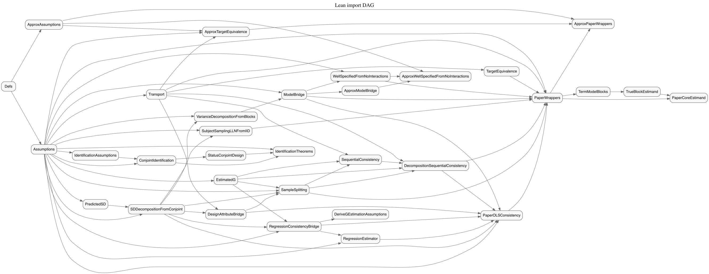

# ConjointSD

ConjointSD is a Lean formalization of the standard deviation (SD) decomposition and
consistency results used in conjoint analysis. It connects the paper's causal
[estimands](readable/jargon_estimand.md) to [plug-in](readable/jargon_plug_in.md) SD
estimators, and organizes the supporting probability, transport, identification,
and regression machinery.

## Documentation indexes

- [Lean docs index](readable/lean_index.md): readable summaries of each Lean file.
- [Jargon index](readable/jargon_index.md): short definitions of technical terms.
- [Proven statements](proven_statements.md): key proved theorems with assumptions.
- [Project map](project_map.md): dependency-oriented overview of the Lean modules.
- [Proof gaps](gaps.md): known open gaps between the paper and the formalization.
- [Dependency tables](dependency_tables.md): generated tables for Lean dependency summaries.

## What lives where

- `ConjointSD/`: Lean sources for the formal results and definitions.
- `readable/`: human-readable summaries and the jargon glossary.
- `project_map.md`: quick map of how the Lean files relate.
- `gaps.md`: checklist of remaining proof/assumption gaps.
- `paper_highlights.md`: notes connecting the formalization to the paper narrative.

## Main themes in the formalization

- Probability and SD machinery: empirical vs population moments, SD consistency.
- Conjoint identification: causal targets and observed conditional means.
- Transport and population targets: mapping design-space moments to population SDs.
- Estimation and sequential consistency: plug-in SD estimators with sample splitting.
- Regression bridge: OLS consistency to plug-in moment convergence.
- Block/term models: decomposing total scores into block-level SDs.

## Building with Lake

1. Install Lean toolchain via `apt-get install elan` (the `elan` package bundles the Lean and Lake installer).
2. Ensure the toolchain from `lean-toolchain` is available: `elan toolchain install $(cat lean-toolchain)`.
3. Run `lake build` from the repo root. The first invocation downloads mathlib and can take a while, but subsequent runs reuse the cached build in `.lake/`.

A successful build was started in this environment after installing `elan`, though compiling mathlib takes significant time on a fresh cache.

## Lean import DAG

## R helper scripts

- Install R packages used by `plot_proof_structure.R`: `fs`, `stringr`, `dplyr`, `purrr`, `tidyr`, `DiagrammeR`, `DiagrammeRsvg`, `rsvg`.
- Run `Rscript scripts/check_r.R` from the repo root to validate the import-DAG script finds nodes and edges.
