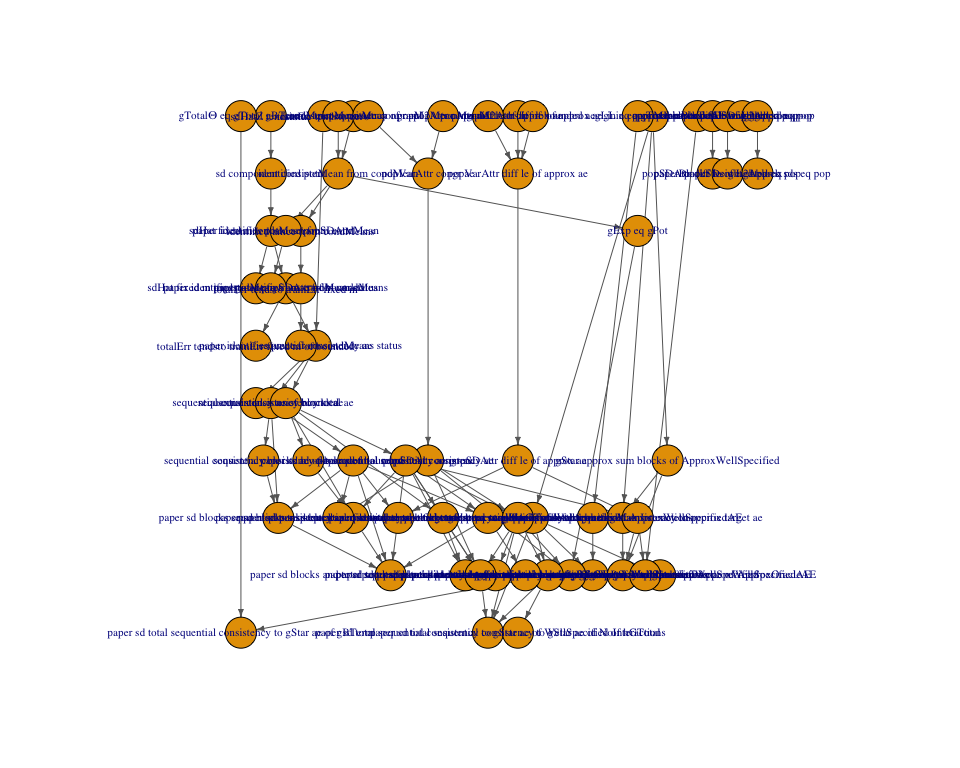

This document auto-generates theorem dependency tables by parsing the
output of `Scratch.lean`.

## Auto-generated assumption matrix

<table>
<colgroup>
<col style="width: 1%" />
<col style="width: 0%" />
<col style="width: 0%" />
<col style="width: 0%" />
<col style="width: 1%" />
<col style="width: 1%" />
<col style="width: 1%" />
<col style="width: 1%" />
<col style="width: 0%" />
<col style="width: 0%" />
<col style="width: 1%" />
<col style="width: 1%" />
<col style="width: 1%" />
<col style="width: 1%" />
<col style="width: 1%" />
<col style="width: 0%" />
<col style="width: 0%" />
<col style="width: 1%" />
<col style="width: 1%" />
<col style="width: 0%" />
<col style="width: 0%" />
<col style="width: 0%" />
<col style="width: 0%" />
<col style="width: 0%" />
<col style="width: 0%" />
<col style="width: 1%" />
<col style="width: 1%" />
<col style="width: 1%" />
<col style="width: 1%" />
<col style="width: 1%" />
<col style="width: 1%" />
<col style="width: 1%" />
<col style="width: 0%" />
<col style="width: 1%" />
<col style="width: 1%" />
<col style="width: 1%" />
<col style="width: 0%" />
<col style="width: 1%" />
<col style="width: 1%" />
<col style="width: 0%" />
<col style="width: 0%" />
<col style="width: 1%" />
<col style="width: 1%" />
<col style="width: 0%" />
<col style="width: 2%" />
<col style="width: 1%" />
<col style="width: 1%" />
<col style="width: 1%" />
<col style="width: 1%" />
<col style="width: 1%" />
<col style="width: 1%" />
<col style="width: 1%" />
<col style="width: 1%" />
<col style="width: 1%" />
<col style="width: 1%" />
<col style="width: 2%" />
<col style="width: 1%" />
<col style="width: 2%" />
<col style="width: 1%" />
<col style="width: 1%" />
<col style="width: 2%" />
<col style="width: 2%" />
<col style="width: 2%" />
<col style="width: 2%" />
<col style="width: 0%" />
<col style="width: 1%" />
<col style="width: 2%" />
<col style="width: 1%" />
<col style="width: 2%" />
<col style="width: 2%" />
<col style="width: 2%" />
<col style="width: 2%" />
</colgroup>
<thead>
<tr>
<th style="text-align: left;"></th>
<th style="text-align: left;">Count</th>
<th style="text-align: left;">sdHatZ tendsto ae</th>
<th style="text-align: left;">sd component consistent</th>
<th style="text-align: left;">sdHat fixed m tendsto ae popSDAttr</th>
<th style="text-align: left;">sdHat fixed m tendsto ae popSDAttr of
bounded</th>
<th style="text-align: left;">totalErr tendsto trainErr fixed m</th>
<th style="text-align: left;">totalErr tendsto trainErr fixed m of
bounded</th>
<th style="text-align: left;">trainErr tendsto zero</th>
<th style="text-align: left;">sequential consistency ae</th>
<th style="text-align: left;">sequential consistency ae of bounded</th>
<th style="text-align: left;">sequential consistency blocks ae</th>
<th style="text-align: left;">sequential consistency total ae</th>
<th style="text-align: left;">sequential consistency blocks ae of
bounded</th>
<th style="text-align: left;">sequential consistency total ae of
bounded</th>
<th style="text-align: left;">condMean eq potMean of rand</th>
<th style="text-align: left;">ae restrict consistency</th>
<th style="text-align: left;">identified potMean from condMean</th>
<th style="text-align: left;">identified amce from condMeans</th>
<th style="text-align: left;">gExp eq gPot</th>
<th style="text-align: left;">popMeanAttr congr ae</th>
<th style="text-align: left;">popM2Attr congr ae</th>
<th style="text-align: left;">popVarAttr congr ae</th>
<th style="text-align: left;">popSDAttr congr ae</th>
<th style="text-align: left;">approxInvarianceAE triangle</th>
<th style="text-align: left;">popMeanAttr diff le of L2Approx</th>
<th style="text-align: left;">popSDAttr diff le of L2Approx</th>
<th style="text-align: left;">popMeanAttr abs le of bounded ae</th>
<th style="text-align: left;">popMeanAttr diff le of approx ae</th>
<th style="text-align: left;">popM2Attr diff le of approx ae</th>
<th style="text-align: left;">popVarAttr diff le of approx ae</th>
<th style="text-align: left;">popSDAttr diff le of approx ae</th>
<th style="text-align: left;">gLin eq gTotal blocks</th>
<th style="text-align: left;">gStar eq sum blocks of WellSpecified</th>
<th style="text-align: left;">gStar approx sum blocks of
ApproxWellSpecified</th>
<th style="text-align: left;">gStar approx sum blocks of
ApproxWellSpecifiedAE</th>
<th style="text-align: left;">gLin eq parametric</th>
<th style="text-align: left;">wellSpecified of
parametricMainInteractions</th>
<th style="text-align: left;">gStar eq sum blocks of
parametricMainInteractions</th>
<th style="text-align: left;">paperBlockSD weighted eq pop</th>
<th style="text-align: left;">paperTotalSD weighted eq pop</th>
<th style="text-align: left;">paperBlockSDs weighted eq pop</th>
<th style="text-align: left;">paper total sd estimator consistency ae of
gBTerm</th>
<th style="text-align: left;">gTotalΘ eq gTotal gBTerm</th>
<th style="text-align: left;">paper sd total sequential consistency to
gStar ae of gBTerm</th>
<th style="text-align: left;">paper identifies potMean from
condMean</th>
<th style="text-align: left;">paper identifies amce from condMeans</th>
<th style="text-align: left;">paper identifies potMean from condMean
status</th>
<th style="text-align: left;">paper identifies amce from condMeans
status</th>
<th style="text-align: left;">paper gStar eq sum blocks of
WellSpecified</th>
<th style="text-align: left;">paper sd blocks sequential consistency
ae</th>
<th style="text-align: left;">paper sd blocks sequential consistency ae
of bounded</th>
<th style="text-align: left;">paper sd total sequential consistency
ae</th>
<th style="text-align: left;">paper sd total sequential consistency ae
of bounded</th>
<th style="text-align: left;">paper sd blocks and total sequential
consistency ae</th>
<th style="text-align: left;">paper sd blocks and total sequential
consistency ae of bounded</th>
<th style="text-align: left;">paper sd blocks sequential consistency to
true target ae</th>
<th style="text-align: left;">paper sd blocks sequential consistency to
approx target ae</th>
<th style="text-align: left;">paper sd total sequential consistency to
approx target ae</th>
<th style="text-align: left;">paper sd total sequential consistency to
true target ae</th>
<th style="text-align: left;">paper sd total sequential consistency to
gPot ae of identification</th>
<th style="text-align: left;">paper sd total sequential consistency to
gStar approx ae of ApproxWellSpecifiedAE</th>
<th style="text-align: left;">paper sd total sequential consistency to
gStar approx ae of ApproxOracleAE</th>
<th style="text-align: left;">paper sd total sequential consistency to
gStar ae of WellSpecified</th>
<th style="text-align: left;">paper weighted sd eq pop</th>
<th style="text-align: left;">paper weighted block sds eq pop</th>
<th style="text-align: left;">paper sd blocks and total sequential
consistency ae of paper ols moments</th>
<th style="text-align: left;">paper sd total sequential consistency ae
of hGTotal</th>
<th style="text-align: left;">paper sd total sequential consistency ae
of paper ols gStar total</th>
<th style="text-align: left;">paper sd total sequential consistency to
true target ae of hGTotal</th>
<th style="text-align: left;">paper sd total sequential consistency to
gStar ae of WellSpecified of hGTotal</th>
<th style="text-align: left;">paper sd total sequential consistency to
gStar ae of NoInteractions</th>
</tr>
</thead>
<tbody>
<tr>
<td style="text-align: left;">∀ᵐ (a : Attr) ∂ν, s a = t a</td>
<td style="text-align: left;">13</td>
<td style="text-align: left;">❌</td>
<td style="text-align: left;">❌</td>
<td style="text-align: left;">❌</td>
<td style="text-align: left;">❌</td>
<td style="text-align: left;">❌</td>
<td style="text-align: left;">❌</td>
<td style="text-align: left;">❌</td>
<td style="text-align: left;">❌</td>
<td style="text-align: left;">❌</td>
<td style="text-align: left;">❌</td>
<td style="text-align: left;">❌</td>
<td style="text-align: left;">❌</td>
<td style="text-align: left;">❌</td>
<td style="text-align: left;">❌</td>
<td style="text-align: left;">❌</td>
<td style="text-align: left;">❌</td>
<td style="text-align: left;">❌</td>
<td style="text-align: left;">❌</td>
<td style="text-align: left;">✅</td>
<td style="text-align: left;">✅</td>
<td style="text-align: left;">✅</td>
<td style="text-align: left;">✅</td>
<td style="text-align: left;">❌</td>
<td style="text-align: left;">❌</td>
<td style="text-align: left;">❌</td>
<td style="text-align: left;">❌</td>
<td style="text-align: left;">❌</td>
<td style="text-align: left;">❌</td>
<td style="text-align: left;">❌</td>
<td style="text-align: left;">❌</td>
<td style="text-align: left;">❌</td>
<td style="text-align: left;">❌</td>
<td style="text-align: left;">❌</td>
<td style="text-align: left;">❌</td>
<td style="text-align: left;">❌</td>
<td style="text-align: left;">❌</td>
<td style="text-align: left;">❌</td>
<td style="text-align: left;">❌</td>
<td style="text-align: left;">❌</td>
<td style="text-align: left;">❌</td>
<td style="text-align: left;">✅</td>
<td style="text-align: left;">❌</td>
<td style="text-align: left;">✅</td>
<td style="text-align: left;">❌</td>
<td style="text-align: left;">❌</td>
<td style="text-align: left;">❌</td>
<td style="text-align: left;">❌</td>
<td style="text-align: left;">❌</td>
<td style="text-align: left;">❌</td>
<td style="text-align: left;">❌</td>
<td style="text-align: left;">❌</td>
<td style="text-align: left;">❌</td>
<td style="text-align: left;">❌</td>
<td style="text-align: left;">❌</td>
<td style="text-align: left;">✅</td>
<td style="text-align: left;">❌</td>
<td style="text-align: left;">❌</td>
<td style="text-align: left;">✅</td>
<td style="text-align: left;">✅</td>
<td style="text-align: left;">❌</td>
<td style="text-align: left;">❌</td>
<td style="text-align: left;">✅</td>
<td style="text-align: left;">❌</td>
<td style="text-align: left;">❌</td>
<td style="text-align: left;">❌</td>
<td style="text-align: left;">❌</td>
<td style="text-align: left;">❌</td>
<td style="text-align: left;">✅</td>
<td style="text-align: left;">✅</td>
<td style="text-align: left;">✅</td>
</tr>
<tr>
<td style="text-align: left;">ConjointIdAssumptions consistency</td>
<td style="text-align: left;">8</td>
<td style="text-align: left;">❌</td>
<td style="text-align: left;">❌</td>
<td style="text-align: left;">❌</td>
<td style="text-align: left;">❌</td>
<td style="text-align: left;">❌</td>
<td style="text-align: left;">❌</td>
<td style="text-align: left;">❌</td>
<td style="text-align: left;">❌</td>
<td style="text-align: left;">❌</td>
<td style="text-align: left;">❌</td>
<td style="text-align: left;">❌</td>
<td style="text-align: left;">❌</td>
<td style="text-align: left;">❌</td>
<td style="text-align: left;">❌</td>
<td style="text-align: left;">❌</td>
<td style="text-align: left;">✅</td>
<td style="text-align: left;">✅</td>
<td style="text-align: left;">✅</td>
<td style="text-align: left;">❌</td>
<td style="text-align: left;">❌</td>
<td style="text-align: left;">❌</td>
<td style="text-align: left;">❌</td>
<td style="text-align: left;">❌</td>
<td style="text-align: left;">❌</td>
<td style="text-align: left;">❌</td>
<td style="text-align: left;">❌</td>
<td style="text-align: left;">❌</td>
<td style="text-align: left;">❌</td>
<td style="text-align: left;">❌</td>
<td style="text-align: left;">❌</td>
<td style="text-align: left;">❌</td>
<td style="text-align: left;">❌</td>
<td style="text-align: left;">❌</td>
<td style="text-align: left;">❌</td>
<td style="text-align: left;">❌</td>
<td style="text-align: left;">❌</td>
<td style="text-align: left;">❌</td>
<td style="text-align: left;">❌</td>
<td style="text-align: left;">❌</td>
<td style="text-align: left;">❌</td>
<td style="text-align: left;">❌</td>
<td style="text-align: left;">❌</td>
<td style="text-align: left;">❌</td>
<td style="text-align: left;">✅</td>
<td style="text-align: left;">✅</td>
<td style="text-align: left;">✅</td>
<td style="text-align: left;">✅</td>
<td style="text-align: left;">❌</td>
<td style="text-align: left;">❌</td>
<td style="text-align: left;">❌</td>
<td style="text-align: left;">❌</td>
<td style="text-align: left;">❌</td>
<td style="text-align: left;">❌</td>
<td style="text-align: left;">❌</td>
<td style="text-align: left;">❌</td>
<td style="text-align: left;">❌</td>
<td style="text-align: left;">❌</td>
<td style="text-align: left;">❌</td>
<td style="text-align: left;">✅</td>
<td style="text-align: left;">❌</td>
<td style="text-align: left;">❌</td>
<td style="text-align: left;">❌</td>
<td style="text-align: left;">❌</td>
<td style="text-align: left;">❌</td>
<td style="text-align: left;">❌</td>
<td style="text-align: left;">❌</td>
<td style="text-align: left;">❌</td>
<td style="text-align: left;">❌</td>
<td style="text-align: left;">❌</td>
<td style="text-align: left;">❌</td>
</tr>
<tr>
<td style="text-align: left;">ConjointIdAssumptions measY</td>
<td style="text-align: left;">8</td>
<td style="text-align: left;">❌</td>
<td style="text-align: left;">❌</td>
<td style="text-align: left;">❌</td>
<td style="text-align: left;">❌</td>
<td style="text-align: left;">❌</td>
<td style="text-align: left;">❌</td>
<td style="text-align: left;">❌</td>
<td style="text-align: left;">❌</td>
<td style="text-align: left;">❌</td>
<td style="text-align: left;">❌</td>
<td style="text-align: left;">❌</td>
<td style="text-align: left;">❌</td>
<td style="text-align: left;">❌</td>
<td style="text-align: left;">❌</td>
<td style="text-align: left;">❌</td>
<td style="text-align: left;">✅</td>
<td style="text-align: left;">✅</td>
<td style="text-align: left;">✅</td>
<td style="text-align: left;">❌</td>
<td style="text-align: left;">❌</td>
<td style="text-align: left;">❌</td>
<td style="text-align: left;">❌</td>
<td style="text-align: left;">❌</td>
<td style="text-align: left;">❌</td>
<td style="text-align: left;">❌</td>
<td style="text-align: left;">❌</td>
<td style="text-align: left;">❌</td>
<td style="text-align: left;">❌</td>
<td style="text-align: left;">❌</td>
<td style="text-align: left;">❌</td>
<td style="text-align: left;">❌</td>
<td style="text-align: left;">❌</td>
<td style="text-align: left;">❌</td>
<td style="text-align: left;">❌</td>
<td style="text-align: left;">❌</td>
<td style="text-align: left;">❌</td>
<td style="text-align: left;">❌</td>
<td style="text-align: left;">❌</td>
<td style="text-align: left;">❌</td>
<td style="text-align: left;">❌</td>
<td style="text-align: left;">❌</td>
<td style="text-align: left;">❌</td>
<td style="text-align: left;">❌</td>
<td style="text-align: left;">✅</td>
<td style="text-align: left;">✅</td>
<td style="text-align: left;">✅</td>
<td style="text-align: left;">✅</td>
<td style="text-align: left;">❌</td>
<td style="text-align: left;">❌</td>
<td style="text-align: left;">❌</td>
<td style="text-align: left;">❌</td>
<td style="text-align: left;">❌</td>
<td style="text-align: left;">❌</td>
<td style="text-align: left;">❌</td>
<td style="text-align: left;">❌</td>
<td style="text-align: left;">❌</td>
<td style="text-align: left;">❌</td>
<td style="text-align: left;">❌</td>
<td style="text-align: left;">✅</td>
<td style="text-align: left;">❌</td>
<td style="text-align: left;">❌</td>
<td style="text-align: left;">❌</td>
<td style="text-align: left;">❌</td>
<td style="text-align: left;">❌</td>
<td style="text-align: left;">❌</td>
<td style="text-align: left;">❌</td>
<td style="text-align: left;">❌</td>
<td style="text-align: left;">❌</td>
<td style="text-align: left;">❌</td>
<td style="text-align: left;">❌</td>
</tr>
<tr>
<td style="text-align: left;">ConjointIdAssumptions measYobs</td>
<td style="text-align: left;">8</td>
<td style="text-align: left;">❌</td>
<td style="text-align: left;">❌</td>
<td style="text-align: left;">❌</td>
<td style="text-align: left;">❌</td>
<td style="text-align: left;">❌</td>
<td style="text-align: left;">❌</td>
<td style="text-align: left;">❌</td>
<td style="text-align: left;">❌</td>
<td style="text-align: left;">❌</td>
<td style="text-align: left;">❌</td>
<td style="text-align: left;">❌</td>
<td style="text-align: left;">❌</td>
<td style="text-align: left;">❌</td>
<td style="text-align: left;">❌</td>
<td style="text-align: left;">❌</td>
<td style="text-align: left;">✅</td>
<td style="text-align: left;">✅</td>
<td style="text-align: left;">✅</td>
<td style="text-align: left;">❌</td>
<td style="text-align: left;">❌</td>
<td style="text-align: left;">❌</td>
<td style="text-align: left;">❌</td>
<td style="text-align: left;">❌</td>
<td style="text-align: left;">❌</td>
<td style="text-align: left;">❌</td>
<td style="text-align: left;">❌</td>
<td style="text-align: left;">❌</td>
<td style="text-align: left;">❌</td>
<td style="text-align: left;">❌</td>
<td style="text-align: left;">❌</td>
<td style="text-align: left;">❌</td>
<td style="text-align: left;">❌</td>
<td style="text-align: left;">❌</td>
<td style="text-align: left;">❌</td>
<td style="text-align: left;">❌</td>
<td style="text-align: left;">❌</td>
<td style="text-align: left;">❌</td>
<td style="text-align: left;">❌</td>
<td style="text-align: left;">❌</td>
<td style="text-align: left;">❌</td>
<td style="text-align: left;">❌</td>
<td style="text-align: left;">❌</td>
<td style="text-align: left;">❌</td>
<td style="text-align: left;">✅</td>
<td style="text-align: left;">✅</td>
<td style="text-align: left;">✅</td>
<td style="text-align: left;">✅</td>
<td style="text-align: left;">❌</td>
<td style="text-align: left;">❌</td>
<td style="text-align: left;">❌</td>
<td style="text-align: left;">❌</td>
<td style="text-align: left;">❌</td>
<td style="text-align: left;">❌</td>
<td style="text-align: left;">❌</td>
<td style="text-align: left;">❌</td>
<td style="text-align: left;">❌</td>
<td style="text-align: left;">❌</td>
<td style="text-align: left;">❌</td>
<td style="text-align: left;">✅</td>
<td style="text-align: left;">❌</td>
<td style="text-align: left;">❌</td>
<td style="text-align: left;">❌</td>
<td style="text-align: left;">❌</td>
<td style="text-align: left;">❌</td>
<td style="text-align: left;">❌</td>
<td style="text-align: left;">❌</td>
<td style="text-align: left;">❌</td>
<td style="text-align: left;">❌</td>
<td style="text-align: left;">❌</td>
<td style="text-align: left;">❌</td>
</tr>
<tr>
<td style="text-align: left;">ConjointIdAssumptions rand</td>
<td style="text-align: left;">8</td>
<td style="text-align: left;">❌</td>
<td style="text-align: left;">❌</td>
<td style="text-align: left;">❌</td>
<td style="text-align: left;">❌</td>
<td style="text-align: left;">❌</td>
<td style="text-align: left;">❌</td>
<td style="text-align: left;">❌</td>
<td style="text-align: left;">❌</td>
<td style="text-align: left;">❌</td>
<td style="text-align: left;">❌</td>
<td style="text-align: left;">❌</td>
<td style="text-align: left;">❌</td>
<td style="text-align: left;">❌</td>
<td style="text-align: left;">❌</td>
<td style="text-align: left;">❌</td>
<td style="text-align: left;">✅</td>
<td style="text-align: left;">✅</td>
<td style="text-align: left;">✅</td>
<td style="text-align: left;">❌</td>
<td style="text-align: left;">❌</td>
<td style="text-align: left;">❌</td>
<td style="text-align: left;">❌</td>
<td style="text-align: left;">❌</td>
<td style="text-align: left;">❌</td>
<td style="text-align: left;">❌</td>
<td style="text-align: left;">❌</td>
<td style="text-align: left;">❌</td>
<td style="text-align: left;">❌</td>
<td style="text-align: left;">❌</td>
<td style="text-align: left;">❌</td>
<td style="text-align: left;">❌</td>
<td style="text-align: left;">❌</td>
<td style="text-align: left;">❌</td>
<td style="text-align: left;">❌</td>
<td style="text-align: left;">❌</td>
<td style="text-align: left;">❌</td>
<td style="text-align: left;">❌</td>
<td style="text-align: left;">❌</td>
<td style="text-align: left;">❌</td>
<td style="text-align: left;">❌</td>
<td style="text-align: left;">❌</td>
<td style="text-align: left;">❌</td>
<td style="text-align: left;">❌</td>
<td style="text-align: left;">✅</td>
<td style="text-align: left;">✅</td>
<td style="text-align: left;">✅</td>
<td style="text-align: left;">✅</td>
<td style="text-align: left;">❌</td>
<td style="text-align: left;">❌</td>
<td style="text-align: left;">❌</td>
<td style="text-align: left;">❌</td>
<td style="text-align: left;">❌</td>
<td style="text-align: left;">❌</td>
<td style="text-align: left;">❌</td>
<td style="text-align: left;">❌</td>
<td style="text-align: left;">❌</td>
<td style="text-align: left;">❌</td>
<td style="text-align: left;">❌</td>
<td style="text-align: left;">✅</td>
<td style="text-align: left;">❌</td>
<td style="text-align: left;">❌</td>
<td style="text-align: left;">❌</td>
<td style="text-align: left;">❌</td>
<td style="text-align: left;">❌</td>
<td style="text-align: left;">❌</td>
<td style="text-align: left;">❌</td>
<td style="text-align: left;">❌</td>
<td style="text-align: left;">❌</td>
<td style="text-align: left;">❌</td>
<td style="text-align: left;">❌</td>
</tr>
<tr>
<td style="text-align: left;">GEstimationAssumptions m2 tendsto</td>
<td style="text-align: left;">29</td>
<td style="text-align: left;">❌</td>
<td style="text-align: left;">❌</td>
<td style="text-align: left;">❌</td>
<td style="text-align: left;">❌</td>
<td style="text-align: left;">❌</td>
<td style="text-align: left;">❌</td>
<td style="text-align: left;">✅</td>
<td style="text-align: left;">✅</td>
<td style="text-align: left;">✅</td>
<td style="text-align: left;">✅</td>
<td style="text-align: left;">✅</td>
<td style="text-align: left;">✅</td>
<td style="text-align: left;">✅</td>
<td style="text-align: left;">❌</td>
<td style="text-align: left;">❌</td>
<td style="text-align: left;">❌</td>
<td style="text-align: left;">❌</td>
<td style="text-align: left;">❌</td>
<td style="text-align: left;">❌</td>
<td style="text-align: left;">❌</td>
<td style="text-align: left;">❌</td>
<td style="text-align: left;">❌</td>
<td style="text-align: left;">❌</td>
<td style="text-align: left;">❌</td>
<td style="text-align: left;">❌</td>
<td style="text-align: left;">❌</td>
<td style="text-align: left;">❌</td>
<td style="text-align: left;">❌</td>
<td style="text-align: left;">❌</td>
<td style="text-align: left;">❌</td>
<td style="text-align: left;">❌</td>
<td style="text-align: left;">❌</td>
<td style="text-align: left;">❌</td>
<td style="text-align: left;">❌</td>
<td style="text-align: left;">❌</td>
<td style="text-align: left;">❌</td>
<td style="text-align: left;">❌</td>
<td style="text-align: left;">❌</td>
<td style="text-align: left;">❌</td>
<td style="text-align: left;">❌</td>
<td style="text-align: left;">✅</td>
<td style="text-align: left;">❌</td>
<td style="text-align: left;">✅</td>
<td style="text-align: left;">❌</td>
<td style="text-align: left;">❌</td>
<td style="text-align: left;">❌</td>
<td style="text-align: left;">❌</td>
<td style="text-align: left;">❌</td>
<td style="text-align: left;">✅</td>
<td style="text-align: left;">✅</td>
<td style="text-align: left;">✅</td>
<td style="text-align: left;">✅</td>
<td style="text-align: left;">✅</td>
<td style="text-align: left;">✅</td>
<td style="text-align: left;">✅</td>
<td style="text-align: left;">✅</td>
<td style="text-align: left;">✅</td>
<td style="text-align: left;">✅</td>
<td style="text-align: left;">✅</td>
<td style="text-align: left;">✅</td>
<td style="text-align: left;">✅</td>
<td style="text-align: left;">✅</td>
<td style="text-align: left;">❌</td>
<td style="text-align: left;">❌</td>
<td style="text-align: left;">✅</td>
<td style="text-align: left;">✅</td>
<td style="text-align: left;">✅</td>
<td style="text-align: left;">✅</td>
<td style="text-align: left;">✅</td>
<td style="text-align: left;">✅</td>
</tr>
<tr>
<td style="text-align: left;">GEstimationAssumptions mean tendsto</td>
<td style="text-align: left;">29</td>
<td style="text-align: left;">❌</td>
<td style="text-align: left;">❌</td>
<td style="text-align: left;">❌</td>
<td style="text-align: left;">❌</td>
<td style="text-align: left;">❌</td>
<td style="text-align: left;">❌</td>
<td style="text-align: left;">✅</td>
<td style="text-align: left;">✅</td>
<td style="text-align: left;">✅</td>
<td style="text-align: left;">✅</td>
<td style="text-align: left;">✅</td>
<td style="text-align: left;">✅</td>
<td style="text-align: left;">✅</td>
<td style="text-align: left;">❌</td>
<td style="text-align: left;">❌</td>
<td style="text-align: left;">❌</td>
<td style="text-align: left;">❌</td>
<td style="text-align: left;">❌</td>
<td style="text-align: left;">❌</td>
<td style="text-align: left;">❌</td>
<td style="text-align: left;">❌</td>
<td style="text-align: left;">❌</td>
<td style="text-align: left;">❌</td>
<td style="text-align: left;">❌</td>
<td style="text-align: left;">❌</td>
<td style="text-align: left;">❌</td>
<td style="text-align: left;">❌</td>
<td style="text-align: left;">❌</td>
<td style="text-align: left;">❌</td>
<td style="text-align: left;">❌</td>
<td style="text-align: left;">❌</td>
<td style="text-align: left;">❌</td>
<td style="text-align: left;">❌</td>
<td style="text-align: left;">❌</td>
<td style="text-align: left;">❌</td>
<td style="text-align: left;">❌</td>
<td style="text-align: left;">❌</td>
<td style="text-align: left;">❌</td>
<td style="text-align: left;">❌</td>
<td style="text-align: left;">❌</td>
<td style="text-align: left;">✅</td>
<td style="text-align: left;">❌</td>
<td style="text-align: left;">✅</td>
<td style="text-align: left;">❌</td>
<td style="text-align: left;">❌</td>
<td style="text-align: left;">❌</td>
<td style="text-align: left;">❌</td>
<td style="text-align: left;">❌</td>
<td style="text-align: left;">✅</td>
<td style="text-align: left;">✅</td>
<td style="text-align: left;">✅</td>
<td style="text-align: left;">✅</td>
<td style="text-align: left;">✅</td>
<td style="text-align: left;">✅</td>
<td style="text-align: left;">✅</td>
<td style="text-align: left;">✅</td>
<td style="text-align: left;">✅</td>
<td style="text-align: left;">✅</td>
<td style="text-align: left;">✅</td>
<td style="text-align: left;">✅</td>
<td style="text-align: left;">✅</td>
<td style="text-align: left;">✅</td>
<td style="text-align: left;">❌</td>
<td style="text-align: left;">❌</td>
<td style="text-align: left;">✅</td>
<td style="text-align: left;">✅</td>
<td style="text-align: left;">✅</td>
<td style="text-align: left;">✅</td>
<td style="text-align: left;">✅</td>
<td style="text-align: left;">✅</td>
</tr>
<tr>
<td style="text-align: left;">IIDAssumptions ident</td>
<td style="text-align: left;">34</td>
<td style="text-align: left;">✅</td>
<td style="text-align: left;">✅</td>
<td style="text-align: left;">✅</td>
<td style="text-align: left;">✅</td>
<td style="text-align: left;">✅</td>
<td style="text-align: left;">✅</td>
<td style="text-align: left;">❌</td>
<td style="text-align: left;">✅</td>
<td style="text-align: left;">✅</td>
<td style="text-align: left;">✅</td>
<td style="text-align: left;">✅</td>
<td style="text-align: left;">✅</td>
<td style="text-align: left;">✅</td>
<td style="text-align: left;">❌</td>
<td style="text-align: left;">❌</td>
<td style="text-align: left;">❌</td>
<td style="text-align: left;">❌</td>
<td style="text-align: left;">❌</td>
<td style="text-align: left;">❌</td>
<td style="text-align: left;">❌</td>
<td style="text-align: left;">❌</td>
<td style="text-align: left;">❌</td>
<td style="text-align: left;">❌</td>
<td style="text-align: left;">❌</td>
<td style="text-align: left;">❌</td>
<td style="text-align: left;">❌</td>
<td style="text-align: left;">❌</td>
<td style="text-align: left;">❌</td>
<td style="text-align: left;">❌</td>
<td style="text-align: left;">❌</td>
<td style="text-align: left;">❌</td>
<td style="text-align: left;">❌</td>
<td style="text-align: left;">❌</td>
<td style="text-align: left;">❌</td>
<td style="text-align: left;">❌</td>
<td style="text-align: left;">❌</td>
<td style="text-align: left;">❌</td>
<td style="text-align: left;">❌</td>
<td style="text-align: left;">❌</td>
<td style="text-align: left;">❌</td>
<td style="text-align: left;">✅</td>
<td style="text-align: left;">❌</td>
<td style="text-align: left;">✅</td>
<td style="text-align: left;">❌</td>
<td style="text-align: left;">❌</td>
<td style="text-align: left;">❌</td>
<td style="text-align: left;">❌</td>
<td style="text-align: left;">❌</td>
<td style="text-align: left;">✅</td>
<td style="text-align: left;">✅</td>
<td style="text-align: left;">✅</td>
<td style="text-align: left;">✅</td>
<td style="text-align: left;">✅</td>
<td style="text-align: left;">✅</td>
<td style="text-align: left;">✅</td>
<td style="text-align: left;">✅</td>
<td style="text-align: left;">✅</td>
<td style="text-align: left;">✅</td>
<td style="text-align: left;">✅</td>
<td style="text-align: left;">✅</td>
<td style="text-align: left;">✅</td>
<td style="text-align: left;">✅</td>
<td style="text-align: left;">❌</td>
<td style="text-align: left;">❌</td>
<td style="text-align: left;">✅</td>
<td style="text-align: left;">✅</td>
<td style="text-align: left;">✅</td>
<td style="text-align: left;">✅</td>
<td style="text-align: left;">✅</td>
<td style="text-align: left;">✅</td>
</tr>
<tr>
<td style="text-align: left;">IIDAssumptions indep</td>
<td style="text-align: left;">34</td>
<td style="text-align: left;">✅</td>
<td style="text-align: left;">✅</td>
<td style="text-align: left;">✅</td>
<td style="text-align: left;">✅</td>
<td style="text-align: left;">✅</td>
<td style="text-align: left;">✅</td>
<td style="text-align: left;">❌</td>
<td style="text-align: left;">✅</td>
<td style="text-align: left;">✅</td>
<td style="text-align: left;">✅</td>
<td style="text-align: left;">✅</td>
<td style="text-align: left;">✅</td>
<td style="text-align: left;">✅</td>
<td style="text-align: left;">❌</td>
<td style="text-align: left;">❌</td>
<td style="text-align: left;">❌</td>
<td style="text-align: left;">❌</td>
<td style="text-align: left;">❌</td>
<td style="text-align: left;">❌</td>
<td style="text-align: left;">❌</td>
<td style="text-align: left;">❌</td>
<td style="text-align: left;">❌</td>
<td style="text-align: left;">❌</td>
<td style="text-align: left;">❌</td>
<td style="text-align: left;">❌</td>
<td style="text-align: left;">❌</td>
<td style="text-align: left;">❌</td>
<td style="text-align: left;">❌</td>
<td style="text-align: left;">❌</td>
<td style="text-align: left;">❌</td>
<td style="text-align: left;">❌</td>
<td style="text-align: left;">❌</td>
<td style="text-align: left;">❌</td>
<td style="text-align: left;">❌</td>
<td style="text-align: left;">❌</td>
<td style="text-align: left;">❌</td>
<td style="text-align: left;">❌</td>
<td style="text-align: left;">❌</td>
<td style="text-align: left;">❌</td>
<td style="text-align: left;">❌</td>
<td style="text-align: left;">✅</td>
<td style="text-align: left;">❌</td>
<td style="text-align: left;">✅</td>
<td style="text-align: left;">❌</td>
<td style="text-align: left;">❌</td>
<td style="text-align: left;">❌</td>
<td style="text-align: left;">❌</td>
<td style="text-align: left;">❌</td>
<td style="text-align: left;">✅</td>
<td style="text-align: left;">✅</td>
<td style="text-align: left;">✅</td>
<td style="text-align: left;">✅</td>
<td style="text-align: left;">✅</td>
<td style="text-align: left;">✅</td>
<td style="text-align: left;">✅</td>
<td style="text-align: left;">✅</td>
<td style="text-align: left;">✅</td>
<td style="text-align: left;">✅</td>
<td style="text-align: left;">✅</td>
<td style="text-align: left;">✅</td>
<td style="text-align: left;">✅</td>
<td style="text-align: left;">✅</td>
<td style="text-align: left;">❌</td>
<td style="text-align: left;">❌</td>
<td style="text-align: left;">✅</td>
<td style="text-align: left;">✅</td>
<td style="text-align: left;">✅</td>
<td style="text-align: left;">✅</td>
<td style="text-align: left;">✅</td>
<td style="text-align: left;">✅</td>
</tr>
<tr>
<td style="text-align: left;">IIDAssumptions intZ</td>
<td style="text-align: left;">34</td>
<td style="text-align: left;">✅</td>
<td style="text-align: left;">✅</td>
<td style="text-align: left;">✅</td>
<td style="text-align: left;">✅</td>
<td style="text-align: left;">✅</td>
<td style="text-align: left;">✅</td>
<td style="text-align: left;">❌</td>
<td style="text-align: left;">✅</td>
<td style="text-align: left;">✅</td>
<td style="text-align: left;">✅</td>
<td style="text-align: left;">✅</td>
<td style="text-align: left;">✅</td>
<td style="text-align: left;">✅</td>
<td style="text-align: left;">❌</td>
<td style="text-align: left;">❌</td>
<td style="text-align: left;">❌</td>
<td style="text-align: left;">❌</td>
<td style="text-align: left;">❌</td>
<td style="text-align: left;">❌</td>
<td style="text-align: left;">❌</td>
<td style="text-align: left;">❌</td>
<td style="text-align: left;">❌</td>
<td style="text-align: left;">❌</td>
<td style="text-align: left;">❌</td>
<td style="text-align: left;">❌</td>
<td style="text-align: left;">❌</td>
<td style="text-align: left;">❌</td>
<td style="text-align: left;">❌</td>
<td style="text-align: left;">❌</td>
<td style="text-align: left;">❌</td>
<td style="text-align: left;">❌</td>
<td style="text-align: left;">❌</td>
<td style="text-align: left;">❌</td>
<td style="text-align: left;">❌</td>
<td style="text-align: left;">❌</td>
<td style="text-align: left;">❌</td>
<td style="text-align: left;">❌</td>
<td style="text-align: left;">❌</td>
<td style="text-align: left;">❌</td>
<td style="text-align: left;">❌</td>
<td style="text-align: left;">✅</td>
<td style="text-align: left;">❌</td>
<td style="text-align: left;">✅</td>
<td style="text-align: left;">❌</td>
<td style="text-align: left;">❌</td>
<td style="text-align: left;">❌</td>
<td style="text-align: left;">❌</td>
<td style="text-align: left;">❌</td>
<td style="text-align: left;">✅</td>
<td style="text-align: left;">✅</td>
<td style="text-align: left;">✅</td>
<td style="text-align: left;">✅</td>
<td style="text-align: left;">✅</td>
<td style="text-align: left;">✅</td>
<td style="text-align: left;">✅</td>
<td style="text-align: left;">✅</td>
<td style="text-align: left;">✅</td>
<td style="text-align: left;">✅</td>
<td style="text-align: left;">✅</td>
<td style="text-align: left;">✅</td>
<td style="text-align: left;">✅</td>
<td style="text-align: left;">✅</td>
<td style="text-align: left;">❌</td>
<td style="text-align: left;">❌</td>
<td style="text-align: left;">✅</td>
<td style="text-align: left;">✅</td>
<td style="text-align: left;">✅</td>
<td style="text-align: left;">✅</td>
<td style="text-align: left;">✅</td>
<td style="text-align: left;">✅</td>
</tr>
<tr>
<td style="text-align: left;">IIDAssumptions intZ2</td>
<td style="text-align: left;">34</td>
<td style="text-align: left;">✅</td>
<td style="text-align: left;">✅</td>
<td style="text-align: left;">✅</td>
<td style="text-align: left;">✅</td>
<td style="text-align: left;">✅</td>
<td style="text-align: left;">✅</td>
<td style="text-align: left;">❌</td>
<td style="text-align: left;">✅</td>
<td style="text-align: left;">✅</td>
<td style="text-align: left;">✅</td>
<td style="text-align: left;">✅</td>
<td style="text-align: left;">✅</td>
<td style="text-align: left;">✅</td>
<td style="text-align: left;">❌</td>
<td style="text-align: left;">❌</td>
<td style="text-align: left;">❌</td>
<td style="text-align: left;">❌</td>
<td style="text-align: left;">❌</td>
<td style="text-align: left;">❌</td>
<td style="text-align: left;">❌</td>
<td style="text-align: left;">❌</td>
<td style="text-align: left;">❌</td>
<td style="text-align: left;">❌</td>
<td style="text-align: left;">❌</td>
<td style="text-align: left;">❌</td>
<td style="text-align: left;">❌</td>
<td style="text-align: left;">❌</td>
<td style="text-align: left;">❌</td>
<td style="text-align: left;">❌</td>
<td style="text-align: left;">❌</td>
<td style="text-align: left;">❌</td>
<td style="text-align: left;">❌</td>
<td style="text-align: left;">❌</td>
<td style="text-align: left;">❌</td>
<td style="text-align: left;">❌</td>
<td style="text-align: left;">❌</td>
<td style="text-align: left;">❌</td>
<td style="text-align: left;">❌</td>
<td style="text-align: left;">❌</td>
<td style="text-align: left;">❌</td>
<td style="text-align: left;">✅</td>
<td style="text-align: left;">❌</td>
<td style="text-align: left;">✅</td>
<td style="text-align: left;">❌</td>
<td style="text-align: left;">❌</td>
<td style="text-align: left;">❌</td>
<td style="text-align: left;">❌</td>
<td style="text-align: left;">❌</td>
<td style="text-align: left;">✅</td>
<td style="text-align: left;">✅</td>
<td style="text-align: left;">✅</td>
<td style="text-align: left;">✅</td>
<td style="text-align: left;">✅</td>
<td style="text-align: left;">✅</td>
<td style="text-align: left;">✅</td>
<td style="text-align: left;">✅</td>
<td style="text-align: left;">✅</td>
<td style="text-align: left;">✅</td>
<td style="text-align: left;">✅</td>
<td style="text-align: left;">✅</td>
<td style="text-align: left;">✅</td>
<td style="text-align: left;">✅</td>
<td style="text-align: left;">❌</td>
<td style="text-align: left;">❌</td>
<td style="text-align: left;">✅</td>
<td style="text-align: left;">✅</td>
<td style="text-align: left;">✅</td>
<td style="text-align: left;">✅</td>
<td style="text-align: left;">✅</td>
<td style="text-align: left;">✅</td>
</tr>
<tr>
<td style="text-align: left;">Measurable (A 0)</td>
<td style="text-align: left;">32</td>
<td style="text-align: left;">❌</td>
<td style="text-align: left;">❌</td>
<td style="text-align: left;">✅</td>
<td style="text-align: left;">✅</td>
<td style="text-align: left;">✅</td>
<td style="text-align: left;">✅</td>
<td style="text-align: left;">❌</td>
<td style="text-align: left;">✅</td>
<td style="text-align: left;">✅</td>
<td style="text-align: left;">✅</td>
<td style="text-align: left;">✅</td>
<td style="text-align: left;">✅</td>
<td style="text-align: left;">✅</td>
<td style="text-align: left;">❌</td>
<td style="text-align: left;">❌</td>
<td style="text-align: left;">❌</td>
<td style="text-align: left;">❌</td>
<td style="text-align: left;">❌</td>
<td style="text-align: left;">❌</td>
<td style="text-align: left;">❌</td>
<td style="text-align: left;">❌</td>
<td style="text-align: left;">❌</td>
<td style="text-align: left;">❌</td>
<td style="text-align: left;">❌</td>
<td style="text-align: left;">❌</td>
<td style="text-align: left;">❌</td>
<td style="text-align: left;">❌</td>
<td style="text-align: left;">❌</td>
<td style="text-align: left;">❌</td>
<td style="text-align: left;">❌</td>
<td style="text-align: left;">❌</td>
<td style="text-align: left;">❌</td>
<td style="text-align: left;">❌</td>
<td style="text-align: left;">❌</td>
<td style="text-align: left;">❌</td>
<td style="text-align: left;">❌</td>
<td style="text-align: left;">❌</td>
<td style="text-align: left;">❌</td>
<td style="text-align: left;">❌</td>
<td style="text-align: left;">❌</td>
<td style="text-align: left;">✅</td>
<td style="text-align: left;">❌</td>
<td style="text-align: left;">✅</td>
<td style="text-align: left;">❌</td>
<td style="text-align: left;">❌</td>
<td style="text-align: left;">❌</td>
<td style="text-align: left;">❌</td>
<td style="text-align: left;">❌</td>
<td style="text-align: left;">✅</td>
<td style="text-align: left;">✅</td>
<td style="text-align: left;">✅</td>
<td style="text-align: left;">✅</td>
<td style="text-align: left;">✅</td>
<td style="text-align: left;">✅</td>
<td style="text-align: left;">✅</td>
<td style="text-align: left;">✅</td>
<td style="text-align: left;">✅</td>
<td style="text-align: left;">✅</td>
<td style="text-align: left;">✅</td>
<td style="text-align: left;">✅</td>
<td style="text-align: left;">✅</td>
<td style="text-align: left;">✅</td>
<td style="text-align: left;">❌</td>
<td style="text-align: left;">❌</td>
<td style="text-align: left;">✅</td>
<td style="text-align: left;">✅</td>
<td style="text-align: left;">✅</td>
<td style="text-align: left;">✅</td>
<td style="text-align: left;">✅</td>
<td style="text-align: left;">✅</td>
</tr>
<tr>
<td style="text-align: left;">OLSMomentAssumptionsOfPop cross
tendsto</td>
<td style="text-align: left;">2</td>
<td style="text-align: left;">❌</td>
<td style="text-align: left;">❌</td>
<td style="text-align: left;">❌</td>
<td style="text-align: left;">❌</td>
<td style="text-align: left;">❌</td>
<td style="text-align: left;">❌</td>
<td style="text-align: left;">❌</td>
<td style="text-align: left;">❌</td>
<td style="text-align: left;">❌</td>
<td style="text-align: left;">❌</td>
<td style="text-align: left;">❌</td>
<td style="text-align: left;">❌</td>
<td style="text-align: left;">❌</td>
<td style="text-align: left;">❌</td>
<td style="text-align: left;">❌</td>
<td style="text-align: left;">❌</td>
<td style="text-align: left;">❌</td>
<td style="text-align: left;">❌</td>
<td style="text-align: left;">❌</td>
<td style="text-align: left;">❌</td>
<td style="text-align: left;">❌</td>
<td style="text-align: left;">❌</td>
<td style="text-align: left;">❌</td>
<td style="text-align: left;">❌</td>
<td style="text-align: left;">❌</td>
<td style="text-align: left;">❌</td>
<td style="text-align: left;">❌</td>
<td style="text-align: left;">❌</td>
<td style="text-align: left;">❌</td>
<td style="text-align: left;">❌</td>
<td style="text-align: left;">❌</td>
<td style="text-align: left;">❌</td>
<td style="text-align: left;">❌</td>
<td style="text-align: left;">❌</td>
<td style="text-align: left;">❌</td>
<td style="text-align: left;">❌</td>
<td style="text-align: left;">❌</td>
<td style="text-align: left;">❌</td>
<td style="text-align: left;">❌</td>
<td style="text-align: left;">❌</td>
<td style="text-align: left;">❌</td>
<td style="text-align: left;">❌</td>
<td style="text-align: left;">❌</td>
<td style="text-align: left;">❌</td>
<td style="text-align: left;">❌</td>
<td style="text-align: left;">❌</td>
<td style="text-align: left;">❌</td>
<td style="text-align: left;">❌</td>
<td style="text-align: left;">❌</td>
<td style="text-align: left;">❌</td>
<td style="text-align: left;">❌</td>
<td style="text-align: left;">❌</td>
<td style="text-align: left;">❌</td>
<td style="text-align: left;">❌</td>
<td style="text-align: left;">❌</td>
<td style="text-align: left;">❌</td>
<td style="text-align: left;">❌</td>
<td style="text-align: left;">❌</td>
<td style="text-align: left;">❌</td>
<td style="text-align: left;">❌</td>
<td style="text-align: left;">❌</td>
<td style="text-align: left;">❌</td>
<td style="text-align: left;">❌</td>
<td style="text-align: left;">❌</td>
<td style="text-align: left;">✅</td>
<td style="text-align: left;">❌</td>
<td style="text-align: left;">✅</td>
<td style="text-align: left;">❌</td>
<td style="text-align: left;">❌</td>
<td style="text-align: left;">❌</td>
</tr>
<tr>
<td style="text-align: left;">OLSMomentAssumptionsOfPop gramInv
tendsto</td>
<td style="text-align: left;">2</td>
<td style="text-align: left;">❌</td>
<td style="text-align: left;">❌</td>
<td style="text-align: left;">❌</td>
<td style="text-align: left;">❌</td>
<td style="text-align: left;">❌</td>
<td style="text-align: left;">❌</td>
<td style="text-align: left;">❌</td>
<td style="text-align: left;">❌</td>
<td style="text-align: left;">❌</td>
<td style="text-align: left;">❌</td>
<td style="text-align: left;">❌</td>
<td style="text-align: left;">❌</td>
<td style="text-align: left;">❌</td>
<td style="text-align: left;">❌</td>
<td style="text-align: left;">❌</td>
<td style="text-align: left;">❌</td>
<td style="text-align: left;">❌</td>
<td style="text-align: left;">❌</td>
<td style="text-align: left;">❌</td>
<td style="text-align: left;">❌</td>
<td style="text-align: left;">❌</td>
<td style="text-align: left;">❌</td>
<td style="text-align: left;">❌</td>
<td style="text-align: left;">❌</td>
<td style="text-align: left;">❌</td>
<td style="text-align: left;">❌</td>
<td style="text-align: left;">❌</td>
<td style="text-align: left;">❌</td>
<td style="text-align: left;">❌</td>
<td style="text-align: left;">❌</td>
<td style="text-align: left;">❌</td>
<td style="text-align: left;">❌</td>
<td style="text-align: left;">❌</td>
<td style="text-align: left;">❌</td>
<td style="text-align: left;">❌</td>
<td style="text-align: left;">❌</td>
<td style="text-align: left;">❌</td>
<td style="text-align: left;">❌</td>
<td style="text-align: left;">❌</td>
<td style="text-align: left;">❌</td>
<td style="text-align: left;">❌</td>
<td style="text-align: left;">❌</td>
<td style="text-align: left;">❌</td>
<td style="text-align: left;">❌</td>
<td style="text-align: left;">❌</td>
<td style="text-align: left;">❌</td>
<td style="text-align: left;">❌</td>
<td style="text-align: left;">❌</td>
<td style="text-align: left;">❌</td>
<td style="text-align: left;">❌</td>
<td style="text-align: left;">❌</td>
<td style="text-align: left;">❌</td>
<td style="text-align: left;">❌</td>
<td style="text-align: left;">❌</td>
<td style="text-align: left;">❌</td>
<td style="text-align: left;">❌</td>
<td style="text-align: left;">❌</td>
<td style="text-align: left;">❌</td>
<td style="text-align: left;">❌</td>
<td style="text-align: left;">❌</td>
<td style="text-align: left;">❌</td>
<td style="text-align: left;">❌</td>
<td style="text-align: left;">❌</td>
<td style="text-align: left;">❌</td>
<td style="text-align: left;">✅</td>
<td style="text-align: left;">❌</td>
<td style="text-align: left;">✅</td>
<td style="text-align: left;">❌</td>
<td style="text-align: left;">❌</td>
<td style="text-align: left;">❌</td>
</tr>
<tr>
<td style="text-align: left;">PopIID identA</td>
<td style="text-align: left;">33</td>
<td style="text-align: left;">❌</td>
<td style="text-align: left;">✅</td>
<td style="text-align: left;">✅</td>
<td style="text-align: left;">✅</td>
<td style="text-align: left;">✅</td>
<td style="text-align: left;">✅</td>
<td style="text-align: left;">❌</td>
<td style="text-align: left;">✅</td>
<td style="text-align: left;">✅</td>
<td style="text-align: left;">✅</td>
<td style="text-align: left;">✅</td>
<td style="text-align: left;">✅</td>
<td style="text-align: left;">✅</td>
<td style="text-align: left;">❌</td>
<td style="text-align: left;">❌</td>
<td style="text-align: left;">❌</td>
<td style="text-align: left;">❌</td>
<td style="text-align: left;">❌</td>
<td style="text-align: left;">❌</td>
<td style="text-align: left;">❌</td>
<td style="text-align: left;">❌</td>
<td style="text-align: left;">❌</td>
<td style="text-align: left;">❌</td>
<td style="text-align: left;">❌</td>
<td style="text-align: left;">❌</td>
<td style="text-align: left;">❌</td>
<td style="text-align: left;">❌</td>
<td style="text-align: left;">❌</td>
<td style="text-align: left;">❌</td>
<td style="text-align: left;">❌</td>
<td style="text-align: left;">❌</td>
<td style="text-align: left;">❌</td>
<td style="text-align: left;">❌</td>
<td style="text-align: left;">❌</td>
<td style="text-align: left;">❌</td>
<td style="text-align: left;">❌</td>
<td style="text-align: left;">❌</td>
<td style="text-align: left;">❌</td>
<td style="text-align: left;">❌</td>
<td style="text-align: left;">❌</td>
<td style="text-align: left;">✅</td>
<td style="text-align: left;">❌</td>
<td style="text-align: left;">✅</td>
<td style="text-align: left;">❌</td>
<td style="text-align: left;">❌</td>
<td style="text-align: left;">❌</td>
<td style="text-align: left;">❌</td>
<td style="text-align: left;">❌</td>
<td style="text-align: left;">✅</td>
<td style="text-align: left;">✅</td>
<td style="text-align: left;">✅</td>
<td style="text-align: left;">✅</td>
<td style="text-align: left;">✅</td>
<td style="text-align: left;">✅</td>
<td style="text-align: left;">✅</td>
<td style="text-align: left;">✅</td>
<td style="text-align: left;">✅</td>
<td style="text-align: left;">✅</td>
<td style="text-align: left;">✅</td>
<td style="text-align: left;">✅</td>
<td style="text-align: left;">✅</td>
<td style="text-align: left;">✅</td>
<td style="text-align: left;">❌</td>
<td style="text-align: left;">❌</td>
<td style="text-align: left;">✅</td>
<td style="text-align: left;">✅</td>
<td style="text-align: left;">✅</td>
<td style="text-align: left;">✅</td>
<td style="text-align: left;">✅</td>
<td style="text-align: left;">✅</td>
</tr>
<tr>
<td style="text-align: left;">PopIID indepA</td>
<td style="text-align: left;">33</td>
<td style="text-align: left;">❌</td>
<td style="text-align: left;">✅</td>
<td style="text-align: left;">✅</td>
<td style="text-align: left;">✅</td>
<td style="text-align: left;">✅</td>
<td style="text-align: left;">✅</td>
<td style="text-align: left;">❌</td>
<td style="text-align: left;">✅</td>
<td style="text-align: left;">✅</td>
<td style="text-align: left;">✅</td>
<td style="text-align: left;">✅</td>
<td style="text-align: left;">✅</td>
<td style="text-align: left;">✅</td>
<td style="text-align: left;">❌</td>
<td style="text-align: left;">❌</td>
<td style="text-align: left;">❌</td>
<td style="text-align: left;">❌</td>
<td style="text-align: left;">❌</td>
<td style="text-align: left;">❌</td>
<td style="text-align: left;">❌</td>
<td style="text-align: left;">❌</td>
<td style="text-align: left;">❌</td>
<td style="text-align: left;">❌</td>
<td style="text-align: left;">❌</td>
<td style="text-align: left;">❌</td>
<td style="text-align: left;">❌</td>
<td style="text-align: left;">❌</td>
<td style="text-align: left;">❌</td>
<td style="text-align: left;">❌</td>
<td style="text-align: left;">❌</td>
<td style="text-align: left;">❌</td>
<td style="text-align: left;">❌</td>
<td style="text-align: left;">❌</td>
<td style="text-align: left;">❌</td>
<td style="text-align: left;">❌</td>
<td style="text-align: left;">❌</td>
<td style="text-align: left;">❌</td>
<td style="text-align: left;">❌</td>
<td style="text-align: left;">❌</td>
<td style="text-align: left;">❌</td>
<td style="text-align: left;">✅</td>
<td style="text-align: left;">❌</td>
<td style="text-align: left;">✅</td>
<td style="text-align: left;">❌</td>
<td style="text-align: left;">❌</td>
<td style="text-align: left;">❌</td>
<td style="text-align: left;">❌</td>
<td style="text-align: left;">❌</td>
<td style="text-align: left;">✅</td>
<td style="text-align: left;">✅</td>
<td style="text-align: left;">✅</td>
<td style="text-align: left;">✅</td>
<td style="text-align: left;">✅</td>
<td style="text-align: left;">✅</td>
<td style="text-align: left;">✅</td>
<td style="text-align: left;">✅</td>
<td style="text-align: left;">✅</td>
<td style="text-align: left;">✅</td>
<td style="text-align: left;">✅</td>
<td style="text-align: left;">✅</td>
<td style="text-align: left;">✅</td>
<td style="text-align: left;">✅</td>
<td style="text-align: left;">❌</td>
<td style="text-align: left;">❌</td>
<td style="text-align: left;">✅</td>
<td style="text-align: left;">✅</td>
<td style="text-align: left;">✅</td>
<td style="text-align: left;">✅</td>
<td style="text-align: left;">✅</td>
<td style="text-align: left;">✅</td>
</tr>
<tr>
<td style="text-align: left;">PopIID measA</td>
<td style="text-align: left;">33</td>
<td style="text-align: left;">❌</td>
<td style="text-align: left;">✅</td>
<td style="text-align: left;">✅</td>
<td style="text-align: left;">✅</td>
<td style="text-align: left;">✅</td>
<td style="text-align: left;">✅</td>
<td style="text-align: left;">❌</td>
<td style="text-align: left;">✅</td>
<td style="text-align: left;">✅</td>
<td style="text-align: left;">✅</td>
<td style="text-align: left;">✅</td>
<td style="text-align: left;">✅</td>
<td style="text-align: left;">✅</td>
<td style="text-align: left;">❌</td>
<td style="text-align: left;">❌</td>
<td style="text-align: left;">❌</td>
<td style="text-align: left;">❌</td>
<td style="text-align: left;">❌</td>
<td style="text-align: left;">❌</td>
<td style="text-align: left;">❌</td>
<td style="text-align: left;">❌</td>
<td style="text-align: left;">❌</td>
<td style="text-align: left;">❌</td>
<td style="text-align: left;">❌</td>
<td style="text-align: left;">❌</td>
<td style="text-align: left;">❌</td>
<td style="text-align: left;">❌</td>
<td style="text-align: left;">❌</td>
<td style="text-align: left;">❌</td>
<td style="text-align: left;">❌</td>
<td style="text-align: left;">❌</td>
<td style="text-align: left;">❌</td>
<td style="text-align: left;">❌</td>
<td style="text-align: left;">❌</td>
<td style="text-align: left;">❌</td>
<td style="text-align: left;">❌</td>
<td style="text-align: left;">❌</td>
<td style="text-align: left;">❌</td>
<td style="text-align: left;">❌</td>
<td style="text-align: left;">❌</td>
<td style="text-align: left;">✅</td>
<td style="text-align: left;">❌</td>
<td style="text-align: left;">✅</td>
<td style="text-align: left;">❌</td>
<td style="text-align: left;">❌</td>
<td style="text-align: left;">❌</td>
<td style="text-align: left;">❌</td>
<td style="text-align: left;">❌</td>
<td style="text-align: left;">✅</td>
<td style="text-align: left;">✅</td>
<td style="text-align: left;">✅</td>
<td style="text-align: left;">✅</td>
<td style="text-align: left;">✅</td>
<td style="text-align: left;">✅</td>
<td style="text-align: left;">✅</td>
<td style="text-align: left;">✅</td>
<td style="text-align: left;">✅</td>
<td style="text-align: left;">✅</td>
<td style="text-align: left;">✅</td>
<td style="text-align: left;">✅</td>
<td style="text-align: left;">✅</td>
<td style="text-align: left;">✅</td>
<td style="text-align: left;">❌</td>
<td style="text-align: left;">❌</td>
<td style="text-align: left;">✅</td>
<td style="text-align: left;">✅</td>
<td style="text-align: left;">✅</td>
<td style="text-align: left;">✅</td>
<td style="text-align: left;">✅</td>
<td style="text-align: left;">✅</td>
</tr>
<tr>
<td style="text-align: left;">PopulationMomentAssumptions int1</td>
<td style="text-align: left;">8</td>
<td style="text-align: left;">❌</td>
<td style="text-align: left;">❌</td>
<td style="text-align: left;">❌</td>
<td style="text-align: left;">❌</td>
<td style="text-align: left;">❌</td>
<td style="text-align: left;">❌</td>
<td style="text-align: left;">❌</td>
<td style="text-align: left;">❌</td>
<td style="text-align: left;">❌</td>
<td style="text-align: left;">❌</td>
<td style="text-align: left;">❌</td>
<td style="text-align: left;">❌</td>
<td style="text-align: left;">❌</td>
<td style="text-align: left;">❌</td>
<td style="text-align: left;">❌</td>
<td style="text-align: left;">❌</td>
<td style="text-align: left;">❌</td>
<td style="text-align: left;">❌</td>
<td style="text-align: left;">❌</td>
<td style="text-align: left;">❌</td>
<td style="text-align: left;">❌</td>
<td style="text-align: left;">❌</td>
<td style="text-align: left;">❌</td>
<td style="text-align: left;">❌</td>
<td style="text-align: left;">✅</td>
<td style="text-align: left;">❌</td>
<td style="text-align: left;">❌</td>
<td style="text-align: left;">✅</td>
<td style="text-align: left;">✅</td>
<td style="text-align: left;">✅</td>
<td style="text-align: left;">❌</td>
<td style="text-align: left;">❌</td>
<td style="text-align: left;">❌</td>
<td style="text-align: left;">❌</td>
<td style="text-align: left;">❌</td>
<td style="text-align: left;">❌</td>
<td style="text-align: left;">❌</td>
<td style="text-align: left;">❌</td>
<td style="text-align: left;">❌</td>
<td style="text-align: left;">❌</td>
<td style="text-align: left;">❌</td>
<td style="text-align: left;">❌</td>
<td style="text-align: left;">❌</td>
<td style="text-align: left;">❌</td>
<td style="text-align: left;">❌</td>
<td style="text-align: left;">❌</td>
<td style="text-align: left;">❌</td>
<td style="text-align: left;">❌</td>
<td style="text-align: left;">❌</td>
<td style="text-align: left;">❌</td>
<td style="text-align: left;">❌</td>
<td style="text-align: left;">❌</td>
<td style="text-align: left;">❌</td>
<td style="text-align: left;">❌</td>
<td style="text-align: left;">❌</td>
<td style="text-align: left;">✅</td>
<td style="text-align: left;">✅</td>
<td style="text-align: left;">❌</td>
<td style="text-align: left;">❌</td>
<td style="text-align: left;">✅</td>
<td style="text-align: left;">✅</td>
<td style="text-align: left;">❌</td>
<td style="text-align: left;">❌</td>
<td style="text-align: left;">❌</td>
<td style="text-align: left;">❌</td>
<td style="text-align: left;">❌</td>
<td style="text-align: left;">❌</td>
<td style="text-align: left;">❌</td>
<td style="text-align: left;">❌</td>
<td style="text-align: left;">❌</td>
</tr>
<tr>
<td style="text-align: left;">PopulationMomentAssumptions int2</td>
<td style="text-align: left;">8</td>
<td style="text-align: left;">❌</td>
<td style="text-align: left;">❌</td>
<td style="text-align: left;">❌</td>
<td style="text-align: left;">❌</td>
<td style="text-align: left;">❌</td>
<td style="text-align: left;">❌</td>
<td style="text-align: left;">❌</td>
<td style="text-align: left;">❌</td>
<td style="text-align: left;">❌</td>
<td style="text-align: left;">❌</td>
<td style="text-align: left;">❌</td>
<td style="text-align: left;">❌</td>
<td style="text-align: left;">❌</td>
<td style="text-align: left;">❌</td>
<td style="text-align: left;">❌</td>
<td style="text-align: left;">❌</td>
<td style="text-align: left;">❌</td>
<td style="text-align: left;">❌</td>
<td style="text-align: left;">❌</td>
<td style="text-align: left;">❌</td>
<td style="text-align: left;">❌</td>
<td style="text-align: left;">❌</td>
<td style="text-align: left;">❌</td>
<td style="text-align: left;">❌</td>
<td style="text-align: left;">✅</td>
<td style="text-align: left;">❌</td>
<td style="text-align: left;">❌</td>
<td style="text-align: left;">✅</td>
<td style="text-align: left;">✅</td>
<td style="text-align: left;">✅</td>
<td style="text-align: left;">❌</td>
<td style="text-align: left;">❌</td>
<td style="text-align: left;">❌</td>
<td style="text-align: left;">❌</td>
<td style="text-align: left;">❌</td>
<td style="text-align: left;">❌</td>
<td style="text-align: left;">❌</td>
<td style="text-align: left;">❌</td>
<td style="text-align: left;">❌</td>
<td style="text-align: left;">❌</td>
<td style="text-align: left;">❌</td>
<td style="text-align: left;">❌</td>
<td style="text-align: left;">❌</td>
<td style="text-align: left;">❌</td>
<td style="text-align: left;">❌</td>
<td style="text-align: left;">❌</td>
<td style="text-align: left;">❌</td>
<td style="text-align: left;">❌</td>
<td style="text-align: left;">❌</td>
<td style="text-align: left;">❌</td>
<td style="text-align: left;">❌</td>
<td style="text-align: left;">❌</td>
<td style="text-align: left;">❌</td>
<td style="text-align: left;">❌</td>
<td style="text-align: left;">❌</td>
<td style="text-align: left;">✅</td>
<td style="text-align: left;">✅</td>
<td style="text-align: left;">❌</td>
<td style="text-align: left;">❌</td>
<td style="text-align: left;">✅</td>
<td style="text-align: left;">✅</td>
<td style="text-align: left;">❌</td>
<td style="text-align: left;">❌</td>
<td style="text-align: left;">❌</td>
<td style="text-align: left;">❌</td>
<td style="text-align: left;">❌</td>
<td style="text-align: left;">❌</td>
<td style="text-align: left;">❌</td>
<td style="text-align: left;">❌</td>
<td style="text-align: left;">❌</td>
</tr>
<tr>
<td style="text-align: left;">ScoreAssumptions int g0</td>
<td style="text-align: left;">33</td>
<td style="text-align: left;">❌</td>
<td style="text-align: left;">✅</td>
<td style="text-align: left;">✅</td>
<td style="text-align: left;">✅</td>
<td style="text-align: left;">✅</td>
<td style="text-align: left;">✅</td>
<td style="text-align: left;">❌</td>
<td style="text-align: left;">✅</td>
<td style="text-align: left;">✅</td>
<td style="text-align: left;">✅</td>
<td style="text-align: left;">✅</td>
<td style="text-align: left;">✅</td>
<td style="text-align: left;">✅</td>
<td style="text-align: left;">❌</td>
<td style="text-align: left;">❌</td>
<td style="text-align: left;">❌</td>
<td style="text-align: left;">❌</td>
<td style="text-align: left;">❌</td>
<td style="text-align: left;">❌</td>
<td style="text-align: left;">❌</td>
<td style="text-align: left;">❌</td>
<td style="text-align: left;">❌</td>
<td style="text-align: left;">❌</td>
<td style="text-align: left;">❌</td>
<td style="text-align: left;">❌</td>
<td style="text-align: left;">❌</td>
<td style="text-align: left;">❌</td>
<td style="text-align: left;">❌</td>
<td style="text-align: left;">❌</td>
<td style="text-align: left;">❌</td>
<td style="text-align: left;">❌</td>
<td style="text-align: left;">❌</td>
<td style="text-align: left;">❌</td>
<td style="text-align: left;">❌</td>
<td style="text-align: left;">❌</td>
<td style="text-align: left;">❌</td>
<td style="text-align: left;">❌</td>
<td style="text-align: left;">❌</td>
<td style="text-align: left;">❌</td>
<td style="text-align: left;">❌</td>
<td style="text-align: left;">✅</td>
<td style="text-align: left;">❌</td>
<td style="text-align: left;">✅</td>
<td style="text-align: left;">❌</td>
<td style="text-align: left;">❌</td>
<td style="text-align: left;">❌</td>
<td style="text-align: left;">❌</td>
<td style="text-align: left;">❌</td>
<td style="text-align: left;">✅</td>
<td style="text-align: left;">✅</td>
<td style="text-align: left;">✅</td>
<td style="text-align: left;">✅</td>
<td style="text-align: left;">✅</td>
<td style="text-align: left;">✅</td>
<td style="text-align: left;">✅</td>
<td style="text-align: left;">✅</td>
<td style="text-align: left;">✅</td>
<td style="text-align: left;">✅</td>
<td style="text-align: left;">✅</td>
<td style="text-align: left;">✅</td>
<td style="text-align: left;">✅</td>
<td style="text-align: left;">✅</td>
<td style="text-align: left;">❌</td>
<td style="text-align: left;">❌</td>
<td style="text-align: left;">✅</td>
<td style="text-align: left;">✅</td>
<td style="text-align: left;">✅</td>
<td style="text-align: left;">✅</td>
<td style="text-align: left;">✅</td>
<td style="text-align: left;">✅</td>
</tr>
<tr>
<td style="text-align: left;">ScoreAssumptions int g0 sq</td>
<td style="text-align: left;">33</td>
<td style="text-align: left;">❌</td>
<td style="text-align: left;">✅</td>
<td style="text-align: left;">✅</td>
<td style="text-align: left;">✅</td>
<td style="text-align: left;">✅</td>
<td style="text-align: left;">✅</td>
<td style="text-align: left;">❌</td>
<td style="text-align: left;">✅</td>
<td style="text-align: left;">✅</td>
<td style="text-align: left;">✅</td>
<td style="text-align: left;">✅</td>
<td style="text-align: left;">✅</td>
<td style="text-align: left;">✅</td>
<td style="text-align: left;">❌</td>
<td style="text-align: left;">❌</td>
<td style="text-align: left;">❌</td>
<td style="text-align: left;">❌</td>
<td style="text-align: left;">❌</td>
<td style="text-align: left;">❌</td>
<td style="text-align: left;">❌</td>
<td style="text-align: left;">❌</td>
<td style="text-align: left;">❌</td>
<td style="text-align: left;">❌</td>
<td style="text-align: left;">❌</td>
<td style="text-align: left;">❌</td>
<td style="text-align: left;">❌</td>
<td style="text-align: left;">❌</td>
<td style="text-align: left;">❌</td>
<td style="text-align: left;">❌</td>
<td style="text-align: left;">❌</td>
<td style="text-align: left;">❌</td>
<td style="text-align: left;">❌</td>
<td style="text-align: left;">❌</td>
<td style="text-align: left;">❌</td>
<td style="text-align: left;">❌</td>
<td style="text-align: left;">❌</td>
<td style="text-align: left;">❌</td>
<td style="text-align: left;">❌</td>
<td style="text-align: left;">❌</td>
<td style="text-align: left;">❌</td>
<td style="text-align: left;">✅</td>
<td style="text-align: left;">❌</td>
<td style="text-align: left;">✅</td>
<td style="text-align: left;">❌</td>
<td style="text-align: left;">❌</td>
<td style="text-align: left;">❌</td>
<td style="text-align: left;">❌</td>
<td style="text-align: left;">❌</td>
<td style="text-align: left;">✅</td>
<td style="text-align: left;">✅</td>
<td style="text-align: left;">✅</td>
<td style="text-align: left;">✅</td>
<td style="text-align: left;">✅</td>
<td style="text-align: left;">✅</td>
<td style="text-align: left;">✅</td>
<td style="text-align: left;">✅</td>
<td style="text-align: left;">✅</td>
<td style="text-align: left;">✅</td>
<td style="text-align: left;">✅</td>
<td style="text-align: left;">✅</td>
<td style="text-align: left;">✅</td>
<td style="text-align: left;">✅</td>
<td style="text-align: left;">❌</td>
<td style="text-align: left;">❌</td>
<td style="text-align: left;">✅</td>
<td style="text-align: left;">✅</td>
<td style="text-align: left;">✅</td>
<td style="text-align: left;">✅</td>
<td style="text-align: left;">✅</td>
<td style="text-align: left;">✅</td>
</tr>
<tr>
<td style="text-align: left;">ScoreAssumptions meas g</td>
<td style="text-align: left;">33</td>
<td style="text-align: left;">❌</td>
<td style="text-align: left;">✅</td>
<td style="text-align: left;">✅</td>
<td style="text-align: left;">✅</td>
<td style="text-align: left;">✅</td>
<td style="text-align: left;">✅</td>
<td style="text-align: left;">❌</td>
<td style="text-align: left;">✅</td>
<td style="text-align: left;">✅</td>
<td style="text-align: left;">✅</td>
<td style="text-align: left;">✅</td>
<td style="text-align: left;">✅</td>
<td style="text-align: left;">✅</td>
<td style="text-align: left;">❌</td>
<td style="text-align: left;">❌</td>
<td style="text-align: left;">❌</td>
<td style="text-align: left;">❌</td>
<td style="text-align: left;">❌</td>
<td style="text-align: left;">❌</td>
<td style="text-align: left;">❌</td>
<td style="text-align: left;">❌</td>
<td style="text-align: left;">❌</td>
<td style="text-align: left;">❌</td>
<td style="text-align: left;">❌</td>
<td style="text-align: left;">❌</td>
<td style="text-align: left;">❌</td>
<td style="text-align: left;">❌</td>
<td style="text-align: left;">❌</td>
<td style="text-align: left;">❌</td>
<td style="text-align: left;">❌</td>
<td style="text-align: left;">❌</td>
<td style="text-align: left;">❌</td>
<td style="text-align: left;">❌</td>
<td style="text-align: left;">❌</td>
<td style="text-align: left;">❌</td>
<td style="text-align: left;">❌</td>
<td style="text-align: left;">❌</td>
<td style="text-align: left;">❌</td>
<td style="text-align: left;">❌</td>
<td style="text-align: left;">❌</td>
<td style="text-align: left;">✅</td>
<td style="text-align: left;">❌</td>
<td style="text-align: left;">✅</td>
<td style="text-align: left;">❌</td>
<td style="text-align: left;">❌</td>
<td style="text-align: left;">❌</td>
<td style="text-align: left;">❌</td>
<td style="text-align: left;">❌</td>
<td style="text-align: left;">✅</td>
<td style="text-align: left;">✅</td>
<td style="text-align: left;">✅</td>
<td style="text-align: left;">✅</td>
<td style="text-align: left;">✅</td>
<td style="text-align: left;">✅</td>
<td style="text-align: left;">✅</td>
<td style="text-align: left;">✅</td>
<td style="text-align: left;">✅</td>
<td style="text-align: left;">✅</td>
<td style="text-align: left;">✅</td>
<td style="text-align: left;">✅</td>
<td style="text-align: left;">✅</td>
<td style="text-align: left;">✅</td>
<td style="text-align: left;">❌</td>
<td style="text-align: left;">❌</td>
<td style="text-align: left;">✅</td>
<td style="text-align: left;">✅</td>
<td style="text-align: left;">✅</td>
<td style="text-align: left;">✅</td>
<td style="text-align: left;">✅</td>
<td style="text-align: left;">✅</td>
</tr>
<tr>
<td style="text-align: left;">WeightMatchesPopMoments m2 eq</td>
<td style="text-align: left;">5</td>
<td style="text-align: left;">❌</td>
<td style="text-align: left;">❌</td>
<td style="text-align: left;">❌</td>
<td style="text-align: left;">❌</td>
<td style="text-align: left;">❌</td>
<td style="text-align: left;">❌</td>
<td style="text-align: left;">❌</td>
<td style="text-align: left;">❌</td>
<td style="text-align: left;">❌</td>
<td style="text-align: left;">❌</td>
<td style="text-align: left;">❌</td>
<td style="text-align: left;">❌</td>
<td style="text-align: left;">❌</td>
<td style="text-align: left;">❌</td>
<td style="text-align: left;">❌</td>
<td style="text-align: left;">❌</td>
<td style="text-align: left;">❌</td>
<td style="text-align: left;">❌</td>
<td style="text-align: left;">❌</td>
<td style="text-align: left;">❌</td>
<td style="text-align: left;">❌</td>
<td style="text-align: left;">❌</td>
<td style="text-align: left;">❌</td>
<td style="text-align: left;">❌</td>
<td style="text-align: left;">❌</td>
<td style="text-align: left;">❌</td>
<td style="text-align: left;">❌</td>
<td style="text-align: left;">❌</td>
<td style="text-align: left;">❌</td>
<td style="text-align: left;">❌</td>
<td style="text-align: left;">❌</td>
<td style="text-align: left;">❌</td>
<td style="text-align: left;">❌</td>
<td style="text-align: left;">❌</td>
<td style="text-align: left;">❌</td>
<td style="text-align: left;">❌</td>
<td style="text-align: left;">❌</td>
<td style="text-align: left;">✅</td>
<td style="text-align: left;">✅</td>
<td style="text-align: left;">✅</td>
<td style="text-align: left;">❌</td>
<td style="text-align: left;">❌</td>
<td style="text-align: left;">❌</td>
<td style="text-align: left;">❌</td>
<td style="text-align: left;">❌</td>
<td style="text-align: left;">❌</td>
<td style="text-align: left;">❌</td>
<td style="text-align: left;">❌</td>
<td style="text-align: left;">❌</td>
<td style="text-align: left;">❌</td>
<td style="text-align: left;">❌</td>
<td style="text-align: left;">❌</td>
<td style="text-align: left;">❌</td>
<td style="text-align: left;">❌</td>
<td style="text-align: left;">❌</td>
<td style="text-align: left;">❌</td>
<td style="text-align: left;">❌</td>
<td style="text-align: left;">❌</td>
<td style="text-align: left;">❌</td>
<td style="text-align: left;">❌</td>
<td style="text-align: left;">❌</td>
<td style="text-align: left;">❌</td>
<td style="text-align: left;">✅</td>
<td style="text-align: left;">✅</td>
<td style="text-align: left;">❌</td>
<td style="text-align: left;">❌</td>
<td style="text-align: left;">❌</td>
<td style="text-align: left;">❌</td>
<td style="text-align: left;">❌</td>
<td style="text-align: left;">❌</td>
</tr>
<tr>
<td style="text-align: left;">WeightMatchesPopMoments mean eq</td>
<td style="text-align: left;">5</td>
<td style="text-align: left;">❌</td>
<td style="text-align: left;">❌</td>
<td style="text-align: left;">❌</td>
<td style="text-align: left;">❌</td>
<td style="text-align: left;">❌</td>
<td style="text-align: left;">❌</td>
<td style="text-align: left;">❌</td>
<td style="text-align: left;">❌</td>
<td style="text-align: left;">❌</td>
<td style="text-align: left;">❌</td>
<td style="text-align: left;">❌</td>
<td style="text-align: left;">❌</td>
<td style="text-align: left;">❌</td>
<td style="text-align: left;">❌</td>
<td style="text-align: left;">❌</td>
<td style="text-align: left;">❌</td>
<td style="text-align: left;">❌</td>
<td style="text-align: left;">❌</td>
<td style="text-align: left;">❌</td>
<td style="text-align: left;">❌</td>
<td style="text-align: left;">❌</td>
<td style="text-align: left;">❌</td>
<td style="text-align: left;">❌</td>
<td style="text-align: left;">❌</td>
<td style="text-align: left;">❌</td>
<td style="text-align: left;">❌</td>
<td style="text-align: left;">❌</td>
<td style="text-align: left;">❌</td>
<td style="text-align: left;">❌</td>
<td style="text-align: left;">❌</td>
<td style="text-align: left;">❌</td>
<td style="text-align: left;">❌</td>
<td style="text-align: left;">❌</td>
<td style="text-align: left;">❌</td>
<td style="text-align: left;">❌</td>
<td style="text-align: left;">❌</td>
<td style="text-align: left;">❌</td>
<td style="text-align: left;">✅</td>
<td style="text-align: left;">✅</td>
<td style="text-align: left;">✅</td>
<td style="text-align: left;">❌</td>
<td style="text-align: left;">❌</td>
<td style="text-align: left;">❌</td>
<td style="text-align: left;">❌</td>
<td style="text-align: left;">❌</td>
<td style="text-align: left;">❌</td>
<td style="text-align: left;">❌</td>
<td style="text-align: left;">❌</td>
<td style="text-align: left;">❌</td>
<td style="text-align: left;">❌</td>
<td style="text-align: left;">❌</td>
<td style="text-align: left;">❌</td>
<td style="text-align: left;">❌</td>
<td style="text-align: left;">❌</td>
<td style="text-align: left;">❌</td>
<td style="text-align: left;">❌</td>
<td style="text-align: left;">❌</td>
<td style="text-align: left;">❌</td>
<td style="text-align: left;">❌</td>
<td style="text-align: left;">❌</td>
<td style="text-align: left;">❌</td>
<td style="text-align: left;">❌</td>
<td style="text-align: left;">✅</td>
<td style="text-align: left;">✅</td>
<td style="text-align: left;">❌</td>
<td style="text-align: left;">❌</td>
<td style="text-align: left;">❌</td>
<td style="text-align: left;">❌</td>
<td style="text-align: left;">❌</td>
<td style="text-align: left;">❌</td>
</tr>
</tbody>
</table>

## Auto-generated theorem dependency matrix

<table style="width:100%;">
<colgroup>
<col style="width: 2%" />
<col style="width: 0%" />
<col style="width: 0%" />
<col style="width: 1%" />
<col style="width: 1%" />
<col style="width: 1%" />
<col style="width: 1%" />
<col style="width: 0%" />
<col style="width: 0%" />
<col style="width: 1%" />
<col style="width: 1%" />
<col style="width: 1%" />
<col style="width: 1%" />
<col style="width: 1%" />
<col style="width: 0%" />
<col style="width: 0%" />
<col style="width: 1%" />
<col style="width: 1%" />
<col style="width: 0%" />
<col style="width: 0%" />
<col style="width: 0%" />
<col style="width: 0%" />
<col style="width: 0%" />
<col style="width: 0%" />
<col style="width: 1%" />
<col style="width: 1%" />
<col style="width: 1%" />
<col style="width: 1%" />
<col style="width: 1%" />
<col style="width: 1%" />
<col style="width: 1%" />
<col style="width: 0%" />
<col style="width: 1%" />
<col style="width: 1%" />
<col style="width: 1%" />
<col style="width: 0%" />
<col style="width: 1%" />
<col style="width: 1%" />
<col style="width: 0%" />
<col style="width: 0%" />
<col style="width: 1%" />
<col style="width: 1%" />
<col style="width: 0%" />
<col style="width: 2%" />
<col style="width: 1%" />
<col style="width: 1%" />
<col style="width: 1%" />
<col style="width: 1%" />
<col style="width: 1%" />
<col style="width: 1%" />
<col style="width: 1%" />
<col style="width: 1%" />
<col style="width: 1%" />
<col style="width: 1%" />
<col style="width: 2%" />
<col style="width: 1%" />
<col style="width: 1%" />
<col style="width: 1%" />
<col style="width: 1%" />
<col style="width: 2%" />
<col style="width: 2%" />
<col style="width: 2%" />
<col style="width: 2%" />
<col style="width: 0%" />
<col style="width: 1%" />
<col style="width: 2%" />
<col style="width: 1%" />
<col style="width: 2%" />
<col style="width: 2%" />
<col style="width: 2%" />
<col style="width: 2%" />
</colgroup>
<thead>
<tr>
<th style="text-align: left;"></th>
<th style="text-align: left;">sdHatZ tendsto ae</th>
<th style="text-align: left;">sd component consistent</th>
<th style="text-align: left;">sdHat fixed m tendsto ae popSDAttr</th>
<th style="text-align: left;">sdHat fixed m tendsto ae popSDAttr of
bounded</th>
<th style="text-align: left;">totalErr tendsto trainErr fixed m</th>
<th style="text-align: left;">totalErr tendsto trainErr fixed m of
bounded</th>
<th style="text-align: left;">trainErr tendsto zero</th>
<th style="text-align: left;">sequential consistency ae</th>
<th style="text-align: left;">sequential consistency ae of bounded</th>
<th style="text-align: left;">sequential consistency blocks ae</th>
<th style="text-align: left;">sequential consistency total ae</th>
<th style="text-align: left;">sequential consistency blocks ae of
bounded</th>
<th style="text-align: left;">sequential consistency total ae of
bounded</th>
<th style="text-align: left;">condMean eq potMean of rand</th>
<th style="text-align: left;">ae restrict consistency</th>
<th style="text-align: left;">identified potMean from condMean</th>
<th style="text-align: left;">identified amce from condMeans</th>
<th style="text-align: left;">gExp eq gPot</th>
<th style="text-align: left;">popMeanAttr congr ae</th>
<th style="text-align: left;">popM2Attr congr ae</th>
<th style="text-align: left;">popVarAttr congr ae</th>
<th style="text-align: left;">popSDAttr congr ae</th>
<th style="text-align: left;">approxInvarianceAE triangle</th>
<th style="text-align: left;">popMeanAttr diff le of L2Approx</th>
<th style="text-align: left;">popSDAttr diff le of L2Approx</th>
<th style="text-align: left;">popMeanAttr abs le of bounded ae</th>
<th style="text-align: left;">popMeanAttr diff le of approx ae</th>
<th style="text-align: left;">popM2Attr diff le of approx ae</th>
<th style="text-align: left;">popVarAttr diff le of approx ae</th>
<th style="text-align: left;">popSDAttr diff le of approx ae</th>
<th style="text-align: left;">gLin eq gTotal blocks</th>
<th style="text-align: left;">gStar eq sum blocks of WellSpecified</th>
<th style="text-align: left;">gStar approx sum blocks of
ApproxWellSpecified</th>
<th style="text-align: left;">gStar approx sum blocks of
ApproxWellSpecifiedAE</th>
<th style="text-align: left;">gLin eq parametric</th>
<th style="text-align: left;">wellSpecified of
parametricMainInteractions</th>
<th style="text-align: left;">gStar eq sum blocks of
parametricMainInteractions</th>
<th style="text-align: left;">paperBlockSD weighted eq pop</th>
<th style="text-align: left;">paperTotalSD weighted eq pop</th>
<th style="text-align: left;">paperBlockSDs weighted eq pop</th>
<th style="text-align: left;">paper total sd estimator consistency ae of
gBTerm</th>
<th style="text-align: left;">gTotalΘ eq gTotal gBTerm</th>
<th style="text-align: left;">paper sd total sequential consistency to
gStar ae of gBTerm</th>
<th style="text-align: left;">paper identifies potMean from
condMean</th>
<th style="text-align: left;">paper identifies amce from condMeans</th>
<th style="text-align: left;">paper identifies potMean from condMean
status</th>
<th style="text-align: left;">paper identifies amce from condMeans
status</th>
<th style="text-align: left;">paper gStar eq sum blocks of
WellSpecified</th>
<th style="text-align: left;">paper sd blocks sequential consistency
ae</th>
<th style="text-align: left;">paper sd blocks sequential consistency ae
of bounded</th>
<th style="text-align: left;">paper sd total sequential consistency
ae</th>
<th style="text-align: left;">paper sd total sequential consistency ae
of bounded</th>
<th style="text-align: left;">paper sd blocks and total sequential
consistency ae</th>
<th style="text-align: left;">paper sd blocks and total sequential
consistency ae of bounded</th>
<th style="text-align: left;">paper sd blocks sequential consistency to
true target ae</th>
<th style="text-align: left;">paper sd blocks sequential consistency to
approx target ae</th>
<th style="text-align: left;">paper sd total sequential consistency to
approx target ae</th>
<th style="text-align: left;">paper sd total sequential consistency to
true target ae</th>
<th style="text-align: left;">paper sd total sequential consistency to
gPot ae of identification</th>
<th style="text-align: left;">paper sd total sequential consistency to
gStar approx ae of ApproxWellSpecifiedAE</th>
<th style="text-align: left;">paper sd total sequential consistency to
gStar approx ae of ApproxOracleAE</th>
<th style="text-align: left;">paper sd total sequential consistency to
gStar ae of WellSpecified</th>
<th style="text-align: left;">paper weighted sd eq pop</th>
<th style="text-align: left;">paper weighted block sds eq pop</th>
<th style="text-align: left;">paper sd blocks and total sequential
consistency ae of paper ols moments</th>
<th style="text-align: left;">paper sd total sequential consistency ae
of hGTotal</th>
<th style="text-align: left;">paper sd total sequential consistency ae
of paper ols gStar total</th>
<th style="text-align: left;">paper sd total sequential consistency to
true target ae of hGTotal</th>
<th style="text-align: left;">paper sd total sequential consistency to
gStar ae of WellSpecified of hGTotal</th>
<th style="text-align: left;">paper sd total sequential consistency to
gStar ae of NoInteractions</th>
</tr>
</thead>
<tbody>
<tr>
<td style="text-align: left;">sdHatZ tendsto ae</td>
<td style="text-align: left;">Ø</td>
<td style="text-align: left;">✅</td>
<td style="text-align: left;">✅</td>
<td style="text-align: left;">✅</td>
<td style="text-align: left;">✅</td>
<td style="text-align: left;">✅</td>
<td style="text-align: left;">❌</td>
<td style="text-align: left;">✅</td>
<td style="text-align: left;">✅</td>
<td style="text-align: left;">✅</td>
<td style="text-align: left;">✅</td>
<td style="text-align: left;">✅</td>
<td style="text-align: left;">✅</td>
<td style="text-align: left;">❌</td>
<td style="text-align: left;">❌</td>
<td style="text-align: left;">❌</td>
<td style="text-align: left;">❌</td>
<td style="text-align: left;">❌</td>
<td style="text-align: left;">❌</td>
<td style="text-align: left;">❌</td>
<td style="text-align: left;">❌</td>
<td style="text-align: left;">❌</td>
<td style="text-align: left;">❌</td>
<td style="text-align: left;">❌</td>
<td style="text-align: left;">❌</td>
<td style="text-align: left;">❌</td>
<td style="text-align: left;">❌</td>
<td style="text-align: left;">❌</td>
<td style="text-align: left;">❌</td>
<td style="text-align: left;">❌</td>
<td style="text-align: left;">❌</td>
<td style="text-align: left;">❌</td>
<td style="text-align: left;">❌</td>
<td style="text-align: left;">❌</td>
<td style="text-align: left;">❌</td>
<td style="text-align: left;">❌</td>
<td style="text-align: left;">❌</td>
<td style="text-align: left;">❌</td>
<td style="text-align: left;">❌</td>
<td style="text-align: left;">❌</td>
<td style="text-align: left;">✅</td>
<td style="text-align: left;">❌</td>
<td style="text-align: left;">✅</td>
<td style="text-align: left;">❌</td>
<td style="text-align: left;">❌</td>
<td style="text-align: left;">❌</td>
<td style="text-align: left;">❌</td>
<td style="text-align: left;">❌</td>
<td style="text-align: left;">✅</td>
<td style="text-align: left;">✅</td>
<td style="text-align: left;">✅</td>
<td style="text-align: left;">✅</td>
<td style="text-align: left;">✅</td>
<td style="text-align: left;">✅</td>
<td style="text-align: left;">✅</td>
<td style="text-align: left;">✅</td>
<td style="text-align: left;">✅</td>
<td style="text-align: left;">✅</td>
<td style="text-align: left;">✅</td>
<td style="text-align: left;">✅</td>
<td style="text-align: left;">✅</td>
<td style="text-align: left;">✅</td>
<td style="text-align: left;">❌</td>
<td style="text-align: left;">❌</td>
<td style="text-align: left;">✅</td>
<td style="text-align: left;">✅</td>
<td style="text-align: left;">✅</td>
<td style="text-align: left;">✅</td>
<td style="text-align: left;">✅</td>
<td style="text-align: left;">✅</td>
</tr>
<tr>
<td style="text-align: left;">sd component consistent</td>
<td style="text-align: left;">❌</td>
<td style="text-align: left;">Ø</td>
<td style="text-align: left;">✅</td>
<td style="text-align: left;">✅</td>
<td style="text-align: left;">✅</td>
<td style="text-align: left;">✅</td>
<td style="text-align: left;">❌</td>
<td style="text-align: left;">✅</td>
<td style="text-align: left;">✅</td>
<td style="text-align: left;">✅</td>
<td style="text-align: left;">✅</td>
<td style="text-align: left;">✅</td>
<td style="text-align: left;">✅</td>
<td style="text-align: left;">❌</td>
<td style="text-align: left;">❌</td>
<td style="text-align: left;">❌</td>
<td style="text-align: left;">❌</td>
<td style="text-align: left;">❌</td>
<td style="text-align: left;">❌</td>
<td style="text-align: left;">❌</td>
<td style="text-align: left;">❌</td>
<td style="text-align: left;">❌</td>
<td style="text-align: left;">❌</td>
<td style="text-align: left;">❌</td>
<td style="text-align: left;">❌</td>
<td style="text-align: left;">❌</td>
<td style="text-align: left;">❌</td>
<td style="text-align: left;">❌</td>
<td style="text-align: left;">❌</td>
<td style="text-align: left;">❌</td>
<td style="text-align: left;">❌</td>
<td style="text-align: left;">❌</td>
<td style="text-align: left;">❌</td>
<td style="text-align: left;">❌</td>
<td style="text-align: left;">❌</td>
<td style="text-align: left;">❌</td>
<td style="text-align: left;">❌</td>
<td style="text-align: left;">❌</td>
<td style="text-align: left;">❌</td>
<td style="text-align: left;">❌</td>
<td style="text-align: left;">✅</td>
<td style="text-align: left;">❌</td>
<td style="text-align: left;">✅</td>
<td style="text-align: left;">❌</td>
<td style="text-align: left;">❌</td>
<td style="text-align: left;">❌</td>
<td style="text-align: left;">❌</td>
<td style="text-align: left;">❌</td>
<td style="text-align: left;">✅</td>
<td style="text-align: left;">✅</td>
<td style="text-align: left;">✅</td>
<td style="text-align: left;">✅</td>
<td style="text-align: left;">✅</td>
<td style="text-align: left;">✅</td>
<td style="text-align: left;">✅</td>
<td style="text-align: left;">✅</td>
<td style="text-align: left;">✅</td>
<td style="text-align: left;">✅</td>
<td style="text-align: left;">✅</td>
<td style="text-align: left;">✅</td>
<td style="text-align: left;">✅</td>
<td style="text-align: left;">✅</td>
<td style="text-align: left;">❌</td>
<td style="text-align: left;">❌</td>
<td style="text-align: left;">✅</td>
<td style="text-align: left;">✅</td>
<td style="text-align: left;">✅</td>
<td style="text-align: left;">✅</td>
<td style="text-align: left;">✅</td>
<td style="text-align: left;">✅</td>
</tr>
<tr>
<td style="text-align: left;">sdHat fixed m tendsto ae popSDAttr</td>
<td style="text-align: left;">❌</td>
<td style="text-align: left;">❌</td>
<td style="text-align: left;">Ø</td>
<td style="text-align: left;">✅</td>
<td style="text-align: left;">✅</td>
<td style="text-align: left;">✅</td>
<td style="text-align: left;">❌</td>
<td style="text-align: left;">✅</td>
<td style="text-align: left;">✅</td>
<td style="text-align: left;">✅</td>
<td style="text-align: left;">✅</td>
<td style="text-align: left;">✅</td>
<td style="text-align: left;">✅</td>
<td style="text-align: left;">❌</td>
<td style="text-align: left;">❌</td>
<td style="text-align: left;">❌</td>
<td style="text-align: left;">❌</td>
<td style="text-align: left;">❌</td>
<td style="text-align: left;">❌</td>
<td style="text-align: left;">❌</td>
<td style="text-align: left;">❌</td>
<td style="text-align: left;">❌</td>
<td style="text-align: left;">❌</td>
<td style="text-align: left;">❌</td>
<td style="text-align: left;">❌</td>
<td style="text-align: left;">❌</td>
<td style="text-align: left;">❌</td>
<td style="text-align: left;">❌</td>
<td style="text-align: left;">❌</td>
<td style="text-align: left;">❌</td>
<td style="text-align: left;">❌</td>
<td style="text-align: left;">❌</td>
<td style="text-align: left;">❌</td>
<td style="text-align: left;">❌</td>
<td style="text-align: left;">❌</td>
<td style="text-align: left;">❌</td>
<td style="text-align: left;">❌</td>
<td style="text-align: left;">❌</td>
<td style="text-align: left;">❌</td>
<td style="text-align: left;">❌</td>
<td style="text-align: left;">✅</td>
<td style="text-align: left;">❌</td>
<td style="text-align: left;">✅</td>
<td style="text-align: left;">❌</td>
<td style="text-align: left;">❌</td>
<td style="text-align: left;">❌</td>
<td style="text-align: left;">❌</td>
<td style="text-align: left;">❌</td>
<td style="text-align: left;">✅</td>
<td style="text-align: left;">✅</td>
<td style="text-align: left;">✅</td>
<td style="text-align: left;">✅</td>
<td style="text-align: left;">✅</td>
<td style="text-align: left;">✅</td>
<td style="text-align: left;">✅</td>
<td style="text-align: left;">✅</td>
<td style="text-align: left;">✅</td>
<td style="text-align: left;">✅</td>
<td style="text-align: left;">✅</td>
<td style="text-align: left;">✅</td>
<td style="text-align: left;">✅</td>
<td style="text-align: left;">✅</td>
<td style="text-align: left;">❌</td>
<td style="text-align: left;">❌</td>
<td style="text-align: left;">✅</td>
<td style="text-align: left;">✅</td>
<td style="text-align: left;">✅</td>
<td style="text-align: left;">✅</td>
<td style="text-align: left;">✅</td>
<td style="text-align: left;">✅</td>
</tr>
<tr>
<td style="text-align: left;">sdHat fixed m tendsto ae popSDAttr of
bounded</td>
<td style="text-align: left;">❌</td>
<td style="text-align: left;">❌</td>
<td style="text-align: left;">❌</td>
<td style="text-align: left;">Ø</td>
<td style="text-align: left;">❌</td>
<td style="text-align: left;">❌</td>
<td style="text-align: left;">❌</td>
<td style="text-align: left;">❌</td>
<td style="text-align: left;">❌</td>
<td style="text-align: left;">❌</td>
<td style="text-align: left;">❌</td>
<td style="text-align: left;">❌</td>
<td style="text-align: left;">❌</td>
<td style="text-align: left;">❌</td>
<td style="text-align: left;">❌</td>
<td style="text-align: left;">❌</td>
<td style="text-align: left;">❌</td>
<td style="text-align: left;">❌</td>
<td style="text-align: left;">❌</td>
<td style="text-align: left;">❌</td>
<td style="text-align: left;">❌</td>
<td style="text-align: left;">❌</td>
<td style="text-align: left;">❌</td>
<td style="text-align: left;">❌</td>
<td style="text-align: left;">❌</td>
<td style="text-align: left;">❌</td>
<td style="text-align: left;">❌</td>
<td style="text-align: left;">❌</td>
<td style="text-align: left;">❌</td>
<td style="text-align: left;">❌</td>
<td style="text-align: left;">❌</td>
<td style="text-align: left;">❌</td>
<td style="text-align: left;">❌</td>
<td style="text-align: left;">❌</td>
<td style="text-align: left;">❌</td>
<td style="text-align: left;">❌</td>
<td style="text-align: left;">❌</td>
<td style="text-align: left;">❌</td>
<td style="text-align: left;">❌</td>
<td style="text-align: left;">❌</td>
<td style="text-align: left;">❌</td>
<td style="text-align: left;">❌</td>
<td style="text-align: left;">❌</td>
<td style="text-align: left;">❌</td>
<td style="text-align: left;">❌</td>
<td style="text-align: left;">❌</td>
<td style="text-align: left;">❌</td>
<td style="text-align: left;">❌</td>
<td style="text-align: left;">❌</td>
<td style="text-align: left;">❌</td>
<td style="text-align: left;">❌</td>
<td style="text-align: left;">❌</td>
<td style="text-align: left;">❌</td>
<td style="text-align: left;">❌</td>
<td style="text-align: left;">❌</td>
<td style="text-align: left;">❌</td>
<td style="text-align: left;">❌</td>
<td style="text-align: left;">❌</td>
<td style="text-align: left;">❌</td>
<td style="text-align: left;">❌</td>
<td style="text-align: left;">❌</td>
<td style="text-align: left;">❌</td>
<td style="text-align: left;">❌</td>
<td style="text-align: left;">❌</td>
<td style="text-align: left;">❌</td>
<td style="text-align: left;">❌</td>
<td style="text-align: left;">❌</td>
<td style="text-align: left;">❌</td>
<td style="text-align: left;">❌</td>
<td style="text-align: left;">❌</td>
</tr>
<tr>
<td style="text-align: left;">totalErr tendsto trainErr fixed m</td>
<td style="text-align: left;">❌</td>
<td style="text-align: left;">❌</td>
<td style="text-align: left;">❌</td>
<td style="text-align: left;">❌</td>
<td style="text-align: left;">Ø</td>
<td style="text-align: left;">✅</td>
<td style="text-align: left;">❌</td>
<td style="text-align: left;">✅</td>
<td style="text-align: left;">✅</td>
<td style="text-align: left;">✅</td>
<td style="text-align: left;">✅</td>
<td style="text-align: left;">✅</td>
<td style="text-align: left;">✅</td>
<td style="text-align: left;">❌</td>
<td style="text-align: left;">❌</td>
<td style="text-align: left;">❌</td>
<td style="text-align: left;">❌</td>
<td style="text-align: left;">❌</td>
<td style="text-align: left;">❌</td>
<td style="text-align: left;">❌</td>
<td style="text-align: left;">❌</td>
<td style="text-align: left;">❌</td>
<td style="text-align: left;">❌</td>
<td style="text-align: left;">❌</td>
<td style="text-align: left;">❌</td>
<td style="text-align: left;">❌</td>
<td style="text-align: left;">❌</td>
<td style="text-align: left;">❌</td>
<td style="text-align: left;">❌</td>
<td style="text-align: left;">❌</td>
<td style="text-align: left;">❌</td>
<td style="text-align: left;">❌</td>
<td style="text-align: left;">❌</td>
<td style="text-align: left;">❌</td>
<td style="text-align: left;">❌</td>
<td style="text-align: left;">❌</td>
<td style="text-align: left;">❌</td>
<td style="text-align: left;">❌</td>
<td style="text-align: left;">❌</td>
<td style="text-align: left;">❌</td>
<td style="text-align: left;">✅</td>
<td style="text-align: left;">❌</td>
<td style="text-align: left;">✅</td>
<td style="text-align: left;">❌</td>
<td style="text-align: left;">❌</td>
<td style="text-align: left;">❌</td>
<td style="text-align: left;">❌</td>
<td style="text-align: left;">❌</td>
<td style="text-align: left;">✅</td>
<td style="text-align: left;">✅</td>
<td style="text-align: left;">✅</td>
<td style="text-align: left;">✅</td>
<td style="text-align: left;">✅</td>
<td style="text-align: left;">✅</td>
<td style="text-align: left;">✅</td>
<td style="text-align: left;">✅</td>
<td style="text-align: left;">✅</td>
<td style="text-align: left;">✅</td>
<td style="text-align: left;">✅</td>
<td style="text-align: left;">✅</td>
<td style="text-align: left;">✅</td>
<td style="text-align: left;">✅</td>
<td style="text-align: left;">❌</td>
<td style="text-align: left;">❌</td>
<td style="text-align: left;">✅</td>
<td style="text-align: left;">✅</td>
<td style="text-align: left;">✅</td>
<td style="text-align: left;">✅</td>
<td style="text-align: left;">✅</td>
<td style="text-align: left;">✅</td>
</tr>
<tr>
<td style="text-align: left;">totalErr tendsto trainErr fixed m of
bounded</td>
<td style="text-align: left;">❌</td>
<td style="text-align: left;">❌</td>
<td style="text-align: left;">❌</td>
<td style="text-align: left;">❌</td>
<td style="text-align: left;">❌</td>
<td style="text-align: left;">Ø</td>
<td style="text-align: left;">❌</td>
<td style="text-align: left;">❌</td>
<td style="text-align: left;">❌</td>
<td style="text-align: left;">❌</td>
<td style="text-align: left;">❌</td>
<td style="text-align: left;">❌</td>
<td style="text-align: left;">❌</td>
<td style="text-align: left;">❌</td>
<td style="text-align: left;">❌</td>
<td style="text-align: left;">❌</td>
<td style="text-align: left;">❌</td>
<td style="text-align: left;">❌</td>
<td style="text-align: left;">❌</td>
<td style="text-align: left;">❌</td>
<td style="text-align: left;">❌</td>
<td style="text-align: left;">❌</td>
<td style="text-align: left;">❌</td>
<td style="text-align: left;">❌</td>
<td style="text-align: left;">❌</td>
<td style="text-align: left;">❌</td>
<td style="text-align: left;">❌</td>
<td style="text-align: left;">❌</td>
<td style="text-align: left;">❌</td>
<td style="text-align: left;">❌</td>
<td style="text-align: left;">❌</td>
<td style="text-align: left;">❌</td>
<td style="text-align: left;">❌</td>
<td style="text-align: left;">❌</td>
<td style="text-align: left;">❌</td>
<td style="text-align: left;">❌</td>
<td style="text-align: left;">❌</td>
<td style="text-align: left;">❌</td>
<td style="text-align: left;">❌</td>
<td style="text-align: left;">❌</td>
<td style="text-align: left;">❌</td>
<td style="text-align: left;">❌</td>
<td style="text-align: left;">❌</td>
<td style="text-align: left;">❌</td>
<td style="text-align: left;">❌</td>
<td style="text-align: left;">❌</td>
<td style="text-align: left;">❌</td>
<td style="text-align: left;">❌</td>
<td style="text-align: left;">❌</td>
<td style="text-align: left;">❌</td>
<td style="text-align: left;">❌</td>
<td style="text-align: left;">❌</td>
<td style="text-align: left;">❌</td>
<td style="text-align: left;">❌</td>
<td style="text-align: left;">❌</td>
<td style="text-align: left;">❌</td>
<td style="text-align: left;">❌</td>
<td style="text-align: left;">❌</td>
<td style="text-align: left;">❌</td>
<td style="text-align: left;">❌</td>
<td style="text-align: left;">❌</td>
<td style="text-align: left;">❌</td>
<td style="text-align: left;">❌</td>
<td style="text-align: left;">❌</td>
<td style="text-align: left;">❌</td>
<td style="text-align: left;">❌</td>
<td style="text-align: left;">❌</td>
<td style="text-align: left;">❌</td>
<td style="text-align: left;">❌</td>
<td style="text-align: left;">❌</td>
</tr>
<tr>
<td style="text-align: left;">trainErr tendsto zero</td>
<td style="text-align: left;">❌</td>
<td style="text-align: left;">❌</td>
<td style="text-align: left;">❌</td>
<td style="text-align: left;">❌</td>
<td style="text-align: left;">❌</td>
<td style="text-align: left;">❌</td>
<td style="text-align: left;">Ø</td>
<td style="text-align: left;">✅</td>
<td style="text-align: left;">✅</td>
<td style="text-align: left;">✅</td>
<td style="text-align: left;">✅</td>
<td style="text-align: left;">✅</td>
<td style="text-align: left;">✅</td>
<td style="text-align: left;">❌</td>
<td style="text-align: left;">❌</td>
<td style="text-align: left;">❌</td>
<td style="text-align: left;">❌</td>
<td style="text-align: left;">❌</td>
<td style="text-align: left;">❌</td>
<td style="text-align: left;">❌</td>
<td style="text-align: left;">❌</td>
<td style="text-align: left;">❌</td>
<td style="text-align: left;">❌</td>
<td style="text-align: left;">❌</td>
<td style="text-align: left;">❌</td>
<td style="text-align: left;">❌</td>
<td style="text-align: left;">❌</td>
<td style="text-align: left;">❌</td>
<td style="text-align: left;">❌</td>
<td style="text-align: left;">❌</td>
<td style="text-align: left;">❌</td>
<td style="text-align: left;">❌</td>
<td style="text-align: left;">❌</td>
<td style="text-align: left;">❌</td>
<td style="text-align: left;">❌</td>
<td style="text-align: left;">❌</td>
<td style="text-align: left;">❌</td>
<td style="text-align: left;">❌</td>
<td style="text-align: left;">❌</td>
<td style="text-align: left;">❌</td>
<td style="text-align: left;">✅</td>
<td style="text-align: left;">❌</td>
<td style="text-align: left;">✅</td>
<td style="text-align: left;">❌</td>
<td style="text-align: left;">❌</td>
<td style="text-align: left;">❌</td>
<td style="text-align: left;">❌</td>
<td style="text-align: left;">❌</td>
<td style="text-align: left;">✅</td>
<td style="text-align: left;">✅</td>
<td style="text-align: left;">✅</td>
<td style="text-align: left;">✅</td>
<td style="text-align: left;">✅</td>
<td style="text-align: left;">✅</td>
<td style="text-align: left;">✅</td>
<td style="text-align: left;">✅</td>
<td style="text-align: left;">✅</td>
<td style="text-align: left;">✅</td>
<td style="text-align: left;">✅</td>
<td style="text-align: left;">✅</td>
<td style="text-align: left;">✅</td>
<td style="text-align: left;">✅</td>
<td style="text-align: left;">❌</td>
<td style="text-align: left;">❌</td>
<td style="text-align: left;">✅</td>
<td style="text-align: left;">✅</td>
<td style="text-align: left;">✅</td>
<td style="text-align: left;">✅</td>
<td style="text-align: left;">✅</td>
<td style="text-align: left;">✅</td>
</tr>
<tr>
<td style="text-align: left;">sequential consistency ae</td>
<td style="text-align: left;">❌</td>
<td style="text-align: left;">❌</td>
<td style="text-align: left;">❌</td>
<td style="text-align: left;">❌</td>
<td style="text-align: left;">❌</td>
<td style="text-align: left;">❌</td>
<td style="text-align: left;">❌</td>
<td style="text-align: left;">Ø</td>
<td style="text-align: left;">✅</td>
<td style="text-align: left;">✅</td>
<td style="text-align: left;">✅</td>
<td style="text-align: left;">✅</td>
<td style="text-align: left;">✅</td>
<td style="text-align: left;">❌</td>
<td style="text-align: left;">❌</td>
<td style="text-align: left;">❌</td>
<td style="text-align: left;">❌</td>
<td style="text-align: left;">❌</td>
<td style="text-align: left;">❌</td>
<td style="text-align: left;">❌</td>
<td style="text-align: left;">❌</td>
<td style="text-align: left;">❌</td>
<td style="text-align: left;">❌</td>
<td style="text-align: left;">❌</td>
<td style="text-align: left;">❌</td>
<td style="text-align: left;">❌</td>
<td style="text-align: left;">❌</td>
<td style="text-align: left;">❌</td>
<td style="text-align: left;">❌</td>
<td style="text-align: left;">❌</td>
<td style="text-align: left;">❌</td>
<td style="text-align: left;">❌</td>
<td style="text-align: left;">❌</td>
<td style="text-align: left;">❌</td>
<td style="text-align: left;">❌</td>
<td style="text-align: left;">❌</td>
<td style="text-align: left;">❌</td>
<td style="text-align: left;">❌</td>
<td style="text-align: left;">❌</td>
<td style="text-align: left;">❌</td>
<td style="text-align: left;">✅</td>
<td style="text-align: left;">❌</td>
<td style="text-align: left;">✅</td>
<td style="text-align: left;">❌</td>
<td style="text-align: left;">❌</td>
<td style="text-align: left;">❌</td>
<td style="text-align: left;">❌</td>
<td style="text-align: left;">❌</td>
<td style="text-align: left;">✅</td>
<td style="text-align: left;">✅</td>
<td style="text-align: left;">✅</td>
<td style="text-align: left;">✅</td>
<td style="text-align: left;">✅</td>
<td style="text-align: left;">✅</td>
<td style="text-align: left;">✅</td>
<td style="text-align: left;">✅</td>
<td style="text-align: left;">✅</td>
<td style="text-align: left;">✅</td>
<td style="text-align: left;">✅</td>
<td style="text-align: left;">✅</td>
<td style="text-align: left;">✅</td>
<td style="text-align: left;">✅</td>
<td style="text-align: left;">❌</td>
<td style="text-align: left;">❌</td>
<td style="text-align: left;">✅</td>
<td style="text-align: left;">✅</td>
<td style="text-align: left;">✅</td>
<td style="text-align: left;">✅</td>
<td style="text-align: left;">✅</td>
<td style="text-align: left;">✅</td>
</tr>
<tr>
<td style="text-align: left;">sequential consistency ae of bounded</td>
<td style="text-align: left;">❌</td>
<td style="text-align: left;">❌</td>
<td style="text-align: left;">❌</td>
<td style="text-align: left;">❌</td>
<td style="text-align: left;">❌</td>
<td style="text-align: left;">❌</td>
<td style="text-align: left;">❌</td>
<td style="text-align: left;">❌</td>
<td style="text-align: left;">Ø</td>
<td style="text-align: left;">❌</td>
<td style="text-align: left;">❌</td>
<td style="text-align: left;">❌</td>
<td style="text-align: left;">❌</td>
<td style="text-align: left;">❌</td>
<td style="text-align: left;">❌</td>
<td style="text-align: left;">❌</td>
<td style="text-align: left;">❌</td>
<td style="text-align: left;">❌</td>
<td style="text-align: left;">❌</td>
<td style="text-align: left;">❌</td>
<td style="text-align: left;">❌</td>
<td style="text-align: left;">❌</td>
<td style="text-align: left;">❌</td>
<td style="text-align: left;">❌</td>
<td style="text-align: left;">❌</td>
<td style="text-align: left;">❌</td>
<td style="text-align: left;">❌</td>
<td style="text-align: left;">❌</td>
<td style="text-align: left;">❌</td>
<td style="text-align: left;">❌</td>
<td style="text-align: left;">❌</td>
<td style="text-align: left;">❌</td>
<td style="text-align: left;">❌</td>
<td style="text-align: left;">❌</td>
<td style="text-align: left;">❌</td>
<td style="text-align: left;">❌</td>
<td style="text-align: left;">❌</td>
<td style="text-align: left;">❌</td>
<td style="text-align: left;">❌</td>
<td style="text-align: left;">❌</td>
<td style="text-align: left;">❌</td>
<td style="text-align: left;">❌</td>
<td style="text-align: left;">❌</td>
<td style="text-align: left;">❌</td>
<td style="text-align: left;">❌</td>
<td style="text-align: left;">❌</td>
<td style="text-align: left;">❌</td>
<td style="text-align: left;">❌</td>
<td style="text-align: left;">❌</td>
<td style="text-align: left;">❌</td>
<td style="text-align: left;">❌</td>
<td style="text-align: left;">❌</td>
<td style="text-align: left;">❌</td>
<td style="text-align: left;">❌</td>
<td style="text-align: left;">❌</td>
<td style="text-align: left;">❌</td>
<td style="text-align: left;">❌</td>
<td style="text-align: left;">❌</td>
<td style="text-align: left;">❌</td>
<td style="text-align: left;">❌</td>
<td style="text-align: left;">❌</td>
<td style="text-align: left;">❌</td>
<td style="text-align: left;">❌</td>
<td style="text-align: left;">❌</td>
<td style="text-align: left;">❌</td>
<td style="text-align: left;">❌</td>
<td style="text-align: left;">❌</td>
<td style="text-align: left;">❌</td>
<td style="text-align: left;">❌</td>
<td style="text-align: left;">❌</td>
</tr>
<tr>
<td style="text-align: left;">sequential consistency blocks ae</td>
<td style="text-align: left;">❌</td>
<td style="text-align: left;">❌</td>
<td style="text-align: left;">❌</td>
<td style="text-align: left;">❌</td>
<td style="text-align: left;">❌</td>
<td style="text-align: left;">❌</td>
<td style="text-align: left;">❌</td>
<td style="text-align: left;">❌</td>
<td style="text-align: left;">❌</td>
<td style="text-align: left;">Ø</td>
<td style="text-align: left;">❌</td>
<td style="text-align: left;">✅</td>
<td style="text-align: left;">❌</td>
<td style="text-align: left;">❌</td>
<td style="text-align: left;">❌</td>
<td style="text-align: left;">❌</td>
<td style="text-align: left;">❌</td>
<td style="text-align: left;">❌</td>
<td style="text-align: left;">❌</td>
<td style="text-align: left;">❌</td>
<td style="text-align: left;">❌</td>
<td style="text-align: left;">❌</td>
<td style="text-align: left;">❌</td>
<td style="text-align: left;">❌</td>
<td style="text-align: left;">❌</td>
<td style="text-align: left;">❌</td>
<td style="text-align: left;">❌</td>
<td style="text-align: left;">❌</td>
<td style="text-align: left;">❌</td>
<td style="text-align: left;">❌</td>
<td style="text-align: left;">❌</td>
<td style="text-align: left;">❌</td>
<td style="text-align: left;">❌</td>
<td style="text-align: left;">❌</td>
<td style="text-align: left;">❌</td>
<td style="text-align: left;">❌</td>
<td style="text-align: left;">❌</td>
<td style="text-align: left;">❌</td>
<td style="text-align: left;">❌</td>
<td style="text-align: left;">❌</td>
<td style="text-align: left;">❌</td>
<td style="text-align: left;">❌</td>
<td style="text-align: left;">❌</td>
<td style="text-align: left;">❌</td>
<td style="text-align: left;">❌</td>
<td style="text-align: left;">❌</td>
<td style="text-align: left;">❌</td>
<td style="text-align: left;">❌</td>
<td style="text-align: left;">✅</td>
<td style="text-align: left;">✅</td>
<td style="text-align: left;">❌</td>
<td style="text-align: left;">❌</td>
<td style="text-align: left;">✅</td>
<td style="text-align: left;">✅</td>
<td style="text-align: left;">✅</td>
<td style="text-align: left;">✅</td>
<td style="text-align: left;">❌</td>
<td style="text-align: left;">❌</td>
<td style="text-align: left;">❌</td>
<td style="text-align: left;">❌</td>
<td style="text-align: left;">❌</td>
<td style="text-align: left;">❌</td>
<td style="text-align: left;">❌</td>
<td style="text-align: left;">❌</td>
<td style="text-align: left;">✅</td>
<td style="text-align: left;">❌</td>
<td style="text-align: left;">❌</td>
<td style="text-align: left;">❌</td>
<td style="text-align: left;">❌</td>
<td style="text-align: left;">❌</td>
</tr>
<tr>
<td style="text-align: left;">sequential consistency total ae</td>
<td style="text-align: left;">❌</td>
<td style="text-align: left;">❌</td>
<td style="text-align: left;">❌</td>
<td style="text-align: left;">❌</td>
<td style="text-align: left;">❌</td>
<td style="text-align: left;">❌</td>
<td style="text-align: left;">❌</td>
<td style="text-align: left;">❌</td>
<td style="text-align: left;">❌</td>
<td style="text-align: left;">❌</td>
<td style="text-align: left;">Ø</td>
<td style="text-align: left;">❌</td>
<td style="text-align: left;">✅</td>
<td style="text-align: left;">❌</td>
<td style="text-align: left;">❌</td>
<td style="text-align: left;">❌</td>
<td style="text-align: left;">❌</td>
<td style="text-align: left;">❌</td>
<td style="text-align: left;">❌</td>
<td style="text-align: left;">❌</td>
<td style="text-align: left;">❌</td>
<td style="text-align: left;">❌</td>
<td style="text-align: left;">❌</td>
<td style="text-align: left;">❌</td>
<td style="text-align: left;">❌</td>
<td style="text-align: left;">❌</td>
<td style="text-align: left;">❌</td>
<td style="text-align: left;">❌</td>
<td style="text-align: left;">❌</td>
<td style="text-align: left;">❌</td>
<td style="text-align: left;">❌</td>
<td style="text-align: left;">❌</td>
<td style="text-align: left;">❌</td>
<td style="text-align: left;">❌</td>
<td style="text-align: left;">❌</td>
<td style="text-align: left;">❌</td>
<td style="text-align: left;">❌</td>
<td style="text-align: left;">❌</td>
<td style="text-align: left;">❌</td>
<td style="text-align: left;">❌</td>
<td style="text-align: left;">✅</td>
<td style="text-align: left;">❌</td>
<td style="text-align: left;">✅</td>
<td style="text-align: left;">❌</td>
<td style="text-align: left;">❌</td>
<td style="text-align: left;">❌</td>
<td style="text-align: left;">❌</td>
<td style="text-align: left;">❌</td>
<td style="text-align: left;">❌</td>
<td style="text-align: left;">❌</td>
<td style="text-align: left;">✅</td>
<td style="text-align: left;">✅</td>
<td style="text-align: left;">✅</td>
<td style="text-align: left;">✅</td>
<td style="text-align: left;">❌</td>
<td style="text-align: left;">❌</td>
<td style="text-align: left;">✅</td>
<td style="text-align: left;">✅</td>
<td style="text-align: left;">✅</td>
<td style="text-align: left;">✅</td>
<td style="text-align: left;">✅</td>
<td style="text-align: left;">✅</td>
<td style="text-align: left;">❌</td>
<td style="text-align: left;">❌</td>
<td style="text-align: left;">✅</td>
<td style="text-align: left;">✅</td>
<td style="text-align: left;">✅</td>
<td style="text-align: left;">✅</td>
<td style="text-align: left;">✅</td>
<td style="text-align: left;">✅</td>
</tr>
<tr>
<td style="text-align: left;">sequential consistency blocks ae of
bounded</td>
<td style="text-align: left;">❌</td>
<td style="text-align: left;">❌</td>
<td style="text-align: left;">❌</td>
<td style="text-align: left;">❌</td>
<td style="text-align: left;">❌</td>
<td style="text-align: left;">❌</td>
<td style="text-align: left;">❌</td>
<td style="text-align: left;">❌</td>
<td style="text-align: left;">❌</td>
<td style="text-align: left;">❌</td>
<td style="text-align: left;">❌</td>
<td style="text-align: left;">Ø</td>
<td style="text-align: left;">❌</td>
<td style="text-align: left;">❌</td>
<td style="text-align: left;">❌</td>
<td style="text-align: left;">❌</td>
<td style="text-align: left;">❌</td>
<td style="text-align: left;">❌</td>
<td style="text-align: left;">❌</td>
<td style="text-align: left;">❌</td>
<td style="text-align: left;">❌</td>
<td style="text-align: left;">❌</td>
<td style="text-align: left;">❌</td>
<td style="text-align: left;">❌</td>
<td style="text-align: left;">❌</td>
<td style="text-align: left;">❌</td>
<td style="text-align: left;">❌</td>
<td style="text-align: left;">❌</td>
<td style="text-align: left;">❌</td>
<td style="text-align: left;">❌</td>
<td style="text-align: left;">❌</td>
<td style="text-align: left;">❌</td>
<td style="text-align: left;">❌</td>
<td style="text-align: left;">❌</td>
<td style="text-align: left;">❌</td>
<td style="text-align: left;">❌</td>
<td style="text-align: left;">❌</td>
<td style="text-align: left;">❌</td>
<td style="text-align: left;">❌</td>
<td style="text-align: left;">❌</td>
<td style="text-align: left;">❌</td>
<td style="text-align: left;">❌</td>
<td style="text-align: left;">❌</td>
<td style="text-align: left;">❌</td>
<td style="text-align: left;">❌</td>
<td style="text-align: left;">❌</td>
<td style="text-align: left;">❌</td>
<td style="text-align: left;">❌</td>
<td style="text-align: left;">❌</td>
<td style="text-align: left;">✅</td>
<td style="text-align: left;">❌</td>
<td style="text-align: left;">❌</td>
<td style="text-align: left;">❌</td>
<td style="text-align: left;">✅</td>
<td style="text-align: left;">❌</td>
<td style="text-align: left;">❌</td>
<td style="text-align: left;">❌</td>
<td style="text-align: left;">❌</td>
<td style="text-align: left;">❌</td>
<td style="text-align: left;">❌</td>
<td style="text-align: left;">❌</td>
<td style="text-align: left;">❌</td>
<td style="text-align: left;">❌</td>
<td style="text-align: left;">❌</td>
<td style="text-align: left;">❌</td>
<td style="text-align: left;">❌</td>
<td style="text-align: left;">❌</td>
<td style="text-align: left;">❌</td>
<td style="text-align: left;">❌</td>
<td style="text-align: left;">❌</td>
</tr>
<tr>
<td style="text-align: left;">sequential consistency total ae of
bounded</td>
<td style="text-align: left;">❌</td>
<td style="text-align: left;">❌</td>
<td style="text-align: left;">❌</td>
<td style="text-align: left;">❌</td>
<td style="text-align: left;">❌</td>
<td style="text-align: left;">❌</td>
<td style="text-align: left;">❌</td>
<td style="text-align: left;">❌</td>
<td style="text-align: left;">❌</td>
<td style="text-align: left;">❌</td>
<td style="text-align: left;">❌</td>
<td style="text-align: left;">❌</td>
<td style="text-align: left;">Ø</td>
<td style="text-align: left;">❌</td>
<td style="text-align: left;">❌</td>
<td style="text-align: left;">❌</td>
<td style="text-align: left;">❌</td>
<td style="text-align: left;">❌</td>
<td style="text-align: left;">❌</td>
<td style="text-align: left;">❌</td>
<td style="text-align: left;">❌</td>
<td style="text-align: left;">❌</td>
<td style="text-align: left;">❌</td>
<td style="text-align: left;">❌</td>
<td style="text-align: left;">❌</td>
<td style="text-align: left;">❌</td>
<td style="text-align: left;">❌</td>
<td style="text-align: left;">❌</td>
<td style="text-align: left;">❌</td>
<td style="text-align: left;">❌</td>
<td style="text-align: left;">❌</td>
<td style="text-align: left;">❌</td>
<td style="text-align: left;">❌</td>
<td style="text-align: left;">❌</td>
<td style="text-align: left;">❌</td>
<td style="text-align: left;">❌</td>
<td style="text-align: left;">❌</td>
<td style="text-align: left;">❌</td>
<td style="text-align: left;">❌</td>
<td style="text-align: left;">❌</td>
<td style="text-align: left;">❌</td>
<td style="text-align: left;">❌</td>
<td style="text-align: left;">❌</td>
<td style="text-align: left;">❌</td>
<td style="text-align: left;">❌</td>
<td style="text-align: left;">❌</td>
<td style="text-align: left;">❌</td>
<td style="text-align: left;">❌</td>
<td style="text-align: left;">❌</td>
<td style="text-align: left;">❌</td>
<td style="text-align: left;">❌</td>
<td style="text-align: left;">✅</td>
<td style="text-align: left;">❌</td>
<td style="text-align: left;">✅</td>
<td style="text-align: left;">❌</td>
<td style="text-align: left;">❌</td>
<td style="text-align: left;">❌</td>
<td style="text-align: left;">❌</td>
<td style="text-align: left;">❌</td>
<td style="text-align: left;">❌</td>
<td style="text-align: left;">❌</td>
<td style="text-align: left;">❌</td>
<td style="text-align: left;">❌</td>
<td style="text-align: left;">❌</td>
<td style="text-align: left;">❌</td>
<td style="text-align: left;">❌</td>
<td style="text-align: left;">❌</td>
<td style="text-align: left;">❌</td>
<td style="text-align: left;">❌</td>
<td style="text-align: left;">❌</td>
</tr>
<tr>
<td style="text-align: left;">condMean eq potMean of rand</td>
<td style="text-align: left;">❌</td>
<td style="text-align: left;">❌</td>
<td style="text-align: left;">❌</td>
<td style="text-align: left;">❌</td>
<td style="text-align: left;">❌</td>
<td style="text-align: left;">❌</td>
<td style="text-align: left;">❌</td>
<td style="text-align: left;">❌</td>
<td style="text-align: left;">❌</td>
<td style="text-align: left;">❌</td>
<td style="text-align: left;">❌</td>
<td style="text-align: left;">❌</td>
<td style="text-align: left;">❌</td>
<td style="text-align: left;">Ø</td>
<td style="text-align: left;">❌</td>
<td style="text-align: left;">✅</td>
<td style="text-align: left;">✅</td>
<td style="text-align: left;">✅</td>
<td style="text-align: left;">❌</td>
<td style="text-align: left;">❌</td>
<td style="text-align: left;">❌</td>
<td style="text-align: left;">❌</td>
<td style="text-align: left;">❌</td>
<td style="text-align: left;">❌</td>
<td style="text-align: left;">❌</td>
<td style="text-align: left;">❌</td>
<td style="text-align: left;">❌</td>
<td style="text-align: left;">❌</td>
<td style="text-align: left;">❌</td>
<td style="text-align: left;">❌</td>
<td style="text-align: left;">❌</td>
<td style="text-align: left;">❌</td>
<td style="text-align: left;">❌</td>
<td style="text-align: left;">❌</td>
<td style="text-align: left;">❌</td>
<td style="text-align: left;">❌</td>
<td style="text-align: left;">❌</td>
<td style="text-align: left;">❌</td>
<td style="text-align: left;">❌</td>
<td style="text-align: left;">❌</td>
<td style="text-align: left;">❌</td>
<td style="text-align: left;">❌</td>
<td style="text-align: left;">❌</td>
<td style="text-align: left;">✅</td>
<td style="text-align: left;">✅</td>
<td style="text-align: left;">✅</td>
<td style="text-align: left;">✅</td>
<td style="text-align: left;">❌</td>
<td style="text-align: left;">❌</td>
<td style="text-align: left;">❌</td>
<td style="text-align: left;">❌</td>
<td style="text-align: left;">❌</td>
<td style="text-align: left;">❌</td>
<td style="text-align: left;">❌</td>
<td style="text-align: left;">❌</td>
<td style="text-align: left;">❌</td>
<td style="text-align: left;">❌</td>
<td style="text-align: left;">❌</td>
<td style="text-align: left;">✅</td>
<td style="text-align: left;">❌</td>
<td style="text-align: left;">❌</td>
<td style="text-align: left;">❌</td>
<td style="text-align: left;">❌</td>
<td style="text-align: left;">❌</td>
<td style="text-align: left;">❌</td>
<td style="text-align: left;">❌</td>
<td style="text-align: left;">❌</td>
<td style="text-align: left;">❌</td>
<td style="text-align: left;">❌</td>
<td style="text-align: left;">❌</td>
</tr>
<tr>
<td style="text-align: left;">ae restrict consistency</td>
<td style="text-align: left;">❌</td>
<td style="text-align: left;">❌</td>
<td style="text-align: left;">❌</td>
<td style="text-align: left;">❌</td>
<td style="text-align: left;">❌</td>
<td style="text-align: left;">❌</td>
<td style="text-align: left;">❌</td>
<td style="text-align: left;">❌</td>
<td style="text-align: left;">❌</td>
<td style="text-align: left;">❌</td>
<td style="text-align: left;">❌</td>
<td style="text-align: left;">❌</td>
<td style="text-align: left;">❌</td>
<td style="text-align: left;">❌</td>
<td style="text-align: left;">Ø</td>
<td style="text-align: left;">✅</td>
<td style="text-align: left;">✅</td>
<td style="text-align: left;">✅</td>
<td style="text-align: left;">❌</td>
<td style="text-align: left;">❌</td>
<td style="text-align: left;">❌</td>
<td style="text-align: left;">❌</td>
<td style="text-align: left;">❌</td>
<td style="text-align: left;">❌</td>
<td style="text-align: left;">❌</td>
<td style="text-align: left;">❌</td>
<td style="text-align: left;">❌</td>
<td style="text-align: left;">❌</td>
<td style="text-align: left;">❌</td>
<td style="text-align: left;">❌</td>
<td style="text-align: left;">❌</td>
<td style="text-align: left;">❌</td>
<td style="text-align: left;">❌</td>
<td style="text-align: left;">❌</td>
<td style="text-align: left;">❌</td>
<td style="text-align: left;">❌</td>
<td style="text-align: left;">❌</td>
<td style="text-align: left;">❌</td>
<td style="text-align: left;">❌</td>
<td style="text-align: left;">❌</td>
<td style="text-align: left;">❌</td>
<td style="text-align: left;">❌</td>
<td style="text-align: left;">❌</td>
<td style="text-align: left;">✅</td>
<td style="text-align: left;">✅</td>
<td style="text-align: left;">✅</td>
<td style="text-align: left;">✅</td>
<td style="text-align: left;">❌</td>
<td style="text-align: left;">❌</td>
<td style="text-align: left;">❌</td>
<td style="text-align: left;">❌</td>
<td style="text-align: left;">❌</td>
<td style="text-align: left;">❌</td>
<td style="text-align: left;">❌</td>
<td style="text-align: left;">❌</td>
<td style="text-align: left;">❌</td>
<td style="text-align: left;">❌</td>
<td style="text-align: left;">❌</td>
<td style="text-align: left;">✅</td>
<td style="text-align: left;">❌</td>
<td style="text-align: left;">❌</td>
<td style="text-align: left;">❌</td>
<td style="text-align: left;">❌</td>
<td style="text-align: left;">❌</td>
<td style="text-align: left;">❌</td>
<td style="text-align: left;">❌</td>
<td style="text-align: left;">❌</td>
<td style="text-align: left;">❌</td>
<td style="text-align: left;">❌</td>
<td style="text-align: left;">❌</td>
</tr>
<tr>
<td style="text-align: left;">identified potMean from condMean</td>
<td style="text-align: left;">❌</td>
<td style="text-align: left;">❌</td>
<td style="text-align: left;">❌</td>
<td style="text-align: left;">❌</td>
<td style="text-align: left;">❌</td>
<td style="text-align: left;">❌</td>
<td style="text-align: left;">❌</td>
<td style="text-align: left;">❌</td>
<td style="text-align: left;">❌</td>
<td style="text-align: left;">❌</td>
<td style="text-align: left;">❌</td>
<td style="text-align: left;">❌</td>
<td style="text-align: left;">❌</td>
<td style="text-align: left;">❌</td>
<td style="text-align: left;">❌</td>
<td style="text-align: left;">Ø</td>
<td style="text-align: left;">✅</td>
<td style="text-align: left;">✅</td>
<td style="text-align: left;">❌</td>
<td style="text-align: left;">❌</td>
<td style="text-align: left;">❌</td>
<td style="text-align: left;">❌</td>
<td style="text-align: left;">❌</td>
<td style="text-align: left;">❌</td>
<td style="text-align: left;">❌</td>
<td style="text-align: left;">❌</td>
<td style="text-align: left;">❌</td>
<td style="text-align: left;">❌</td>
<td style="text-align: left;">❌</td>
<td style="text-align: left;">❌</td>
<td style="text-align: left;">❌</td>
<td style="text-align: left;">❌</td>
<td style="text-align: left;">❌</td>
<td style="text-align: left;">❌</td>
<td style="text-align: left;">❌</td>
<td style="text-align: left;">❌</td>
<td style="text-align: left;">❌</td>
<td style="text-align: left;">❌</td>
<td style="text-align: left;">❌</td>
<td style="text-align: left;">❌</td>
<td style="text-align: left;">❌</td>
<td style="text-align: left;">❌</td>
<td style="text-align: left;">❌</td>
<td style="text-align: left;">✅</td>
<td style="text-align: left;">✅</td>
<td style="text-align: left;">✅</td>
<td style="text-align: left;">✅</td>
<td style="text-align: left;">❌</td>
<td style="text-align: left;">❌</td>
<td style="text-align: left;">❌</td>
<td style="text-align: left;">❌</td>
<td style="text-align: left;">❌</td>
<td style="text-align: left;">❌</td>
<td style="text-align: left;">❌</td>
<td style="text-align: left;">❌</td>
<td style="text-align: left;">❌</td>
<td style="text-align: left;">❌</td>
<td style="text-align: left;">❌</td>
<td style="text-align: left;">✅</td>
<td style="text-align: left;">❌</td>
<td style="text-align: left;">❌</td>
<td style="text-align: left;">❌</td>
<td style="text-align: left;">❌</td>
<td style="text-align: left;">❌</td>
<td style="text-align: left;">❌</td>
<td style="text-align: left;">❌</td>
<td style="text-align: left;">❌</td>
<td style="text-align: left;">❌</td>
<td style="text-align: left;">❌</td>
<td style="text-align: left;">❌</td>
</tr>
<tr>
<td style="text-align: left;">identified amce from condMeans</td>
<td style="text-align: left;">❌</td>
<td style="text-align: left;">❌</td>
<td style="text-align: left;">❌</td>
<td style="text-align: left;">❌</td>
<td style="text-align: left;">❌</td>
<td style="text-align: left;">❌</td>
<td style="text-align: left;">❌</td>
<td style="text-align: left;">❌</td>
<td style="text-align: left;">❌</td>
<td style="text-align: left;">❌</td>
<td style="text-align: left;">❌</td>
<td style="text-align: left;">❌</td>
<td style="text-align: left;">❌</td>
<td style="text-align: left;">❌</td>
<td style="text-align: left;">❌</td>
<td style="text-align: left;">❌</td>
<td style="text-align: left;">Ø</td>
<td style="text-align: left;">❌</td>
<td style="text-align: left;">❌</td>
<td style="text-align: left;">❌</td>
<td style="text-align: left;">❌</td>
<td style="text-align: left;">❌</td>
<td style="text-align: left;">❌</td>
<td style="text-align: left;">❌</td>
<td style="text-align: left;">❌</td>
<td style="text-align: left;">❌</td>
<td style="text-align: left;">❌</td>
<td style="text-align: left;">❌</td>
<td style="text-align: left;">❌</td>
<td style="text-align: left;">❌</td>
<td style="text-align: left;">❌</td>
<td style="text-align: left;">❌</td>
<td style="text-align: left;">❌</td>
<td style="text-align: left;">❌</td>
<td style="text-align: left;">❌</td>
<td style="text-align: left;">❌</td>
<td style="text-align: left;">❌</td>
<td style="text-align: left;">❌</td>
<td style="text-align: left;">❌</td>
<td style="text-align: left;">❌</td>
<td style="text-align: left;">❌</td>
<td style="text-align: left;">❌</td>
<td style="text-align: left;">❌</td>
<td style="text-align: left;">❌</td>
<td style="text-align: left;">✅</td>
<td style="text-align: left;">❌</td>
<td style="text-align: left;">✅</td>
<td style="text-align: left;">❌</td>
<td style="text-align: left;">❌</td>
<td style="text-align: left;">❌</td>
<td style="text-align: left;">❌</td>
<td style="text-align: left;">❌</td>
<td style="text-align: left;">❌</td>
<td style="text-align: left;">❌</td>
<td style="text-align: left;">❌</td>
<td style="text-align: left;">❌</td>
<td style="text-align: left;">❌</td>
<td style="text-align: left;">❌</td>
<td style="text-align: left;">❌</td>
<td style="text-align: left;">❌</td>
<td style="text-align: left;">❌</td>
<td style="text-align: left;">❌</td>
<td style="text-align: left;">❌</td>
<td style="text-align: left;">❌</td>
<td style="text-align: left;">❌</td>
<td style="text-align: left;">❌</td>
<td style="text-align: left;">❌</td>
<td style="text-align: left;">❌</td>
<td style="text-align: left;">❌</td>
<td style="text-align: left;">❌</td>
</tr>
<tr>
<td style="text-align: left;">gExp eq gPot</td>
<td style="text-align: left;">❌</td>
<td style="text-align: left;">❌</td>
<td style="text-align: left;">❌</td>
<td style="text-align: left;">❌</td>
<td style="text-align: left;">❌</td>
<td style="text-align: left;">❌</td>
<td style="text-align: left;">❌</td>
<td style="text-align: left;">❌</td>
<td style="text-align: left;">❌</td>
<td style="text-align: left;">❌</td>
<td style="text-align: left;">❌</td>
<td style="text-align: left;">❌</td>
<td style="text-align: left;">❌</td>
<td style="text-align: left;">❌</td>
<td style="text-align: left;">❌</td>
<td style="text-align: left;">❌</td>
<td style="text-align: left;">❌</td>
<td style="text-align: left;">Ø</td>
<td style="text-align: left;">❌</td>
<td style="text-align: left;">❌</td>
<td style="text-align: left;">❌</td>
<td style="text-align: left;">❌</td>
<td style="text-align: left;">❌</td>
<td style="text-align: left;">❌</td>
<td style="text-align: left;">❌</td>
<td style="text-align: left;">❌</td>
<td style="text-align: left;">❌</td>
<td style="text-align: left;">❌</td>
<td style="text-align: left;">❌</td>
<td style="text-align: left;">❌</td>
<td style="text-align: left;">❌</td>
<td style="text-align: left;">❌</td>
<td style="text-align: left;">❌</td>
<td style="text-align: left;">❌</td>
<td style="text-align: left;">❌</td>
<td style="text-align: left;">❌</td>
<td style="text-align: left;">❌</td>
<td style="text-align: left;">❌</td>
<td style="text-align: left;">❌</td>
<td style="text-align: left;">❌</td>
<td style="text-align: left;">❌</td>
<td style="text-align: left;">❌</td>
<td style="text-align: left;">❌</td>
<td style="text-align: left;">❌</td>
<td style="text-align: left;">❌</td>
<td style="text-align: left;">❌</td>
<td style="text-align: left;">❌</td>
<td style="text-align: left;">❌</td>
<td style="text-align: left;">❌</td>
<td style="text-align: left;">❌</td>
<td style="text-align: left;">❌</td>
<td style="text-align: left;">❌</td>
<td style="text-align: left;">❌</td>
<td style="text-align: left;">❌</td>
<td style="text-align: left;">❌</td>
<td style="text-align: left;">❌</td>
<td style="text-align: left;">❌</td>
<td style="text-align: left;">❌</td>
<td style="text-align: left;">✅</td>
<td style="text-align: left;">❌</td>
<td style="text-align: left;">❌</td>
<td style="text-align: left;">❌</td>
<td style="text-align: left;">❌</td>
<td style="text-align: left;">❌</td>
<td style="text-align: left;">❌</td>
<td style="text-align: left;">❌</td>
<td style="text-align: left;">❌</td>
<td style="text-align: left;">❌</td>
<td style="text-align: left;">❌</td>
<td style="text-align: left;">❌</td>
</tr>
<tr>
<td style="text-align: left;">popMeanAttr congr ae</td>
<td style="text-align: left;">❌</td>
<td style="text-align: left;">❌</td>
<td style="text-align: left;">❌</td>
<td style="text-align: left;">❌</td>
<td style="text-align: left;">❌</td>
<td style="text-align: left;">❌</td>
<td style="text-align: left;">❌</td>
<td style="text-align: left;">❌</td>
<td style="text-align: left;">❌</td>
<td style="text-align: left;">❌</td>
<td style="text-align: left;">❌</td>
<td style="text-align: left;">❌</td>
<td style="text-align: left;">❌</td>
<td style="text-align: left;">❌</td>
<td style="text-align: left;">❌</td>
<td style="text-align: left;">❌</td>
<td style="text-align: left;">❌</td>
<td style="text-align: left;">❌</td>
<td style="text-align: left;">Ø</td>
<td style="text-align: left;">❌</td>
<td style="text-align: left;">✅</td>
<td style="text-align: left;">✅</td>
<td style="text-align: left;">❌</td>
<td style="text-align: left;">❌</td>
<td style="text-align: left;">❌</td>
<td style="text-align: left;">❌</td>
<td style="text-align: left;">❌</td>
<td style="text-align: left;">❌</td>
<td style="text-align: left;">❌</td>
<td style="text-align: left;">❌</td>
<td style="text-align: left;">❌</td>
<td style="text-align: left;">❌</td>
<td style="text-align: left;">❌</td>
<td style="text-align: left;">❌</td>
<td style="text-align: left;">❌</td>
<td style="text-align: left;">❌</td>
<td style="text-align: left;">❌</td>
<td style="text-align: left;">❌</td>
<td style="text-align: left;">❌</td>
<td style="text-align: left;">❌</td>
<td style="text-align: left;">✅</td>
<td style="text-align: left;">❌</td>
<td style="text-align: left;">✅</td>
<td style="text-align: left;">❌</td>
<td style="text-align: left;">❌</td>
<td style="text-align: left;">❌</td>
<td style="text-align: left;">❌</td>
<td style="text-align: left;">❌</td>
<td style="text-align: left;">❌</td>
<td style="text-align: left;">❌</td>
<td style="text-align: left;">❌</td>
<td style="text-align: left;">❌</td>
<td style="text-align: left;">❌</td>
<td style="text-align: left;">❌</td>
<td style="text-align: left;">✅</td>
<td style="text-align: left;">❌</td>
<td style="text-align: left;">❌</td>
<td style="text-align: left;">✅</td>
<td style="text-align: left;">✅</td>
<td style="text-align: left;">❌</td>
<td style="text-align: left;">❌</td>
<td style="text-align: left;">✅</td>
<td style="text-align: left;">❌</td>
<td style="text-align: left;">❌</td>
<td style="text-align: left;">❌</td>
<td style="text-align: left;">❌</td>
<td style="text-align: left;">❌</td>
<td style="text-align: left;">✅</td>
<td style="text-align: left;">✅</td>
<td style="text-align: left;">✅</td>
</tr>
<tr>
<td style="text-align: left;">popM2Attr congr ae</td>
<td style="text-align: left;">❌</td>
<td style="text-align: left;">❌</td>
<td style="text-align: left;">❌</td>
<td style="text-align: left;">❌</td>
<td style="text-align: left;">❌</td>
<td style="text-align: left;">❌</td>
<td style="text-align: left;">❌</td>
<td style="text-align: left;">❌</td>
<td style="text-align: left;">❌</td>
<td style="text-align: left;">❌</td>
<td style="text-align: left;">❌</td>
<td style="text-align: left;">❌</td>
<td style="text-align: left;">❌</td>
<td style="text-align: left;">❌</td>
<td style="text-align: left;">❌</td>
<td style="text-align: left;">❌</td>
<td style="text-align: left;">❌</td>
<td style="text-align: left;">❌</td>
<td style="text-align: left;">❌</td>
<td style="text-align: left;">Ø</td>
<td style="text-align: left;">✅</td>
<td style="text-align: left;">✅</td>
<td style="text-align: left;">❌</td>
<td style="text-align: left;">❌</td>
<td style="text-align: left;">❌</td>
<td style="text-align: left;">❌</td>
<td style="text-align: left;">❌</td>
<td style="text-align: left;">❌</td>
<td style="text-align: left;">❌</td>
<td style="text-align: left;">❌</td>
<td style="text-align: left;">❌</td>
<td style="text-align: left;">❌</td>
<td style="text-align: left;">❌</td>
<td style="text-align: left;">❌</td>
<td style="text-align: left;">❌</td>
<td style="text-align: left;">❌</td>
<td style="text-align: left;">❌</td>
<td style="text-align: left;">❌</td>
<td style="text-align: left;">❌</td>
<td style="text-align: left;">❌</td>
<td style="text-align: left;">✅</td>
<td style="text-align: left;">❌</td>
<td style="text-align: left;">✅</td>
<td style="text-align: left;">❌</td>
<td style="text-align: left;">❌</td>
<td style="text-align: left;">❌</td>
<td style="text-align: left;">❌</td>
<td style="text-align: left;">❌</td>
<td style="text-align: left;">❌</td>
<td style="text-align: left;">❌</td>
<td style="text-align: left;">❌</td>
<td style="text-align: left;">❌</td>
<td style="text-align: left;">❌</td>
<td style="text-align: left;">❌</td>
<td style="text-align: left;">✅</td>
<td style="text-align: left;">❌</td>
<td style="text-align: left;">❌</td>
<td style="text-align: left;">✅</td>
<td style="text-align: left;">✅</td>
<td style="text-align: left;">❌</td>
<td style="text-align: left;">❌</td>
<td style="text-align: left;">✅</td>
<td style="text-align: left;">❌</td>
<td style="text-align: left;">❌</td>
<td style="text-align: left;">❌</td>
<td style="text-align: left;">❌</td>
<td style="text-align: left;">❌</td>
<td style="text-align: left;">✅</td>
<td style="text-align: left;">✅</td>
<td style="text-align: left;">✅</td>
</tr>
<tr>
<td style="text-align: left;">popVarAttr congr ae</td>
<td style="text-align: left;">❌</td>
<td style="text-align: left;">❌</td>
<td style="text-align: left;">❌</td>
<td style="text-align: left;">❌</td>
<td style="text-align: left;">❌</td>
<td style="text-align: left;">❌</td>
<td style="text-align: left;">❌</td>
<td style="text-align: left;">❌</td>
<td style="text-align: left;">❌</td>
<td style="text-align: left;">❌</td>
<td style="text-align: left;">❌</td>
<td style="text-align: left;">❌</td>
<td style="text-align: left;">❌</td>
<td style="text-align: left;">❌</td>
<td style="text-align: left;">❌</td>
<td style="text-align: left;">❌</td>
<td style="text-align: left;">❌</td>
<td style="text-align: left;">❌</td>
<td style="text-align: left;">❌</td>
<td style="text-align: left;">❌</td>
<td style="text-align: left;">Ø</td>
<td style="text-align: left;">✅</td>
<td style="text-align: left;">❌</td>
<td style="text-align: left;">❌</td>
<td style="text-align: left;">❌</td>
<td style="text-align: left;">❌</td>
<td style="text-align: left;">❌</td>
<td style="text-align: left;">❌</td>
<td style="text-align: left;">❌</td>
<td style="text-align: left;">❌</td>
<td style="text-align: left;">❌</td>
<td style="text-align: left;">❌</td>
<td style="text-align: left;">❌</td>
<td style="text-align: left;">❌</td>
<td style="text-align: left;">❌</td>
<td style="text-align: left;">❌</td>
<td style="text-align: left;">❌</td>
<td style="text-align: left;">❌</td>
<td style="text-align: left;">❌</td>
<td style="text-align: left;">❌</td>
<td style="text-align: left;">✅</td>
<td style="text-align: left;">❌</td>
<td style="text-align: left;">✅</td>
<td style="text-align: left;">❌</td>
<td style="text-align: left;">❌</td>
<td style="text-align: left;">❌</td>
<td style="text-align: left;">❌</td>
<td style="text-align: left;">❌</td>
<td style="text-align: left;">❌</td>
<td style="text-align: left;">❌</td>
<td style="text-align: left;">❌</td>
<td style="text-align: left;">❌</td>
<td style="text-align: left;">❌</td>
<td style="text-align: left;">❌</td>
<td style="text-align: left;">✅</td>
<td style="text-align: left;">❌</td>
<td style="text-align: left;">❌</td>
<td style="text-align: left;">✅</td>
<td style="text-align: left;">✅</td>
<td style="text-align: left;">❌</td>
<td style="text-align: left;">❌</td>
<td style="text-align: left;">✅</td>
<td style="text-align: left;">❌</td>
<td style="text-align: left;">❌</td>
<td style="text-align: left;">❌</td>
<td style="text-align: left;">❌</td>
<td style="text-align: left;">❌</td>
<td style="text-align: left;">✅</td>
<td style="text-align: left;">✅</td>
<td style="text-align: left;">✅</td>
</tr>
<tr>
<td style="text-align: left;">popSDAttr congr ae</td>
<td style="text-align: left;">❌</td>
<td style="text-align: left;">❌</td>
<td style="text-align: left;">❌</td>
<td style="text-align: left;">❌</td>
<td style="text-align: left;">❌</td>
<td style="text-align: left;">❌</td>
<td style="text-align: left;">❌</td>
<td style="text-align: left;">❌</td>
<td style="text-align: left;">❌</td>
<td style="text-align: left;">❌</td>
<td style="text-align: left;">❌</td>
<td style="text-align: left;">❌</td>
<td style="text-align: left;">❌</td>
<td style="text-align: left;">❌</td>
<td style="text-align: left;">❌</td>
<td style="text-align: left;">❌</td>
<td style="text-align: left;">❌</td>
<td style="text-align: left;">❌</td>
<td style="text-align: left;">❌</td>
<td style="text-align: left;">❌</td>
<td style="text-align: left;">❌</td>
<td style="text-align: left;">Ø</td>
<td style="text-align: left;">❌</td>
<td style="text-align: left;">❌</td>
<td style="text-align: left;">❌</td>
<td style="text-align: left;">❌</td>
<td style="text-align: left;">❌</td>
<td style="text-align: left;">❌</td>
<td style="text-align: left;">❌</td>
<td style="text-align: left;">❌</td>
<td style="text-align: left;">❌</td>
<td style="text-align: left;">❌</td>
<td style="text-align: left;">❌</td>
<td style="text-align: left;">❌</td>
<td style="text-align: left;">❌</td>
<td style="text-align: left;">❌</td>
<td style="text-align: left;">❌</td>
<td style="text-align: left;">❌</td>
<td style="text-align: left;">❌</td>
<td style="text-align: left;">❌</td>
<td style="text-align: left;">✅</td>
<td style="text-align: left;">❌</td>
<td style="text-align: left;">✅</td>
<td style="text-align: left;">❌</td>
<td style="text-align: left;">❌</td>
<td style="text-align: left;">❌</td>
<td style="text-align: left;">❌</td>
<td style="text-align: left;">❌</td>
<td style="text-align: left;">❌</td>
<td style="text-align: left;">❌</td>
<td style="text-align: left;">❌</td>
<td style="text-align: left;">❌</td>
<td style="text-align: left;">❌</td>
<td style="text-align: left;">❌</td>
<td style="text-align: left;">✅</td>
<td style="text-align: left;">❌</td>
<td style="text-align: left;">❌</td>
<td style="text-align: left;">✅</td>
<td style="text-align: left;">✅</td>
<td style="text-align: left;">❌</td>
<td style="text-align: left;">❌</td>
<td style="text-align: left;">✅</td>
<td style="text-align: left;">❌</td>
<td style="text-align: left;">❌</td>
<td style="text-align: left;">❌</td>
<td style="text-align: left;">❌</td>
<td style="text-align: left;">❌</td>
<td style="text-align: left;">✅</td>
<td style="text-align: left;">✅</td>
<td style="text-align: left;">✅</td>
</tr>
<tr>
<td style="text-align: left;">approxInvarianceAE triangle</td>
<td style="text-align: left;">❌</td>
<td style="text-align: left;">❌</td>
<td style="text-align: left;">❌</td>
<td style="text-align: left;">❌</td>
<td style="text-align: left;">❌</td>
<td style="text-align: left;">❌</td>
<td style="text-align: left;">❌</td>
<td style="text-align: left;">❌</td>
<td style="text-align: left;">❌</td>
<td style="text-align: left;">❌</td>
<td style="text-align: left;">❌</td>
<td style="text-align: left;">❌</td>
<td style="text-align: left;">❌</td>
<td style="text-align: left;">❌</td>
<td style="text-align: left;">❌</td>
<td style="text-align: left;">❌</td>
<td style="text-align: left;">❌</td>
<td style="text-align: left;">❌</td>
<td style="text-align: left;">❌</td>
<td style="text-align: left;">❌</td>
<td style="text-align: left;">❌</td>
<td style="text-align: left;">❌</td>
<td style="text-align: left;">Ø</td>
<td style="text-align: left;">❌</td>
<td style="text-align: left;">❌</td>
<td style="text-align: left;">❌</td>
<td style="text-align: left;">❌</td>
<td style="text-align: left;">❌</td>
<td style="text-align: left;">❌</td>
<td style="text-align: left;">❌</td>
<td style="text-align: left;">❌</td>
<td style="text-align: left;">❌</td>
<td style="text-align: left;">❌</td>
<td style="text-align: left;">❌</td>
<td style="text-align: left;">❌</td>
<td style="text-align: left;">❌</td>
<td style="text-align: left;">❌</td>
<td style="text-align: left;">❌</td>
<td style="text-align: left;">❌</td>
<td style="text-align: left;">❌</td>
<td style="text-align: left;">❌</td>
<td style="text-align: left;">❌</td>
<td style="text-align: left;">❌</td>
<td style="text-align: left;">❌</td>
<td style="text-align: left;">❌</td>
<td style="text-align: left;">❌</td>
<td style="text-align: left;">❌</td>
<td style="text-align: left;">❌</td>
<td style="text-align: left;">❌</td>
<td style="text-align: left;">❌</td>
<td style="text-align: left;">❌</td>
<td style="text-align: left;">❌</td>
<td style="text-align: left;">❌</td>
<td style="text-align: left;">❌</td>
<td style="text-align: left;">❌</td>
<td style="text-align: left;">❌</td>
<td style="text-align: left;">❌</td>
<td style="text-align: left;">❌</td>
<td style="text-align: left;">❌</td>
<td style="text-align: left;">❌</td>
<td style="text-align: left;">✅</td>
<td style="text-align: left;">❌</td>
<td style="text-align: left;">❌</td>
<td style="text-align: left;">❌</td>
<td style="text-align: left;">❌</td>
<td style="text-align: left;">❌</td>
<td style="text-align: left;">❌</td>
<td style="text-align: left;">❌</td>
<td style="text-align: left;">❌</td>
<td style="text-align: left;">❌</td>
</tr>
<tr>
<td style="text-align: left;">popMeanAttr diff le of L2Approx</td>
<td style="text-align: left;">❌</td>
<td style="text-align: left;">❌</td>
<td style="text-align: left;">❌</td>
<td style="text-align: left;">❌</td>
<td style="text-align: left;">❌</td>
<td style="text-align: left;">❌</td>
<td style="text-align: left;">❌</td>
<td style="text-align: left;">❌</td>
<td style="text-align: left;">❌</td>
<td style="text-align: left;">❌</td>
<td style="text-align: left;">❌</td>
<td style="text-align: left;">❌</td>
<td style="text-align: left;">❌</td>
<td style="text-align: left;">❌</td>
<td style="text-align: left;">❌</td>
<td style="text-align: left;">❌</td>
<td style="text-align: left;">❌</td>
<td style="text-align: left;">❌</td>
<td style="text-align: left;">❌</td>
<td style="text-align: left;">❌</td>
<td style="text-align: left;">❌</td>
<td style="text-align: left;">❌</td>
<td style="text-align: left;">❌</td>
<td style="text-align: left;">Ø</td>
<td style="text-align: left;">✅</td>
<td style="text-align: left;">❌</td>
<td style="text-align: left;">❌</td>
<td style="text-align: left;">❌</td>
<td style="text-align: left;">❌</td>
<td style="text-align: left;">❌</td>
<td style="text-align: left;">❌</td>
<td style="text-align: left;">❌</td>
<td style="text-align: left;">❌</td>
<td style="text-align: left;">❌</td>
<td style="text-align: left;">❌</td>
<td style="text-align: left;">❌</td>
<td style="text-align: left;">❌</td>
<td style="text-align: left;">❌</td>
<td style="text-align: left;">❌</td>
<td style="text-align: left;">❌</td>
<td style="text-align: left;">❌</td>
<td style="text-align: left;">❌</td>
<td style="text-align: left;">❌</td>
<td style="text-align: left;">❌</td>
<td style="text-align: left;">❌</td>
<td style="text-align: left;">❌</td>
<td style="text-align: left;">❌</td>
<td style="text-align: left;">❌</td>
<td style="text-align: left;">❌</td>
<td style="text-align: left;">❌</td>
<td style="text-align: left;">❌</td>
<td style="text-align: left;">❌</td>
<td style="text-align: left;">❌</td>
<td style="text-align: left;">❌</td>
<td style="text-align: left;">❌</td>
<td style="text-align: left;">❌</td>
<td style="text-align: left;">❌</td>
<td style="text-align: left;">❌</td>
<td style="text-align: left;">❌</td>
<td style="text-align: left;">❌</td>
<td style="text-align: left;">❌</td>
<td style="text-align: left;">❌</td>
<td style="text-align: left;">❌</td>
<td style="text-align: left;">❌</td>
<td style="text-align: left;">❌</td>
<td style="text-align: left;">❌</td>
<td style="text-align: left;">❌</td>
<td style="text-align: left;">❌</td>
<td style="text-align: left;">❌</td>
<td style="text-align: left;">❌</td>
</tr>
<tr>
<td style="text-align: left;">popSDAttr diff le of L2Approx</td>
<td style="text-align: left;">❌</td>
<td style="text-align: left;">❌</td>
<td style="text-align: left;">❌</td>
<td style="text-align: left;">❌</td>
<td style="text-align: left;">❌</td>
<td style="text-align: left;">❌</td>
<td style="text-align: left;">❌</td>
<td style="text-align: left;">❌</td>
<td style="text-align: left;">❌</td>
<td style="text-align: left;">❌</td>
<td style="text-align: left;">❌</td>
<td style="text-align: left;">❌</td>
<td style="text-align: left;">❌</td>
<td style="text-align: left;">❌</td>
<td style="text-align: left;">❌</td>
<td style="text-align: left;">❌</td>
<td style="text-align: left;">❌</td>
<td style="text-align: left;">❌</td>
<td style="text-align: left;">❌</td>
<td style="text-align: left;">❌</td>
<td style="text-align: left;">❌</td>
<td style="text-align: left;">❌</td>
<td style="text-align: left;">❌</td>
<td style="text-align: left;">❌</td>
<td style="text-align: left;">Ø</td>
<td style="text-align: left;">❌</td>
<td style="text-align: left;">❌</td>
<td style="text-align: left;">❌</td>
<td style="text-align: left;">❌</td>
<td style="text-align: left;">❌</td>
<td style="text-align: left;">❌</td>
<td style="text-align: left;">❌</td>
<td style="text-align: left;">❌</td>
<td style="text-align: left;">❌</td>
<td style="text-align: left;">❌</td>
<td style="text-align: left;">❌</td>
<td style="text-align: left;">❌</td>
<td style="text-align: left;">❌</td>
<td style="text-align: left;">❌</td>
<td style="text-align: left;">❌</td>
<td style="text-align: left;">❌</td>
<td style="text-align: left;">❌</td>
<td style="text-align: left;">❌</td>
<td style="text-align: left;">❌</td>
<td style="text-align: left;">❌</td>
<td style="text-align: left;">❌</td>
<td style="text-align: left;">❌</td>
<td style="text-align: left;">❌</td>
<td style="text-align: left;">❌</td>
<td style="text-align: left;">❌</td>
<td style="text-align: left;">❌</td>
<td style="text-align: left;">❌</td>
<td style="text-align: left;">❌</td>
<td style="text-align: left;">❌</td>
<td style="text-align: left;">❌</td>
<td style="text-align: left;">❌</td>
<td style="text-align: left;">❌</td>
<td style="text-align: left;">❌</td>
<td style="text-align: left;">❌</td>
<td style="text-align: left;">❌</td>
<td style="text-align: left;">❌</td>
<td style="text-align: left;">❌</td>
<td style="text-align: left;">❌</td>
<td style="text-align: left;">❌</td>
<td style="text-align: left;">❌</td>
<td style="text-align: left;">❌</td>
<td style="text-align: left;">❌</td>
<td style="text-align: left;">❌</td>
<td style="text-align: left;">❌</td>
<td style="text-align: left;">❌</td>
</tr>
<tr>
<td style="text-align: left;">popMeanAttr abs le of bounded ae</td>
<td style="text-align: left;">❌</td>
<td style="text-align: left;">❌</td>
<td style="text-align: left;">❌</td>
<td style="text-align: left;">❌</td>
<td style="text-align: left;">❌</td>
<td style="text-align: left;">❌</td>
<td style="text-align: left;">❌</td>
<td style="text-align: left;">❌</td>
<td style="text-align: left;">❌</td>
<td style="text-align: left;">❌</td>
<td style="text-align: left;">❌</td>
<td style="text-align: left;">❌</td>
<td style="text-align: left;">❌</td>
<td style="text-align: left;">❌</td>
<td style="text-align: left;">❌</td>
<td style="text-align: left;">❌</td>
<td style="text-align: left;">❌</td>
<td style="text-align: left;">❌</td>
<td style="text-align: left;">❌</td>
<td style="text-align: left;">❌</td>
<td style="text-align: left;">❌</td>
<td style="text-align: left;">❌</td>
<td style="text-align: left;">❌</td>
<td style="text-align: left;">❌</td>
<td style="text-align: left;">❌</td>
<td style="text-align: left;">Ø</td>
<td style="text-align: left;">❌</td>
<td style="text-align: left;">❌</td>
<td style="text-align: left;">✅</td>
<td style="text-align: left;">✅</td>
<td style="text-align: left;">❌</td>
<td style="text-align: left;">❌</td>
<td style="text-align: left;">❌</td>
<td style="text-align: left;">❌</td>
<td style="text-align: left;">❌</td>
<td style="text-align: left;">❌</td>
<td style="text-align: left;">❌</td>
<td style="text-align: left;">❌</td>
<td style="text-align: left;">❌</td>
<td style="text-align: left;">❌</td>
<td style="text-align: left;">❌</td>
<td style="text-align: left;">❌</td>
<td style="text-align: left;">❌</td>
<td style="text-align: left;">❌</td>
<td style="text-align: left;">❌</td>
<td style="text-align: left;">❌</td>
<td style="text-align: left;">❌</td>
<td style="text-align: left;">❌</td>
<td style="text-align: left;">❌</td>
<td style="text-align: left;">❌</td>
<td style="text-align: left;">❌</td>
<td style="text-align: left;">❌</td>
<td style="text-align: left;">❌</td>
<td style="text-align: left;">❌</td>
<td style="text-align: left;">❌</td>
<td style="text-align: left;">✅</td>
<td style="text-align: left;">✅</td>
<td style="text-align: left;">❌</td>
<td style="text-align: left;">❌</td>
<td style="text-align: left;">✅</td>
<td style="text-align: left;">✅</td>
<td style="text-align: left;">❌</td>
<td style="text-align: left;">❌</td>
<td style="text-align: left;">❌</td>
<td style="text-align: left;">❌</td>
<td style="text-align: left;">❌</td>
<td style="text-align: left;">❌</td>
<td style="text-align: left;">❌</td>
<td style="text-align: left;">❌</td>
<td style="text-align: left;">❌</td>
</tr>
<tr>
<td style="text-align: left;">popMeanAttr diff le of approx ae</td>
<td style="text-align: left;">❌</td>
<td style="text-align: left;">❌</td>
<td style="text-align: left;">❌</td>
<td style="text-align: left;">❌</td>
<td style="text-align: left;">❌</td>
<td style="text-align: left;">❌</td>
<td style="text-align: left;">❌</td>
<td style="text-align: left;">❌</td>
<td style="text-align: left;">❌</td>
<td style="text-align: left;">❌</td>
<td style="text-align: left;">❌</td>
<td style="text-align: left;">❌</td>
<td style="text-align: left;">❌</td>
<td style="text-align: left;">❌</td>
<td style="text-align: left;">❌</td>
<td style="text-align: left;">❌</td>
<td style="text-align: left;">❌</td>
<td style="text-align: left;">❌</td>
<td style="text-align: left;">❌</td>
<td style="text-align: left;">❌</td>
<td style="text-align: left;">❌</td>
<td style="text-align: left;">❌</td>
<td style="text-align: left;">❌</td>
<td style="text-align: left;">❌</td>
<td style="text-align: left;">❌</td>
<td style="text-align: left;">❌</td>
<td style="text-align: left;">Ø</td>
<td style="text-align: left;">❌</td>
<td style="text-align: left;">✅</td>
<td style="text-align: left;">✅</td>
<td style="text-align: left;">❌</td>
<td style="text-align: left;">❌</td>
<td style="text-align: left;">❌</td>
<td style="text-align: left;">❌</td>
<td style="text-align: left;">❌</td>
<td style="text-align: left;">❌</td>
<td style="text-align: left;">❌</td>
<td style="text-align: left;">❌</td>
<td style="text-align: left;">❌</td>
<td style="text-align: left;">❌</td>
<td style="text-align: left;">❌</td>
<td style="text-align: left;">❌</td>
<td style="text-align: left;">❌</td>
<td style="text-align: left;">❌</td>
<td style="text-align: left;">❌</td>
<td style="text-align: left;">❌</td>
<td style="text-align: left;">❌</td>
<td style="text-align: left;">❌</td>
<td style="text-align: left;">❌</td>
<td style="text-align: left;">❌</td>
<td style="text-align: left;">❌</td>
<td style="text-align: left;">❌</td>
<td style="text-align: left;">❌</td>
<td style="text-align: left;">❌</td>
<td style="text-align: left;">❌</td>
<td style="text-align: left;">✅</td>
<td style="text-align: left;">✅</td>
<td style="text-align: left;">❌</td>
<td style="text-align: left;">❌</td>
<td style="text-align: left;">✅</td>
<td style="text-align: left;">✅</td>
<td style="text-align: left;">❌</td>
<td style="text-align: left;">❌</td>
<td style="text-align: left;">❌</td>
<td style="text-align: left;">❌</td>
<td style="text-align: left;">❌</td>
<td style="text-align: left;">❌</td>
<td style="text-align: left;">❌</td>
<td style="text-align: left;">❌</td>
<td style="text-align: left;">❌</td>
</tr>
<tr>
<td style="text-align: left;">popM2Attr diff le of approx ae</td>
<td style="text-align: left;">❌</td>
<td style="text-align: left;">❌</td>
<td style="text-align: left;">❌</td>
<td style="text-align: left;">❌</td>
<td style="text-align: left;">❌</td>
<td style="text-align: left;">❌</td>
<td style="text-align: left;">❌</td>
<td style="text-align: left;">❌</td>
<td style="text-align: left;">❌</td>
<td style="text-align: left;">❌</td>
<td style="text-align: left;">❌</td>
<td style="text-align: left;">❌</td>
<td style="text-align: left;">❌</td>
<td style="text-align: left;">❌</td>
<td style="text-align: left;">❌</td>
<td style="text-align: left;">❌</td>
<td style="text-align: left;">❌</td>
<td style="text-align: left;">❌</td>
<td style="text-align: left;">❌</td>
<td style="text-align: left;">❌</td>
<td style="text-align: left;">❌</td>
<td style="text-align: left;">❌</td>
<td style="text-align: left;">❌</td>
<td style="text-align: left;">❌</td>
<td style="text-align: left;">❌</td>
<td style="text-align: left;">❌</td>
<td style="text-align: left;">❌</td>
<td style="text-align: left;">Ø</td>
<td style="text-align: left;">✅</td>
<td style="text-align: left;">✅</td>
<td style="text-align: left;">❌</td>
<td style="text-align: left;">❌</td>
<td style="text-align: left;">❌</td>
<td style="text-align: left;">❌</td>
<td style="text-align: left;">❌</td>
<td style="text-align: left;">❌</td>
<td style="text-align: left;">❌</td>
<td style="text-align: left;">❌</td>
<td style="text-align: left;">❌</td>
<td style="text-align: left;">❌</td>
<td style="text-align: left;">❌</td>
<td style="text-align: left;">❌</td>
<td style="text-align: left;">❌</td>
<td style="text-align: left;">❌</td>
<td style="text-align: left;">❌</td>
<td style="text-align: left;">❌</td>
<td style="text-align: left;">❌</td>
<td style="text-align: left;">❌</td>
<td style="text-align: left;">❌</td>
<td style="text-align: left;">❌</td>
<td style="text-align: left;">❌</td>
<td style="text-align: left;">❌</td>
<td style="text-align: left;">❌</td>
<td style="text-align: left;">❌</td>
<td style="text-align: left;">❌</td>
<td style="text-align: left;">✅</td>
<td style="text-align: left;">✅</td>
<td style="text-align: left;">❌</td>
<td style="text-align: left;">❌</td>
<td style="text-align: left;">✅</td>
<td style="text-align: left;">✅</td>
<td style="text-align: left;">❌</td>
<td style="text-align: left;">❌</td>
<td style="text-align: left;">❌</td>
<td style="text-align: left;">❌</td>
<td style="text-align: left;">❌</td>
<td style="text-align: left;">❌</td>
<td style="text-align: left;">❌</td>
<td style="text-align: left;">❌</td>
<td style="text-align: left;">❌</td>
</tr>
<tr>
<td style="text-align: left;">popVarAttr diff le of approx ae</td>
<td style="text-align: left;">❌</td>
<td style="text-align: left;">❌</td>
<td style="text-align: left;">❌</td>
<td style="text-align: left;">❌</td>
<td style="text-align: left;">❌</td>
<td style="text-align: left;">❌</td>
<td style="text-align: left;">❌</td>
<td style="text-align: left;">❌</td>
<td style="text-align: left;">❌</td>
<td style="text-align: left;">❌</td>
<td style="text-align: left;">❌</td>
<td style="text-align: left;">❌</td>
<td style="text-align: left;">❌</td>
<td style="text-align: left;">❌</td>
<td style="text-align: left;">❌</td>
<td style="text-align: left;">❌</td>
<td style="text-align: left;">❌</td>
<td style="text-align: left;">❌</td>
<td style="text-align: left;">❌</td>
<td style="text-align: left;">❌</td>
<td style="text-align: left;">❌</td>
<td style="text-align: left;">❌</td>
<td style="text-align: left;">❌</td>
<td style="text-align: left;">❌</td>
<td style="text-align: left;">❌</td>
<td style="text-align: left;">❌</td>
<td style="text-align: left;">❌</td>
<td style="text-align: left;">❌</td>
<td style="text-align: left;">Ø</td>
<td style="text-align: left;">✅</td>
<td style="text-align: left;">❌</td>
<td style="text-align: left;">❌</td>
<td style="text-align: left;">❌</td>
<td style="text-align: left;">❌</td>
<td style="text-align: left;">❌</td>
<td style="text-align: left;">❌</td>
<td style="text-align: left;">❌</td>
<td style="text-align: left;">❌</td>
<td style="text-align: left;">❌</td>
<td style="text-align: left;">❌</td>
<td style="text-align: left;">❌</td>
<td style="text-align: left;">❌</td>
<td style="text-align: left;">❌</td>
<td style="text-align: left;">❌</td>
<td style="text-align: left;">❌</td>
<td style="text-align: left;">❌</td>
<td style="text-align: left;">❌</td>
<td style="text-align: left;">❌</td>
<td style="text-align: left;">❌</td>
<td style="text-align: left;">❌</td>
<td style="text-align: left;">❌</td>
<td style="text-align: left;">❌</td>
<td style="text-align: left;">❌</td>
<td style="text-align: left;">❌</td>
<td style="text-align: left;">❌</td>
<td style="text-align: left;">✅</td>
<td style="text-align: left;">✅</td>
<td style="text-align: left;">❌</td>
<td style="text-align: left;">❌</td>
<td style="text-align: left;">✅</td>
<td style="text-align: left;">✅</td>
<td style="text-align: left;">❌</td>
<td style="text-align: left;">❌</td>
<td style="text-align: left;">❌</td>
<td style="text-align: left;">❌</td>
<td style="text-align: left;">❌</td>
<td style="text-align: left;">❌</td>
<td style="text-align: left;">❌</td>
<td style="text-align: left;">❌</td>
<td style="text-align: left;">❌</td>
</tr>
<tr>
<td style="text-align: left;">popSDAttr diff le of approx ae</td>
<td style="text-align: left;">❌</td>
<td style="text-align: left;">❌</td>
<td style="text-align: left;">❌</td>
<td style="text-align: left;">❌</td>
<td style="text-align: left;">❌</td>
<td style="text-align: left;">❌</td>
<td style="text-align: left;">❌</td>
<td style="text-align: left;">❌</td>
<td style="text-align: left;">❌</td>
<td style="text-align: left;">❌</td>
<td style="text-align: left;">❌</td>
<td style="text-align: left;">❌</td>
<td style="text-align: left;">❌</td>
<td style="text-align: left;">❌</td>
<td style="text-align: left;">❌</td>
<td style="text-align: left;">❌</td>
<td style="text-align: left;">❌</td>
<td style="text-align: left;">❌</td>
<td style="text-align: left;">❌</td>
<td style="text-align: left;">❌</td>
<td style="text-align: left;">❌</td>
<td style="text-align: left;">❌</td>
<td style="text-align: left;">❌</td>
<td style="text-align: left;">❌</td>
<td style="text-align: left;">❌</td>
<td style="text-align: left;">❌</td>
<td style="text-align: left;">❌</td>
<td style="text-align: left;">❌</td>
<td style="text-align: left;">❌</td>
<td style="text-align: left;">Ø</td>
<td style="text-align: left;">❌</td>
<td style="text-align: left;">❌</td>
<td style="text-align: left;">❌</td>
<td style="text-align: left;">❌</td>
<td style="text-align: left;">❌</td>
<td style="text-align: left;">❌</td>
<td style="text-align: left;">❌</td>
<td style="text-align: left;">❌</td>
<td style="text-align: left;">❌</td>
<td style="text-align: left;">❌</td>
<td style="text-align: left;">❌</td>
<td style="text-align: left;">❌</td>
<td style="text-align: left;">❌</td>
<td style="text-align: left;">❌</td>
<td style="text-align: left;">❌</td>
<td style="text-align: left;">❌</td>
<td style="text-align: left;">❌</td>
<td style="text-align: left;">❌</td>
<td style="text-align: left;">❌</td>
<td style="text-align: left;">❌</td>
<td style="text-align: left;">❌</td>
<td style="text-align: left;">❌</td>
<td style="text-align: left;">❌</td>
<td style="text-align: left;">❌</td>
<td style="text-align: left;">❌</td>
<td style="text-align: left;">✅</td>
<td style="text-align: left;">✅</td>
<td style="text-align: left;">❌</td>
<td style="text-align: left;">❌</td>
<td style="text-align: left;">✅</td>
<td style="text-align: left;">✅</td>
<td style="text-align: left;">❌</td>
<td style="text-align: left;">❌</td>
<td style="text-align: left;">❌</td>
<td style="text-align: left;">❌</td>
<td style="text-align: left;">❌</td>
<td style="text-align: left;">❌</td>
<td style="text-align: left;">❌</td>
<td style="text-align: left;">❌</td>
<td style="text-align: left;">❌</td>
</tr>
<tr>
<td style="text-align: left;">gLin eq gTotal blocks</td>
<td style="text-align: left;">❌</td>
<td style="text-align: left;">❌</td>
<td style="text-align: left;">❌</td>
<td style="text-align: left;">❌</td>
<td style="text-align: left;">❌</td>
<td style="text-align: left;">❌</td>
<td style="text-align: left;">❌</td>
<td style="text-align: left;">❌</td>
<td style="text-align: left;">❌</td>
<td style="text-align: left;">❌</td>
<td style="text-align: left;">❌</td>
<td style="text-align: left;">❌</td>
<td style="text-align: left;">❌</td>
<td style="text-align: left;">❌</td>
<td style="text-align: left;">❌</td>
<td style="text-align: left;">❌</td>
<td style="text-align: left;">❌</td>
<td style="text-align: left;">❌</td>
<td style="text-align: left;">❌</td>
<td style="text-align: left;">❌</td>
<td style="text-align: left;">❌</td>
<td style="text-align: left;">❌</td>
<td style="text-align: left;">❌</td>
<td style="text-align: left;">❌</td>
<td style="text-align: left;">❌</td>
<td style="text-align: left;">❌</td>
<td style="text-align: left;">❌</td>
<td style="text-align: left;">❌</td>
<td style="text-align: left;">❌</td>
<td style="text-align: left;">❌</td>
<td style="text-align: left;">Ø</td>
<td style="text-align: left;">✅</td>
<td style="text-align: left;">✅</td>
<td style="text-align: left;">✅</td>
<td style="text-align: left;">❌</td>
<td style="text-align: left;">❌</td>
<td style="text-align: left;">✅</td>
<td style="text-align: left;">❌</td>
<td style="text-align: left;">❌</td>
<td style="text-align: left;">❌</td>
<td style="text-align: left;">❌</td>
<td style="text-align: left;">❌</td>
<td style="text-align: left;">✅</td>
<td style="text-align: left;">❌</td>
<td style="text-align: left;">❌</td>
<td style="text-align: left;">❌</td>
<td style="text-align: left;">❌</td>
<td style="text-align: left;">✅</td>
<td style="text-align: left;">❌</td>
<td style="text-align: left;">❌</td>
<td style="text-align: left;">❌</td>
<td style="text-align: left;">❌</td>
<td style="text-align: left;">❌</td>
<td style="text-align: left;">❌</td>
<td style="text-align: left;">❌</td>
<td style="text-align: left;">❌</td>
<td style="text-align: left;">❌</td>
<td style="text-align: left;">❌</td>
<td style="text-align: left;">❌</td>
<td style="text-align: left;">✅</td>
<td style="text-align: left;">❌</td>
<td style="text-align: left;">✅</td>
<td style="text-align: left;">❌</td>
<td style="text-align: left;">❌</td>
<td style="text-align: left;">❌</td>
<td style="text-align: left;">❌</td>
<td style="text-align: left;">❌</td>
<td style="text-align: left;">❌</td>
<td style="text-align: left;">✅</td>
<td style="text-align: left;">✅</td>
</tr>
<tr>
<td style="text-align: left;">gStar eq sum blocks of WellSpecified</td>
<td style="text-align: left;">❌</td>
<td style="text-align: left;">❌</td>
<td style="text-align: left;">❌</td>
<td style="text-align: left;">❌</td>
<td style="text-align: left;">❌</td>
<td style="text-align: left;">❌</td>
<td style="text-align: left;">❌</td>
<td style="text-align: left;">❌</td>
<td style="text-align: left;">❌</td>
<td style="text-align: left;">❌</td>
<td style="text-align: left;">❌</td>
<td style="text-align: left;">❌</td>
<td style="text-align: left;">❌</td>
<td style="text-align: left;">❌</td>
<td style="text-align: left;">❌</td>
<td style="text-align: left;">❌</td>
<td style="text-align: left;">❌</td>
<td style="text-align: left;">❌</td>
<td style="text-align: left;">❌</td>
<td style="text-align: left;">❌</td>
<td style="text-align: left;">❌</td>
<td style="text-align: left;">❌</td>
<td style="text-align: left;">❌</td>
<td style="text-align: left;">❌</td>
<td style="text-align: left;">❌</td>
<td style="text-align: left;">❌</td>
<td style="text-align: left;">❌</td>
<td style="text-align: left;">❌</td>
<td style="text-align: left;">❌</td>
<td style="text-align: left;">❌</td>
<td style="text-align: left;">❌</td>
<td style="text-align: left;">Ø</td>
<td style="text-align: left;">❌</td>
<td style="text-align: left;">❌</td>
<td style="text-align: left;">❌</td>
<td style="text-align: left;">❌</td>
<td style="text-align: left;">✅</td>
<td style="text-align: left;">❌</td>
<td style="text-align: left;">❌</td>
<td style="text-align: left;">❌</td>
<td style="text-align: left;">❌</td>
<td style="text-align: left;">❌</td>
<td style="text-align: left;">✅</td>
<td style="text-align: left;">❌</td>
<td style="text-align: left;">❌</td>
<td style="text-align: left;">❌</td>
<td style="text-align: left;">❌</td>
<td style="text-align: left;">✅</td>
<td style="text-align: left;">❌</td>
<td style="text-align: left;">❌</td>
<td style="text-align: left;">❌</td>
<td style="text-align: left;">❌</td>
<td style="text-align: left;">❌</td>
<td style="text-align: left;">❌</td>
<td style="text-align: left;">❌</td>
<td style="text-align: left;">❌</td>
<td style="text-align: left;">❌</td>
<td style="text-align: left;">❌</td>
<td style="text-align: left;">❌</td>
<td style="text-align: left;">❌</td>
<td style="text-align: left;">❌</td>
<td style="text-align: left;">✅</td>
<td style="text-align: left;">❌</td>
<td style="text-align: left;">❌</td>
<td style="text-align: left;">❌</td>
<td style="text-align: left;">❌</td>
<td style="text-align: left;">❌</td>
<td style="text-align: left;">❌</td>
<td style="text-align: left;">✅</td>
<td style="text-align: left;">✅</td>
</tr>
<tr>
<td style="text-align: left;">gStar approx sum blocks of
ApproxWellSpecified</td>
<td style="text-align: left;">❌</td>
<td style="text-align: left;">❌</td>
<td style="text-align: left;">❌</td>
<td style="text-align: left;">❌</td>
<td style="text-align: left;">❌</td>
<td style="text-align: left;">❌</td>
<td style="text-align: left;">❌</td>
<td style="text-align: left;">❌</td>
<td style="text-align: left;">❌</td>
<td style="text-align: left;">❌</td>
<td style="text-align: left;">❌</td>
<td style="text-align: left;">❌</td>
<td style="text-align: left;">❌</td>
<td style="text-align: left;">❌</td>
<td style="text-align: left;">❌</td>
<td style="text-align: left;">❌</td>
<td style="text-align: left;">❌</td>
<td style="text-align: left;">❌</td>
<td style="text-align: left;">❌</td>
<td style="text-align: left;">❌</td>
<td style="text-align: left;">❌</td>
<td style="text-align: left;">❌</td>
<td style="text-align: left;">❌</td>
<td style="text-align: left;">❌</td>
<td style="text-align: left;">❌</td>
<td style="text-align: left;">❌</td>
<td style="text-align: left;">❌</td>
<td style="text-align: left;">❌</td>
<td style="text-align: left;">❌</td>
<td style="text-align: left;">❌</td>
<td style="text-align: left;">❌</td>
<td style="text-align: left;">❌</td>
<td style="text-align: left;">Ø</td>
<td style="text-align: left;">✅</td>
<td style="text-align: left;">❌</td>
<td style="text-align: left;">❌</td>
<td style="text-align: left;">❌</td>
<td style="text-align: left;">❌</td>
<td style="text-align: left;">❌</td>
<td style="text-align: left;">❌</td>
<td style="text-align: left;">❌</td>
<td style="text-align: left;">❌</td>
<td style="text-align: left;">❌</td>
<td style="text-align: left;">❌</td>
<td style="text-align: left;">❌</td>
<td style="text-align: left;">❌</td>
<td style="text-align: left;">❌</td>
<td style="text-align: left;">❌</td>
<td style="text-align: left;">❌</td>
<td style="text-align: left;">❌</td>
<td style="text-align: left;">❌</td>
<td style="text-align: left;">❌</td>
<td style="text-align: left;">❌</td>
<td style="text-align: left;">❌</td>
<td style="text-align: left;">❌</td>
<td style="text-align: left;">❌</td>
<td style="text-align: left;">❌</td>
<td style="text-align: left;">❌</td>
<td style="text-align: left;">❌</td>
<td style="text-align: left;">✅</td>
<td style="text-align: left;">❌</td>
<td style="text-align: left;">❌</td>
<td style="text-align: left;">❌</td>
<td style="text-align: left;">❌</td>
<td style="text-align: left;">❌</td>
<td style="text-align: left;">❌</td>
<td style="text-align: left;">❌</td>
<td style="text-align: left;">❌</td>
<td style="text-align: left;">❌</td>
<td style="text-align: left;">❌</td>
</tr>
<tr>
<td style="text-align: left;">gStar approx sum blocks of
ApproxWellSpecifiedAE</td>
<td style="text-align: left;">❌</td>
<td style="text-align: left;">❌</td>
<td style="text-align: left;">❌</td>
<td style="text-align: left;">❌</td>
<td style="text-align: left;">❌</td>
<td style="text-align: left;">❌</td>
<td style="text-align: left;">❌</td>
<td style="text-align: left;">❌</td>
<td style="text-align: left;">❌</td>
<td style="text-align: left;">❌</td>
<td style="text-align: left;">❌</td>
<td style="text-align: left;">❌</td>
<td style="text-align: left;">❌</td>
<td style="text-align: left;">❌</td>
<td style="text-align: left;">❌</td>
<td style="text-align: left;">❌</td>
<td style="text-align: left;">❌</td>
<td style="text-align: left;">❌</td>
<td style="text-align: left;">❌</td>
<td style="text-align: left;">❌</td>
<td style="text-align: left;">❌</td>
<td style="text-align: left;">❌</td>
<td style="text-align: left;">❌</td>
<td style="text-align: left;">❌</td>
<td style="text-align: left;">❌</td>
<td style="text-align: left;">❌</td>
<td style="text-align: left;">❌</td>
<td style="text-align: left;">❌</td>
<td style="text-align: left;">❌</td>
<td style="text-align: left;">❌</td>
<td style="text-align: left;">❌</td>
<td style="text-align: left;">❌</td>
<td style="text-align: left;">❌</td>
<td style="text-align: left;">Ø</td>
<td style="text-align: left;">❌</td>
<td style="text-align: left;">❌</td>
<td style="text-align: left;">❌</td>
<td style="text-align: left;">❌</td>
<td style="text-align: left;">❌</td>
<td style="text-align: left;">❌</td>
<td style="text-align: left;">❌</td>
<td style="text-align: left;">❌</td>
<td style="text-align: left;">❌</td>
<td style="text-align: left;">❌</td>
<td style="text-align: left;">❌</td>
<td style="text-align: left;">❌</td>
<td style="text-align: left;">❌</td>
<td style="text-align: left;">❌</td>
<td style="text-align: left;">❌</td>
<td style="text-align: left;">❌</td>
<td style="text-align: left;">❌</td>
<td style="text-align: left;">❌</td>
<td style="text-align: left;">❌</td>
<td style="text-align: left;">❌</td>
<td style="text-align: left;">❌</td>
<td style="text-align: left;">❌</td>
<td style="text-align: left;">❌</td>
<td style="text-align: left;">❌</td>
<td style="text-align: left;">❌</td>
<td style="text-align: left;">✅</td>
<td style="text-align: left;">❌</td>
<td style="text-align: left;">❌</td>
<td style="text-align: left;">❌</td>
<td style="text-align: left;">❌</td>
<td style="text-align: left;">❌</td>
<td style="text-align: left;">❌</td>
<td style="text-align: left;">❌</td>
<td style="text-align: left;">❌</td>
<td style="text-align: left;">❌</td>
<td style="text-align: left;">❌</td>
</tr>
<tr>
<td style="text-align: left;">gLin eq parametric</td>
<td style="text-align: left;">❌</td>
<td style="text-align: left;">❌</td>
<td style="text-align: left;">❌</td>
<td style="text-align: left;">❌</td>
<td style="text-align: left;">❌</td>
<td style="text-align: left;">❌</td>
<td style="text-align: left;">❌</td>
<td style="text-align: left;">❌</td>
<td style="text-align: left;">❌</td>
<td style="text-align: left;">❌</td>
<td style="text-align: left;">❌</td>
<td style="text-align: left;">❌</td>
<td style="text-align: left;">❌</td>
<td style="text-align: left;">❌</td>
<td style="text-align: left;">❌</td>
<td style="text-align: left;">❌</td>
<td style="text-align: left;">❌</td>
<td style="text-align: left;">❌</td>
<td style="text-align: left;">❌</td>
<td style="text-align: left;">❌</td>
<td style="text-align: left;">❌</td>
<td style="text-align: left;">❌</td>
<td style="text-align: left;">❌</td>
<td style="text-align: left;">❌</td>
<td style="text-align: left;">❌</td>
<td style="text-align: left;">❌</td>
<td style="text-align: left;">❌</td>
<td style="text-align: left;">❌</td>
<td style="text-align: left;">❌</td>
<td style="text-align: left;">❌</td>
<td style="text-align: left;">❌</td>
<td style="text-align: left;">❌</td>
<td style="text-align: left;">❌</td>
<td style="text-align: left;">❌</td>
<td style="text-align: left;">Ø</td>
<td style="text-align: left;">✅</td>
<td style="text-align: left;">✅</td>
<td style="text-align: left;">❌</td>
<td style="text-align: left;">❌</td>
<td style="text-align: left;">❌</td>
<td style="text-align: left;">❌</td>
<td style="text-align: left;">❌</td>
<td style="text-align: left;">❌</td>
<td style="text-align: left;">❌</td>
<td style="text-align: left;">❌</td>
<td style="text-align: left;">❌</td>
<td style="text-align: left;">❌</td>
<td style="text-align: left;">❌</td>
<td style="text-align: left;">❌</td>
<td style="text-align: left;">❌</td>
<td style="text-align: left;">❌</td>
<td style="text-align: left;">❌</td>
<td style="text-align: left;">❌</td>
<td style="text-align: left;">❌</td>
<td style="text-align: left;">❌</td>
<td style="text-align: left;">❌</td>
<td style="text-align: left;">❌</td>
<td style="text-align: left;">❌</td>
<td style="text-align: left;">❌</td>
<td style="text-align: left;">❌</td>
<td style="text-align: left;">❌</td>
<td style="text-align: left;">❌</td>
<td style="text-align: left;">❌</td>
<td style="text-align: left;">❌</td>
<td style="text-align: left;">❌</td>
<td style="text-align: left;">❌</td>
<td style="text-align: left;">❌</td>
<td style="text-align: left;">❌</td>
<td style="text-align: left;">❌</td>
<td style="text-align: left;">❌</td>
</tr>
<tr>
<td style="text-align: left;">wellSpecified of
parametricMainInteractions</td>
<td style="text-align: left;">❌</td>
<td style="text-align: left;">❌</td>
<td style="text-align: left;">❌</td>
<td style="text-align: left;">❌</td>
<td style="text-align: left;">❌</td>
<td style="text-align: left;">❌</td>
<td style="text-align: left;">❌</td>
<td style="text-align: left;">❌</td>
<td style="text-align: left;">❌</td>
<td style="text-align: left;">❌</td>
<td style="text-align: left;">❌</td>
<td style="text-align: left;">❌</td>
<td style="text-align: left;">❌</td>
<td style="text-align: left;">❌</td>
<td style="text-align: left;">❌</td>
<td style="text-align: left;">❌</td>
<td style="text-align: left;">❌</td>
<td style="text-align: left;">❌</td>
<td style="text-align: left;">❌</td>
<td style="text-align: left;">❌</td>
<td style="text-align: left;">❌</td>
<td style="text-align: left;">❌</td>
<td style="text-align: left;">❌</td>
<td style="text-align: left;">❌</td>
<td style="text-align: left;">❌</td>
<td style="text-align: left;">❌</td>
<td style="text-align: left;">❌</td>
<td style="text-align: left;">❌</td>
<td style="text-align: left;">❌</td>
<td style="text-align: left;">❌</td>
<td style="text-align: left;">❌</td>
<td style="text-align: left;">❌</td>
<td style="text-align: left;">❌</td>
<td style="text-align: left;">❌</td>
<td style="text-align: left;">❌</td>
<td style="text-align: left;">Ø</td>
<td style="text-align: left;">✅</td>
<td style="text-align: left;">❌</td>
<td style="text-align: left;">❌</td>
<td style="text-align: left;">❌</td>
<td style="text-align: left;">❌</td>
<td style="text-align: left;">❌</td>
<td style="text-align: left;">❌</td>
<td style="text-align: left;">❌</td>
<td style="text-align: left;">❌</td>
<td style="text-align: left;">❌</td>
<td style="text-align: left;">❌</td>
<td style="text-align: left;">❌</td>
<td style="text-align: left;">❌</td>
<td style="text-align: left;">❌</td>
<td style="text-align: left;">❌</td>
<td style="text-align: left;">❌</td>
<td style="text-align: left;">❌</td>
<td style="text-align: left;">❌</td>
<td style="text-align: left;">❌</td>
<td style="text-align: left;">❌</td>
<td style="text-align: left;">❌</td>
<td style="text-align: left;">❌</td>
<td style="text-align: left;">❌</td>
<td style="text-align: left;">❌</td>
<td style="text-align: left;">❌</td>
<td style="text-align: left;">❌</td>
<td style="text-align: left;">❌</td>
<td style="text-align: left;">❌</td>
<td style="text-align: left;">❌</td>
<td style="text-align: left;">❌</td>
<td style="text-align: left;">❌</td>
<td style="text-align: left;">❌</td>
<td style="text-align: left;">❌</td>
<td style="text-align: left;">❌</td>
</tr>
<tr>
<td style="text-align: left;">gStar eq sum blocks of
parametricMainInteractions</td>
<td style="text-align: left;">❌</td>
<td style="text-align: left;">❌</td>
<td style="text-align: left;">❌</td>
<td style="text-align: left;">❌</td>
<td style="text-align: left;">❌</td>
<td style="text-align: left;">❌</td>
<td style="text-align: left;">❌</td>
<td style="text-align: left;">❌</td>
<td style="text-align: left;">❌</td>
<td style="text-align: left;">❌</td>
<td style="text-align: left;">❌</td>
<td style="text-align: left;">❌</td>
<td style="text-align: left;">❌</td>
<td style="text-align: left;">❌</td>
<td style="text-align: left;">❌</td>
<td style="text-align: left;">❌</td>
<td style="text-align: left;">❌</td>
<td style="text-align: left;">❌</td>
<td style="text-align: left;">❌</td>
<td style="text-align: left;">❌</td>
<td style="text-align: left;">❌</td>
<td style="text-align: left;">❌</td>
<td style="text-align: left;">❌</td>
<td style="text-align: left;">❌</td>
<td style="text-align: left;">❌</td>
<td style="text-align: left;">❌</td>
<td style="text-align: left;">❌</td>
<td style="text-align: left;">❌</td>
<td style="text-align: left;">❌</td>
<td style="text-align: left;">❌</td>
<td style="text-align: left;">❌</td>
<td style="text-align: left;">❌</td>
<td style="text-align: left;">❌</td>
<td style="text-align: left;">❌</td>
<td style="text-align: left;">❌</td>
<td style="text-align: left;">❌</td>
<td style="text-align: left;">Ø</td>
<td style="text-align: left;">❌</td>
<td style="text-align: left;">❌</td>
<td style="text-align: left;">❌</td>
<td style="text-align: left;">❌</td>
<td style="text-align: left;">❌</td>
<td style="text-align: left;">❌</td>
<td style="text-align: left;">❌</td>
<td style="text-align: left;">❌</td>
<td style="text-align: left;">❌</td>
<td style="text-align: left;">❌</td>
<td style="text-align: left;">❌</td>
<td style="text-align: left;">❌</td>
<td style="text-align: left;">❌</td>
<td style="text-align: left;">❌</td>
<td style="text-align: left;">❌</td>
<td style="text-align: left;">❌</td>
<td style="text-align: left;">❌</td>
<td style="text-align: left;">❌</td>
<td style="text-align: left;">❌</td>
<td style="text-align: left;">❌</td>
<td style="text-align: left;">❌</td>
<td style="text-align: left;">❌</td>
<td style="text-align: left;">❌</td>
<td style="text-align: left;">❌</td>
<td style="text-align: left;">❌</td>
<td style="text-align: left;">❌</td>
<td style="text-align: left;">❌</td>
<td style="text-align: left;">❌</td>
<td style="text-align: left;">❌</td>
<td style="text-align: left;">❌</td>
<td style="text-align: left;">❌</td>
<td style="text-align: left;">❌</td>
<td style="text-align: left;">❌</td>
</tr>
<tr>
<td style="text-align: left;">paperBlockSD weighted eq pop</td>
<td style="text-align: left;">❌</td>
<td style="text-align: left;">❌</td>
<td style="text-align: left;">❌</td>
<td style="text-align: left;">❌</td>
<td style="text-align: left;">❌</td>
<td style="text-align: left;">❌</td>
<td style="text-align: left;">❌</td>
<td style="text-align: left;">❌</td>
<td style="text-align: left;">❌</td>
<td style="text-align: left;">❌</td>
<td style="text-align: left;">❌</td>
<td style="text-align: left;">❌</td>
<td style="text-align: left;">❌</td>
<td style="text-align: left;">❌</td>
<td style="text-align: left;">❌</td>
<td style="text-align: left;">❌</td>
<td style="text-align: left;">❌</td>
<td style="text-align: left;">❌</td>
<td style="text-align: left;">❌</td>
<td style="text-align: left;">❌</td>
<td style="text-align: left;">❌</td>
<td style="text-align: left;">❌</td>
<td style="text-align: left;">❌</td>
<td style="text-align: left;">❌</td>
<td style="text-align: left;">❌</td>
<td style="text-align: left;">❌</td>
<td style="text-align: left;">❌</td>
<td style="text-align: left;">❌</td>
<td style="text-align: left;">❌</td>
<td style="text-align: left;">❌</td>
<td style="text-align: left;">❌</td>
<td style="text-align: left;">❌</td>
<td style="text-align: left;">❌</td>
<td style="text-align: left;">❌</td>
<td style="text-align: left;">❌</td>
<td style="text-align: left;">❌</td>
<td style="text-align: left;">❌</td>
<td style="text-align: left;">Ø</td>
<td style="text-align: left;">❌</td>
<td style="text-align: left;">✅</td>
<td style="text-align: left;">❌</td>
<td style="text-align: left;">❌</td>
<td style="text-align: left;">❌</td>
<td style="text-align: left;">❌</td>
<td style="text-align: left;">❌</td>
<td style="text-align: left;">❌</td>
<td style="text-align: left;">❌</td>
<td style="text-align: left;">❌</td>
<td style="text-align: left;">❌</td>
<td style="text-align: left;">❌</td>
<td style="text-align: left;">❌</td>
<td style="text-align: left;">❌</td>
<td style="text-align: left;">❌</td>
<td style="text-align: left;">❌</td>
<td style="text-align: left;">❌</td>
<td style="text-align: left;">❌</td>
<td style="text-align: left;">❌</td>
<td style="text-align: left;">❌</td>
<td style="text-align: left;">❌</td>
<td style="text-align: left;">❌</td>
<td style="text-align: left;">❌</td>
<td style="text-align: left;">❌</td>
<td style="text-align: left;">❌</td>
<td style="text-align: left;">❌</td>
<td style="text-align: left;">❌</td>
<td style="text-align: left;">❌</td>
<td style="text-align: left;">❌</td>
<td style="text-align: left;">❌</td>
<td style="text-align: left;">❌</td>
<td style="text-align: left;">❌</td>
</tr>
<tr>
<td style="text-align: left;">paperTotalSD weighted eq pop</td>
<td style="text-align: left;">❌</td>
<td style="text-align: left;">❌</td>
<td style="text-align: left;">❌</td>
<td style="text-align: left;">❌</td>
<td style="text-align: left;">❌</td>
<td style="text-align: left;">❌</td>
<td style="text-align: left;">❌</td>
<td style="text-align: left;">❌</td>
<td style="text-align: left;">❌</td>
<td style="text-align: left;">❌</td>
<td style="text-align: left;">❌</td>
<td style="text-align: left;">❌</td>
<td style="text-align: left;">❌</td>
<td style="text-align: left;">❌</td>
<td style="text-align: left;">❌</td>
<td style="text-align: left;">❌</td>
<td style="text-align: left;">❌</td>
<td style="text-align: left;">❌</td>
<td style="text-align: left;">❌</td>
<td style="text-align: left;">❌</td>
<td style="text-align: left;">❌</td>
<td style="text-align: left;">❌</td>
<td style="text-align: left;">❌</td>
<td style="text-align: left;">❌</td>
<td style="text-align: left;">❌</td>
<td style="text-align: left;">❌</td>
<td style="text-align: left;">❌</td>
<td style="text-align: left;">❌</td>
<td style="text-align: left;">❌</td>
<td style="text-align: left;">❌</td>
<td style="text-align: left;">❌</td>
<td style="text-align: left;">❌</td>
<td style="text-align: left;">❌</td>
<td style="text-align: left;">❌</td>
<td style="text-align: left;">❌</td>
<td style="text-align: left;">❌</td>
<td style="text-align: left;">❌</td>
<td style="text-align: left;">❌</td>
<td style="text-align: left;">Ø</td>
<td style="text-align: left;">❌</td>
<td style="text-align: left;">❌</td>
<td style="text-align: left;">❌</td>
<td style="text-align: left;">❌</td>
<td style="text-align: left;">❌</td>
<td style="text-align: left;">❌</td>
<td style="text-align: left;">❌</td>
<td style="text-align: left;">❌</td>
<td style="text-align: left;">❌</td>
<td style="text-align: left;">❌</td>
<td style="text-align: left;">❌</td>
<td style="text-align: left;">❌</td>
<td style="text-align: left;">❌</td>
<td style="text-align: left;">❌</td>
<td style="text-align: left;">❌</td>
<td style="text-align: left;">❌</td>
<td style="text-align: left;">❌</td>
<td style="text-align: left;">❌</td>
<td style="text-align: left;">❌</td>
<td style="text-align: left;">❌</td>
<td style="text-align: left;">❌</td>
<td style="text-align: left;">❌</td>
<td style="text-align: left;">❌</td>
<td style="text-align: left;">❌</td>
<td style="text-align: left;">❌</td>
<td style="text-align: left;">❌</td>
<td style="text-align: left;">❌</td>
<td style="text-align: left;">❌</td>
<td style="text-align: left;">❌</td>
<td style="text-align: left;">❌</td>
<td style="text-align: left;">❌</td>
</tr>
<tr>
<td style="text-align: left;">paperBlockSDs weighted eq pop</td>
<td style="text-align: left;">❌</td>
<td style="text-align: left;">❌</td>
<td style="text-align: left;">❌</td>
<td style="text-align: left;">❌</td>
<td style="text-align: left;">❌</td>
<td style="text-align: left;">❌</td>
<td style="text-align: left;">❌</td>
<td style="text-align: left;">❌</td>
<td style="text-align: left;">❌</td>
<td style="text-align: left;">❌</td>
<td style="text-align: left;">❌</td>
<td style="text-align: left;">❌</td>
<td style="text-align: left;">❌</td>
<td style="text-align: left;">❌</td>
<td style="text-align: left;">❌</td>
<td style="text-align: left;">❌</td>
<td style="text-align: left;">❌</td>
<td style="text-align: left;">❌</td>
<td style="text-align: left;">❌</td>
<td style="text-align: left;">❌</td>
<td style="text-align: left;">❌</td>
<td style="text-align: left;">❌</td>
<td style="text-align: left;">❌</td>
<td style="text-align: left;">❌</td>
<td style="text-align: left;">❌</td>
<td style="text-align: left;">❌</td>
<td style="text-align: left;">❌</td>
<td style="text-align: left;">❌</td>
<td style="text-align: left;">❌</td>
<td style="text-align: left;">❌</td>
<td style="text-align: left;">❌</td>
<td style="text-align: left;">❌</td>
<td style="text-align: left;">❌</td>
<td style="text-align: left;">❌</td>
<td style="text-align: left;">❌</td>
<td style="text-align: left;">❌</td>
<td style="text-align: left;">❌</td>
<td style="text-align: left;">❌</td>
<td style="text-align: left;">❌</td>
<td style="text-align: left;">Ø</td>
<td style="text-align: left;">❌</td>
<td style="text-align: left;">❌</td>
<td style="text-align: left;">❌</td>
<td style="text-align: left;">❌</td>
<td style="text-align: left;">❌</td>
<td style="text-align: left;">❌</td>
<td style="text-align: left;">❌</td>
<td style="text-align: left;">❌</td>
<td style="text-align: left;">❌</td>
<td style="text-align: left;">❌</td>
<td style="text-align: left;">❌</td>
<td style="text-align: left;">❌</td>
<td style="text-align: left;">❌</td>
<td style="text-align: left;">❌</td>
<td style="text-align: left;">❌</td>
<td style="text-align: left;">❌</td>
<td style="text-align: left;">❌</td>
<td style="text-align: left;">❌</td>
<td style="text-align: left;">❌</td>
<td style="text-align: left;">❌</td>
<td style="text-align: left;">❌</td>
<td style="text-align: left;">❌</td>
<td style="text-align: left;">❌</td>
<td style="text-align: left;">❌</td>
<td style="text-align: left;">❌</td>
<td style="text-align: left;">❌</td>
<td style="text-align: left;">❌</td>
<td style="text-align: left;">❌</td>
<td style="text-align: left;">❌</td>
<td style="text-align: left;">❌</td>
</tr>
<tr>
<td style="text-align: left;">paper total sd estimator consistency ae of
gBTerm</td>
<td style="text-align: left;">❌</td>
<td style="text-align: left;">❌</td>
<td style="text-align: left;">❌</td>
<td style="text-align: left;">❌</td>
<td style="text-align: left;">❌</td>
<td style="text-align: left;">❌</td>
<td style="text-align: left;">❌</td>
<td style="text-align: left;">❌</td>
<td style="text-align: left;">❌</td>
<td style="text-align: left;">❌</td>
<td style="text-align: left;">❌</td>
<td style="text-align: left;">❌</td>
<td style="text-align: left;">❌</td>
<td style="text-align: left;">❌</td>
<td style="text-align: left;">❌</td>
<td style="text-align: left;">❌</td>
<td style="text-align: left;">❌</td>
<td style="text-align: left;">❌</td>
<td style="text-align: left;">❌</td>
<td style="text-align: left;">❌</td>
<td style="text-align: left;">❌</td>
<td style="text-align: left;">❌</td>
<td style="text-align: left;">❌</td>
<td style="text-align: left;">❌</td>
<td style="text-align: left;">❌</td>
<td style="text-align: left;">❌</td>
<td style="text-align: left;">❌</td>
<td style="text-align: left;">❌</td>
<td style="text-align: left;">❌</td>
<td style="text-align: left;">❌</td>
<td style="text-align: left;">❌</td>
<td style="text-align: left;">❌</td>
<td style="text-align: left;">❌</td>
<td style="text-align: left;">❌</td>
<td style="text-align: left;">❌</td>
<td style="text-align: left;">❌</td>
<td style="text-align: left;">❌</td>
<td style="text-align: left;">❌</td>
<td style="text-align: left;">❌</td>
<td style="text-align: left;">❌</td>
<td style="text-align: left;">Ø</td>
<td style="text-align: left;">❌</td>
<td style="text-align: left;">❌</td>
<td style="text-align: left;">❌</td>
<td style="text-align: left;">❌</td>
<td style="text-align: left;">❌</td>
<td style="text-align: left;">❌</td>
<td style="text-align: left;">❌</td>
<td style="text-align: left;">❌</td>
<td style="text-align: left;">❌</td>
<td style="text-align: left;">❌</td>
<td style="text-align: left;">❌</td>
<td style="text-align: left;">❌</td>
<td style="text-align: left;">❌</td>
<td style="text-align: left;">❌</td>
<td style="text-align: left;">❌</td>
<td style="text-align: left;">❌</td>
<td style="text-align: left;">❌</td>
<td style="text-align: left;">❌</td>
<td style="text-align: left;">❌</td>
<td style="text-align: left;">❌</td>
<td style="text-align: left;">❌</td>
<td style="text-align: left;">❌</td>
<td style="text-align: left;">❌</td>
<td style="text-align: left;">❌</td>
<td style="text-align: left;">❌</td>
<td style="text-align: left;">❌</td>
<td style="text-align: left;">❌</td>
<td style="text-align: left;">❌</td>
<td style="text-align: left;">❌</td>
</tr>
<tr>
<td style="text-align: left;">gTotalΘ eq gTotal gBTerm</td>
<td style="text-align: left;">❌</td>
<td style="text-align: left;">❌</td>
<td style="text-align: left;">❌</td>
<td style="text-align: left;">❌</td>
<td style="text-align: left;">❌</td>
<td style="text-align: left;">❌</td>
<td style="text-align: left;">❌</td>
<td style="text-align: left;">❌</td>
<td style="text-align: left;">❌</td>
<td style="text-align: left;">❌</td>
<td style="text-align: left;">❌</td>
<td style="text-align: left;">❌</td>
<td style="text-align: left;">❌</td>
<td style="text-align: left;">❌</td>
<td style="text-align: left;">❌</td>
<td style="text-align: left;">❌</td>
<td style="text-align: left;">❌</td>
<td style="text-align: left;">❌</td>
<td style="text-align: left;">❌</td>
<td style="text-align: left;">❌</td>
<td style="text-align: left;">❌</td>
<td style="text-align: left;">❌</td>
<td style="text-align: left;">❌</td>
<td style="text-align: left;">❌</td>
<td style="text-align: left;">❌</td>
<td style="text-align: left;">❌</td>
<td style="text-align: left;">❌</td>
<td style="text-align: left;">❌</td>
<td style="text-align: left;">❌</td>
<td style="text-align: left;">❌</td>
<td style="text-align: left;">❌</td>
<td style="text-align: left;">❌</td>
<td style="text-align: left;">❌</td>
<td style="text-align: left;">❌</td>
<td style="text-align: left;">❌</td>
<td style="text-align: left;">❌</td>
<td style="text-align: left;">❌</td>
<td style="text-align: left;">❌</td>
<td style="text-align: left;">❌</td>
<td style="text-align: left;">❌</td>
<td style="text-align: left;">❌</td>
<td style="text-align: left;">Ø</td>
<td style="text-align: left;">✅</td>
<td style="text-align: left;">❌</td>
<td style="text-align: left;">❌</td>
<td style="text-align: left;">❌</td>
<td style="text-align: left;">❌</td>
<td style="text-align: left;">❌</td>
<td style="text-align: left;">❌</td>
<td style="text-align: left;">❌</td>
<td style="text-align: left;">❌</td>
<td style="text-align: left;">❌</td>
<td style="text-align: left;">❌</td>
<td style="text-align: left;">❌</td>
<td style="text-align: left;">❌</td>
<td style="text-align: left;">❌</td>
<td style="text-align: left;">❌</td>
<td style="text-align: left;">❌</td>
<td style="text-align: left;">❌</td>
<td style="text-align: left;">❌</td>
<td style="text-align: left;">❌</td>
<td style="text-align: left;">❌</td>
<td style="text-align: left;">❌</td>
<td style="text-align: left;">❌</td>
<td style="text-align: left;">❌</td>
<td style="text-align: left;">❌</td>
<td style="text-align: left;">❌</td>
<td style="text-align: left;">❌</td>
<td style="text-align: left;">❌</td>
<td style="text-align: left;">❌</td>
</tr>
<tr>
<td style="text-align: left;">paper sd total sequential consistency to
gStar ae of gBTerm</td>
<td style="text-align: left;">❌</td>
<td style="text-align: left;">❌</td>
<td style="text-align: left;">❌</td>
<td style="text-align: left;">❌</td>
<td style="text-align: left;">❌</td>
<td style="text-align: left;">❌</td>
<td style="text-align: left;">❌</td>
<td style="text-align: left;">❌</td>
<td style="text-align: left;">❌</td>
<td style="text-align: left;">❌</td>
<td style="text-align: left;">❌</td>
<td style="text-align: left;">❌</td>
<td style="text-align: left;">❌</td>
<td style="text-align: left;">❌</td>
<td style="text-align: left;">❌</td>
<td style="text-align: left;">❌</td>
<td style="text-align: left;">❌</td>
<td style="text-align: left;">❌</td>
<td style="text-align: left;">❌</td>
<td style="text-align: left;">❌</td>
<td style="text-align: left;">❌</td>
<td style="text-align: left;">❌</td>
<td style="text-align: left;">❌</td>
<td style="text-align: left;">❌</td>
<td style="text-align: left;">❌</td>
<td style="text-align: left;">❌</td>
<td style="text-align: left;">❌</td>
<td style="text-align: left;">❌</td>
<td style="text-align: left;">❌</td>
<td style="text-align: left;">❌</td>
<td style="text-align: left;">❌</td>
<td style="text-align: left;">❌</td>
<td style="text-align: left;">❌</td>
<td style="text-align: left;">❌</td>
<td style="text-align: left;">❌</td>
<td style="text-align: left;">❌</td>
<td style="text-align: left;">❌</td>
<td style="text-align: left;">❌</td>
<td style="text-align: left;">❌</td>
<td style="text-align: left;">❌</td>
<td style="text-align: left;">❌</td>
<td style="text-align: left;">❌</td>
<td style="text-align: left;">Ø</td>
<td style="text-align: left;">❌</td>
<td style="text-align: left;">❌</td>
<td style="text-align: left;">❌</td>
<td style="text-align: left;">❌</td>
<td style="text-align: left;">❌</td>
<td style="text-align: left;">❌</td>
<td style="text-align: left;">❌</td>
<td style="text-align: left;">❌</td>
<td style="text-align: left;">❌</td>
<td style="text-align: left;">❌</td>
<td style="text-align: left;">❌</td>
<td style="text-align: left;">❌</td>
<td style="text-align: left;">❌</td>
<td style="text-align: left;">❌</td>
<td style="text-align: left;">❌</td>
<td style="text-align: left;">❌</td>
<td style="text-align: left;">❌</td>
<td style="text-align: left;">❌</td>
<td style="text-align: left;">❌</td>
<td style="text-align: left;">❌</td>
<td style="text-align: left;">❌</td>
<td style="text-align: left;">❌</td>
<td style="text-align: left;">❌</td>
<td style="text-align: left;">❌</td>
<td style="text-align: left;">❌</td>
<td style="text-align: left;">❌</td>
<td style="text-align: left;">❌</td>
</tr>
<tr>
<td style="text-align: left;">paper identifies potMean from
condMean</td>
<td style="text-align: left;">❌</td>
<td style="text-align: left;">❌</td>
<td style="text-align: left;">❌</td>
<td style="text-align: left;">❌</td>
<td style="text-align: left;">❌</td>
<td style="text-align: left;">❌</td>
<td style="text-align: left;">❌</td>
<td style="text-align: left;">❌</td>
<td style="text-align: left;">❌</td>
<td style="text-align: left;">❌</td>
<td style="text-align: left;">❌</td>
<td style="text-align: left;">❌</td>
<td style="text-align: left;">❌</td>
<td style="text-align: left;">❌</td>
<td style="text-align: left;">❌</td>
<td style="text-align: left;">❌</td>
<td style="text-align: left;">❌</td>
<td style="text-align: left;">❌</td>
<td style="text-align: left;">❌</td>
<td style="text-align: left;">❌</td>
<td style="text-align: left;">❌</td>
<td style="text-align: left;">❌</td>
<td style="text-align: left;">❌</td>
<td style="text-align: left;">❌</td>
<td style="text-align: left;">❌</td>
<td style="text-align: left;">❌</td>
<td style="text-align: left;">❌</td>
<td style="text-align: left;">❌</td>
<td style="text-align: left;">❌</td>
<td style="text-align: left;">❌</td>
<td style="text-align: left;">❌</td>
<td style="text-align: left;">❌</td>
<td style="text-align: left;">❌</td>
<td style="text-align: left;">❌</td>
<td style="text-align: left;">❌</td>
<td style="text-align: left;">❌</td>
<td style="text-align: left;">❌</td>
<td style="text-align: left;">❌</td>
<td style="text-align: left;">❌</td>
<td style="text-align: left;">❌</td>
<td style="text-align: left;">❌</td>
<td style="text-align: left;">❌</td>
<td style="text-align: left;">❌</td>
<td style="text-align: left;">Ø</td>
<td style="text-align: left;">❌</td>
<td style="text-align: left;">✅</td>
<td style="text-align: left;">❌</td>
<td style="text-align: left;">❌</td>
<td style="text-align: left;">❌</td>
<td style="text-align: left;">❌</td>
<td style="text-align: left;">❌</td>
<td style="text-align: left;">❌</td>
<td style="text-align: left;">❌</td>
<td style="text-align: left;">❌</td>
<td style="text-align: left;">❌</td>
<td style="text-align: left;">❌</td>
<td style="text-align: left;">❌</td>
<td style="text-align: left;">❌</td>
<td style="text-align: left;">❌</td>
<td style="text-align: left;">❌</td>
<td style="text-align: left;">❌</td>
<td style="text-align: left;">❌</td>
<td style="text-align: left;">❌</td>
<td style="text-align: left;">❌</td>
<td style="text-align: left;">❌</td>
<td style="text-align: left;">❌</td>
<td style="text-align: left;">❌</td>
<td style="text-align: left;">❌</td>
<td style="text-align: left;">❌</td>
<td style="text-align: left;">❌</td>
</tr>
<tr>
<td style="text-align: left;">paper identifies amce from condMeans</td>
<td style="text-align: left;">❌</td>
<td style="text-align: left;">❌</td>
<td style="text-align: left;">❌</td>
<td style="text-align: left;">❌</td>
<td style="text-align: left;">❌</td>
<td style="text-align: left;">❌</td>
<td style="text-align: left;">❌</td>
<td style="text-align: left;">❌</td>
<td style="text-align: left;">❌</td>
<td style="text-align: left;">❌</td>
<td style="text-align: left;">❌</td>
<td style="text-align: left;">❌</td>
<td style="text-align: left;">❌</td>
<td style="text-align: left;">❌</td>
<td style="text-align: left;">❌</td>
<td style="text-align: left;">❌</td>
<td style="text-align: left;">❌</td>
<td style="text-align: left;">❌</td>
<td style="text-align: left;">❌</td>
<td style="text-align: left;">❌</td>
<td style="text-align: left;">❌</td>
<td style="text-align: left;">❌</td>
<td style="text-align: left;">❌</td>
<td style="text-align: left;">❌</td>
<td style="text-align: left;">❌</td>
<td style="text-align: left;">❌</td>
<td style="text-align: left;">❌</td>
<td style="text-align: left;">❌</td>
<td style="text-align: left;">❌</td>
<td style="text-align: left;">❌</td>
<td style="text-align: left;">❌</td>
<td style="text-align: left;">❌</td>
<td style="text-align: left;">❌</td>
<td style="text-align: left;">❌</td>
<td style="text-align: left;">❌</td>
<td style="text-align: left;">❌</td>
<td style="text-align: left;">❌</td>
<td style="text-align: left;">❌</td>
<td style="text-align: left;">❌</td>
<td style="text-align: left;">❌</td>
<td style="text-align: left;">❌</td>
<td style="text-align: left;">❌</td>
<td style="text-align: left;">❌</td>
<td style="text-align: left;">❌</td>
<td style="text-align: left;">Ø</td>
<td style="text-align: left;">❌</td>
<td style="text-align: left;">✅</td>
<td style="text-align: left;">❌</td>
<td style="text-align: left;">❌</td>
<td style="text-align: left;">❌</td>
<td style="text-align: left;">❌</td>
<td style="text-align: left;">❌</td>
<td style="text-align: left;">❌</td>
<td style="text-align: left;">❌</td>
<td style="text-align: left;">❌</td>
<td style="text-align: left;">❌</td>
<td style="text-align: left;">❌</td>
<td style="text-align: left;">❌</td>
<td style="text-align: left;">❌</td>
<td style="text-align: left;">❌</td>
<td style="text-align: left;">❌</td>
<td style="text-align: left;">❌</td>
<td style="text-align: left;">❌</td>
<td style="text-align: left;">❌</td>
<td style="text-align: left;">❌</td>
<td style="text-align: left;">❌</td>
<td style="text-align: left;">❌</td>
<td style="text-align: left;">❌</td>
<td style="text-align: left;">❌</td>
<td style="text-align: left;">❌</td>
</tr>
<tr>
<td style="text-align: left;">paper identifies potMean from condMean
status</td>
<td style="text-align: left;">❌</td>
<td style="text-align: left;">❌</td>
<td style="text-align: left;">❌</td>
<td style="text-align: left;">❌</td>
<td style="text-align: left;">❌</td>
<td style="text-align: left;">❌</td>
<td style="text-align: left;">❌</td>
<td style="text-align: left;">❌</td>
<td style="text-align: left;">❌</td>
<td style="text-align: left;">❌</td>
<td style="text-align: left;">❌</td>
<td style="text-align: left;">❌</td>
<td style="text-align: left;">❌</td>
<td style="text-align: left;">❌</td>
<td style="text-align: left;">❌</td>
<td style="text-align: left;">❌</td>
<td style="text-align: left;">❌</td>
<td style="text-align: left;">❌</td>
<td style="text-align: left;">❌</td>
<td style="text-align: left;">❌</td>
<td style="text-align: left;">❌</td>
<td style="text-align: left;">❌</td>
<td style="text-align: left;">❌</td>
<td style="text-align: left;">❌</td>
<td style="text-align: left;">❌</td>
<td style="text-align: left;">❌</td>
<td style="text-align: left;">❌</td>
<td style="text-align: left;">❌</td>
<td style="text-align: left;">❌</td>
<td style="text-align: left;">❌</td>
<td style="text-align: left;">❌</td>
<td style="text-align: left;">❌</td>
<td style="text-align: left;">❌</td>
<td style="text-align: left;">❌</td>
<td style="text-align: left;">❌</td>
<td style="text-align: left;">❌</td>
<td style="text-align: left;">❌</td>
<td style="text-align: left;">❌</td>
<td style="text-align: left;">❌</td>
<td style="text-align: left;">❌</td>
<td style="text-align: left;">❌</td>
<td style="text-align: left;">❌</td>
<td style="text-align: left;">❌</td>
<td style="text-align: left;">❌</td>
<td style="text-align: left;">❌</td>
<td style="text-align: left;">Ø</td>
<td style="text-align: left;">❌</td>
<td style="text-align: left;">❌</td>
<td style="text-align: left;">❌</td>
<td style="text-align: left;">❌</td>
<td style="text-align: left;">❌</td>
<td style="text-align: left;">❌</td>
<td style="text-align: left;">❌</td>
<td style="text-align: left;">❌</td>
<td style="text-align: left;">❌</td>
<td style="text-align: left;">❌</td>
<td style="text-align: left;">❌</td>
<td style="text-align: left;">❌</td>
<td style="text-align: left;">❌</td>
<td style="text-align: left;">❌</td>
<td style="text-align: left;">❌</td>
<td style="text-align: left;">❌</td>
<td style="text-align: left;">❌</td>
<td style="text-align: left;">❌</td>
<td style="text-align: left;">❌</td>
<td style="text-align: left;">❌</td>
<td style="text-align: left;">❌</td>
<td style="text-align: left;">❌</td>
<td style="text-align: left;">❌</td>
<td style="text-align: left;">❌</td>
</tr>
<tr>
<td style="text-align: left;">paper identifies amce from condMeans
status</td>
<td style="text-align: left;">❌</td>
<td style="text-align: left;">❌</td>
<td style="text-align: left;">❌</td>
<td style="text-align: left;">❌</td>
<td style="text-align: left;">❌</td>
<td style="text-align: left;">❌</td>
<td style="text-align: left;">❌</td>
<td style="text-align: left;">❌</td>
<td style="text-align: left;">❌</td>
<td style="text-align: left;">❌</td>
<td style="text-align: left;">❌</td>
<td style="text-align: left;">❌</td>
<td style="text-align: left;">❌</td>
<td style="text-align: left;">❌</td>
<td style="text-align: left;">❌</td>
<td style="text-align: left;">❌</td>
<td style="text-align: left;">❌</td>
<td style="text-align: left;">❌</td>
<td style="text-align: left;">❌</td>
<td style="text-align: left;">❌</td>
<td style="text-align: left;">❌</td>
<td style="text-align: left;">❌</td>
<td style="text-align: left;">❌</td>
<td style="text-align: left;">❌</td>
<td style="text-align: left;">❌</td>
<td style="text-align: left;">❌</td>
<td style="text-align: left;">❌</td>
<td style="text-align: left;">❌</td>
<td style="text-align: left;">❌</td>
<td style="text-align: left;">❌</td>
<td style="text-align: left;">❌</td>
<td style="text-align: left;">❌</td>
<td style="text-align: left;">❌</td>
<td style="text-align: left;">❌</td>
<td style="text-align: left;">❌</td>
<td style="text-align: left;">❌</td>
<td style="text-align: left;">❌</td>
<td style="text-align: left;">❌</td>
<td style="text-align: left;">❌</td>
<td style="text-align: left;">❌</td>
<td style="text-align: left;">❌</td>
<td style="text-align: left;">❌</td>
<td style="text-align: left;">❌</td>
<td style="text-align: left;">❌</td>
<td style="text-align: left;">❌</td>
<td style="text-align: left;">❌</td>
<td style="text-align: left;">Ø</td>
<td style="text-align: left;">❌</td>
<td style="text-align: left;">❌</td>
<td style="text-align: left;">❌</td>
<td style="text-align: left;">❌</td>
<td style="text-align: left;">❌</td>
<td style="text-align: left;">❌</td>
<td style="text-align: left;">❌</td>
<td style="text-align: left;">❌</td>
<td style="text-align: left;">❌</td>
<td style="text-align: left;">❌</td>
<td style="text-align: left;">❌</td>
<td style="text-align: left;">❌</td>
<td style="text-align: left;">❌</td>
<td style="text-align: left;">❌</td>
<td style="text-align: left;">❌</td>
<td style="text-align: left;">❌</td>
<td style="text-align: left;">❌</td>
<td style="text-align: left;">❌</td>
<td style="text-align: left;">❌</td>
<td style="text-align: left;">❌</td>
<td style="text-align: left;">❌</td>
<td style="text-align: left;">❌</td>
<td style="text-align: left;">❌</td>
</tr>
<tr>
<td style="text-align: left;">paper gStar eq sum blocks of
WellSpecified</td>
<td style="text-align: left;">❌</td>
<td style="text-align: left;">❌</td>
<td style="text-align: left;">❌</td>
<td style="text-align: left;">❌</td>
<td style="text-align: left;">❌</td>
<td style="text-align: left;">❌</td>
<td style="text-align: left;">❌</td>
<td style="text-align: left;">❌</td>
<td style="text-align: left;">❌</td>
<td style="text-align: left;">❌</td>
<td style="text-align: left;">❌</td>
<td style="text-align: left;">❌</td>
<td style="text-align: left;">❌</td>
<td style="text-align: left;">❌</td>
<td style="text-align: left;">❌</td>
<td style="text-align: left;">❌</td>
<td style="text-align: left;">❌</td>
<td style="text-align: left;">❌</td>
<td style="text-align: left;">❌</td>
<td style="text-align: left;">❌</td>
<td style="text-align: left;">❌</td>
<td style="text-align: left;">❌</td>
<td style="text-align: left;">❌</td>
<td style="text-align: left;">❌</td>
<td style="text-align: left;">❌</td>
<td style="text-align: left;">❌</td>
<td style="text-align: left;">❌</td>
<td style="text-align: left;">❌</td>
<td style="text-align: left;">❌</td>
<td style="text-align: left;">❌</td>
<td style="text-align: left;">❌</td>
<td style="text-align: left;">❌</td>
<td style="text-align: left;">❌</td>
<td style="text-align: left;">❌</td>
<td style="text-align: left;">❌</td>
<td style="text-align: left;">❌</td>
<td style="text-align: left;">❌</td>
<td style="text-align: left;">❌</td>
<td style="text-align: left;">❌</td>
<td style="text-align: left;">❌</td>
<td style="text-align: left;">❌</td>
<td style="text-align: left;">❌</td>
<td style="text-align: left;">❌</td>
<td style="text-align: left;">❌</td>
<td style="text-align: left;">❌</td>
<td style="text-align: left;">❌</td>
<td style="text-align: left;">❌</td>
<td style="text-align: left;">Ø</td>
<td style="text-align: left;">❌</td>
<td style="text-align: left;">❌</td>
<td style="text-align: left;">❌</td>
<td style="text-align: left;">❌</td>
<td style="text-align: left;">❌</td>
<td style="text-align: left;">❌</td>
<td style="text-align: left;">❌</td>
<td style="text-align: left;">❌</td>
<td style="text-align: left;">❌</td>
<td style="text-align: left;">❌</td>
<td style="text-align: left;">❌</td>
<td style="text-align: left;">❌</td>
<td style="text-align: left;">❌</td>
<td style="text-align: left;">❌</td>
<td style="text-align: left;">❌</td>
<td style="text-align: left;">❌</td>
<td style="text-align: left;">❌</td>
<td style="text-align: left;">❌</td>
<td style="text-align: left;">❌</td>
<td style="text-align: left;">❌</td>
<td style="text-align: left;">❌</td>
<td style="text-align: left;">❌</td>
</tr>
<tr>
<td style="text-align: left;">paper sd blocks sequential consistency
ae</td>
<td style="text-align: left;">❌</td>
<td style="text-align: left;">❌</td>
<td style="text-align: left;">❌</td>
<td style="text-align: left;">❌</td>
<td style="text-align: left;">❌</td>
<td style="text-align: left;">❌</td>
<td style="text-align: left;">❌</td>
<td style="text-align: left;">❌</td>
<td style="text-align: left;">❌</td>
<td style="text-align: left;">❌</td>
<td style="text-align: left;">❌</td>
<td style="text-align: left;">❌</td>
<td style="text-align: left;">❌</td>
<td style="text-align: left;">❌</td>
<td style="text-align: left;">❌</td>
<td style="text-align: left;">❌</td>
<td style="text-align: left;">❌</td>
<td style="text-align: left;">❌</td>
<td style="text-align: left;">❌</td>
<td style="text-align: left;">❌</td>
<td style="text-align: left;">❌</td>
<td style="text-align: left;">❌</td>
<td style="text-align: left;">❌</td>
<td style="text-align: left;">❌</td>
<td style="text-align: left;">❌</td>
<td style="text-align: left;">❌</td>
<td style="text-align: left;">❌</td>
<td style="text-align: left;">❌</td>
<td style="text-align: left;">❌</td>
<td style="text-align: left;">❌</td>
<td style="text-align: left;">❌</td>
<td style="text-align: left;">❌</td>
<td style="text-align: left;">❌</td>
<td style="text-align: left;">❌</td>
<td style="text-align: left;">❌</td>
<td style="text-align: left;">❌</td>
<td style="text-align: left;">❌</td>
<td style="text-align: left;">❌</td>
<td style="text-align: left;">❌</td>
<td style="text-align: left;">❌</td>
<td style="text-align: left;">❌</td>
<td style="text-align: left;">❌</td>
<td style="text-align: left;">❌</td>
<td style="text-align: left;">❌</td>
<td style="text-align: left;">❌</td>
<td style="text-align: left;">❌</td>
<td style="text-align: left;">❌</td>
<td style="text-align: left;">❌</td>
<td style="text-align: left;">Ø</td>
<td style="text-align: left;">✅</td>
<td style="text-align: left;">❌</td>
<td style="text-align: left;">❌</td>
<td style="text-align: left;">✅</td>
<td style="text-align: left;">✅</td>
<td style="text-align: left;">✅</td>
<td style="text-align: left;">✅</td>
<td style="text-align: left;">❌</td>
<td style="text-align: left;">❌</td>
<td style="text-align: left;">❌</td>
<td style="text-align: left;">❌</td>
<td style="text-align: left;">❌</td>
<td style="text-align: left;">❌</td>
<td style="text-align: left;">❌</td>
<td style="text-align: left;">❌</td>
<td style="text-align: left;">✅</td>
<td style="text-align: left;">❌</td>
<td style="text-align: left;">❌</td>
<td style="text-align: left;">❌</td>
<td style="text-align: left;">❌</td>
<td style="text-align: left;">❌</td>
</tr>
<tr>
<td style="text-align: left;">paper sd blocks sequential consistency ae
of bounded</td>
<td style="text-align: left;">❌</td>
<td style="text-align: left;">❌</td>
<td style="text-align: left;">❌</td>
<td style="text-align: left;">❌</td>
<td style="text-align: left;">❌</td>
<td style="text-align: left;">❌</td>
<td style="text-align: left;">❌</td>
<td style="text-align: left;">❌</td>
<td style="text-align: left;">❌</td>
<td style="text-align: left;">❌</td>
<td style="text-align: left;">❌</td>
<td style="text-align: left;">❌</td>
<td style="text-align: left;">❌</td>
<td style="text-align: left;">❌</td>
<td style="text-align: left;">❌</td>
<td style="text-align: left;">❌</td>
<td style="text-align: left;">❌</td>
<td style="text-align: left;">❌</td>
<td style="text-align: left;">❌</td>
<td style="text-align: left;">❌</td>
<td style="text-align: left;">❌</td>
<td style="text-align: left;">❌</td>
<td style="text-align: left;">❌</td>
<td style="text-align: left;">❌</td>
<td style="text-align: left;">❌</td>
<td style="text-align: left;">❌</td>
<td style="text-align: left;">❌</td>
<td style="text-align: left;">❌</td>
<td style="text-align: left;">❌</td>
<td style="text-align: left;">❌</td>
<td style="text-align: left;">❌</td>
<td style="text-align: left;">❌</td>
<td style="text-align: left;">❌</td>
<td style="text-align: left;">❌</td>
<td style="text-align: left;">❌</td>
<td style="text-align: left;">❌</td>
<td style="text-align: left;">❌</td>
<td style="text-align: left;">❌</td>
<td style="text-align: left;">❌</td>
<td style="text-align: left;">❌</td>
<td style="text-align: left;">❌</td>
<td style="text-align: left;">❌</td>
<td style="text-align: left;">❌</td>
<td style="text-align: left;">❌</td>
<td style="text-align: left;">❌</td>
<td style="text-align: left;">❌</td>
<td style="text-align: left;">❌</td>
<td style="text-align: left;">❌</td>
<td style="text-align: left;">❌</td>
<td style="text-align: left;">Ø</td>
<td style="text-align: left;">❌</td>
<td style="text-align: left;">❌</td>
<td style="text-align: left;">❌</td>
<td style="text-align: left;">✅</td>
<td style="text-align: left;">❌</td>
<td style="text-align: left;">❌</td>
<td style="text-align: left;">❌</td>
<td style="text-align: left;">❌</td>
<td style="text-align: left;">❌</td>
<td style="text-align: left;">❌</td>
<td style="text-align: left;">❌</td>
<td style="text-align: left;">❌</td>
<td style="text-align: left;">❌</td>
<td style="text-align: left;">❌</td>
<td style="text-align: left;">❌</td>
<td style="text-align: left;">❌</td>
<td style="text-align: left;">❌</td>
<td style="text-align: left;">❌</td>
<td style="text-align: left;">❌</td>
<td style="text-align: left;">❌</td>
</tr>
<tr>
<td style="text-align: left;">paper sd total sequential consistency
ae</td>
<td style="text-align: left;">❌</td>
<td style="text-align: left;">❌</td>
<td style="text-align: left;">❌</td>
<td style="text-align: left;">❌</td>
<td style="text-align: left;">❌</td>
<td style="text-align: left;">❌</td>
<td style="text-align: left;">❌</td>
<td style="text-align: left;">❌</td>
<td style="text-align: left;">❌</td>
<td style="text-align: left;">❌</td>
<td style="text-align: left;">❌</td>
<td style="text-align: left;">❌</td>
<td style="text-align: left;">❌</td>
<td style="text-align: left;">❌</td>
<td style="text-align: left;">❌</td>
<td style="text-align: left;">❌</td>
<td style="text-align: left;">❌</td>
<td style="text-align: left;">❌</td>
<td style="text-align: left;">❌</td>
<td style="text-align: left;">❌</td>
<td style="text-align: left;">❌</td>
<td style="text-align: left;">❌</td>
<td style="text-align: left;">❌</td>
<td style="text-align: left;">❌</td>
<td style="text-align: left;">❌</td>
<td style="text-align: left;">❌</td>
<td style="text-align: left;">❌</td>
<td style="text-align: left;">❌</td>
<td style="text-align: left;">❌</td>
<td style="text-align: left;">❌</td>
<td style="text-align: left;">❌</td>
<td style="text-align: left;">❌</td>
<td style="text-align: left;">❌</td>
<td style="text-align: left;">❌</td>
<td style="text-align: left;">❌</td>
<td style="text-align: left;">❌</td>
<td style="text-align: left;">❌</td>
<td style="text-align: left;">❌</td>
<td style="text-align: left;">❌</td>
<td style="text-align: left;">❌</td>
<td style="text-align: left;">✅</td>
<td style="text-align: left;">❌</td>
<td style="text-align: left;">✅</td>
<td style="text-align: left;">❌</td>
<td style="text-align: left;">❌</td>
<td style="text-align: left;">❌</td>
<td style="text-align: left;">❌</td>
<td style="text-align: left;">❌</td>
<td style="text-align: left;">❌</td>
<td style="text-align: left;">❌</td>
<td style="text-align: left;">Ø</td>
<td style="text-align: left;">✅</td>
<td style="text-align: left;">✅</td>
<td style="text-align: left;">✅</td>
<td style="text-align: left;">❌</td>
<td style="text-align: left;">❌</td>
<td style="text-align: left;">✅</td>
<td style="text-align: left;">✅</td>
<td style="text-align: left;">✅</td>
<td style="text-align: left;">✅</td>
<td style="text-align: left;">✅</td>
<td style="text-align: left;">✅</td>
<td style="text-align: left;">❌</td>
<td style="text-align: left;">❌</td>
<td style="text-align: left;">✅</td>
<td style="text-align: left;">✅</td>
<td style="text-align: left;">✅</td>
<td style="text-align: left;">✅</td>
<td style="text-align: left;">✅</td>
<td style="text-align: left;">✅</td>
</tr>
<tr>
<td style="text-align: left;">paper sd total sequential consistency ae
of bounded</td>
<td style="text-align: left;">❌</td>
<td style="text-align: left;">❌</td>
<td style="text-align: left;">❌</td>
<td style="text-align: left;">❌</td>
<td style="text-align: left;">❌</td>
<td style="text-align: left;">❌</td>
<td style="text-align: left;">❌</td>
<td style="text-align: left;">❌</td>
<td style="text-align: left;">❌</td>
<td style="text-align: left;">❌</td>
<td style="text-align: left;">❌</td>
<td style="text-align: left;">❌</td>
<td style="text-align: left;">❌</td>
<td style="text-align: left;">❌</td>
<td style="text-align: left;">❌</td>
<td style="text-align: left;">❌</td>
<td style="text-align: left;">❌</td>
<td style="text-align: left;">❌</td>
<td style="text-align: left;">❌</td>
<td style="text-align: left;">❌</td>
<td style="text-align: left;">❌</td>
<td style="text-align: left;">❌</td>
<td style="text-align: left;">❌</td>
<td style="text-align: left;">❌</td>
<td style="text-align: left;">❌</td>
<td style="text-align: left;">❌</td>
<td style="text-align: left;">❌</td>
<td style="text-align: left;">❌</td>
<td style="text-align: left;">❌</td>
<td style="text-align: left;">❌</td>
<td style="text-align: left;">❌</td>
<td style="text-align: left;">❌</td>
<td style="text-align: left;">❌</td>
<td style="text-align: left;">❌</td>
<td style="text-align: left;">❌</td>
<td style="text-align: left;">❌</td>
<td style="text-align: left;">❌</td>
<td style="text-align: left;">❌</td>
<td style="text-align: left;">❌</td>
<td style="text-align: left;">❌</td>
<td style="text-align: left;">❌</td>
<td style="text-align: left;">❌</td>
<td style="text-align: left;">❌</td>
<td style="text-align: left;">❌</td>
<td style="text-align: left;">❌</td>
<td style="text-align: left;">❌</td>
<td style="text-align: left;">❌</td>
<td style="text-align: left;">❌</td>
<td style="text-align: left;">❌</td>
<td style="text-align: left;">❌</td>
<td style="text-align: left;">❌</td>
<td style="text-align: left;">Ø</td>
<td style="text-align: left;">❌</td>
<td style="text-align: left;">✅</td>
<td style="text-align: left;">❌</td>
<td style="text-align: left;">❌</td>
<td style="text-align: left;">❌</td>
<td style="text-align: left;">❌</td>
<td style="text-align: left;">❌</td>
<td style="text-align: left;">❌</td>
<td style="text-align: left;">❌</td>
<td style="text-align: left;">❌</td>
<td style="text-align: left;">❌</td>
<td style="text-align: left;">❌</td>
<td style="text-align: left;">❌</td>
<td style="text-align: left;">❌</td>
<td style="text-align: left;">❌</td>
<td style="text-align: left;">❌</td>
<td style="text-align: left;">❌</td>
<td style="text-align: left;">❌</td>
</tr>
<tr>
<td style="text-align: left;">paper sd blocks and total sequential
consistency ae</td>
<td style="text-align: left;">❌</td>
<td style="text-align: left;">❌</td>
<td style="text-align: left;">❌</td>
<td style="text-align: left;">❌</td>
<td style="text-align: left;">❌</td>
<td style="text-align: left;">❌</td>
<td style="text-align: left;">❌</td>
<td style="text-align: left;">❌</td>
<td style="text-align: left;">❌</td>
<td style="text-align: left;">❌</td>
<td style="text-align: left;">❌</td>
<td style="text-align: left;">❌</td>
<td style="text-align: left;">❌</td>
<td style="text-align: left;">❌</td>
<td style="text-align: left;">❌</td>
<td style="text-align: left;">❌</td>
<td style="text-align: left;">❌</td>
<td style="text-align: left;">❌</td>
<td style="text-align: left;">❌</td>
<td style="text-align: left;">❌</td>
<td style="text-align: left;">❌</td>
<td style="text-align: left;">❌</td>
<td style="text-align: left;">❌</td>
<td style="text-align: left;">❌</td>
<td style="text-align: left;">❌</td>
<td style="text-align: left;">❌</td>
<td style="text-align: left;">❌</td>
<td style="text-align: left;">❌</td>
<td style="text-align: left;">❌</td>
<td style="text-align: left;">❌</td>
<td style="text-align: left;">❌</td>
<td style="text-align: left;">❌</td>
<td style="text-align: left;">❌</td>
<td style="text-align: left;">❌</td>
<td style="text-align: left;">❌</td>
<td style="text-align: left;">❌</td>
<td style="text-align: left;">❌</td>
<td style="text-align: left;">❌</td>
<td style="text-align: left;">❌</td>
<td style="text-align: left;">❌</td>
<td style="text-align: left;">❌</td>
<td style="text-align: left;">❌</td>
<td style="text-align: left;">❌</td>
<td style="text-align: left;">❌</td>
<td style="text-align: left;">❌</td>
<td style="text-align: left;">❌</td>
<td style="text-align: left;">❌</td>
<td style="text-align: left;">❌</td>
<td style="text-align: left;">❌</td>
<td style="text-align: left;">❌</td>
<td style="text-align: left;">❌</td>
<td style="text-align: left;">❌</td>
<td style="text-align: left;">Ø</td>
<td style="text-align: left;">✅</td>
<td style="text-align: left;">❌</td>
<td style="text-align: left;">❌</td>
<td style="text-align: left;">❌</td>
<td style="text-align: left;">❌</td>
<td style="text-align: left;">❌</td>
<td style="text-align: left;">❌</td>
<td style="text-align: left;">❌</td>
<td style="text-align: left;">❌</td>
<td style="text-align: left;">❌</td>
<td style="text-align: left;">❌</td>
<td style="text-align: left;">✅</td>
<td style="text-align: left;">❌</td>
<td style="text-align: left;">❌</td>
<td style="text-align: left;">❌</td>
<td style="text-align: left;">❌</td>
<td style="text-align: left;">❌</td>
</tr>
<tr>
<td style="text-align: left;">paper sd blocks and total sequential
consistency ae of bounded</td>
<td style="text-align: left;">❌</td>
<td style="text-align: left;">❌</td>
<td style="text-align: left;">❌</td>
<td style="text-align: left;">❌</td>
<td style="text-align: left;">❌</td>
<td style="text-align: left;">❌</td>
<td style="text-align: left;">❌</td>
<td style="text-align: left;">❌</td>
<td style="text-align: left;">❌</td>
<td style="text-align: left;">❌</td>
<td style="text-align: left;">❌</td>
<td style="text-align: left;">❌</td>
<td style="text-align: left;">❌</td>
<td style="text-align: left;">❌</td>
<td style="text-align: left;">❌</td>
<td style="text-align: left;">❌</td>
<td style="text-align: left;">❌</td>
<td style="text-align: left;">❌</td>
<td style="text-align: left;">❌</td>
<td style="text-align: left;">❌</td>
<td style="text-align: left;">❌</td>
<td style="text-align: left;">❌</td>
<td style="text-align: left;">❌</td>
<td style="text-align: left;">❌</td>
<td style="text-align: left;">❌</td>
<td style="text-align: left;">❌</td>
<td style="text-align: left;">❌</td>
<td style="text-align: left;">❌</td>
<td style="text-align: left;">❌</td>
<td style="text-align: left;">❌</td>
<td style="text-align: left;">❌</td>
<td style="text-align: left;">❌</td>
<td style="text-align: left;">❌</td>
<td style="text-align: left;">❌</td>
<td style="text-align: left;">❌</td>
<td style="text-align: left;">❌</td>
<td style="text-align: left;">❌</td>
<td style="text-align: left;">❌</td>
<td style="text-align: left;">❌</td>
<td style="text-align: left;">❌</td>
<td style="text-align: left;">❌</td>
<td style="text-align: left;">❌</td>
<td style="text-align: left;">❌</td>
<td style="text-align: left;">❌</td>
<td style="text-align: left;">❌</td>
<td style="text-align: left;">❌</td>
<td style="text-align: left;">❌</td>
<td style="text-align: left;">❌</td>
<td style="text-align: left;">❌</td>
<td style="text-align: left;">❌</td>
<td style="text-align: left;">❌</td>
<td style="text-align: left;">❌</td>
<td style="text-align: left;">❌</td>
<td style="text-align: left;">Ø</td>
<td style="text-align: left;">❌</td>
<td style="text-align: left;">❌</td>
<td style="text-align: left;">❌</td>
<td style="text-align: left;">❌</td>
<td style="text-align: left;">❌</td>
<td style="text-align: left;">❌</td>
<td style="text-align: left;">❌</td>
<td style="text-align: left;">❌</td>
<td style="text-align: left;">❌</td>
<td style="text-align: left;">❌</td>
<td style="text-align: left;">❌</td>
<td style="text-align: left;">❌</td>
<td style="text-align: left;">❌</td>
<td style="text-align: left;">❌</td>
<td style="text-align: left;">❌</td>
<td style="text-align: left;">❌</td>
</tr>
<tr>
<td style="text-align: left;">paper sd blocks sequential consistency to
true target ae</td>
<td style="text-align: left;">❌</td>
<td style="text-align: left;">❌</td>
<td style="text-align: left;">❌</td>
<td style="text-align: left;">❌</td>
<td style="text-align: left;">❌</td>
<td style="text-align: left;">❌</td>
<td style="text-align: left;">❌</td>
<td style="text-align: left;">❌</td>
<td style="text-align: left;">❌</td>
<td style="text-align: left;">❌</td>
<td style="text-align: left;">❌</td>
<td style="text-align: left;">❌</td>
<td style="text-align: left;">❌</td>
<td style="text-align: left;">❌</td>
<td style="text-align: left;">❌</td>
<td style="text-align: left;">❌</td>
<td style="text-align: left;">❌</td>
<td style="text-align: left;">❌</td>
<td style="text-align: left;">❌</td>
<td style="text-align: left;">❌</td>
<td style="text-align: left;">❌</td>
<td style="text-align: left;">❌</td>
<td style="text-align: left;">❌</td>
<td style="text-align: left;">❌</td>
<td style="text-align: left;">❌</td>
<td style="text-align: left;">❌</td>
<td style="text-align: left;">❌</td>
<td style="text-align: left;">❌</td>
<td style="text-align: left;">❌</td>
<td style="text-align: left;">❌</td>
<td style="text-align: left;">❌</td>
<td style="text-align: left;">❌</td>
<td style="text-align: left;">❌</td>
<td style="text-align: left;">❌</td>
<td style="text-align: left;">❌</td>
<td style="text-align: left;">❌</td>
<td style="text-align: left;">❌</td>
<td style="text-align: left;">❌</td>
<td style="text-align: left;">❌</td>
<td style="text-align: left;">❌</td>
<td style="text-align: left;">❌</td>
<td style="text-align: left;">❌</td>
<td style="text-align: left;">❌</td>
<td style="text-align: left;">❌</td>
<td style="text-align: left;">❌</td>
<td style="text-align: left;">❌</td>
<td style="text-align: left;">❌</td>
<td style="text-align: left;">❌</td>
<td style="text-align: left;">❌</td>
<td style="text-align: left;">❌</td>
<td style="text-align: left;">❌</td>
<td style="text-align: left;">❌</td>
<td style="text-align: left;">❌</td>
<td style="text-align: left;">❌</td>
<td style="text-align: left;">Ø</td>
<td style="text-align: left;">❌</td>
<td style="text-align: left;">❌</td>
<td style="text-align: left;">❌</td>
<td style="text-align: left;">❌</td>
<td style="text-align: left;">❌</td>
<td style="text-align: left;">❌</td>
<td style="text-align: left;">❌</td>
<td style="text-align: left;">❌</td>
<td style="text-align: left;">❌</td>
<td style="text-align: left;">❌</td>
<td style="text-align: left;">❌</td>
<td style="text-align: left;">❌</td>
<td style="text-align: left;">❌</td>
<td style="text-align: left;">❌</td>
<td style="text-align: left;">❌</td>
</tr>
<tr>
<td style="text-align: left;">paper sd blocks sequential consistency to
approx target ae</td>
<td style="text-align: left;">❌</td>
<td style="text-align: left;">❌</td>
<td style="text-align: left;">❌</td>
<td style="text-align: left;">❌</td>
<td style="text-align: left;">❌</td>
<td style="text-align: left;">❌</td>
<td style="text-align: left;">❌</td>
<td style="text-align: left;">❌</td>
<td style="text-align: left;">❌</td>
<td style="text-align: left;">❌</td>
<td style="text-align: left;">❌</td>
<td style="text-align: left;">❌</td>
<td style="text-align: left;">❌</td>
<td style="text-align: left;">❌</td>
<td style="text-align: left;">❌</td>
<td style="text-align: left;">❌</td>
<td style="text-align: left;">❌</td>
<td style="text-align: left;">❌</td>
<td style="text-align: left;">❌</td>
<td style="text-align: left;">❌</td>
<td style="text-align: left;">❌</td>
<td style="text-align: left;">❌</td>
<td style="text-align: left;">❌</td>
<td style="text-align: left;">❌</td>
<td style="text-align: left;">❌</td>
<td style="text-align: left;">❌</td>
<td style="text-align: left;">❌</td>
<td style="text-align: left;">❌</td>
<td style="text-align: left;">❌</td>
<td style="text-align: left;">❌</td>
<td style="text-align: left;">❌</td>
<td style="text-align: left;">❌</td>
<td style="text-align: left;">❌</td>
<td style="text-align: left;">❌</td>
<td style="text-align: left;">❌</td>
<td style="text-align: left;">❌</td>
<td style="text-align: left;">❌</td>
<td style="text-align: left;">❌</td>
<td style="text-align: left;">❌</td>
<td style="text-align: left;">❌</td>
<td style="text-align: left;">❌</td>
<td style="text-align: left;">❌</td>
<td style="text-align: left;">❌</td>
<td style="text-align: left;">❌</td>
<td style="text-align: left;">❌</td>
<td style="text-align: left;">❌</td>
<td style="text-align: left;">❌</td>
<td style="text-align: left;">❌</td>
<td style="text-align: left;">❌</td>
<td style="text-align: left;">❌</td>
<td style="text-align: left;">❌</td>
<td style="text-align: left;">❌</td>
<td style="text-align: left;">❌</td>
<td style="text-align: left;">❌</td>
<td style="text-align: left;">❌</td>
<td style="text-align: left;">Ø</td>
<td style="text-align: left;">❌</td>
<td style="text-align: left;">❌</td>
<td style="text-align: left;">❌</td>
<td style="text-align: left;">❌</td>
<td style="text-align: left;">❌</td>
<td style="text-align: left;">❌</td>
<td style="text-align: left;">❌</td>
<td style="text-align: left;">❌</td>
<td style="text-align: left;">❌</td>
<td style="text-align: left;">❌</td>
<td style="text-align: left;">❌</td>
<td style="text-align: left;">❌</td>
<td style="text-align: left;">❌</td>
<td style="text-align: left;">❌</td>
</tr>
<tr>
<td style="text-align: left;">paper sd total sequential consistency to
approx target ae</td>
<td style="text-align: left;">❌</td>
<td style="text-align: left;">❌</td>
<td style="text-align: left;">❌</td>
<td style="text-align: left;">❌</td>
<td style="text-align: left;">❌</td>
<td style="text-align: left;">❌</td>
<td style="text-align: left;">❌</td>
<td style="text-align: left;">❌</td>
<td style="text-align: left;">❌</td>
<td style="text-align: left;">❌</td>
<td style="text-align: left;">❌</td>
<td style="text-align: left;">❌</td>
<td style="text-align: left;">❌</td>
<td style="text-align: left;">❌</td>
<td style="text-align: left;">❌</td>
<td style="text-align: left;">❌</td>
<td style="text-align: left;">❌</td>
<td style="text-align: left;">❌</td>
<td style="text-align: left;">❌</td>
<td style="text-align: left;">❌</td>
<td style="text-align: left;">❌</td>
<td style="text-align: left;">❌</td>
<td style="text-align: left;">❌</td>
<td style="text-align: left;">❌</td>
<td style="text-align: left;">❌</td>
<td style="text-align: left;">❌</td>
<td style="text-align: left;">❌</td>
<td style="text-align: left;">❌</td>
<td style="text-align: left;">❌</td>
<td style="text-align: left;">❌</td>
<td style="text-align: left;">❌</td>
<td style="text-align: left;">❌</td>
<td style="text-align: left;">❌</td>
<td style="text-align: left;">❌</td>
<td style="text-align: left;">❌</td>
<td style="text-align: left;">❌</td>
<td style="text-align: left;">❌</td>
<td style="text-align: left;">❌</td>
<td style="text-align: left;">❌</td>
<td style="text-align: left;">❌</td>
<td style="text-align: left;">❌</td>
<td style="text-align: left;">❌</td>
<td style="text-align: left;">❌</td>
<td style="text-align: left;">❌</td>
<td style="text-align: left;">❌</td>
<td style="text-align: left;">❌</td>
<td style="text-align: left;">❌</td>
<td style="text-align: left;">❌</td>
<td style="text-align: left;">❌</td>
<td style="text-align: left;">❌</td>
<td style="text-align: left;">❌</td>
<td style="text-align: left;">❌</td>
<td style="text-align: left;">❌</td>
<td style="text-align: left;">❌</td>
<td style="text-align: left;">❌</td>
<td style="text-align: left;">❌</td>
<td style="text-align: left;">Ø</td>
<td style="text-align: left;">❌</td>
<td style="text-align: left;">❌</td>
<td style="text-align: left;">✅</td>
<td style="text-align: left;">✅</td>
<td style="text-align: left;">❌</td>
<td style="text-align: left;">❌</td>
<td style="text-align: left;">❌</td>
<td style="text-align: left;">❌</td>
<td style="text-align: left;">❌</td>
<td style="text-align: left;">❌</td>
<td style="text-align: left;">❌</td>
<td style="text-align: left;">❌</td>
<td style="text-align: left;">❌</td>
</tr>
<tr>
<td style="text-align: left;">paper sd total sequential consistency to
true target ae</td>
<td style="text-align: left;">❌</td>
<td style="text-align: left;">❌</td>
<td style="text-align: left;">❌</td>
<td style="text-align: left;">❌</td>
<td style="text-align: left;">❌</td>
<td style="text-align: left;">❌</td>
<td style="text-align: left;">❌</td>
<td style="text-align: left;">❌</td>
<td style="text-align: left;">❌</td>
<td style="text-align: left;">❌</td>
<td style="text-align: left;">❌</td>
<td style="text-align: left;">❌</td>
<td style="text-align: left;">❌</td>
<td style="text-align: left;">❌</td>
<td style="text-align: left;">❌</td>
<td style="text-align: left;">❌</td>
<td style="text-align: left;">❌</td>
<td style="text-align: left;">❌</td>
<td style="text-align: left;">❌</td>
<td style="text-align: left;">❌</td>
<td style="text-align: left;">❌</td>
<td style="text-align: left;">❌</td>
<td style="text-align: left;">❌</td>
<td style="text-align: left;">❌</td>
<td style="text-align: left;">❌</td>
<td style="text-align: left;">❌</td>
<td style="text-align: left;">❌</td>
<td style="text-align: left;">❌</td>
<td style="text-align: left;">❌</td>
<td style="text-align: left;">❌</td>
<td style="text-align: left;">❌</td>
<td style="text-align: left;">❌</td>
<td style="text-align: left;">❌</td>
<td style="text-align: left;">❌</td>
<td style="text-align: left;">❌</td>
<td style="text-align: left;">❌</td>
<td style="text-align: left;">❌</td>
<td style="text-align: left;">❌</td>
<td style="text-align: left;">❌</td>
<td style="text-align: left;">❌</td>
<td style="text-align: left;">✅</td>
<td style="text-align: left;">❌</td>
<td style="text-align: left;">✅</td>
<td style="text-align: left;">❌</td>
<td style="text-align: left;">❌</td>
<td style="text-align: left;">❌</td>
<td style="text-align: left;">❌</td>
<td style="text-align: left;">❌</td>
<td style="text-align: left;">❌</td>
<td style="text-align: left;">❌</td>
<td style="text-align: left;">❌</td>
<td style="text-align: left;">❌</td>
<td style="text-align: left;">❌</td>
<td style="text-align: left;">❌</td>
<td style="text-align: left;">❌</td>
<td style="text-align: left;">❌</td>
<td style="text-align: left;">❌</td>
<td style="text-align: left;">Ø</td>
<td style="text-align: left;">✅</td>
<td style="text-align: left;">❌</td>
<td style="text-align: left;">❌</td>
<td style="text-align: left;">✅</td>
<td style="text-align: left;">❌</td>
<td style="text-align: left;">❌</td>
<td style="text-align: left;">❌</td>
<td style="text-align: left;">❌</td>
<td style="text-align: left;">❌</td>
<td style="text-align: left;">✅</td>
<td style="text-align: left;">✅</td>
<td style="text-align: left;">✅</td>
</tr>
<tr>
<td style="text-align: left;">paper sd total sequential consistency to
gPot ae of identification</td>
<td style="text-align: left;">❌</td>
<td style="text-align: left;">❌</td>
<td style="text-align: left;">❌</td>
<td style="text-align: left;">❌</td>
<td style="text-align: left;">❌</td>
<td style="text-align: left;">❌</td>
<td style="text-align: left;">❌</td>
<td style="text-align: left;">❌</td>
<td style="text-align: left;">❌</td>
<td style="text-align: left;">❌</td>
<td style="text-align: left;">❌</td>
<td style="text-align: left;">❌</td>
<td style="text-align: left;">❌</td>
<td style="text-align: left;">❌</td>
<td style="text-align: left;">❌</td>
<td style="text-align: left;">❌</td>
<td style="text-align: left;">❌</td>
<td style="text-align: left;">❌</td>
<td style="text-align: left;">❌</td>
<td style="text-align: left;">❌</td>
<td style="text-align: left;">❌</td>
<td style="text-align: left;">❌</td>
<td style="text-align: left;">❌</td>
<td style="text-align: left;">❌</td>
<td style="text-align: left;">❌</td>
<td style="text-align: left;">❌</td>
<td style="text-align: left;">❌</td>
<td style="text-align: left;">❌</td>
<td style="text-align: left;">❌</td>
<td style="text-align: left;">❌</td>
<td style="text-align: left;">❌</td>
<td style="text-align: left;">❌</td>
<td style="text-align: left;">❌</td>
<td style="text-align: left;">❌</td>
<td style="text-align: left;">❌</td>
<td style="text-align: left;">❌</td>
<td style="text-align: left;">❌</td>
<td style="text-align: left;">❌</td>
<td style="text-align: left;">❌</td>
<td style="text-align: left;">❌</td>
<td style="text-align: left;">❌</td>
<td style="text-align: left;">❌</td>
<td style="text-align: left;">❌</td>
<td style="text-align: left;">❌</td>
<td style="text-align: left;">❌</td>
<td style="text-align: left;">❌</td>
<td style="text-align: left;">❌</td>
<td style="text-align: left;">❌</td>
<td style="text-align: left;">❌</td>
<td style="text-align: left;">❌</td>
<td style="text-align: left;">❌</td>
<td style="text-align: left;">❌</td>
<td style="text-align: left;">❌</td>
<td style="text-align: left;">❌</td>
<td style="text-align: left;">❌</td>
<td style="text-align: left;">❌</td>
<td style="text-align: left;">❌</td>
<td style="text-align: left;">❌</td>
<td style="text-align: left;">Ø</td>
<td style="text-align: left;">❌</td>
<td style="text-align: left;">❌</td>
<td style="text-align: left;">❌</td>
<td style="text-align: left;">❌</td>
<td style="text-align: left;">❌</td>
<td style="text-align: left;">❌</td>
<td style="text-align: left;">❌</td>
<td style="text-align: left;">❌</td>
<td style="text-align: left;">❌</td>
<td style="text-align: left;">❌</td>
<td style="text-align: left;">❌</td>
</tr>
<tr>
<td style="text-align: left;">paper sd total sequential consistency to
gStar approx ae of ApproxWellSpecifiedAE</td>
<td style="text-align: left;">❌</td>
<td style="text-align: left;">❌</td>
<td style="text-align: left;">❌</td>
<td style="text-align: left;">❌</td>
<td style="text-align: left;">❌</td>
<td style="text-align: left;">❌</td>
<td style="text-align: left;">❌</td>
<td style="text-align: left;">❌</td>
<td style="text-align: left;">❌</td>
<td style="text-align: left;">❌</td>
<td style="text-align: left;">❌</td>
<td style="text-align: left;">❌</td>
<td style="text-align: left;">❌</td>
<td style="text-align: left;">❌</td>
<td style="text-align: left;">❌</td>
<td style="text-align: left;">❌</td>
<td style="text-align: left;">❌</td>
<td style="text-align: left;">❌</td>
<td style="text-align: left;">❌</td>
<td style="text-align: left;">❌</td>
<td style="text-align: left;">❌</td>
<td style="text-align: left;">❌</td>
<td style="text-align: left;">❌</td>
<td style="text-align: left;">❌</td>
<td style="text-align: left;">❌</td>
<td style="text-align: left;">❌</td>
<td style="text-align: left;">❌</td>
<td style="text-align: left;">❌</td>
<td style="text-align: left;">❌</td>
<td style="text-align: left;">❌</td>
<td style="text-align: left;">❌</td>
<td style="text-align: left;">❌</td>
<td style="text-align: left;">❌</td>
<td style="text-align: left;">❌</td>
<td style="text-align: left;">❌</td>
<td style="text-align: left;">❌</td>
<td style="text-align: left;">❌</td>
<td style="text-align: left;">❌</td>
<td style="text-align: left;">❌</td>
<td style="text-align: left;">❌</td>
<td style="text-align: left;">❌</td>
<td style="text-align: left;">❌</td>
<td style="text-align: left;">❌</td>
<td style="text-align: left;">❌</td>
<td style="text-align: left;">❌</td>
<td style="text-align: left;">❌</td>
<td style="text-align: left;">❌</td>
<td style="text-align: left;">❌</td>
<td style="text-align: left;">❌</td>
<td style="text-align: left;">❌</td>
<td style="text-align: left;">❌</td>
<td style="text-align: left;">❌</td>
<td style="text-align: left;">❌</td>
<td style="text-align: left;">❌</td>
<td style="text-align: left;">❌</td>
<td style="text-align: left;">❌</td>
<td style="text-align: left;">❌</td>
<td style="text-align: left;">❌</td>
<td style="text-align: left;">❌</td>
<td style="text-align: left;">Ø</td>
<td style="text-align: left;">❌</td>
<td style="text-align: left;">❌</td>
<td style="text-align: left;">❌</td>
<td style="text-align: left;">❌</td>
<td style="text-align: left;">❌</td>
<td style="text-align: left;">❌</td>
<td style="text-align: left;">❌</td>
<td style="text-align: left;">❌</td>
<td style="text-align: left;">❌</td>
<td style="text-align: left;">❌</td>
</tr>
<tr>
<td style="text-align: left;">paper sd total sequential consistency to
gStar approx ae of ApproxOracleAE</td>
<td style="text-align: left;">❌</td>
<td style="text-align: left;">❌</td>
<td style="text-align: left;">❌</td>
<td style="text-align: left;">❌</td>
<td style="text-align: left;">❌</td>
<td style="text-align: left;">❌</td>
<td style="text-align: left;">❌</td>
<td style="text-align: left;">❌</td>
<td style="text-align: left;">❌</td>
<td style="text-align: left;">❌</td>
<td style="text-align: left;">❌</td>
<td style="text-align: left;">❌</td>
<td style="text-align: left;">❌</td>
<td style="text-align: left;">❌</td>
<td style="text-align: left;">❌</td>
<td style="text-align: left;">❌</td>
<td style="text-align: left;">❌</td>
<td style="text-align: left;">❌</td>
<td style="text-align: left;">❌</td>
<td style="text-align: left;">❌</td>
<td style="text-align: left;">❌</td>
<td style="text-align: left;">❌</td>
<td style="text-align: left;">❌</td>
<td style="text-align: left;">❌</td>
<td style="text-align: left;">❌</td>
<td style="text-align: left;">❌</td>
<td style="text-align: left;">❌</td>
<td style="text-align: left;">❌</td>
<td style="text-align: left;">❌</td>
<td style="text-align: left;">❌</td>
<td style="text-align: left;">❌</td>
<td style="text-align: left;">❌</td>
<td style="text-align: left;">❌</td>
<td style="text-align: left;">❌</td>
<td style="text-align: left;">❌</td>
<td style="text-align: left;">❌</td>
<td style="text-align: left;">❌</td>
<td style="text-align: left;">❌</td>
<td style="text-align: left;">❌</td>
<td style="text-align: left;">❌</td>
<td style="text-align: left;">❌</td>
<td style="text-align: left;">❌</td>
<td style="text-align: left;">❌</td>
<td style="text-align: left;">❌</td>
<td style="text-align: left;">❌</td>
<td style="text-align: left;">❌</td>
<td style="text-align: left;">❌</td>
<td style="text-align: left;">❌</td>
<td style="text-align: left;">❌</td>
<td style="text-align: left;">❌</td>
<td style="text-align: left;">❌</td>
<td style="text-align: left;">❌</td>
<td style="text-align: left;">❌</td>
<td style="text-align: left;">❌</td>
<td style="text-align: left;">❌</td>
<td style="text-align: left;">❌</td>
<td style="text-align: left;">❌</td>
<td style="text-align: left;">❌</td>
<td style="text-align: left;">❌</td>
<td style="text-align: left;">❌</td>
<td style="text-align: left;">Ø</td>
<td style="text-align: left;">❌</td>
<td style="text-align: left;">❌</td>
<td style="text-align: left;">❌</td>
<td style="text-align: left;">❌</td>
<td style="text-align: left;">❌</td>
<td style="text-align: left;">❌</td>
<td style="text-align: left;">❌</td>
<td style="text-align: left;">❌</td>
<td style="text-align: left;">❌</td>
</tr>
<tr>
<td style="text-align: left;">paper sd total sequential consistency to
gStar ae of WellSpecified</td>
<td style="text-align: left;">❌</td>
<td style="text-align: left;">❌</td>
<td style="text-align: left;">❌</td>
<td style="text-align: left;">❌</td>
<td style="text-align: left;">❌</td>
<td style="text-align: left;">❌</td>
<td style="text-align: left;">❌</td>
<td style="text-align: left;">❌</td>
<td style="text-align: left;">❌</td>
<td style="text-align: left;">❌</td>
<td style="text-align: left;">❌</td>
<td style="text-align: left;">❌</td>
<td style="text-align: left;">❌</td>
<td style="text-align: left;">❌</td>
<td style="text-align: left;">❌</td>
<td style="text-align: left;">❌</td>
<td style="text-align: left;">❌</td>
<td style="text-align: left;">❌</td>
<td style="text-align: left;">❌</td>
<td style="text-align: left;">❌</td>
<td style="text-align: left;">❌</td>
<td style="text-align: left;">❌</td>
<td style="text-align: left;">❌</td>
<td style="text-align: left;">❌</td>
<td style="text-align: left;">❌</td>
<td style="text-align: left;">❌</td>
<td style="text-align: left;">❌</td>
<td style="text-align: left;">❌</td>
<td style="text-align: left;">❌</td>
<td style="text-align: left;">❌</td>
<td style="text-align: left;">❌</td>
<td style="text-align: left;">❌</td>
<td style="text-align: left;">❌</td>
<td style="text-align: left;">❌</td>
<td style="text-align: left;">❌</td>
<td style="text-align: left;">❌</td>
<td style="text-align: left;">❌</td>
<td style="text-align: left;">❌</td>
<td style="text-align: left;">❌</td>
<td style="text-align: left;">❌</td>
<td style="text-align: left;">❌</td>
<td style="text-align: left;">❌</td>
<td style="text-align: left;">✅</td>
<td style="text-align: left;">❌</td>
<td style="text-align: left;">❌</td>
<td style="text-align: left;">❌</td>
<td style="text-align: left;">❌</td>
<td style="text-align: left;">❌</td>
<td style="text-align: left;">❌</td>
<td style="text-align: left;">❌</td>
<td style="text-align: left;">❌</td>
<td style="text-align: left;">❌</td>
<td style="text-align: left;">❌</td>
<td style="text-align: left;">❌</td>
<td style="text-align: left;">❌</td>
<td style="text-align: left;">❌</td>
<td style="text-align: left;">❌</td>
<td style="text-align: left;">❌</td>
<td style="text-align: left;">❌</td>
<td style="text-align: left;">❌</td>
<td style="text-align: left;">❌</td>
<td style="text-align: left;">Ø</td>
<td style="text-align: left;">❌</td>
<td style="text-align: left;">❌</td>
<td style="text-align: left;">❌</td>
<td style="text-align: left;">❌</td>
<td style="text-align: left;">❌</td>
<td style="text-align: left;">❌</td>
<td style="text-align: left;">✅</td>
<td style="text-align: left;">✅</td>
</tr>
<tr>
<td style="text-align: left;">paper weighted sd eq pop</td>
<td style="text-align: left;">❌</td>
<td style="text-align: left;">❌</td>
<td style="text-align: left;">❌</td>
<td style="text-align: left;">❌</td>
<td style="text-align: left;">❌</td>
<td style="text-align: left;">❌</td>
<td style="text-align: left;">❌</td>
<td style="text-align: left;">❌</td>
<td style="text-align: left;">❌</td>
<td style="text-align: left;">❌</td>
<td style="text-align: left;">❌</td>
<td style="text-align: left;">❌</td>
<td style="text-align: left;">❌</td>
<td style="text-align: left;">❌</td>
<td style="text-align: left;">❌</td>
<td style="text-align: left;">❌</td>
<td style="text-align: left;">❌</td>
<td style="text-align: left;">❌</td>
<td style="text-align: left;">❌</td>
<td style="text-align: left;">❌</td>
<td style="text-align: left;">❌</td>
<td style="text-align: left;">❌</td>
<td style="text-align: left;">❌</td>
<td style="text-align: left;">❌</td>
<td style="text-align: left;">❌</td>
<td style="text-align: left;">❌</td>
<td style="text-align: left;">❌</td>
<td style="text-align: left;">❌</td>
<td style="text-align: left;">❌</td>
<td style="text-align: left;">❌</td>
<td style="text-align: left;">❌</td>
<td style="text-align: left;">❌</td>
<td style="text-align: left;">❌</td>
<td style="text-align: left;">❌</td>
<td style="text-align: left;">❌</td>
<td style="text-align: left;">❌</td>
<td style="text-align: left;">❌</td>
<td style="text-align: left;">❌</td>
<td style="text-align: left;">❌</td>
<td style="text-align: left;">❌</td>
<td style="text-align: left;">❌</td>
<td style="text-align: left;">❌</td>
<td style="text-align: left;">❌</td>
<td style="text-align: left;">❌</td>
<td style="text-align: left;">❌</td>
<td style="text-align: left;">❌</td>
<td style="text-align: left;">❌</td>
<td style="text-align: left;">❌</td>
<td style="text-align: left;">❌</td>
<td style="text-align: left;">❌</td>
<td style="text-align: left;">❌</td>
<td style="text-align: left;">❌</td>
<td style="text-align: left;">❌</td>
<td style="text-align: left;">❌</td>
<td style="text-align: left;">❌</td>
<td style="text-align: left;">❌</td>
<td style="text-align: left;">❌</td>
<td style="text-align: left;">❌</td>
<td style="text-align: left;">❌</td>
<td style="text-align: left;">❌</td>
<td style="text-align: left;">❌</td>
<td style="text-align: left;">❌</td>
<td style="text-align: left;">Ø</td>
<td style="text-align: left;">✅</td>
<td style="text-align: left;">❌</td>
<td style="text-align: left;">❌</td>
<td style="text-align: left;">❌</td>
<td style="text-align: left;">❌</td>
<td style="text-align: left;">❌</td>
<td style="text-align: left;">❌</td>
</tr>
<tr>
<td style="text-align: left;">paper weighted block sds eq pop</td>
<td style="text-align: left;">❌</td>
<td style="text-align: left;">❌</td>
<td style="text-align: left;">❌</td>
<td style="text-align: left;">❌</td>
<td style="text-align: left;">❌</td>
<td style="text-align: left;">❌</td>
<td style="text-align: left;">❌</td>
<td style="text-align: left;">❌</td>
<td style="text-align: left;">❌</td>
<td style="text-align: left;">❌</td>
<td style="text-align: left;">❌</td>
<td style="text-align: left;">❌</td>
<td style="text-align: left;">❌</td>
<td style="text-align: left;">❌</td>
<td style="text-align: left;">❌</td>
<td style="text-align: left;">❌</td>
<td style="text-align: left;">❌</td>
<td style="text-align: left;">❌</td>
<td style="text-align: left;">❌</td>
<td style="text-align: left;">❌</td>
<td style="text-align: left;">❌</td>
<td style="text-align: left;">❌</td>
<td style="text-align: left;">❌</td>
<td style="text-align: left;">❌</td>
<td style="text-align: left;">❌</td>
<td style="text-align: left;">❌</td>
<td style="text-align: left;">❌</td>
<td style="text-align: left;">❌</td>
<td style="text-align: left;">❌</td>
<td style="text-align: left;">❌</td>
<td style="text-align: left;">❌</td>
<td style="text-align: left;">❌</td>
<td style="text-align: left;">❌</td>
<td style="text-align: left;">❌</td>
<td style="text-align: left;">❌</td>
<td style="text-align: left;">❌</td>
<td style="text-align: left;">❌</td>
<td style="text-align: left;">❌</td>
<td style="text-align: left;">❌</td>
<td style="text-align: left;">❌</td>
<td style="text-align: left;">❌</td>
<td style="text-align: left;">❌</td>
<td style="text-align: left;">❌</td>
<td style="text-align: left;">❌</td>
<td style="text-align: left;">❌</td>
<td style="text-align: left;">❌</td>
<td style="text-align: left;">❌</td>
<td style="text-align: left;">❌</td>
<td style="text-align: left;">❌</td>
<td style="text-align: left;">❌</td>
<td style="text-align: left;">❌</td>
<td style="text-align: left;">❌</td>
<td style="text-align: left;">❌</td>
<td style="text-align: left;">❌</td>
<td style="text-align: left;">❌</td>
<td style="text-align: left;">❌</td>
<td style="text-align: left;">❌</td>
<td style="text-align: left;">❌</td>
<td style="text-align: left;">❌</td>
<td style="text-align: left;">❌</td>
<td style="text-align: left;">❌</td>
<td style="text-align: left;">❌</td>
<td style="text-align: left;">❌</td>
<td style="text-align: left;">Ø</td>
<td style="text-align: left;">❌</td>
<td style="text-align: left;">❌</td>
<td style="text-align: left;">❌</td>
<td style="text-align: left;">❌</td>
<td style="text-align: left;">❌</td>
<td style="text-align: left;">❌</td>
</tr>
<tr>
<td style="text-align: left;">paper sd blocks and total sequential
consistency ae of paper ols moments</td>
<td style="text-align: left;">❌</td>
<td style="text-align: left;">❌</td>
<td style="text-align: left;">❌</td>
<td style="text-align: left;">❌</td>
<td style="text-align: left;">❌</td>
<td style="text-align: left;">❌</td>
<td style="text-align: left;">❌</td>
<td style="text-align: left;">❌</td>
<td style="text-align: left;">❌</td>
<td style="text-align: left;">❌</td>
<td style="text-align: left;">❌</td>
<td style="text-align: left;">❌</td>
<td style="text-align: left;">❌</td>
<td style="text-align: left;">❌</td>
<td style="text-align: left;">❌</td>
<td style="text-align: left;">❌</td>
<td style="text-align: left;">❌</td>
<td style="text-align: left;">❌</td>
<td style="text-align: left;">❌</td>
<td style="text-align: left;">❌</td>
<td style="text-align: left;">❌</td>
<td style="text-align: left;">❌</td>
<td style="text-align: left;">❌</td>
<td style="text-align: left;">❌</td>
<td style="text-align: left;">❌</td>
<td style="text-align: left;">❌</td>
<td style="text-align: left;">❌</td>
<td style="text-align: left;">❌</td>
<td style="text-align: left;">❌</td>
<td style="text-align: left;">❌</td>
<td style="text-align: left;">❌</td>
<td style="text-align: left;">❌</td>
<td style="text-align: left;">❌</td>
<td style="text-align: left;">❌</td>
<td style="text-align: left;">❌</td>
<td style="text-align: left;">❌</td>
<td style="text-align: left;">❌</td>
<td style="text-align: left;">❌</td>
<td style="text-align: left;">❌</td>
<td style="text-align: left;">❌</td>
<td style="text-align: left;">❌</td>
<td style="text-align: left;">❌</td>
<td style="text-align: left;">❌</td>
<td style="text-align: left;">❌</td>
<td style="text-align: left;">❌</td>
<td style="text-align: left;">❌</td>
<td style="text-align: left;">❌</td>
<td style="text-align: left;">❌</td>
<td style="text-align: left;">❌</td>
<td style="text-align: left;">❌</td>
<td style="text-align: left;">❌</td>
<td style="text-align: left;">❌</td>
<td style="text-align: left;">❌</td>
<td style="text-align: left;">❌</td>
<td style="text-align: left;">❌</td>
<td style="text-align: left;">❌</td>
<td style="text-align: left;">❌</td>
<td style="text-align: left;">❌</td>
<td style="text-align: left;">❌</td>
<td style="text-align: left;">❌</td>
<td style="text-align: left;">❌</td>
<td style="text-align: left;">❌</td>
<td style="text-align: left;">❌</td>
<td style="text-align: left;">❌</td>
<td style="text-align: left;">Ø</td>
<td style="text-align: left;">❌</td>
<td style="text-align: left;">❌</td>
<td style="text-align: left;">❌</td>
<td style="text-align: left;">❌</td>
<td style="text-align: left;">❌</td>
</tr>
<tr>
<td style="text-align: left;">paper sd total sequential consistency ae
of hGTotal</td>
<td style="text-align: left;">❌</td>
<td style="text-align: left;">❌</td>
<td style="text-align: left;">❌</td>
<td style="text-align: left;">❌</td>
<td style="text-align: left;">❌</td>
<td style="text-align: left;">❌</td>
<td style="text-align: left;">❌</td>
<td style="text-align: left;">❌</td>
<td style="text-align: left;">❌</td>
<td style="text-align: left;">❌</td>
<td style="text-align: left;">❌</td>
<td style="text-align: left;">❌</td>
<td style="text-align: left;">❌</td>
<td style="text-align: left;">❌</td>
<td style="text-align: left;">❌</td>
<td style="text-align: left;">❌</td>
<td style="text-align: left;">❌</td>
<td style="text-align: left;">❌</td>
<td style="text-align: left;">❌</td>
<td style="text-align: left;">❌</td>
<td style="text-align: left;">❌</td>
<td style="text-align: left;">❌</td>
<td style="text-align: left;">❌</td>
<td style="text-align: left;">❌</td>
<td style="text-align: left;">❌</td>
<td style="text-align: left;">❌</td>
<td style="text-align: left;">❌</td>
<td style="text-align: left;">❌</td>
<td style="text-align: left;">❌</td>
<td style="text-align: left;">❌</td>
<td style="text-align: left;">❌</td>
<td style="text-align: left;">❌</td>
<td style="text-align: left;">❌</td>
<td style="text-align: left;">❌</td>
<td style="text-align: left;">❌</td>
<td style="text-align: left;">❌</td>
<td style="text-align: left;">❌</td>
<td style="text-align: left;">❌</td>
<td style="text-align: left;">❌</td>
<td style="text-align: left;">❌</td>
<td style="text-align: left;">❌</td>
<td style="text-align: left;">❌</td>
<td style="text-align: left;">❌</td>
<td style="text-align: left;">❌</td>
<td style="text-align: left;">❌</td>
<td style="text-align: left;">❌</td>
<td style="text-align: left;">❌</td>
<td style="text-align: left;">❌</td>
<td style="text-align: left;">❌</td>
<td style="text-align: left;">❌</td>
<td style="text-align: left;">❌</td>
<td style="text-align: left;">❌</td>
<td style="text-align: left;">❌</td>
<td style="text-align: left;">❌</td>
<td style="text-align: left;">❌</td>
<td style="text-align: left;">❌</td>
<td style="text-align: left;">❌</td>
<td style="text-align: left;">❌</td>
<td style="text-align: left;">❌</td>
<td style="text-align: left;">❌</td>
<td style="text-align: left;">❌</td>
<td style="text-align: left;">❌</td>
<td style="text-align: left;">❌</td>
<td style="text-align: left;">❌</td>
<td style="text-align: left;">❌</td>
<td style="text-align: left;">Ø</td>
<td style="text-align: left;">✅</td>
<td style="text-align: left;">✅</td>
<td style="text-align: left;">✅</td>
<td style="text-align: left;">❌</td>
</tr>
<tr>
<td style="text-align: left;">paper sd total sequential consistency ae
of paper ols gStar total</td>
<td style="text-align: left;">❌</td>
<td style="text-align: left;">❌</td>
<td style="text-align: left;">❌</td>
<td style="text-align: left;">❌</td>
<td style="text-align: left;">❌</td>
<td style="text-align: left;">❌</td>
<td style="text-align: left;">❌</td>
<td style="text-align: left;">❌</td>
<td style="text-align: left;">❌</td>
<td style="text-align: left;">❌</td>
<td style="text-align: left;">❌</td>
<td style="text-align: left;">❌</td>
<td style="text-align: left;">❌</td>
<td style="text-align: left;">❌</td>
<td style="text-align: left;">❌</td>
<td style="text-align: left;">❌</td>
<td style="text-align: left;">❌</td>
<td style="text-align: left;">❌</td>
<td style="text-align: left;">❌</td>
<td style="text-align: left;">❌</td>
<td style="text-align: left;">❌</td>
<td style="text-align: left;">❌</td>
<td style="text-align: left;">❌</td>
<td style="text-align: left;">❌</td>
<td style="text-align: left;">❌</td>
<td style="text-align: left;">❌</td>
<td style="text-align: left;">❌</td>
<td style="text-align: left;">❌</td>
<td style="text-align: left;">❌</td>
<td style="text-align: left;">❌</td>
<td style="text-align: left;">❌</td>
<td style="text-align: left;">❌</td>
<td style="text-align: left;">❌</td>
<td style="text-align: left;">❌</td>
<td style="text-align: left;">❌</td>
<td style="text-align: left;">❌</td>
<td style="text-align: left;">❌</td>
<td style="text-align: left;">❌</td>
<td style="text-align: left;">❌</td>
<td style="text-align: left;">❌</td>
<td style="text-align: left;">❌</td>
<td style="text-align: left;">❌</td>
<td style="text-align: left;">❌</td>
<td style="text-align: left;">❌</td>
<td style="text-align: left;">❌</td>
<td style="text-align: left;">❌</td>
<td style="text-align: left;">❌</td>
<td style="text-align: left;">❌</td>
<td style="text-align: left;">❌</td>
<td style="text-align: left;">❌</td>
<td style="text-align: left;">❌</td>
<td style="text-align: left;">❌</td>
<td style="text-align: left;">❌</td>
<td style="text-align: left;">❌</td>
<td style="text-align: left;">❌</td>
<td style="text-align: left;">❌</td>
<td style="text-align: left;">❌</td>
<td style="text-align: left;">❌</td>
<td style="text-align: left;">❌</td>
<td style="text-align: left;">❌</td>
<td style="text-align: left;">❌</td>
<td style="text-align: left;">❌</td>
<td style="text-align: left;">❌</td>
<td style="text-align: left;">❌</td>
<td style="text-align: left;">❌</td>
<td style="text-align: left;">❌</td>
<td style="text-align: left;">Ø</td>
<td style="text-align: left;">❌</td>
<td style="text-align: left;">❌</td>
<td style="text-align: left;">❌</td>
</tr>
<tr>
<td style="text-align: left;">paper sd total sequential consistency to
true target ae of hGTotal</td>
<td style="text-align: left;">❌</td>
<td style="text-align: left;">❌</td>
<td style="text-align: left;">❌</td>
<td style="text-align: left;">❌</td>
<td style="text-align: left;">❌</td>
<td style="text-align: left;">❌</td>
<td style="text-align: left;">❌</td>
<td style="text-align: left;">❌</td>
<td style="text-align: left;">❌</td>
<td style="text-align: left;">❌</td>
<td style="text-align: left;">❌</td>
<td style="text-align: left;">❌</td>
<td style="text-align: left;">❌</td>
<td style="text-align: left;">❌</td>
<td style="text-align: left;">❌</td>
<td style="text-align: left;">❌</td>
<td style="text-align: left;">❌</td>
<td style="text-align: left;">❌</td>
<td style="text-align: left;">❌</td>
<td style="text-align: left;">❌</td>
<td style="text-align: left;">❌</td>
<td style="text-align: left;">❌</td>
<td style="text-align: left;">❌</td>
<td style="text-align: left;">❌</td>
<td style="text-align: left;">❌</td>
<td style="text-align: left;">❌</td>
<td style="text-align: left;">❌</td>
<td style="text-align: left;">❌</td>
<td style="text-align: left;">❌</td>
<td style="text-align: left;">❌</td>
<td style="text-align: left;">❌</td>
<td style="text-align: left;">❌</td>
<td style="text-align: left;">❌</td>
<td style="text-align: left;">❌</td>
<td style="text-align: left;">❌</td>
<td style="text-align: left;">❌</td>
<td style="text-align: left;">❌</td>
<td style="text-align: left;">❌</td>
<td style="text-align: left;">❌</td>
<td style="text-align: left;">❌</td>
<td style="text-align: left;">❌</td>
<td style="text-align: left;">❌</td>
<td style="text-align: left;">❌</td>
<td style="text-align: left;">❌</td>
<td style="text-align: left;">❌</td>
<td style="text-align: left;">❌</td>
<td style="text-align: left;">❌</td>
<td style="text-align: left;">❌</td>
<td style="text-align: left;">❌</td>
<td style="text-align: left;">❌</td>
<td style="text-align: left;">❌</td>
<td style="text-align: left;">❌</td>
<td style="text-align: left;">❌</td>
<td style="text-align: left;">❌</td>
<td style="text-align: left;">❌</td>
<td style="text-align: left;">❌</td>
<td style="text-align: left;">❌</td>
<td style="text-align: left;">❌</td>
<td style="text-align: left;">❌</td>
<td style="text-align: left;">❌</td>
<td style="text-align: left;">❌</td>
<td style="text-align: left;">❌</td>
<td style="text-align: left;">❌</td>
<td style="text-align: left;">❌</td>
<td style="text-align: left;">❌</td>
<td style="text-align: left;">❌</td>
<td style="text-align: left;">❌</td>
<td style="text-align: left;">Ø</td>
<td style="text-align: left;">✅</td>
<td style="text-align: left;">❌</td>
</tr>
<tr>
<td style="text-align: left;">paper sd total sequential consistency to
gStar ae of WellSpecified of hGTotal</td>
<td style="text-align: left;">❌</td>
<td style="text-align: left;">❌</td>
<td style="text-align: left;">❌</td>
<td style="text-align: left;">❌</td>
<td style="text-align: left;">❌</td>
<td style="text-align: left;">❌</td>
<td style="text-align: left;">❌</td>
<td style="text-align: left;">❌</td>
<td style="text-align: left;">❌</td>
<td style="text-align: left;">❌</td>
<td style="text-align: left;">❌</td>
<td style="text-align: left;">❌</td>
<td style="text-align: left;">❌</td>
<td style="text-align: left;">❌</td>
<td style="text-align: left;">❌</td>
<td style="text-align: left;">❌</td>
<td style="text-align: left;">❌</td>
<td style="text-align: left;">❌</td>
<td style="text-align: left;">❌</td>
<td style="text-align: left;">❌</td>
<td style="text-align: left;">❌</td>
<td style="text-align: left;">❌</td>
<td style="text-align: left;">❌</td>
<td style="text-align: left;">❌</td>
<td style="text-align: left;">❌</td>
<td style="text-align: left;">❌</td>
<td style="text-align: left;">❌</td>
<td style="text-align: left;">❌</td>
<td style="text-align: left;">❌</td>
<td style="text-align: left;">❌</td>
<td style="text-align: left;">❌</td>
<td style="text-align: left;">❌</td>
<td style="text-align: left;">❌</td>
<td style="text-align: left;">❌</td>
<td style="text-align: left;">❌</td>
<td style="text-align: left;">❌</td>
<td style="text-align: left;">❌</td>
<td style="text-align: left;">❌</td>
<td style="text-align: left;">❌</td>
<td style="text-align: left;">❌</td>
<td style="text-align: left;">❌</td>
<td style="text-align: left;">❌</td>
<td style="text-align: left;">❌</td>
<td style="text-align: left;">❌</td>
<td style="text-align: left;">❌</td>
<td style="text-align: left;">❌</td>
<td style="text-align: left;">❌</td>
<td style="text-align: left;">❌</td>
<td style="text-align: left;">❌</td>
<td style="text-align: left;">❌</td>
<td style="text-align: left;">❌</td>
<td style="text-align: left;">❌</td>
<td style="text-align: left;">❌</td>
<td style="text-align: left;">❌</td>
<td style="text-align: left;">❌</td>
<td style="text-align: left;">❌</td>
<td style="text-align: left;">❌</td>
<td style="text-align: left;">❌</td>
<td style="text-align: left;">❌</td>
<td style="text-align: left;">❌</td>
<td style="text-align: left;">❌</td>
<td style="text-align: left;">❌</td>
<td style="text-align: left;">❌</td>
<td style="text-align: left;">❌</td>
<td style="text-align: left;">❌</td>
<td style="text-align: left;">❌</td>
<td style="text-align: left;">❌</td>
<td style="text-align: left;">❌</td>
<td style="text-align: left;">Ø</td>
<td style="text-align: left;">❌</td>
</tr>
<tr>
<td style="text-align: left;">paper sd total sequential consistency to
gStar ae of NoInteractions</td>
<td style="text-align: left;">❌</td>
<td style="text-align: left;">❌</td>
<td style="text-align: left;">❌</td>
<td style="text-align: left;">❌</td>
<td style="text-align: left;">❌</td>
<td style="text-align: left;">❌</td>
<td style="text-align: left;">❌</td>
<td style="text-align: left;">❌</td>
<td style="text-align: left;">❌</td>
<td style="text-align: left;">❌</td>
<td style="text-align: left;">❌</td>
<td style="text-align: left;">❌</td>
<td style="text-align: left;">❌</td>
<td style="text-align: left;">❌</td>
<td style="text-align: left;">❌</td>
<td style="text-align: left;">❌</td>
<td style="text-align: left;">❌</td>
<td style="text-align: left;">❌</td>
<td style="text-align: left;">❌</td>
<td style="text-align: left;">❌</td>
<td style="text-align: left;">❌</td>
<td style="text-align: left;">❌</td>
<td style="text-align: left;">❌</td>
<td style="text-align: left;">❌</td>
<td style="text-align: left;">❌</td>
<td style="text-align: left;">❌</td>
<td style="text-align: left;">❌</td>
<td style="text-align: left;">❌</td>
<td style="text-align: left;">❌</td>
<td style="text-align: left;">❌</td>
<td style="text-align: left;">❌</td>
<td style="text-align: left;">❌</td>
<td style="text-align: left;">❌</td>
<td style="text-align: left;">❌</td>
<td style="text-align: left;">❌</td>
<td style="text-align: left;">❌</td>
<td style="text-align: left;">❌</td>
<td style="text-align: left;">❌</td>
<td style="text-align: left;">❌</td>
<td style="text-align: left;">❌</td>
<td style="text-align: left;">❌</td>
<td style="text-align: left;">❌</td>
<td style="text-align: left;">❌</td>
<td style="text-align: left;">❌</td>
<td style="text-align: left;">❌</td>
<td style="text-align: left;">❌</td>
<td style="text-align: left;">❌</td>
<td style="text-align: left;">❌</td>
<td style="text-align: left;">❌</td>
<td style="text-align: left;">❌</td>
<td style="text-align: left;">❌</td>
<td style="text-align: left;">❌</td>
<td style="text-align: left;">❌</td>
<td style="text-align: left;">❌</td>
<td style="text-align: left;">❌</td>
<td style="text-align: left;">❌</td>
<td style="text-align: left;">❌</td>
<td style="text-align: left;">❌</td>
<td style="text-align: left;">❌</td>
<td style="text-align: left;">❌</td>
<td style="text-align: left;">❌</td>
<td style="text-align: left;">❌</td>
<td style="text-align: left;">❌</td>
<td style="text-align: left;">❌</td>
<td style="text-align: left;">❌</td>
<td style="text-align: left;">❌</td>
<td style="text-align: left;">❌</td>
<td style="text-align: left;">❌</td>
<td style="text-align: left;">❌</td>
<td style="text-align: left;">Ø</td>
</tr>
</tbody>
</table>

## Theorem dependency DAG

