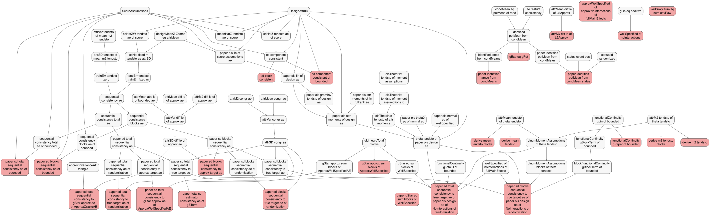
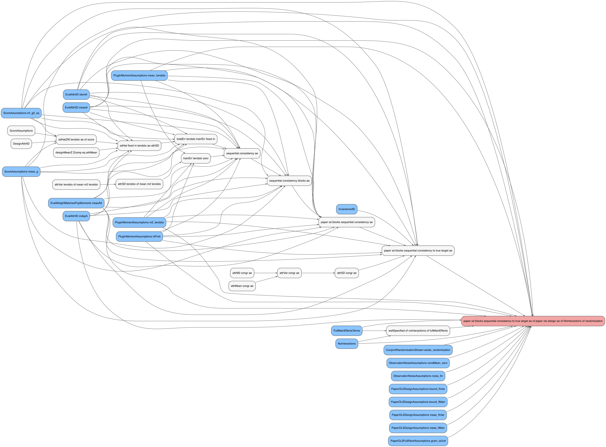

This document auto-generates theorem dependency tables by parsing the
output of `Scratch.lean`.

## Auto-generated assumption matrix

<table style="width:100%;">
<colgroup>
<col style="width: 3%" />
<col style="width: 0%" />
<col style="width: 2%" />
<col style="width: 2%" />
<col style="width: 2%" />
<col style="width: 2%" />
<col style="width: 2%" />
<col style="width: 1%" />
<col style="width: 2%" />
<col style="width: 2%" />
<col style="width: 3%" />
<col style="width: 2%" />
<col style="width: 3%" />
<col style="width: 2%" />
<col style="width: 2%" />
<col style="width: 2%" />
<col style="width: 1%" />
<col style="width: 2%" />
<col style="width: 2%" />
<col style="width: 2%" />
<col style="width: 2%" />
<col style="width: 1%" />
<col style="width: 2%" />
<col style="width: 2%" />
<col style="width: 1%" />
<col style="width: 1%" />
<col style="width: 1%" />
<col style="width: 1%" />
<col style="width: 1%" />
<col style="width: 4%" />
<col style="width: 2%" />
<col style="width: 9%" />
<col style="width: 2%" />
<col style="width: 2%" />
<col style="width: 3%" />
<col style="width: 2%" />
<col style="width: 2%" />
<col style="width: 4%" />
</colgroup>
<thead>
<tr>
<th style="text-align: left;"></th>
<th style="text-align: left;">Count</th>
<th style="text-align: left;">attrMean tendsto of theta tendsto</th>
<th style="text-align: left;">attrM2 tendsto of theta tendsto</th>
<th style="text-align: left;">attrSD tendsto of mean m2 tendsto</th>
<th style="text-align: left;">olsThetaHat tendsto of attr moments</th>
<th style="text-align: left;">cont mean gLin of bounded</th>
<th style="text-align: left;">cont m2 gLin of bounded</th>
<th style="text-align: left;">cont mean gBlockTerm of bounded</th>
<th style="text-align: left;">cont m2 gBlockTerm of bounded</th>
<th style="text-align: left;">cont mean blocks gBlockTerm of
bounded</th>
<th style="text-align: left;">cont m2 blocks gBlockTerm of bounded</th>
<th style="text-align: left;">paper ols gramInv tendsto of design
ae</th>
<th style="text-align: left;">paper ols theta0 eq of normal eq</th>
<th style="text-align: left;">paper ols normal eq of wellSpecified</th>
<th style="text-align: left;">theta tendsto of paper ols design ae</th>
<th style="text-align: left;">subject lln gPop of iid</th>
<th style="text-align: left;">meanHatZ tendsto ae of score</th>
<th style="text-align: left;">sdHatZ tendsto ae of score</th>
<th style="text-align: left;">sdHat fixed m tendsto ae attrSD</th>
<th style="text-align: left;">totalErr tendsto trainErr fixed m</th>
<th style="text-align: left;">trainErr tendsto zero</th>
<th style="text-align: left;">sequential consistency ae</th>
<th style="text-align: left;">sequential consistency blocks ae</th>
<th style="text-align: left;">attrMean congr ae</th>
<th style="text-align: left;">attrM2 congr ae</th>
<th style="text-align: left;">attrVar congr ae</th>
<th style="text-align: left;">attrSD congr ae</th>
<th style="text-align: left;">gLin eq gTotal blocks</th>
<th style="text-align: left;">paper sd blocks sequential consistency to
true target ae</th>
<th style="text-align: left;">paper ols attr moments of design ae</th>
<th style="text-align: left;">paper sd blocks sequential consistency to
true target ae of paper ols design ae of NoInteractions of
randomization</th>
<th style="text-align: left;">attrVar tendsto of mean m2 tendsto</th>
<th style="text-align: left;">designMeanZ Zcomp eq attrMean</th>
<th style="text-align: left;">paper ols attr moments of lln fullrank
ae</th>
<th style="text-align: left;">paper ols lln of design ae</th>
<th style="text-align: left;">paper ols lln of score assumptions ae</th>
<th style="text-align: left;">wellSpecified of noInteractions of
fullMainEffects</th>
</tr>
</thead>
<tbody>
<tr>
<td style="text-align: left;">ConjointRandomizationStream exists
randomization</td>
<td style="text-align: left;">5</td>
<td style="text-align: left;">❌</td>
<td style="text-align: left;">❌</td>
<td style="text-align: left;">❌</td>
<td style="text-align: left;">❌</td>
<td style="text-align: left;">❌</td>
<td style="text-align: left;">❌</td>
<td style="text-align: left;">❌</td>
<td style="text-align: left;">❌</td>
<td style="text-align: left;">❌</td>
<td style="text-align: left;">❌</td>
<td style="text-align: left;">✅</td>
<td style="text-align: left;">❌</td>
<td style="text-align: left;">❌</td>
<td style="text-align: left;">✅</td>
<td style="text-align: left;">❌</td>
<td style="text-align: left;">❌</td>
<td style="text-align: left;">❌</td>
<td style="text-align: left;">❌</td>
<td style="text-align: left;">❌</td>
<td style="text-align: left;">❌</td>
<td style="text-align: left;">❌</td>
<td style="text-align: left;">❌</td>
<td style="text-align: left;">❌</td>
<td style="text-align: left;">❌</td>
<td style="text-align: left;">❌</td>
<td style="text-align: left;">❌</td>
<td style="text-align: left;">❌</td>
<td style="text-align: left;">❌</td>
<td style="text-align: left;">✅</td>
<td style="text-align: left;">✅</td>
<td style="text-align: left;">❌</td>
<td style="text-align: left;">❌</td>
<td style="text-align: left;">❌</td>
<td style="text-align: left;">✅</td>
<td style="text-align: left;">❌</td>
<td style="text-align: left;">❌</td>
</tr>
<tr>
<td style="text-align: left;">EvalAttrIID identA</td>
<td style="text-align: left;">13</td>
<td style="text-align: left;">❌</td>
<td style="text-align: left;">❌</td>
<td style="text-align: left;">❌</td>
<td style="text-align: left;">❌</td>
<td style="text-align: left;">❌</td>
<td style="text-align: left;">❌</td>
<td style="text-align: left;">❌</td>
<td style="text-align: left;">❌</td>
<td style="text-align: left;">❌</td>
<td style="text-align: left;">❌</td>
<td style="text-align: left;">✅</td>
<td style="text-align: left;">❌</td>
<td style="text-align: left;">❌</td>
<td style="text-align: left;">✅</td>
<td style="text-align: left;">❌</td>
<td style="text-align: left;">✅</td>
<td style="text-align: left;">✅</td>
<td style="text-align: left;">✅</td>
<td style="text-align: left;">✅</td>
<td style="text-align: left;">❌</td>
<td style="text-align: left;">✅</td>
<td style="text-align: left;">✅</td>
<td style="text-align: left;">❌</td>
<td style="text-align: left;">❌</td>
<td style="text-align: left;">❌</td>
<td style="text-align: left;">❌</td>
<td style="text-align: left;">❌</td>
<td style="text-align: left;">✅</td>
<td style="text-align: left;">✅</td>
<td style="text-align: left;">✅</td>
<td style="text-align: left;">❌</td>
<td style="text-align: left;">❌</td>
<td style="text-align: left;">❌</td>
<td style="text-align: left;">✅</td>
<td style="text-align: left;">✅</td>
<td style="text-align: left;">❌</td>
</tr>
<tr>
<td style="text-align: left;">EvalAttrIID indepA</td>
<td style="text-align: left;">13</td>
<td style="text-align: left;">❌</td>
<td style="text-align: left;">❌</td>
<td style="text-align: left;">❌</td>
<td style="text-align: left;">❌</td>
<td style="text-align: left;">❌</td>
<td style="text-align: left;">❌</td>
<td style="text-align: left;">❌</td>
<td style="text-align: left;">❌</td>
<td style="text-align: left;">❌</td>
<td style="text-align: left;">❌</td>
<td style="text-align: left;">✅</td>
<td style="text-align: left;">❌</td>
<td style="text-align: left;">❌</td>
<td style="text-align: left;">✅</td>
<td style="text-align: left;">❌</td>
<td style="text-align: left;">✅</td>
<td style="text-align: left;">✅</td>
<td style="text-align: left;">✅</td>
<td style="text-align: left;">✅</td>
<td style="text-align: left;">❌</td>
<td style="text-align: left;">✅</td>
<td style="text-align: left;">✅</td>
<td style="text-align: left;">❌</td>
<td style="text-align: left;">❌</td>
<td style="text-align: left;">❌</td>
<td style="text-align: left;">❌</td>
<td style="text-align: left;">❌</td>
<td style="text-align: left;">✅</td>
<td style="text-align: left;">✅</td>
<td style="text-align: left;">✅</td>
<td style="text-align: left;">❌</td>
<td style="text-align: left;">❌</td>
<td style="text-align: left;">❌</td>
<td style="text-align: left;">✅</td>
<td style="text-align: left;">✅</td>
<td style="text-align: left;">❌</td>
</tr>
<tr>
<td style="text-align: left;">EvalAttrIID measA</td>
<td style="text-align: left;">13</td>
<td style="text-align: left;">❌</td>
<td style="text-align: left;">❌</td>
<td style="text-align: left;">❌</td>
<td style="text-align: left;">❌</td>
<td style="text-align: left;">❌</td>
<td style="text-align: left;">❌</td>
<td style="text-align: left;">❌</td>
<td style="text-align: left;">❌</td>
<td style="text-align: left;">❌</td>
<td style="text-align: left;">❌</td>
<td style="text-align: left;">✅</td>
<td style="text-align: left;">❌</td>
<td style="text-align: left;">❌</td>
<td style="text-align: left;">✅</td>
<td style="text-align: left;">❌</td>
<td style="text-align: left;">✅</td>
<td style="text-align: left;">✅</td>
<td style="text-align: left;">✅</td>
<td style="text-align: left;">✅</td>
<td style="text-align: left;">❌</td>
<td style="text-align: left;">✅</td>
<td style="text-align: left;">✅</td>
<td style="text-align: left;">❌</td>
<td style="text-align: left;">❌</td>
<td style="text-align: left;">❌</td>
<td style="text-align: left;">❌</td>
<td style="text-align: left;">❌</td>
<td style="text-align: left;">✅</td>
<td style="text-align: left;">✅</td>
<td style="text-align: left;">✅</td>
<td style="text-align: left;">❌</td>
<td style="text-align: left;">❌</td>
<td style="text-align: left;">❌</td>
<td style="text-align: left;">✅</td>
<td style="text-align: left;">✅</td>
<td style="text-align: left;">❌</td>
</tr>
<tr>
<td style="text-align: left;">EvalAttrLawEqPop identA</td>
<td style="text-align: left;">6</td>
<td style="text-align: left;">❌</td>
<td style="text-align: left;">❌</td>
<td style="text-align: left;">❌</td>
<td style="text-align: left;">❌</td>
<td style="text-align: left;">❌</td>
<td style="text-align: left;">❌</td>
<td style="text-align: left;">❌</td>
<td style="text-align: left;">❌</td>
<td style="text-align: left;">❌</td>
<td style="text-align: left;">❌</td>
<td style="text-align: left;">❌</td>
<td style="text-align: left;">❌</td>
<td style="text-align: left;">❌</td>
<td style="text-align: left;">❌</td>
<td style="text-align: left;">❌</td>
<td style="text-align: left;">❌</td>
<td style="text-align: left;">❌</td>
<td style="text-align: left;">✅</td>
<td style="text-align: left;">✅</td>
<td style="text-align: left;">❌</td>
<td style="text-align: left;">✅</td>
<td style="text-align: left;">✅</td>
<td style="text-align: left;">❌</td>
<td style="text-align: left;">❌</td>
<td style="text-align: left;">❌</td>
<td style="text-align: left;">❌</td>
<td style="text-align: left;">❌</td>
<td style="text-align: left;">✅</td>
<td style="text-align: left;">❌</td>
<td style="text-align: left;">✅</td>
<td style="text-align: left;">❌</td>
<td style="text-align: left;">❌</td>
<td style="text-align: left;">❌</td>
<td style="text-align: left;">❌</td>
<td style="text-align: left;">❌</td>
<td style="text-align: left;">❌</td>
</tr>
<tr>
<td style="text-align: left;">EvalAttrLawEqPop indepA</td>
<td style="text-align: left;">6</td>
<td style="text-align: left;">❌</td>
<td style="text-align: left;">❌</td>
<td style="text-align: left;">❌</td>
<td style="text-align: left;">❌</td>
<td style="text-align: left;">❌</td>
<td style="text-align: left;">❌</td>
<td style="text-align: left;">❌</td>
<td style="text-align: left;">❌</td>
<td style="text-align: left;">❌</td>
<td style="text-align: left;">❌</td>
<td style="text-align: left;">❌</td>
<td style="text-align: left;">❌</td>
<td style="text-align: left;">❌</td>
<td style="text-align: left;">❌</td>
<td style="text-align: left;">❌</td>
<td style="text-align: left;">❌</td>
<td style="text-align: left;">❌</td>
<td style="text-align: left;">✅</td>
<td style="text-align: left;">✅</td>
<td style="text-align: left;">❌</td>
<td style="text-align: left;">✅</td>
<td style="text-align: left;">✅</td>
<td style="text-align: left;">❌</td>
<td style="text-align: left;">❌</td>
<td style="text-align: left;">❌</td>
<td style="text-align: left;">❌</td>
<td style="text-align: left;">❌</td>
<td style="text-align: left;">✅</td>
<td style="text-align: left;">❌</td>
<td style="text-align: left;">✅</td>
<td style="text-align: left;">❌</td>
<td style="text-align: left;">❌</td>
<td style="text-align: left;">❌</td>
<td style="text-align: left;">❌</td>
<td style="text-align: left;">❌</td>
<td style="text-align: left;">❌</td>
</tr>
<tr>
<td style="text-align: left;">EvalAttrLawEqPop measA</td>
<td style="text-align: left;">6</td>
<td style="text-align: left;">❌</td>
<td style="text-align: left;">❌</td>
<td style="text-align: left;">❌</td>
<td style="text-align: left;">❌</td>
<td style="text-align: left;">❌</td>
<td style="text-align: left;">❌</td>
<td style="text-align: left;">❌</td>
<td style="text-align: left;">❌</td>
<td style="text-align: left;">❌</td>
<td style="text-align: left;">❌</td>
<td style="text-align: left;">❌</td>
<td style="text-align: left;">❌</td>
<td style="text-align: left;">❌</td>
<td style="text-align: left;">❌</td>
<td style="text-align: left;">❌</td>
<td style="text-align: left;">❌</td>
<td style="text-align: left;">❌</td>
<td style="text-align: left;">✅</td>
<td style="text-align: left;">✅</td>
<td style="text-align: left;">❌</td>
<td style="text-align: left;">✅</td>
<td style="text-align: left;">✅</td>
<td style="text-align: left;">❌</td>
<td style="text-align: left;">❌</td>
<td style="text-align: left;">❌</td>
<td style="text-align: left;">❌</td>
<td style="text-align: left;">❌</td>
<td style="text-align: left;">✅</td>
<td style="text-align: left;">❌</td>
<td style="text-align: left;">✅</td>
<td style="text-align: left;">❌</td>
<td style="text-align: left;">❌</td>
<td style="text-align: left;">❌</td>
<td style="text-align: left;">❌</td>
<td style="text-align: left;">❌</td>
<td style="text-align: left;">❌</td>
</tr>
<tr>
<td style="text-align: left;">FullMainEffectsTerms</td>
<td style="text-align: left;">2</td>
<td style="text-align: left;">❌</td>
<td style="text-align: left;">❌</td>
<td style="text-align: left;">❌</td>
<td style="text-align: left;">❌</td>
<td style="text-align: left;">❌</td>
<td style="text-align: left;">❌</td>
<td style="text-align: left;">❌</td>
<td style="text-align: left;">❌</td>
<td style="text-align: left;">❌</td>
<td style="text-align: left;">❌</td>
<td style="text-align: left;">❌</td>
<td style="text-align: left;">❌</td>
<td style="text-align: left;">❌</td>
<td style="text-align: left;">❌</td>
<td style="text-align: left;">❌</td>
<td style="text-align: left;">❌</td>
<td style="text-align: left;">❌</td>
<td style="text-align: left;">❌</td>
<td style="text-align: left;">❌</td>
<td style="text-align: left;">❌</td>
<td style="text-align: left;">❌</td>
<td style="text-align: left;">❌</td>
<td style="text-align: left;">❌</td>
<td style="text-align: left;">❌</td>
<td style="text-align: left;">❌</td>
<td style="text-align: left;">❌</td>
<td style="text-align: left;">❌</td>
<td style="text-align: left;">❌</td>
<td style="text-align: left;">❌</td>
<td style="text-align: left;">✅</td>
<td style="text-align: left;">❌</td>
<td style="text-align: left;">❌</td>
<td style="text-align: left;">❌</td>
<td style="text-align: left;">❌</td>
<td style="text-align: left;">❌</td>
<td style="text-align: left;">✅</td>
</tr>
<tr>
<td style="text-align: left;">NoInteractions</td>
<td style="text-align: left;">7</td>
<td style="text-align: left;">❌</td>
<td style="text-align: left;">❌</td>
<td style="text-align: left;">❌</td>
<td style="text-align: left;">❌</td>
<td style="text-align: left;">❌</td>
<td style="text-align: left;">❌</td>
<td style="text-align: left;">❌</td>
<td style="text-align: left;">❌</td>
<td style="text-align: left;">❌</td>
<td style="text-align: left;">❌</td>
<td style="text-align: left;">✅</td>
<td style="text-align: left;">❌</td>
<td style="text-align: left;">✅</td>
<td style="text-align: left;">✅</td>
<td style="text-align: left;">❌</td>
<td style="text-align: left;">❌</td>
<td style="text-align: left;">❌</td>
<td style="text-align: left;">❌</td>
<td style="text-align: left;">❌</td>
<td style="text-align: left;">❌</td>
<td style="text-align: left;">❌</td>
<td style="text-align: left;">❌</td>
<td style="text-align: left;">❌</td>
<td style="text-align: left;">❌</td>
<td style="text-align: left;">❌</td>
<td style="text-align: left;">❌</td>
<td style="text-align: left;">❌</td>
<td style="text-align: left;">❌</td>
<td style="text-align: left;">✅</td>
<td style="text-align: left;">✅</td>
<td style="text-align: left;">❌</td>
<td style="text-align: left;">❌</td>
<td style="text-align: left;">❌</td>
<td style="text-align: left;">✅</td>
<td style="text-align: left;">❌</td>
<td style="text-align: left;">✅</td>
</tr>
<tr>
<td style="text-align: left;">ObservationNoiseAssumptions condMean
zero</td>
<td style="text-align: left;">6</td>
<td style="text-align: left;">❌</td>
<td style="text-align: left;">❌</td>
<td style="text-align: left;">❌</td>
<td style="text-align: left;">❌</td>
<td style="text-align: left;">❌</td>
<td style="text-align: left;">❌</td>
<td style="text-align: left;">❌</td>
<td style="text-align: left;">❌</td>
<td style="text-align: left;">❌</td>
<td style="text-align: left;">❌</td>
<td style="text-align: left;">✅</td>
<td style="text-align: left;">❌</td>
<td style="text-align: left;">❌</td>
<td style="text-align: left;">✅</td>
<td style="text-align: left;">❌</td>
<td style="text-align: left;">❌</td>
<td style="text-align: left;">❌</td>
<td style="text-align: left;">❌</td>
<td style="text-align: left;">❌</td>
<td style="text-align: left;">❌</td>
<td style="text-align: left;">❌</td>
<td style="text-align: left;">❌</td>
<td style="text-align: left;">❌</td>
<td style="text-align: left;">❌</td>
<td style="text-align: left;">❌</td>
<td style="text-align: left;">❌</td>
<td style="text-align: left;">❌</td>
<td style="text-align: left;">❌</td>
<td style="text-align: left;">✅</td>
<td style="text-align: left;">✅</td>
<td style="text-align: left;">❌</td>
<td style="text-align: left;">❌</td>
<td style="text-align: left;">❌</td>
<td style="text-align: left;">✅</td>
<td style="text-align: left;">✅</td>
<td style="text-align: left;">❌</td>
</tr>
<tr>
<td style="text-align: left;">ObservationNoiseAssumptions noise lln</td>
<td style="text-align: left;">6</td>
<td style="text-align: left;">❌</td>
<td style="text-align: left;">❌</td>
<td style="text-align: left;">❌</td>
<td style="text-align: left;">❌</td>
<td style="text-align: left;">❌</td>
<td style="text-align: left;">❌</td>
<td style="text-align: left;">❌</td>
<td style="text-align: left;">❌</td>
<td style="text-align: left;">❌</td>
<td style="text-align: left;">❌</td>
<td style="text-align: left;">✅</td>
<td style="text-align: left;">❌</td>
<td style="text-align: left;">❌</td>
<td style="text-align: left;">✅</td>
<td style="text-align: left;">❌</td>
<td style="text-align: left;">❌</td>
<td style="text-align: left;">❌</td>
<td style="text-align: left;">❌</td>
<td style="text-align: left;">❌</td>
<td style="text-align: left;">❌</td>
<td style="text-align: left;">❌</td>
<td style="text-align: left;">❌</td>
<td style="text-align: left;">❌</td>
<td style="text-align: left;">❌</td>
<td style="text-align: left;">❌</td>
<td style="text-align: left;">❌</td>
<td style="text-align: left;">❌</td>
<td style="text-align: left;">❌</td>
<td style="text-align: left;">✅</td>
<td style="text-align: left;">✅</td>
<td style="text-align: left;">❌</td>
<td style="text-align: left;">❌</td>
<td style="text-align: left;">❌</td>
<td style="text-align: left;">✅</td>
<td style="text-align: left;">✅</td>
<td style="text-align: left;">❌</td>
</tr>
<tr>
<td style="text-align: left;">PaperOLSDesignAssumptions bound
fInter</td>
<td style="text-align: left;">5</td>
<td style="text-align: left;">❌</td>
<td style="text-align: left;">❌</td>
<td style="text-align: left;">❌</td>
<td style="text-align: left;">❌</td>
<td style="text-align: left;">❌</td>
<td style="text-align: left;">❌</td>
<td style="text-align: left;">❌</td>
<td style="text-align: left;">❌</td>
<td style="text-align: left;">❌</td>
<td style="text-align: left;">❌</td>
<td style="text-align: left;">✅</td>
<td style="text-align: left;">❌</td>
<td style="text-align: left;">❌</td>
<td style="text-align: left;">✅</td>
<td style="text-align: left;">❌</td>
<td style="text-align: left;">❌</td>
<td style="text-align: left;">❌</td>
<td style="text-align: left;">❌</td>
<td style="text-align: left;">❌</td>
<td style="text-align: left;">❌</td>
<td style="text-align: left;">❌</td>
<td style="text-align: left;">❌</td>
<td style="text-align: left;">❌</td>
<td style="text-align: left;">❌</td>
<td style="text-align: left;">❌</td>
<td style="text-align: left;">❌</td>
<td style="text-align: left;">❌</td>
<td style="text-align: left;">❌</td>
<td style="text-align: left;">✅</td>
<td style="text-align: left;">✅</td>
<td style="text-align: left;">❌</td>
<td style="text-align: left;">❌</td>
<td style="text-align: left;">❌</td>
<td style="text-align: left;">✅</td>
<td style="text-align: left;">❌</td>
<td style="text-align: left;">❌</td>
</tr>
<tr>
<td style="text-align: left;">PaperOLSDesignAssumptions bound fMain</td>
<td style="text-align: left;">5</td>
<td style="text-align: left;">❌</td>
<td style="text-align: left;">❌</td>
<td style="text-align: left;">❌</td>
<td style="text-align: left;">❌</td>
<td style="text-align: left;">❌</td>
<td style="text-align: left;">❌</td>
<td style="text-align: left;">❌</td>
<td style="text-align: left;">❌</td>
<td style="text-align: left;">❌</td>
<td style="text-align: left;">❌</td>
<td style="text-align: left;">✅</td>
<td style="text-align: left;">❌</td>
<td style="text-align: left;">❌</td>
<td style="text-align: left;">✅</td>
<td style="text-align: left;">❌</td>
<td style="text-align: left;">❌</td>
<td style="text-align: left;">❌</td>
<td style="text-align: left;">❌</td>
<td style="text-align: left;">❌</td>
<td style="text-align: left;">❌</td>
<td style="text-align: left;">❌</td>
<td style="text-align: left;">❌</td>
<td style="text-align: left;">❌</td>
<td style="text-align: left;">❌</td>
<td style="text-align: left;">❌</td>
<td style="text-align: left;">❌</td>
<td style="text-align: left;">❌</td>
<td style="text-align: left;">❌</td>
<td style="text-align: left;">✅</td>
<td style="text-align: left;">✅</td>
<td style="text-align: left;">❌</td>
<td style="text-align: left;">❌</td>
<td style="text-align: left;">❌</td>
<td style="text-align: left;">✅</td>
<td style="text-align: left;">❌</td>
<td style="text-align: left;">❌</td>
</tr>
<tr>
<td style="text-align: left;">PaperOLSDesignAssumptions meas fInter</td>
<td style="text-align: left;">5</td>
<td style="text-align: left;">❌</td>
<td style="text-align: left;">❌</td>
<td style="text-align: left;">❌</td>
<td style="text-align: left;">❌</td>
<td style="text-align: left;">❌</td>
<td style="text-align: left;">❌</td>
<td style="text-align: left;">❌</td>
<td style="text-align: left;">❌</td>
<td style="text-align: left;">❌</td>
<td style="text-align: left;">❌</td>
<td style="text-align: left;">✅</td>
<td style="text-align: left;">❌</td>
<td style="text-align: left;">❌</td>
<td style="text-align: left;">✅</td>
<td style="text-align: left;">❌</td>
<td style="text-align: left;">❌</td>
<td style="text-align: left;">❌</td>
<td style="text-align: left;">❌</td>
<td style="text-align: left;">❌</td>
<td style="text-align: left;">❌</td>
<td style="text-align: left;">❌</td>
<td style="text-align: left;">❌</td>
<td style="text-align: left;">❌</td>
<td style="text-align: left;">❌</td>
<td style="text-align: left;">❌</td>
<td style="text-align: left;">❌</td>
<td style="text-align: left;">❌</td>
<td style="text-align: left;">❌</td>
<td style="text-align: left;">✅</td>
<td style="text-align: left;">✅</td>
<td style="text-align: left;">❌</td>
<td style="text-align: left;">❌</td>
<td style="text-align: left;">❌</td>
<td style="text-align: left;">✅</td>
<td style="text-align: left;">❌</td>
<td style="text-align: left;">❌</td>
</tr>
<tr>
<td style="text-align: left;">PaperOLSDesignAssumptions meas fMain</td>
<td style="text-align: left;">5</td>
<td style="text-align: left;">❌</td>
<td style="text-align: left;">❌</td>
<td style="text-align: left;">❌</td>
<td style="text-align: left;">❌</td>
<td style="text-align: left;">❌</td>
<td style="text-align: left;">❌</td>
<td style="text-align: left;">❌</td>
<td style="text-align: left;">❌</td>
<td style="text-align: left;">❌</td>
<td style="text-align: left;">❌</td>
<td style="text-align: left;">✅</td>
<td style="text-align: left;">❌</td>
<td style="text-align: left;">❌</td>
<td style="text-align: left;">✅</td>
<td style="text-align: left;">❌</td>
<td style="text-align: left;">❌</td>
<td style="text-align: left;">❌</td>
<td style="text-align: left;">❌</td>
<td style="text-align: left;">❌</td>
<td style="text-align: left;">❌</td>
<td style="text-align: left;">❌</td>
<td style="text-align: left;">❌</td>
<td style="text-align: left;">❌</td>
<td style="text-align: left;">❌</td>
<td style="text-align: left;">❌</td>
<td style="text-align: left;">❌</td>
<td style="text-align: left;">❌</td>
<td style="text-align: left;">❌</td>
<td style="text-align: left;">✅</td>
<td style="text-align: left;">✅</td>
<td style="text-align: left;">❌</td>
<td style="text-align: left;">❌</td>
<td style="text-align: left;">❌</td>
<td style="text-align: left;">✅</td>
<td style="text-align: left;">❌</td>
<td style="text-align: left;">❌</td>
</tr>
<tr>
<td style="text-align: left;">PaperOLSFullRankAssumptions gram
isUnit</td>
<td style="text-align: left;">5</td>
<td style="text-align: left;">❌</td>
<td style="text-align: left;">❌</td>
<td style="text-align: left;">❌</td>
<td style="text-align: left;">❌</td>
<td style="text-align: left;">❌</td>
<td style="text-align: left;">❌</td>
<td style="text-align: left;">❌</td>
<td style="text-align: left;">❌</td>
<td style="text-align: left;">❌</td>
<td style="text-align: left;">❌</td>
<td style="text-align: left;">✅</td>
<td style="text-align: left;">✅</td>
<td style="text-align: left;">❌</td>
<td style="text-align: left;">✅</td>
<td style="text-align: left;">❌</td>
<td style="text-align: left;">❌</td>
<td style="text-align: left;">❌</td>
<td style="text-align: left;">❌</td>
<td style="text-align: left;">❌</td>
<td style="text-align: left;">❌</td>
<td style="text-align: left;">❌</td>
<td style="text-align: left;">❌</td>
<td style="text-align: left;">❌</td>
<td style="text-align: left;">❌</td>
<td style="text-align: left;">❌</td>
<td style="text-align: left;">❌</td>
<td style="text-align: left;">❌</td>
<td style="text-align: left;">❌</td>
<td style="text-align: left;">✅</td>
<td style="text-align: left;">✅</td>
<td style="text-align: left;">❌</td>
<td style="text-align: left;">❌</td>
<td style="text-align: left;">❌</td>
<td style="text-align: left;">❌</td>
<td style="text-align: left;">❌</td>
<td style="text-align: left;">❌</td>
</tr>
<tr>
<td style="text-align: left;">SubjectSamplingIID identR</td>
<td style="text-align: left;">2</td>
<td style="text-align: left;">❌</td>
<td style="text-align: left;">❌</td>
<td style="text-align: left;">❌</td>
<td style="text-align: left;">❌</td>
<td style="text-align: left;">❌</td>
<td style="text-align: left;">❌</td>
<td style="text-align: left;">❌</td>
<td style="text-align: left;">❌</td>
<td style="text-align: left;">❌</td>
<td style="text-align: left;">❌</td>
<td style="text-align: left;">❌</td>
<td style="text-align: left;">❌</td>
<td style="text-align: left;">❌</td>
<td style="text-align: left;">❌</td>
<td style="text-align: left;">✅</td>
<td style="text-align: left;">❌</td>
<td style="text-align: left;">❌</td>
<td style="text-align: left;">❌</td>
<td style="text-align: left;">❌</td>
<td style="text-align: left;">❌</td>
<td style="text-align: left;">❌</td>
<td style="text-align: left;">❌</td>
<td style="text-align: left;">❌</td>
<td style="text-align: left;">❌</td>
<td style="text-align: left;">❌</td>
<td style="text-align: left;">❌</td>
<td style="text-align: left;">❌</td>
<td style="text-align: left;">❌</td>
<td style="text-align: left;">❌</td>
<td style="text-align: left;">✅</td>
<td style="text-align: left;">❌</td>
<td style="text-align: left;">❌</td>
<td style="text-align: left;">❌</td>
<td style="text-align: left;">❌</td>
<td style="text-align: left;">❌</td>
<td style="text-align: left;">❌</td>
</tr>
<tr>
<td style="text-align: left;">SubjectSamplingIID indepR</td>
<td style="text-align: left;">2</td>
<td style="text-align: left;">❌</td>
<td style="text-align: left;">❌</td>
<td style="text-align: left;">❌</td>
<td style="text-align: left;">❌</td>
<td style="text-align: left;">❌</td>
<td style="text-align: left;">❌</td>
<td style="text-align: left;">❌</td>
<td style="text-align: left;">❌</td>
<td style="text-align: left;">❌</td>
<td style="text-align: left;">❌</td>
<td style="text-align: left;">❌</td>
<td style="text-align: left;">❌</td>
<td style="text-align: left;">❌</td>
<td style="text-align: left;">❌</td>
<td style="text-align: left;">✅</td>
<td style="text-align: left;">❌</td>
<td style="text-align: left;">❌</td>
<td style="text-align: left;">❌</td>
<td style="text-align: left;">❌</td>
<td style="text-align: left;">❌</td>
<td style="text-align: left;">❌</td>
<td style="text-align: left;">❌</td>
<td style="text-align: left;">❌</td>
<td style="text-align: left;">❌</td>
<td style="text-align: left;">❌</td>
<td style="text-align: left;">❌</td>
<td style="text-align: left;">❌</td>
<td style="text-align: left;">❌</td>
<td style="text-align: left;">❌</td>
<td style="text-align: left;">✅</td>
<td style="text-align: left;">❌</td>
<td style="text-align: left;">❌</td>
<td style="text-align: left;">❌</td>
<td style="text-align: left;">❌</td>
<td style="text-align: left;">❌</td>
<td style="text-align: left;">❌</td>
</tr>
<tr>
<td style="text-align: left;">SubjectSamplingIID measR</td>
<td style="text-align: left;">2</td>
<td style="text-align: left;">❌</td>
<td style="text-align: left;">❌</td>
<td style="text-align: left;">❌</td>
<td style="text-align: left;">❌</td>
<td style="text-align: left;">❌</td>
<td style="text-align: left;">❌</td>
<td style="text-align: left;">❌</td>
<td style="text-align: left;">❌</td>
<td style="text-align: left;">❌</td>
<td style="text-align: left;">❌</td>
<td style="text-align: left;">❌</td>
<td style="text-align: left;">❌</td>
<td style="text-align: left;">❌</td>
<td style="text-align: left;">❌</td>
<td style="text-align: left;">✅</td>
<td style="text-align: left;">❌</td>
<td style="text-align: left;">❌</td>
<td style="text-align: left;">❌</td>
<td style="text-align: left;">❌</td>
<td style="text-align: left;">❌</td>
<td style="text-align: left;">❌</td>
<td style="text-align: left;">❌</td>
<td style="text-align: left;">❌</td>
<td style="text-align: left;">❌</td>
<td style="text-align: left;">❌</td>
<td style="text-align: left;">❌</td>
<td style="text-align: left;">❌</td>
<td style="text-align: left;">❌</td>
<td style="text-align: left;">❌</td>
<td style="text-align: left;">✅</td>
<td style="text-align: left;">❌</td>
<td style="text-align: left;">❌</td>
<td style="text-align: left;">❌</td>
<td style="text-align: left;">❌</td>
<td style="text-align: left;">❌</td>
<td style="text-align: left;">❌</td>
</tr>
<tr>
<td style="text-align: left;">SubjectSamplingLLNStar lln gStar</td>
<td style="text-align: left;">1</td>
<td style="text-align: left;">❌</td>
<td style="text-align: left;">❌</td>
<td style="text-align: left;">❌</td>
<td style="text-align: left;">❌</td>
<td style="text-align: left;">❌</td>
<td style="text-align: left;">❌</td>
<td style="text-align: left;">❌</td>
<td style="text-align: left;">❌</td>
<td style="text-align: left;">❌</td>
<td style="text-align: left;">❌</td>
<td style="text-align: left;">❌</td>
<td style="text-align: left;">❌</td>
<td style="text-align: left;">❌</td>
<td style="text-align: left;">❌</td>
<td style="text-align: left;">❌</td>
<td style="text-align: left;">❌</td>
<td style="text-align: left;">❌</td>
<td style="text-align: left;">❌</td>
<td style="text-align: left;">❌</td>
<td style="text-align: left;">❌</td>
<td style="text-align: left;">❌</td>
<td style="text-align: left;">❌</td>
<td style="text-align: left;">❌</td>
<td style="text-align: left;">❌</td>
<td style="text-align: left;">❌</td>
<td style="text-align: left;">❌</td>
<td style="text-align: left;">❌</td>
<td style="text-align: left;">❌</td>
<td style="text-align: left;">❌</td>
<td style="text-align: left;">✅</td>
<td style="text-align: left;">❌</td>
<td style="text-align: left;">❌</td>
<td style="text-align: left;">❌</td>
<td style="text-align: left;">❌</td>
<td style="text-align: left;">❌</td>
<td style="text-align: left;">❌</td>
</tr>
<tr>
<td style="text-align: left;">SubjectScoreAssumptions bound gP</td>
<td style="text-align: left;">2</td>
<td style="text-align: left;">❌</td>
<td style="text-align: left;">❌</td>
<td style="text-align: left;">❌</td>
<td style="text-align: left;">❌</td>
<td style="text-align: left;">❌</td>
<td style="text-align: left;">❌</td>
<td style="text-align: left;">❌</td>
<td style="text-align: left;">❌</td>
<td style="text-align: left;">❌</td>
<td style="text-align: left;">❌</td>
<td style="text-align: left;">❌</td>
<td style="text-align: left;">❌</td>
<td style="text-align: left;">❌</td>
<td style="text-align: left;">❌</td>
<td style="text-align: left;">✅</td>
<td style="text-align: left;">❌</td>
<td style="text-align: left;">❌</td>
<td style="text-align: left;">❌</td>
<td style="text-align: left;">❌</td>
<td style="text-align: left;">❌</td>
<td style="text-align: left;">❌</td>
<td style="text-align: left;">❌</td>
<td style="text-align: left;">❌</td>
<td style="text-align: left;">❌</td>
<td style="text-align: left;">❌</td>
<td style="text-align: left;">❌</td>
<td style="text-align: left;">❌</td>
<td style="text-align: left;">❌</td>
<td style="text-align: left;">❌</td>
<td style="text-align: left;">✅</td>
<td style="text-align: left;">❌</td>
<td style="text-align: left;">❌</td>
<td style="text-align: left;">❌</td>
<td style="text-align: left;">❌</td>
<td style="text-align: left;">❌</td>
<td style="text-align: left;">❌</td>
</tr>
<tr>
<td style="text-align: left;">SubjectScoreAssumptions meas gP</td>
<td style="text-align: left;">2</td>
<td style="text-align: left;">❌</td>
<td style="text-align: left;">❌</td>
<td style="text-align: left;">❌</td>
<td style="text-align: left;">❌</td>
<td style="text-align: left;">❌</td>
<td style="text-align: left;">❌</td>
<td style="text-align: left;">❌</td>
<td style="text-align: left;">❌</td>
<td style="text-align: left;">❌</td>
<td style="text-align: left;">❌</td>
<td style="text-align: left;">❌</td>
<td style="text-align: left;">❌</td>
<td style="text-align: left;">❌</td>
<td style="text-align: left;">❌</td>
<td style="text-align: left;">✅</td>
<td style="text-align: left;">❌</td>
<td style="text-align: left;">❌</td>
<td style="text-align: left;">❌</td>
<td style="text-align: left;">❌</td>
<td style="text-align: left;">❌</td>
<td style="text-align: left;">❌</td>
<td style="text-align: left;">❌</td>
<td style="text-align: left;">❌</td>
<td style="text-align: left;">❌</td>
<td style="text-align: left;">❌</td>
<td style="text-align: left;">❌</td>
<td style="text-align: left;">❌</td>
<td style="text-align: left;">❌</td>
<td style="text-align: left;">❌</td>
<td style="text-align: left;">✅</td>
<td style="text-align: left;">❌</td>
<td style="text-align: left;">❌</td>
<td style="text-align: left;">❌</td>
<td style="text-align: left;">❌</td>
<td style="text-align: left;">❌</td>
<td style="text-align: left;">❌</td>
</tr>
</tbody>
</table>

    ## Warning: Package 'writexl' or 'openxlsx' is required to write assumption_matrix.xlsx; wrote CSV instead.

## Theorem dependency DAG

## OLS SD block consistency DAG (direct assumptions)

