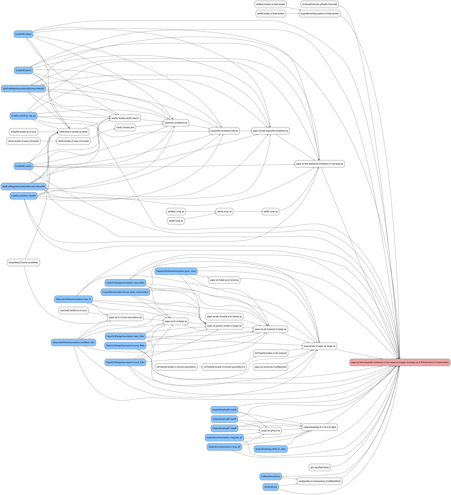

This document auto-generates theorem dependency tables by parsing the
output of `Scratch.lean`.

## Auto-generated assumption matrix

<table>
<colgroup>
<col style="width: 1%" />
<col style="width: 0%" />
<col style="width: 1%" />
<col style="width: 0%" />
<col style="width: 1%" />
<col style="width: 1%" />
<col style="width: 1%" />
<col style="width: 1%" />
<col style="width: 1%" />
<col style="width: 1%" />
<col style="width: 1%" />
<col style="width: 1%" />
<col style="width: 1%" />
<col style="width: 1%" />
<col style="width: 1%" />
<col style="width: 0%" />
<col style="width: 1%" />
<col style="width: 1%" />
<col style="width: 0%" />
<col style="width: 0%" />
<col style="width: 0%" />
<col style="width: 0%" />
<col style="width: 0%" />
<col style="width: 1%" />
<col style="width: 0%" />
<col style="width: 0%" />
<col style="width: 0%" />
<col style="width: 0%" />
<col style="width: 0%" />
<col style="width: 0%" />
<col style="width: 0%" />
<col style="width: 0%" />
<col style="width: 0%" />
<col style="width: 0%" />
<col style="width: 0%" />
<col style="width: 0%" />
<col style="width: 0%" />
<col style="width: 0%" />
<col style="width: 0%" />
<col style="width: 0%" />
<col style="width: 0%" />
<col style="width: 0%" />
<col style="width: 0%" />
<col style="width: 0%" />
<col style="width: 0%" />
<col style="width: 0%" />
<col style="width: 1%" />
<col style="width: 1%" />
<col style="width: 1%" />
<col style="width: 1%" />
<col style="width: 1%" />
<col style="width: 1%" />
<col style="width: 1%" />
<col style="width: 1%" />
<col style="width: 1%" />
<col style="width: 1%" />
<col style="width: 1%" />
<col style="width: 1%" />
<col style="width: 1%" />
<col style="width: 1%" />
<col style="width: 2%" />
<col style="width: 1%" />
<col style="width: 1%" />
<col style="width: 1%" />
<col style="width: 2%" />
<col style="width: 2%" />
<col style="width: 2%" />
<col style="width: 1%" />
<col style="width: 3%" />
<col style="width: 3%" />
<col style="width: 1%" />
<col style="width: 0%" />
<col style="width: 0%" />
<col style="width: 0%" />
<col style="width: 0%" />
<col style="width: 0%" />
<col style="width: 1%" />
<col style="width: 0%" />
<col style="width: 1%" />
<col style="width: 0%" />
<col style="width: 1%" />
<col style="width: 0%" />
<col style="width: 1%" />
<col style="width: 0%" />
<col style="width: 0%" />
<col style="width: 0%" />
<col style="width: 0%" />
<col style="width: 1%" />
</colgroup>
<thead>
<tr>
<th style="text-align: left;"></th>
<th style="text-align: left;">Count</th>
<th style="text-align: left;">attrMean tendsto of theta tendsto</th>
<th style="text-align: left;">attrM2 tendsto of theta tendsto</th>
<th style="text-align: left;">attrSD tendsto of mean m2 tendsto</th>
<th style="text-align: left;">olsThetaHat tendsto of moment
assumptions</th>
<th style="text-align: left;">olsThetaHat tendsto of moment assumptions
id</th>
<th style="text-align: left;">olsThetaHat tendsto of attr moments</th>
<th style="text-align: left;">functionalContinuity gLin of bounded</th>
<th style="text-align: left;">functionalContinuity gTotalΘ of
bounded</th>
<th style="text-align: left;">functionalContinuity gBlockTerm of
bounded</th>
<th style="text-align: left;">blockFunctionalContinuity gBlockTerm of
bounded</th>
<th style="text-align: left;">plugInMomentAssumptions of theta
tendsto</th>
<th style="text-align: left;">plugInMomentAssumptions blocks of theta
tendsto</th>
<th style="text-align: left;">paper ols gramInv tendsto of design
ae</th>
<th style="text-align: left;">paper ols theta0 eq of normal eq</th>
<th style="text-align: left;">paper ols normal eq of wellSpecified</th>
<th style="text-align: left;">theta tendsto of paper ols design ae</th>
<th style="text-align: left;">sd component consistent</th>
<th style="text-align: left;">meanHatZ tendsto ae of score</th>
<th style="text-align: left;">sdHatZ tendsto ae of score</th>
<th style="text-align: left;">sdHatZW tendsto ae of score</th>
<th style="text-align: left;">sdHat fixed m tendsto ae attrSD</th>
<th style="text-align: left;">totalErr tendsto trainErr fixed m</th>
<th style="text-align: left;">trainErr tendsto zero</th>
<th style="text-align: left;">sequential consistency ae</th>
<th style="text-align: left;">sequential consistency blocks ae</th>
<th style="text-align: left;">sequential consistency total ae</th>
<th style="text-align: left;">condMean eq potMean of rand</th>
<th style="text-align: left;">ae restrict consistency</th>
<th style="text-align: left;">identified potMean from condMean</th>
<th style="text-align: left;">identified amce from condMeans</th>
<th style="text-align: left;">gExp eq gPot</th>
<th style="text-align: left;">attrMean congr ae</th>
<th style="text-align: left;">attrM2 congr ae</th>
<th style="text-align: left;">attrVar congr ae</th>
<th style="text-align: left;">attrSD congr ae</th>
<th style="text-align: left;">approxInvarianceAE triangle</th>
<th style="text-align: left;">attrMean diff le of L2Approx</th>
<th style="text-align: left;">attrSD diff le of L2Approx</th>
<th style="text-align: left;">attrMean abs le of bounded ae</th>
<th style="text-align: left;">attrMean diff le of approx ae</th>
<th style="text-align: left;">attrM2 diff le of approx ae</th>
<th style="text-align: left;">attrVar diff le of approx ae</th>
<th style="text-align: left;">attrSD diff le of approx ae</th>
<th style="text-align: left;">gLin eq gTotal blocks</th>
<th style="text-align: left;">gStar eq sum blocks of WellSpecified</th>
<th style="text-align: left;">gStar approx sum blocks of
ApproxWellSpecified</th>
<th style="text-align: left;">gStar approx sum blocks of
ApproxWellSpecifiedAE</th>
<th style="text-align: left;">approxWellSpecified of
approxNoInteractions of fullMainEffects</th>
<th style="text-align: left;">paper total sd estimator consistency ae of
gBTerm</th>
<th style="text-align: left;">paper identifies potMean from
condMean</th>
<th style="text-align: left;">paper identifies amce from condMeans</th>
<th style="text-align: left;">paper identifies potMean from condMean
status</th>
<th style="text-align: left;">paper gStar eq sum blocks of
WellSpecified</th>
<th style="text-align: left;">paper sd blocks sequential consistency
ae</th>
<th style="text-align: left;">paper sd blocks sequential consistency ae
of randomization</th>
<th style="text-align: left;">paper sd total sequential consistency
ae</th>
<th style="text-align: left;">paper sd total sequential consistency ae
of randomization</th>
<th style="text-align: left;">paper sd blocks sequential consistency to
true target ae</th>
<th style="text-align: left;">paper sd blocks sequential consistency to
true target ae of randomization</th>
<th style="text-align: left;">paper sd blocks sequential consistency to
approx target ae</th>
<th style="text-align: left;">paper sd total sequential consistency to
approx target ae</th>
<th style="text-align: left;">paper sd total sequential consistency to
true target ae</th>
<th style="text-align: left;">paper sd total sequential consistency to
true target ae of randomization</th>
<th style="text-align: left;">paper sd total sequential consistency to
gStar approx ae of ApproxWellSpecifiedAE</th>
<th style="text-align: left;">paper sd total sequential consistency to
gStar approx ae of ApproxOracleAE</th>
<th style="text-align: left;">paper ols attr moments of design ae</th>
<th style="text-align: left;">paper sd total sequential consistency to
true target ae of paper ols design ae of NoInteractions of
randomization</th>
<th style="text-align: left;">paper sd blocks sequential consistency to
true target ae of paper ols design ae of NoInteractions of
randomization</th>
<th style="text-align: left;">attrVar tendsto of mean m2 tendsto</th>
<th style="text-align: left;">derive m2 tendsto</th>
<th style="text-align: left;">derive m2 tendsto blocks</th>
<th style="text-align: left;">derive mean tendsto</th>
<th style="text-align: left;">derive mean tendsto blocks</th>
<th style="text-align: left;">designMeanZ Zcomp eq attrMean</th>
<th style="text-align: left;">functionalContinuity gPaper of
bounded</th>
<th style="text-align: left;">gLin eq additive</th>
<th style="text-align: left;">paper ols attr moments of lln fullrank
ae</th>
<th style="text-align: left;">paper ols lln of design ae</th>
<th style="text-align: left;">paper ols lln of score assumptions ae</th>
<th style="text-align: left;">sd block consistent</th>
<th style="text-align: left;">sd component consistent of bounded</th>
<th style="text-align: left;">status event pos</th>
<th style="text-align: left;">status id randomized</th>
<th style="text-align: left;">varProxy sum eq sum covRaw</th>
<th style="text-align: left;">wellSpecified of noInteractions</th>
<th style="text-align: left;">wellSpecified of noInteractions of
fullMainEffects</th>
</tr>
</thead>
<tbody>
<tr>
<td style="text-align: left;">ApproxInvarianceAE</td>
<td style="text-align: left;">16</td>
<td style="text-align: left;">❌</td>
<td style="text-align: left;">❌</td>
<td style="text-align: left;">❌</td>
<td style="text-align: left;">❌</td>
<td style="text-align: left;">❌</td>
<td style="text-align: left;">❌</td>
<td style="text-align: left;">❌</td>
<td style="text-align: left;">❌</td>
<td style="text-align: left;">❌</td>
<td style="text-align: left;">❌</td>
<td style="text-align: left;">❌</td>
<td style="text-align: left;">❌</td>
<td style="text-align: left;">❌</td>
<td style="text-align: left;">❌</td>
<td style="text-align: left;">❌</td>
<td style="text-align: left;">❌</td>
<td style="text-align: left;">❌</td>
<td style="text-align: left;">❌</td>
<td style="text-align: left;">❌</td>
<td style="text-align: left;">❌</td>
<td style="text-align: left;">❌</td>
<td style="text-align: left;">❌</td>
<td style="text-align: left;">❌</td>
<td style="text-align: left;">❌</td>
<td style="text-align: left;">❌</td>
<td style="text-align: left;">❌</td>
<td style="text-align: left;">❌</td>
<td style="text-align: left;">✅</td>
<td style="text-align: left;">✅</td>
<td style="text-align: left;">✅</td>
<td style="text-align: left;">✅</td>
<td style="text-align: left;">❌</td>
<td style="text-align: left;">❌</td>
<td style="text-align: left;">❌</td>
<td style="text-align: left;">❌</td>
<td style="text-align: left;">✅</td>
<td style="text-align: left;">❌</td>
<td style="text-align: left;">❌</td>
<td style="text-align: left;">❌</td>
<td style="text-align: left;">✅</td>
<td style="text-align: left;">✅</td>
<td style="text-align: left;">✅</td>
<td style="text-align: left;">✅</td>
<td style="text-align: left;">❌</td>
<td style="text-align: left;">❌</td>
<td style="text-align: left;">❌</td>
<td style="text-align: left;">❌</td>
<td style="text-align: left;">❌</td>
<td style="text-align: left;">❌</td>
<td style="text-align: left;">✅</td>
<td style="text-align: left;">✅</td>
<td style="text-align: left;">✅</td>
<td style="text-align: left;">❌</td>
<td style="text-align: left;">❌</td>
<td style="text-align: left;">❌</td>
<td style="text-align: left;">❌</td>
<td style="text-align: left;">❌</td>
<td style="text-align: left;">❌</td>
<td style="text-align: left;">❌</td>
<td style="text-align: left;">✅</td>
<td style="text-align: left;">✅</td>
<td style="text-align: left;">❌</td>
<td style="text-align: left;">❌</td>
<td style="text-align: left;">✅</td>
<td style="text-align: left;">✅</td>
<td style="text-align: left;">❌</td>
<td style="text-align: left;">❌</td>
<td style="text-align: left;">❌</td>
<td style="text-align: left;">❌</td>
<td style="text-align: left;">❌</td>
<td style="text-align: left;">❌</td>
<td style="text-align: left;">❌</td>
<td style="text-align: left;">❌</td>
<td style="text-align: left;">❌</td>
<td style="text-align: left;">❌</td>
<td style="text-align: left;">❌</td>
<td style="text-align: left;">❌</td>
<td style="text-align: left;">❌</td>
<td style="text-align: left;">❌</td>
<td style="text-align: left;">❌</td>
<td style="text-align: left;">❌</td>
<td style="text-align: left;">❌</td>
<td style="text-align: left;">❌</td>
<td style="text-align: left;">❌</td>
<td style="text-align: left;">❌</td>
<td style="text-align: left;">❌</td>
</tr>
<tr>
<td style="text-align: left;">ApproxNoInteractions</td>
<td style="text-align: left;">3</td>
<td style="text-align: left;">❌</td>
<td style="text-align: left;">❌</td>
<td style="text-align: left;">❌</td>
<td style="text-align: left;">❌</td>
<td style="text-align: left;">❌</td>
<td style="text-align: left;">❌</td>
<td style="text-align: left;">❌</td>
<td style="text-align: left;">❌</td>
<td style="text-align: left;">❌</td>
<td style="text-align: left;">❌</td>
<td style="text-align: left;">❌</td>
<td style="text-align: left;">❌</td>
<td style="text-align: left;">❌</td>
<td style="text-align: left;">❌</td>
<td style="text-align: left;">❌</td>
<td style="text-align: left;">❌</td>
<td style="text-align: left;">❌</td>
<td style="text-align: left;">❌</td>
<td style="text-align: left;">❌</td>
<td style="text-align: left;">❌</td>
<td style="text-align: left;">❌</td>
<td style="text-align: left;">❌</td>
<td style="text-align: left;">❌</td>
<td style="text-align: left;">❌</td>
<td style="text-align: left;">❌</td>
<td style="text-align: left;">❌</td>
<td style="text-align: left;">❌</td>
<td style="text-align: left;">❌</td>
<td style="text-align: left;">❌</td>
<td style="text-align: left;">❌</td>
<td style="text-align: left;">❌</td>
<td style="text-align: left;">❌</td>
<td style="text-align: left;">❌</td>
<td style="text-align: left;">❌</td>
<td style="text-align: left;">❌</td>
<td style="text-align: left;">✅</td>
<td style="text-align: left;">❌</td>
<td style="text-align: left;">❌</td>
<td style="text-align: left;">❌</td>
<td style="text-align: left;">❌</td>
<td style="text-align: left;">❌</td>
<td style="text-align: left;">❌</td>
<td style="text-align: left;">❌</td>
<td style="text-align: left;">❌</td>
<td style="text-align: left;">❌</td>
<td style="text-align: left;">❌</td>
<td style="text-align: left;">❌</td>
<td style="text-align: left;">✅</td>
<td style="text-align: left;">❌</td>
<td style="text-align: left;">❌</td>
<td style="text-align: left;">❌</td>
<td style="text-align: left;">❌</td>
<td style="text-align: left;">❌</td>
<td style="text-align: left;">❌</td>
<td style="text-align: left;">❌</td>
<td style="text-align: left;">❌</td>
<td style="text-align: left;">❌</td>
<td style="text-align: left;">❌</td>
<td style="text-align: left;">❌</td>
<td style="text-align: left;">❌</td>
<td style="text-align: left;">❌</td>
<td style="text-align: left;">❌</td>
<td style="text-align: left;">❌</td>
<td style="text-align: left;">❌</td>
<td style="text-align: left;">✅</td>
<td style="text-align: left;">❌</td>
<td style="text-align: left;">❌</td>
<td style="text-align: left;">❌</td>
<td style="text-align: left;">❌</td>
<td style="text-align: left;">❌</td>
<td style="text-align: left;">❌</td>
<td style="text-align: left;">❌</td>
<td style="text-align: left;">❌</td>
<td style="text-align: left;">❌</td>
<td style="text-align: left;">❌</td>
<td style="text-align: left;">❌</td>
<td style="text-align: left;">❌</td>
<td style="text-align: left;">❌</td>
<td style="text-align: left;">❌</td>
<td style="text-align: left;">❌</td>
<td style="text-align: left;">❌</td>
<td style="text-align: left;">❌</td>
<td style="text-align: left;">❌</td>
<td style="text-align: left;">❌</td>
<td style="text-align: left;">❌</td>
<td style="text-align: left;">❌</td>
</tr>
<tr>
<td style="text-align: left;">ApproxOracleAE</td>
<td style="text-align: left;">2</td>
<td style="text-align: left;">❌</td>
<td style="text-align: left;">❌</td>
<td style="text-align: left;">❌</td>
<td style="text-align: left;">❌</td>
<td style="text-align: left;">❌</td>
<td style="text-align: left;">❌</td>
<td style="text-align: left;">❌</td>
<td style="text-align: left;">❌</td>
<td style="text-align: left;">❌</td>
<td style="text-align: left;">❌</td>
<td style="text-align: left;">❌</td>
<td style="text-align: left;">❌</td>
<td style="text-align: left;">❌</td>
<td style="text-align: left;">❌</td>
<td style="text-align: left;">❌</td>
<td style="text-align: left;">❌</td>
<td style="text-align: left;">❌</td>
<td style="text-align: left;">❌</td>
<td style="text-align: left;">❌</td>
<td style="text-align: left;">❌</td>
<td style="text-align: left;">❌</td>
<td style="text-align: left;">❌</td>
<td style="text-align: left;">❌</td>
<td style="text-align: left;">❌</td>
<td style="text-align: left;">❌</td>
<td style="text-align: left;">❌</td>
<td style="text-align: left;">❌</td>
<td style="text-align: left;">❌</td>
<td style="text-align: left;">❌</td>
<td style="text-align: left;">❌</td>
<td style="text-align: left;">❌</td>
<td style="text-align: left;">❌</td>
<td style="text-align: left;">❌</td>
<td style="text-align: left;">❌</td>
<td style="text-align: left;">❌</td>
<td style="text-align: left;">✅</td>
<td style="text-align: left;">❌</td>
<td style="text-align: left;">❌</td>
<td style="text-align: left;">❌</td>
<td style="text-align: left;">❌</td>
<td style="text-align: left;">❌</td>
<td style="text-align: left;">❌</td>
<td style="text-align: left;">❌</td>
<td style="text-align: left;">❌</td>
<td style="text-align: left;">❌</td>
<td style="text-align: left;">❌</td>
<td style="text-align: left;">❌</td>
<td style="text-align: left;">❌</td>
<td style="text-align: left;">❌</td>
<td style="text-align: left;">❌</td>
<td style="text-align: left;">❌</td>
<td style="text-align: left;">❌</td>
<td style="text-align: left;">❌</td>
<td style="text-align: left;">❌</td>
<td style="text-align: left;">❌</td>
<td style="text-align: left;">❌</td>
<td style="text-align: left;">❌</td>
<td style="text-align: left;">❌</td>
<td style="text-align: left;">❌</td>
<td style="text-align: left;">❌</td>
<td style="text-align: left;">❌</td>
<td style="text-align: left;">❌</td>
<td style="text-align: left;">❌</td>
<td style="text-align: left;">❌</td>
<td style="text-align: left;">✅</td>
<td style="text-align: left;">❌</td>
<td style="text-align: left;">❌</td>
<td style="text-align: left;">❌</td>
<td style="text-align: left;">❌</td>
<td style="text-align: left;">❌</td>
<td style="text-align: left;">❌</td>
<td style="text-align: left;">❌</td>
<td style="text-align: left;">❌</td>
<td style="text-align: left;">❌</td>
<td style="text-align: left;">❌</td>
<td style="text-align: left;">❌</td>
<td style="text-align: left;">❌</td>
<td style="text-align: left;">❌</td>
<td style="text-align: left;">❌</td>
<td style="text-align: left;">❌</td>
<td style="text-align: left;">❌</td>
<td style="text-align: left;">❌</td>
<td style="text-align: left;">❌</td>
<td style="text-align: left;">❌</td>
<td style="text-align: left;">❌</td>
<td style="text-align: left;">❌</td>
</tr>
<tr>
<td style="text-align: left;">AttrMomentAssumptions aemeas</td>
<td style="text-align: left;">8</td>
<td style="text-align: left;">❌</td>
<td style="text-align: left;">❌</td>
<td style="text-align: left;">❌</td>
<td style="text-align: left;">❌</td>
<td style="text-align: left;">❌</td>
<td style="text-align: left;">❌</td>
<td style="text-align: left;">❌</td>
<td style="text-align: left;">❌</td>
<td style="text-align: left;">❌</td>
<td style="text-align: left;">❌</td>
<td style="text-align: left;">❌</td>
<td style="text-align: left;">❌</td>
<td style="text-align: left;">❌</td>
<td style="text-align: left;">❌</td>
<td style="text-align: left;">❌</td>
<td style="text-align: left;">❌</td>
<td style="text-align: left;">❌</td>
<td style="text-align: left;">❌</td>
<td style="text-align: left;">❌</td>
<td style="text-align: left;">❌</td>
<td style="text-align: left;">❌</td>
<td style="text-align: left;">❌</td>
<td style="text-align: left;">❌</td>
<td style="text-align: left;">❌</td>
<td style="text-align: left;">❌</td>
<td style="text-align: left;">❌</td>
<td style="text-align: left;">❌</td>
<td style="text-align: left;">❌</td>
<td style="text-align: left;">❌</td>
<td style="text-align: left;">❌</td>
<td style="text-align: left;">❌</td>
<td style="text-align: left;">❌</td>
<td style="text-align: left;">❌</td>
<td style="text-align: left;">❌</td>
<td style="text-align: left;">❌</td>
<td style="text-align: left;">❌</td>
<td style="text-align: left;">❌</td>
<td style="text-align: left;">✅</td>
<td style="text-align: left;">❌</td>
<td style="text-align: left;">❌</td>
<td style="text-align: left;">✅</td>
<td style="text-align: left;">✅</td>
<td style="text-align: left;">✅</td>
<td style="text-align: left;">❌</td>
<td style="text-align: left;">❌</td>
<td style="text-align: left;">❌</td>
<td style="text-align: left;">❌</td>
<td style="text-align: left;">❌</td>
<td style="text-align: left;">❌</td>
<td style="text-align: left;">❌</td>
<td style="text-align: left;">❌</td>
<td style="text-align: left;">❌</td>
<td style="text-align: left;">❌</td>
<td style="text-align: left;">❌</td>
<td style="text-align: left;">❌</td>
<td style="text-align: left;">❌</td>
<td style="text-align: left;">❌</td>
<td style="text-align: left;">❌</td>
<td style="text-align: left;">❌</td>
<td style="text-align: left;">✅</td>
<td style="text-align: left;">✅</td>
<td style="text-align: left;">❌</td>
<td style="text-align: left;">❌</td>
<td style="text-align: left;">✅</td>
<td style="text-align: left;">✅</td>
<td style="text-align: left;">❌</td>
<td style="text-align: left;">❌</td>
<td style="text-align: left;">❌</td>
<td style="text-align: left;">❌</td>
<td style="text-align: left;">❌</td>
<td style="text-align: left;">❌</td>
<td style="text-align: left;">❌</td>
<td style="text-align: left;">❌</td>
<td style="text-align: left;">❌</td>
<td style="text-align: left;">❌</td>
<td style="text-align: left;">❌</td>
<td style="text-align: left;">❌</td>
<td style="text-align: left;">❌</td>
<td style="text-align: left;">❌</td>
<td style="text-align: left;">❌</td>
<td style="text-align: left;">❌</td>
<td style="text-align: left;">❌</td>
<td style="text-align: left;">❌</td>
<td style="text-align: left;">❌</td>
<td style="text-align: left;">❌</td>
<td style="text-align: left;">❌</td>
</tr>
<tr>
<td style="text-align: left;">AttrMomentAssumptions int2</td>
<td style="text-align: left;">8</td>
<td style="text-align: left;">❌</td>
<td style="text-align: left;">❌</td>
<td style="text-align: left;">❌</td>
<td style="text-align: left;">❌</td>
<td style="text-align: left;">❌</td>
<td style="text-align: left;">❌</td>
<td style="text-align: left;">❌</td>
<td style="text-align: left;">❌</td>
<td style="text-align: left;">❌</td>
<td style="text-align: left;">❌</td>
<td style="text-align: left;">❌</td>
<td style="text-align: left;">❌</td>
<td style="text-align: left;">❌</td>
<td style="text-align: left;">❌</td>
<td style="text-align: left;">❌</td>
<td style="text-align: left;">❌</td>
<td style="text-align: left;">❌</td>
<td style="text-align: left;">❌</td>
<td style="text-align: left;">❌</td>
<td style="text-align: left;">❌</td>
<td style="text-align: left;">❌</td>
<td style="text-align: left;">❌</td>
<td style="text-align: left;">❌</td>
<td style="text-align: left;">❌</td>
<td style="text-align: left;">❌</td>
<td style="text-align: left;">❌</td>
<td style="text-align: left;">❌</td>
<td style="text-align: left;">❌</td>
<td style="text-align: left;">❌</td>
<td style="text-align: left;">❌</td>
<td style="text-align: left;">❌</td>
<td style="text-align: left;">❌</td>
<td style="text-align: left;">❌</td>
<td style="text-align: left;">❌</td>
<td style="text-align: left;">❌</td>
<td style="text-align: left;">❌</td>
<td style="text-align: left;">❌</td>
<td style="text-align: left;">✅</td>
<td style="text-align: left;">❌</td>
<td style="text-align: left;">❌</td>
<td style="text-align: left;">✅</td>
<td style="text-align: left;">✅</td>
<td style="text-align: left;">✅</td>
<td style="text-align: left;">❌</td>
<td style="text-align: left;">❌</td>
<td style="text-align: left;">❌</td>
<td style="text-align: left;">❌</td>
<td style="text-align: left;">❌</td>
<td style="text-align: left;">❌</td>
<td style="text-align: left;">❌</td>
<td style="text-align: left;">❌</td>
<td style="text-align: left;">❌</td>
<td style="text-align: left;">❌</td>
<td style="text-align: left;">❌</td>
<td style="text-align: left;">❌</td>
<td style="text-align: left;">❌</td>
<td style="text-align: left;">❌</td>
<td style="text-align: left;">❌</td>
<td style="text-align: left;">❌</td>
<td style="text-align: left;">✅</td>
<td style="text-align: left;">✅</td>
<td style="text-align: left;">❌</td>
<td style="text-align: left;">❌</td>
<td style="text-align: left;">✅</td>
<td style="text-align: left;">✅</td>
<td style="text-align: left;">❌</td>
<td style="text-align: left;">❌</td>
<td style="text-align: left;">❌</td>
<td style="text-align: left;">❌</td>
<td style="text-align: left;">❌</td>
<td style="text-align: left;">❌</td>
<td style="text-align: left;">❌</td>
<td style="text-align: left;">❌</td>
<td style="text-align: left;">❌</td>
<td style="text-align: left;">❌</td>
<td style="text-align: left;">❌</td>
<td style="text-align: left;">❌</td>
<td style="text-align: left;">❌</td>
<td style="text-align: left;">❌</td>
<td style="text-align: left;">❌</td>
<td style="text-align: left;">❌</td>
<td style="text-align: left;">❌</td>
<td style="text-align: left;">❌</td>
<td style="text-align: left;">❌</td>
<td style="text-align: left;">❌</td>
<td style="text-align: left;">❌</td>
</tr>
<tr>
<td style="text-align: left;">BlockFunctionalContinuityAssumptions
cont</td>
<td style="text-align: left;">5</td>
<td style="text-align: left;">❌</td>
<td style="text-align: left;">❌</td>
<td style="text-align: left;">❌</td>
<td style="text-align: left;">❌</td>
<td style="text-align: left;">❌</td>
<td style="text-align: left;">❌</td>
<td style="text-align: left;">❌</td>
<td style="text-align: left;">❌</td>
<td style="text-align: left;">❌</td>
<td style="text-align: left;">✅</td>
<td style="text-align: left;">❌</td>
<td style="text-align: left;">✅</td>
<td style="text-align: left;">❌</td>
<td style="text-align: left;">❌</td>
<td style="text-align: left;">❌</td>
<td style="text-align: left;">❌</td>
<td style="text-align: left;">❌</td>
<td style="text-align: left;">❌</td>
<td style="text-align: left;">❌</td>
<td style="text-align: left;">❌</td>
<td style="text-align: left;">❌</td>
<td style="text-align: left;">❌</td>
<td style="text-align: left;">❌</td>
<td style="text-align: left;">❌</td>
<td style="text-align: left;">❌</td>
<td style="text-align: left;">❌</td>
<td style="text-align: left;">❌</td>
<td style="text-align: left;">❌</td>
<td style="text-align: left;">❌</td>
<td style="text-align: left;">❌</td>
<td style="text-align: left;">❌</td>
<td style="text-align: left;">❌</td>
<td style="text-align: left;">❌</td>
<td style="text-align: left;">❌</td>
<td style="text-align: left;">❌</td>
<td style="text-align: left;">❌</td>
<td style="text-align: left;">❌</td>
<td style="text-align: left;">❌</td>
<td style="text-align: left;">❌</td>
<td style="text-align: left;">❌</td>
<td style="text-align: left;">❌</td>
<td style="text-align: left;">❌</td>
<td style="text-align: left;">❌</td>
<td style="text-align: left;">❌</td>
<td style="text-align: left;">❌</td>
<td style="text-align: left;">❌</td>
<td style="text-align: left;">❌</td>
<td style="text-align: left;">❌</td>
<td style="text-align: left;">❌</td>
<td style="text-align: left;">❌</td>
<td style="text-align: left;">❌</td>
<td style="text-align: left;">❌</td>
<td style="text-align: left;">❌</td>
<td style="text-align: left;">❌</td>
<td style="text-align: left;">❌</td>
<td style="text-align: left;">❌</td>
<td style="text-align: left;">❌</td>
<td style="text-align: left;">❌</td>
<td style="text-align: left;">❌</td>
<td style="text-align: left;">❌</td>
<td style="text-align: left;">❌</td>
<td style="text-align: left;">❌</td>
<td style="text-align: left;">❌</td>
<td style="text-align: left;">❌</td>
<td style="text-align: left;">❌</td>
<td style="text-align: left;">❌</td>
<td style="text-align: left;">❌</td>
<td style="text-align: left;">✅</td>
<td style="text-align: left;">❌</td>
<td style="text-align: left;">❌</td>
<td style="text-align: left;">✅</td>
<td style="text-align: left;">❌</td>
<td style="text-align: left;">✅</td>
<td style="text-align: left;">❌</td>
<td style="text-align: left;">❌</td>
<td style="text-align: left;">❌</td>
<td style="text-align: left;">❌</td>
<td style="text-align: left;">❌</td>
<td style="text-align: left;">❌</td>
<td style="text-align: left;">❌</td>
<td style="text-align: left;">❌</td>
<td style="text-align: left;">❌</td>
<td style="text-align: left;">❌</td>
<td style="text-align: left;">❌</td>
<td style="text-align: left;">❌</td>
<td style="text-align: left;">❌</td>
</tr>
<tr>
<td style="text-align: left;">BlockIntegrable intMul</td>
<td style="text-align: left;">1</td>
<td style="text-align: left;">❌</td>
<td style="text-align: left;">❌</td>
<td style="text-align: left;">❌</td>
<td style="text-align: left;">❌</td>
<td style="text-align: left;">❌</td>
<td style="text-align: left;">❌</td>
<td style="text-align: left;">❌</td>
<td style="text-align: left;">❌</td>
<td style="text-align: left;">❌</td>
<td style="text-align: left;">❌</td>
<td style="text-align: left;">❌</td>
<td style="text-align: left;">❌</td>
<td style="text-align: left;">❌</td>
<td style="text-align: left;">❌</td>
<td style="text-align: left;">❌</td>
<td style="text-align: left;">❌</td>
<td style="text-align: left;">❌</td>
<td style="text-align: left;">❌</td>
<td style="text-align: left;">❌</td>
<td style="text-align: left;">❌</td>
<td style="text-align: left;">❌</td>
<td style="text-align: left;">❌</td>
<td style="text-align: left;">❌</td>
<td style="text-align: left;">❌</td>
<td style="text-align: left;">❌</td>
<td style="text-align: left;">❌</td>
<td style="text-align: left;">❌</td>
<td style="text-align: left;">❌</td>
<td style="text-align: left;">❌</td>
<td style="text-align: left;">❌</td>
<td style="text-align: left;">❌</td>
<td style="text-align: left;">❌</td>
<td style="text-align: left;">❌</td>
<td style="text-align: left;">❌</td>
<td style="text-align: left;">❌</td>
<td style="text-align: left;">❌</td>
<td style="text-align: left;">❌</td>
<td style="text-align: left;">❌</td>
<td style="text-align: left;">❌</td>
<td style="text-align: left;">❌</td>
<td style="text-align: left;">❌</td>
<td style="text-align: left;">❌</td>
<td style="text-align: left;">❌</td>
<td style="text-align: left;">❌</td>
<td style="text-align: left;">❌</td>
<td style="text-align: left;">❌</td>
<td style="text-align: left;">❌</td>
<td style="text-align: left;">❌</td>
<td style="text-align: left;">❌</td>
<td style="text-align: left;">❌</td>
<td style="text-align: left;">❌</td>
<td style="text-align: left;">❌</td>
<td style="text-align: left;">❌</td>
<td style="text-align: left;">❌</td>
<td style="text-align: left;">❌</td>
<td style="text-align: left;">❌</td>
<td style="text-align: left;">❌</td>
<td style="text-align: left;">❌</td>
<td style="text-align: left;">❌</td>
<td style="text-align: left;">❌</td>
<td style="text-align: left;">❌</td>
<td style="text-align: left;">❌</td>
<td style="text-align: left;">❌</td>
<td style="text-align: left;">❌</td>
<td style="text-align: left;">❌</td>
<td style="text-align: left;">❌</td>
<td style="text-align: left;">❌</td>
<td style="text-align: left;">❌</td>
<td style="text-align: left;">❌</td>
<td style="text-align: left;">❌</td>
<td style="text-align: left;">❌</td>
<td style="text-align: left;">❌</td>
<td style="text-align: left;">❌</td>
<td style="text-align: left;">❌</td>
<td style="text-align: left;">❌</td>
<td style="text-align: left;">❌</td>
<td style="text-align: left;">❌</td>
<td style="text-align: left;">❌</td>
<td style="text-align: left;">❌</td>
<td style="text-align: left;">❌</td>
<td style="text-align: left;">❌</td>
<td style="text-align: left;">❌</td>
<td style="text-align: left;">❌</td>
<td style="text-align: left;">✅</td>
<td style="text-align: left;">❌</td>
<td style="text-align: left;">❌</td>
</tr>
<tr>
<td style="text-align: left;">BlockIntegrable intX</td>
<td style="text-align: left;">1</td>
<td style="text-align: left;">❌</td>
<td style="text-align: left;">❌</td>
<td style="text-align: left;">❌</td>
<td style="text-align: left;">❌</td>
<td style="text-align: left;">❌</td>
<td style="text-align: left;">❌</td>
<td style="text-align: left;">❌</td>
<td style="text-align: left;">❌</td>
<td style="text-align: left;">❌</td>
<td style="text-align: left;">❌</td>
<td style="text-align: left;">❌</td>
<td style="text-align: left;">❌</td>
<td style="text-align: left;">❌</td>
<td style="text-align: left;">❌</td>
<td style="text-align: left;">❌</td>
<td style="text-align: left;">❌</td>
<td style="text-align: left;">❌</td>
<td style="text-align: left;">❌</td>
<td style="text-align: left;">❌</td>
<td style="text-align: left;">❌</td>
<td style="text-align: left;">❌</td>
<td style="text-align: left;">❌</td>
<td style="text-align: left;">❌</td>
<td style="text-align: left;">❌</td>
<td style="text-align: left;">❌</td>
<td style="text-align: left;">❌</td>
<td style="text-align: left;">❌</td>
<td style="text-align: left;">❌</td>
<td style="text-align: left;">❌</td>
<td style="text-align: left;">❌</td>
<td style="text-align: left;">❌</td>
<td style="text-align: left;">❌</td>
<td style="text-align: left;">❌</td>
<td style="text-align: left;">❌</td>
<td style="text-align: left;">❌</td>
<td style="text-align: left;">❌</td>
<td style="text-align: left;">❌</td>
<td style="text-align: left;">❌</td>
<td style="text-align: left;">❌</td>
<td style="text-align: left;">❌</td>
<td style="text-align: left;">❌</td>
<td style="text-align: left;">❌</td>
<td style="text-align: left;">❌</td>
<td style="text-align: left;">❌</td>
<td style="text-align: left;">❌</td>
<td style="text-align: left;">❌</td>
<td style="text-align: left;">❌</td>
<td style="text-align: left;">❌</td>
<td style="text-align: left;">❌</td>
<td style="text-align: left;">❌</td>
<td style="text-align: left;">❌</td>
<td style="text-align: left;">❌</td>
<td style="text-align: left;">❌</td>
<td style="text-align: left;">❌</td>
<td style="text-align: left;">❌</td>
<td style="text-align: left;">❌</td>
<td style="text-align: left;">❌</td>
<td style="text-align: left;">❌</td>
<td style="text-align: left;">❌</td>
<td style="text-align: left;">❌</td>
<td style="text-align: left;">❌</td>
<td style="text-align: left;">❌</td>
<td style="text-align: left;">❌</td>
<td style="text-align: left;">❌</td>
<td style="text-align: left;">❌</td>
<td style="text-align: left;">❌</td>
<td style="text-align: left;">❌</td>
<td style="text-align: left;">❌</td>
<td style="text-align: left;">❌</td>
<td style="text-align: left;">❌</td>
<td style="text-align: left;">❌</td>
<td style="text-align: left;">❌</td>
<td style="text-align: left;">❌</td>
<td style="text-align: left;">❌</td>
<td style="text-align: left;">❌</td>
<td style="text-align: left;">❌</td>
<td style="text-align: left;">❌</td>
<td style="text-align: left;">❌</td>
<td style="text-align: left;">❌</td>
<td style="text-align: left;">❌</td>
<td style="text-align: left;">❌</td>
<td style="text-align: left;">❌</td>
<td style="text-align: left;">❌</td>
<td style="text-align: left;">✅</td>
<td style="text-align: left;">❌</td>
<td style="text-align: left;">❌</td>
</tr>
<tr>
<td style="text-align: left;">BoundedAE</td>
<td style="text-align: left;">16</td>
<td style="text-align: left;">❌</td>
<td style="text-align: left;">❌</td>
<td style="text-align: left;">❌</td>
<td style="text-align: left;">❌</td>
<td style="text-align: left;">❌</td>
<td style="text-align: left;">❌</td>
<td style="text-align: left;">❌</td>
<td style="text-align: left;">❌</td>
<td style="text-align: left;">❌</td>
<td style="text-align: left;">❌</td>
<td style="text-align: left;">❌</td>
<td style="text-align: left;">❌</td>
<td style="text-align: left;">✅</td>
<td style="text-align: left;">❌</td>
<td style="text-align: left;">✅</td>
<td style="text-align: left;">✅</td>
<td style="text-align: left;">❌</td>
<td style="text-align: left;">❌</td>
<td style="text-align: left;">❌</td>
<td style="text-align: left;">❌</td>
<td style="text-align: left;">❌</td>
<td style="text-align: left;">❌</td>
<td style="text-align: left;">❌</td>
<td style="text-align: left;">❌</td>
<td style="text-align: left;">❌</td>
<td style="text-align: left;">❌</td>
<td style="text-align: left;">❌</td>
<td style="text-align: left;">❌</td>
<td style="text-align: left;">❌</td>
<td style="text-align: left;">❌</td>
<td style="text-align: left;">❌</td>
<td style="text-align: left;">❌</td>
<td style="text-align: left;">❌</td>
<td style="text-align: left;">❌</td>
<td style="text-align: left;">❌</td>
<td style="text-align: left;">❌</td>
<td style="text-align: left;">❌</td>
<td style="text-align: left;">❌</td>
<td style="text-align: left;">✅</td>
<td style="text-align: left;">❌</td>
<td style="text-align: left;">✅</td>
<td style="text-align: left;">✅</td>
<td style="text-align: left;">✅</td>
<td style="text-align: left;">❌</td>
<td style="text-align: left;">❌</td>
<td style="text-align: left;">❌</td>
<td style="text-align: left;">❌</td>
<td style="text-align: left;">❌</td>
<td style="text-align: left;">❌</td>
<td style="text-align: left;">❌</td>
<td style="text-align: left;">❌</td>
<td style="text-align: left;">❌</td>
<td style="text-align: left;">❌</td>
<td style="text-align: left;">❌</td>
<td style="text-align: left;">❌</td>
<td style="text-align: left;">❌</td>
<td style="text-align: left;">❌</td>
<td style="text-align: left;">❌</td>
<td style="text-align: left;">❌</td>
<td style="text-align: left;">✅</td>
<td style="text-align: left;">✅</td>
<td style="text-align: left;">❌</td>
<td style="text-align: left;">❌</td>
<td style="text-align: left;">✅</td>
<td style="text-align: left;">✅</td>
<td style="text-align: left;">✅</td>
<td style="text-align: left;">✅</td>
<td style="text-align: left;">✅</td>
<td style="text-align: left;">❌</td>
<td style="text-align: left;">❌</td>
<td style="text-align: left;">❌</td>
<td style="text-align: left;">❌</td>
<td style="text-align: left;">❌</td>
<td style="text-align: left;">❌</td>
<td style="text-align: left;">✅</td>
<td style="text-align: left;">❌</td>
<td style="text-align: left;">❌</td>
<td style="text-align: left;">✅</td>
<td style="text-align: left;">❌</td>
<td style="text-align: left;">❌</td>
<td style="text-align: left;">❌</td>
<td style="text-align: left;">❌</td>
<td style="text-align: left;">❌</td>
<td style="text-align: left;">❌</td>
<td style="text-align: left;">❌</td>
<td style="text-align: left;">❌</td>
</tr>
<tr>
<td style="text-align: left;">ConjointIdRandomized bounded</td>
<td style="text-align: left;">7</td>
<td style="text-align: left;">❌</td>
<td style="text-align: left;">❌</td>
<td style="text-align: left;">❌</td>
<td style="text-align: left;">❌</td>
<td style="text-align: left;">❌</td>
<td style="text-align: left;">❌</td>
<td style="text-align: left;">❌</td>
<td style="text-align: left;">❌</td>
<td style="text-align: left;">❌</td>
<td style="text-align: left;">❌</td>
<td style="text-align: left;">❌</td>
<td style="text-align: left;">❌</td>
<td style="text-align: left;">❌</td>
<td style="text-align: left;">❌</td>
<td style="text-align: left;">❌</td>
<td style="text-align: left;">❌</td>
<td style="text-align: left;">❌</td>
<td style="text-align: left;">❌</td>
<td style="text-align: left;">❌</td>
<td style="text-align: left;">❌</td>
<td style="text-align: left;">❌</td>
<td style="text-align: left;">❌</td>
<td style="text-align: left;">❌</td>
<td style="text-align: left;">❌</td>
<td style="text-align: left;">❌</td>
<td style="text-align: left;">❌</td>
<td style="text-align: left;">❌</td>
<td style="text-align: left;">❌</td>
<td style="text-align: left;">✅</td>
<td style="text-align: left;">✅</td>
<td style="text-align: left;">✅</td>
<td style="text-align: left;">❌</td>
<td style="text-align: left;">❌</td>
<td style="text-align: left;">❌</td>
<td style="text-align: left;">❌</td>
<td style="text-align: left;">❌</td>
<td style="text-align: left;">❌</td>
<td style="text-align: left;">❌</td>
<td style="text-align: left;">❌</td>
<td style="text-align: left;">❌</td>
<td style="text-align: left;">❌</td>
<td style="text-align: left;">❌</td>
<td style="text-align: left;">❌</td>
<td style="text-align: left;">❌</td>
<td style="text-align: left;">❌</td>
<td style="text-align: left;">❌</td>
<td style="text-align: left;">❌</td>
<td style="text-align: left;">❌</td>
<td style="text-align: left;">❌</td>
<td style="text-align: left;">✅</td>
<td style="text-align: left;">✅</td>
<td style="text-align: left;">✅</td>
<td style="text-align: left;">❌</td>
<td style="text-align: left;">❌</td>
<td style="text-align: left;">❌</td>
<td style="text-align: left;">❌</td>
<td style="text-align: left;">❌</td>
<td style="text-align: left;">❌</td>
<td style="text-align: left;">❌</td>
<td style="text-align: left;">❌</td>
<td style="text-align: left;">❌</td>
<td style="text-align: left;">❌</td>
<td style="text-align: left;">❌</td>
<td style="text-align: left;">❌</td>
<td style="text-align: left;">❌</td>
<td style="text-align: left;">❌</td>
<td style="text-align: left;">❌</td>
<td style="text-align: left;">❌</td>
<td style="text-align: left;">❌</td>
<td style="text-align: left;">❌</td>
<td style="text-align: left;">❌</td>
<td style="text-align: left;">❌</td>
<td style="text-align: left;">❌</td>
<td style="text-align: left;">❌</td>
<td style="text-align: left;">❌</td>
<td style="text-align: left;">❌</td>
<td style="text-align: left;">❌</td>
<td style="text-align: left;">❌</td>
<td style="text-align: left;">❌</td>
<td style="text-align: left;">❌</td>
<td style="text-align: left;">❌</td>
<td style="text-align: left;">❌</td>
<td style="text-align: left;">✅</td>
<td style="text-align: left;">❌</td>
<td style="text-align: left;">❌</td>
<td style="text-align: left;">❌</td>
</tr>
<tr>
<td style="text-align: left;">ConjointIdRandomized consistency</td>
<td style="text-align: left;">7</td>
<td style="text-align: left;">❌</td>
<td style="text-align: left;">❌</td>
<td style="text-align: left;">❌</td>
<td style="text-align: left;">❌</td>
<td style="text-align: left;">❌</td>
<td style="text-align: left;">❌</td>
<td style="text-align: left;">❌</td>
<td style="text-align: left;">❌</td>
<td style="text-align: left;">❌</td>
<td style="text-align: left;">❌</td>
<td style="text-align: left;">❌</td>
<td style="text-align: left;">❌</td>
<td style="text-align: left;">❌</td>
<td style="text-align: left;">❌</td>
<td style="text-align: left;">❌</td>
<td style="text-align: left;">❌</td>
<td style="text-align: left;">❌</td>
<td style="text-align: left;">❌</td>
<td style="text-align: left;">❌</td>
<td style="text-align: left;">❌</td>
<td style="text-align: left;">❌</td>
<td style="text-align: left;">❌</td>
<td style="text-align: left;">❌</td>
<td style="text-align: left;">❌</td>
<td style="text-align: left;">❌</td>
<td style="text-align: left;">❌</td>
<td style="text-align: left;">❌</td>
<td style="text-align: left;">❌</td>
<td style="text-align: left;">✅</td>
<td style="text-align: left;">✅</td>
<td style="text-align: left;">✅</td>
<td style="text-align: left;">❌</td>
<td style="text-align: left;">❌</td>
<td style="text-align: left;">❌</td>
<td style="text-align: left;">❌</td>
<td style="text-align: left;">❌</td>
<td style="text-align: left;">❌</td>
<td style="text-align: left;">❌</td>
<td style="text-align: left;">❌</td>
<td style="text-align: left;">❌</td>
<td style="text-align: left;">❌</td>
<td style="text-align: left;">❌</td>
<td style="text-align: left;">❌</td>
<td style="text-align: left;">❌</td>
<td style="text-align: left;">❌</td>
<td style="text-align: left;">❌</td>
<td style="text-align: left;">❌</td>
<td style="text-align: left;">❌</td>
<td style="text-align: left;">❌</td>
<td style="text-align: left;">✅</td>
<td style="text-align: left;">✅</td>
<td style="text-align: left;">✅</td>
<td style="text-align: left;">❌</td>
<td style="text-align: left;">❌</td>
<td style="text-align: left;">❌</td>
<td style="text-align: left;">❌</td>
<td style="text-align: left;">❌</td>
<td style="text-align: left;">❌</td>
<td style="text-align: left;">❌</td>
<td style="text-align: left;">❌</td>
<td style="text-align: left;">❌</td>
<td style="text-align: left;">❌</td>
<td style="text-align: left;">❌</td>
<td style="text-align: left;">❌</td>
<td style="text-align: left;">❌</td>
<td style="text-align: left;">❌</td>
<td style="text-align: left;">❌</td>
<td style="text-align: left;">❌</td>
<td style="text-align: left;">❌</td>
<td style="text-align: left;">❌</td>
<td style="text-align: left;">❌</td>
<td style="text-align: left;">❌</td>
<td style="text-align: left;">❌</td>
<td style="text-align: left;">❌</td>
<td style="text-align: left;">❌</td>
<td style="text-align: left;">❌</td>
<td style="text-align: left;">❌</td>
<td style="text-align: left;">❌</td>
<td style="text-align: left;">❌</td>
<td style="text-align: left;">❌</td>
<td style="text-align: left;">❌</td>
<td style="text-align: left;">❌</td>
<td style="text-align: left;">✅</td>
<td style="text-align: left;">❌</td>
<td style="text-align: left;">❌</td>
<td style="text-align: left;">❌</td>
</tr>
<tr>
<td style="text-align: left;">ConjointIdRandomized ignorability</td>
<td style="text-align: left;">7</td>
<td style="text-align: left;">❌</td>
<td style="text-align: left;">❌</td>
<td style="text-align: left;">❌</td>
<td style="text-align: left;">❌</td>
<td style="text-align: left;">❌</td>
<td style="text-align: left;">❌</td>
<td style="text-align: left;">❌</td>
<td style="text-align: left;">❌</td>
<td style="text-align: left;">❌</td>
<td style="text-align: left;">❌</td>
<td style="text-align: left;">❌</td>
<td style="text-align: left;">❌</td>
<td style="text-align: left;">❌</td>
<td style="text-align: left;">❌</td>
<td style="text-align: left;">❌</td>
<td style="text-align: left;">❌</td>
<td style="text-align: left;">❌</td>
<td style="text-align: left;">❌</td>
<td style="text-align: left;">❌</td>
<td style="text-align: left;">❌</td>
<td style="text-align: left;">❌</td>
<td style="text-align: left;">❌</td>
<td style="text-align: left;">❌</td>
<td style="text-align: left;">❌</td>
<td style="text-align: left;">❌</td>
<td style="text-align: left;">❌</td>
<td style="text-align: left;">❌</td>
<td style="text-align: left;">❌</td>
<td style="text-align: left;">✅</td>
<td style="text-align: left;">✅</td>
<td style="text-align: left;">✅</td>
<td style="text-align: left;">❌</td>
<td style="text-align: left;">❌</td>
<td style="text-align: left;">❌</td>
<td style="text-align: left;">❌</td>
<td style="text-align: left;">❌</td>
<td style="text-align: left;">❌</td>
<td style="text-align: left;">❌</td>
<td style="text-align: left;">❌</td>
<td style="text-align: left;">❌</td>
<td style="text-align: left;">❌</td>
<td style="text-align: left;">❌</td>
<td style="text-align: left;">❌</td>
<td style="text-align: left;">❌</td>
<td style="text-align: left;">❌</td>
<td style="text-align: left;">❌</td>
<td style="text-align: left;">❌</td>
<td style="text-align: left;">❌</td>
<td style="text-align: left;">❌</td>
<td style="text-align: left;">✅</td>
<td style="text-align: left;">✅</td>
<td style="text-align: left;">✅</td>
<td style="text-align: left;">❌</td>
<td style="text-align: left;">❌</td>
<td style="text-align: left;">❌</td>
<td style="text-align: left;">❌</td>
<td style="text-align: left;">❌</td>
<td style="text-align: left;">❌</td>
<td style="text-align: left;">❌</td>
<td style="text-align: left;">❌</td>
<td style="text-align: left;">❌</td>
<td style="text-align: left;">❌</td>
<td style="text-align: left;">❌</td>
<td style="text-align: left;">❌</td>
<td style="text-align: left;">❌</td>
<td style="text-align: left;">❌</td>
<td style="text-align: left;">❌</td>
<td style="text-align: left;">❌</td>
<td style="text-align: left;">❌</td>
<td style="text-align: left;">❌</td>
<td style="text-align: left;">❌</td>
<td style="text-align: left;">❌</td>
<td style="text-align: left;">❌</td>
<td style="text-align: left;">❌</td>
<td style="text-align: left;">❌</td>
<td style="text-align: left;">❌</td>
<td style="text-align: left;">❌</td>
<td style="text-align: left;">❌</td>
<td style="text-align: left;">❌</td>
<td style="text-align: left;">❌</td>
<td style="text-align: left;">❌</td>
<td style="text-align: left;">❌</td>
<td style="text-align: left;">✅</td>
<td style="text-align: left;">❌</td>
<td style="text-align: left;">❌</td>
<td style="text-align: left;">❌</td>
</tr>
<tr>
<td style="text-align: left;">ConjointIdRandomized measX</td>
<td style="text-align: left;">7</td>
<td style="text-align: left;">❌</td>
<td style="text-align: left;">❌</td>
<td style="text-align: left;">❌</td>
<td style="text-align: left;">❌</td>
<td style="text-align: left;">❌</td>
<td style="text-align: left;">❌</td>
<td style="text-align: left;">❌</td>
<td style="text-align: left;">❌</td>
<td style="text-align: left;">❌</td>
<td style="text-align: left;">❌</td>
<td style="text-align: left;">❌</td>
<td style="text-align: left;">❌</td>
<td style="text-align: left;">❌</td>
<td style="text-align: left;">❌</td>
<td style="text-align: left;">❌</td>
<td style="text-align: left;">❌</td>
<td style="text-align: left;">❌</td>
<td style="text-align: left;">❌</td>
<td style="text-align: left;">❌</td>
<td style="text-align: left;">❌</td>
<td style="text-align: left;">❌</td>
<td style="text-align: left;">❌</td>
<td style="text-align: left;">❌</td>
<td style="text-align: left;">❌</td>
<td style="text-align: left;">❌</td>
<td style="text-align: left;">❌</td>
<td style="text-align: left;">❌</td>
<td style="text-align: left;">❌</td>
<td style="text-align: left;">✅</td>
<td style="text-align: left;">✅</td>
<td style="text-align: left;">✅</td>
<td style="text-align: left;">❌</td>
<td style="text-align: left;">❌</td>
<td style="text-align: left;">❌</td>
<td style="text-align: left;">❌</td>
<td style="text-align: left;">❌</td>
<td style="text-align: left;">❌</td>
<td style="text-align: left;">❌</td>
<td style="text-align: left;">❌</td>
<td style="text-align: left;">❌</td>
<td style="text-align: left;">❌</td>
<td style="text-align: left;">❌</td>
<td style="text-align: left;">❌</td>
<td style="text-align: left;">❌</td>
<td style="text-align: left;">❌</td>
<td style="text-align: left;">❌</td>
<td style="text-align: left;">❌</td>
<td style="text-align: left;">❌</td>
<td style="text-align: left;">❌</td>
<td style="text-align: left;">✅</td>
<td style="text-align: left;">✅</td>
<td style="text-align: left;">✅</td>
<td style="text-align: left;">❌</td>
<td style="text-align: left;">❌</td>
<td style="text-align: left;">❌</td>
<td style="text-align: left;">❌</td>
<td style="text-align: left;">❌</td>
<td style="text-align: left;">❌</td>
<td style="text-align: left;">❌</td>
<td style="text-align: left;">❌</td>
<td style="text-align: left;">❌</td>
<td style="text-align: left;">❌</td>
<td style="text-align: left;">❌</td>
<td style="text-align: left;">❌</td>
<td style="text-align: left;">❌</td>
<td style="text-align: left;">❌</td>
<td style="text-align: left;">❌</td>
<td style="text-align: left;">❌</td>
<td style="text-align: left;">❌</td>
<td style="text-align: left;">❌</td>
<td style="text-align: left;">❌</td>
<td style="text-align: left;">❌</td>
<td style="text-align: left;">❌</td>
<td style="text-align: left;">❌</td>
<td style="text-align: left;">❌</td>
<td style="text-align: left;">❌</td>
<td style="text-align: left;">❌</td>
<td style="text-align: left;">❌</td>
<td style="text-align: left;">❌</td>
<td style="text-align: left;">❌</td>
<td style="text-align: left;">❌</td>
<td style="text-align: left;">❌</td>
<td style="text-align: left;">✅</td>
<td style="text-align: left;">❌</td>
<td style="text-align: left;">❌</td>
<td style="text-align: left;">❌</td>
</tr>
<tr>
<td style="text-align: left;">ConjointIdRandomized measY</td>
<td style="text-align: left;">7</td>
<td style="text-align: left;">❌</td>
<td style="text-align: left;">❌</td>
<td style="text-align: left;">❌</td>
<td style="text-align: left;">❌</td>
<td style="text-align: left;">❌</td>
<td style="text-align: left;">❌</td>
<td style="text-align: left;">❌</td>
<td style="text-align: left;">❌</td>
<td style="text-align: left;">❌</td>
<td style="text-align: left;">❌</td>
<td style="text-align: left;">❌</td>
<td style="text-align: left;">❌</td>
<td style="text-align: left;">❌</td>
<td style="text-align: left;">❌</td>
<td style="text-align: left;">❌</td>
<td style="text-align: left;">❌</td>
<td style="text-align: left;">❌</td>
<td style="text-align: left;">❌</td>
<td style="text-align: left;">❌</td>
<td style="text-align: left;">❌</td>
<td style="text-align: left;">❌</td>
<td style="text-align: left;">❌</td>
<td style="text-align: left;">❌</td>
<td style="text-align: left;">❌</td>
<td style="text-align: left;">❌</td>
<td style="text-align: left;">❌</td>
<td style="text-align: left;">❌</td>
<td style="text-align: left;">❌</td>
<td style="text-align: left;">✅</td>
<td style="text-align: left;">✅</td>
<td style="text-align: left;">✅</td>
<td style="text-align: left;">❌</td>
<td style="text-align: left;">❌</td>
<td style="text-align: left;">❌</td>
<td style="text-align: left;">❌</td>
<td style="text-align: left;">❌</td>
<td style="text-align: left;">❌</td>
<td style="text-align: left;">❌</td>
<td style="text-align: left;">❌</td>
<td style="text-align: left;">❌</td>
<td style="text-align: left;">❌</td>
<td style="text-align: left;">❌</td>
<td style="text-align: left;">❌</td>
<td style="text-align: left;">❌</td>
<td style="text-align: left;">❌</td>
<td style="text-align: left;">❌</td>
<td style="text-align: left;">❌</td>
<td style="text-align: left;">❌</td>
<td style="text-align: left;">❌</td>
<td style="text-align: left;">✅</td>
<td style="text-align: left;">✅</td>
<td style="text-align: left;">✅</td>
<td style="text-align: left;">❌</td>
<td style="text-align: left;">❌</td>
<td style="text-align: left;">❌</td>
<td style="text-align: left;">❌</td>
<td style="text-align: left;">❌</td>
<td style="text-align: left;">❌</td>
<td style="text-align: left;">❌</td>
<td style="text-align: left;">❌</td>
<td style="text-align: left;">❌</td>
<td style="text-align: left;">❌</td>
<td style="text-align: left;">❌</td>
<td style="text-align: left;">❌</td>
<td style="text-align: left;">❌</td>
<td style="text-align: left;">❌</td>
<td style="text-align: left;">❌</td>
<td style="text-align: left;">❌</td>
<td style="text-align: left;">❌</td>
<td style="text-align: left;">❌</td>
<td style="text-align: left;">❌</td>
<td style="text-align: left;">❌</td>
<td style="text-align: left;">❌</td>
<td style="text-align: left;">❌</td>
<td style="text-align: left;">❌</td>
<td style="text-align: left;">❌</td>
<td style="text-align: left;">❌</td>
<td style="text-align: left;">❌</td>
<td style="text-align: left;">❌</td>
<td style="text-align: left;">❌</td>
<td style="text-align: left;">❌</td>
<td style="text-align: left;">❌</td>
<td style="text-align: left;">✅</td>
<td style="text-align: left;">❌</td>
<td style="text-align: left;">❌</td>
<td style="text-align: left;">❌</td>
</tr>
<tr>
<td style="text-align: left;">ConjointIdRandomized measYobs</td>
<td style="text-align: left;">7</td>
<td style="text-align: left;">❌</td>
<td style="text-align: left;">❌</td>
<td style="text-align: left;">❌</td>
<td style="text-align: left;">❌</td>
<td style="text-align: left;">❌</td>
<td style="text-align: left;">❌</td>
<td style="text-align: left;">❌</td>
<td style="text-align: left;">❌</td>
<td style="text-align: left;">❌</td>
<td style="text-align: left;">❌</td>
<td style="text-align: left;">❌</td>
<td style="text-align: left;">❌</td>
<td style="text-align: left;">❌</td>
<td style="text-align: left;">❌</td>
<td style="text-align: left;">❌</td>
<td style="text-align: left;">❌</td>
<td style="text-align: left;">❌</td>
<td style="text-align: left;">❌</td>
<td style="text-align: left;">❌</td>
<td style="text-align: left;">❌</td>
<td style="text-align: left;">❌</td>
<td style="text-align: left;">❌</td>
<td style="text-align: left;">❌</td>
<td style="text-align: left;">❌</td>
<td style="text-align: left;">❌</td>
<td style="text-align: left;">❌</td>
<td style="text-align: left;">❌</td>
<td style="text-align: left;">❌</td>
<td style="text-align: left;">✅</td>
<td style="text-align: left;">✅</td>
<td style="text-align: left;">✅</td>
<td style="text-align: left;">❌</td>
<td style="text-align: left;">❌</td>
<td style="text-align: left;">❌</td>
<td style="text-align: left;">❌</td>
<td style="text-align: left;">❌</td>
<td style="text-align: left;">❌</td>
<td style="text-align: left;">❌</td>
<td style="text-align: left;">❌</td>
<td style="text-align: left;">❌</td>
<td style="text-align: left;">❌</td>
<td style="text-align: left;">❌</td>
<td style="text-align: left;">❌</td>
<td style="text-align: left;">❌</td>
<td style="text-align: left;">❌</td>
<td style="text-align: left;">❌</td>
<td style="text-align: left;">❌</td>
<td style="text-align: left;">❌</td>
<td style="text-align: left;">❌</td>
<td style="text-align: left;">✅</td>
<td style="text-align: left;">✅</td>
<td style="text-align: left;">✅</td>
<td style="text-align: left;">❌</td>
<td style="text-align: left;">❌</td>
<td style="text-align: left;">❌</td>
<td style="text-align: left;">❌</td>
<td style="text-align: left;">❌</td>
<td style="text-align: left;">❌</td>
<td style="text-align: left;">❌</td>
<td style="text-align: left;">❌</td>
<td style="text-align: left;">❌</td>
<td style="text-align: left;">❌</td>
<td style="text-align: left;">❌</td>
<td style="text-align: left;">❌</td>
<td style="text-align: left;">❌</td>
<td style="text-align: left;">❌</td>
<td style="text-align: left;">❌</td>
<td style="text-align: left;">❌</td>
<td style="text-align: left;">❌</td>
<td style="text-align: left;">❌</td>
<td style="text-align: left;">❌</td>
<td style="text-align: left;">❌</td>
<td style="text-align: left;">❌</td>
<td style="text-align: left;">❌</td>
<td style="text-align: left;">❌</td>
<td style="text-align: left;">❌</td>
<td style="text-align: left;">❌</td>
<td style="text-align: left;">❌</td>
<td style="text-align: left;">❌</td>
<td style="text-align: left;">❌</td>
<td style="text-align: left;">❌</td>
<td style="text-align: left;">❌</td>
<td style="text-align: left;">✅</td>
<td style="text-align: left;">❌</td>
<td style="text-align: left;">❌</td>
<td style="text-align: left;">❌</td>
</tr>
<tr>
<td style="text-align: left;">ConjointRandomizationStream exists
randomization</td>
<td style="text-align: left;">10</td>
<td style="text-align: left;">❌</td>
<td style="text-align: left;">❌</td>
<td style="text-align: left;">❌</td>
<td style="text-align: left;">❌</td>
<td style="text-align: left;">❌</td>
<td style="text-align: left;">❌</td>
<td style="text-align: left;">❌</td>
<td style="text-align: left;">❌</td>
<td style="text-align: left;">❌</td>
<td style="text-align: left;">❌</td>
<td style="text-align: left;">❌</td>
<td style="text-align: left;">❌</td>
<td style="text-align: left;">✅</td>
<td style="text-align: left;">❌</td>
<td style="text-align: left;">❌</td>
<td style="text-align: left;">✅</td>
<td style="text-align: left;">❌</td>
<td style="text-align: left;">❌</td>
<td style="text-align: left;">❌</td>
<td style="text-align: left;">❌</td>
<td style="text-align: left;">❌</td>
<td style="text-align: left;">❌</td>
<td style="text-align: left;">❌</td>
<td style="text-align: left;">❌</td>
<td style="text-align: left;">❌</td>
<td style="text-align: left;">❌</td>
<td style="text-align: left;">❌</td>
<td style="text-align: left;">❌</td>
<td style="text-align: left;">❌</td>
<td style="text-align: left;">❌</td>
<td style="text-align: left;">❌</td>
<td style="text-align: left;">❌</td>
<td style="text-align: left;">❌</td>
<td style="text-align: left;">❌</td>
<td style="text-align: left;">❌</td>
<td style="text-align: left;">❌</td>
<td style="text-align: left;">❌</td>
<td style="text-align: left;">❌</td>
<td style="text-align: left;">❌</td>
<td style="text-align: left;">❌</td>
<td style="text-align: left;">❌</td>
<td style="text-align: left;">❌</td>
<td style="text-align: left;">❌</td>
<td style="text-align: left;">❌</td>
<td style="text-align: left;">❌</td>
<td style="text-align: left;">❌</td>
<td style="text-align: left;">❌</td>
<td style="text-align: left;">❌</td>
<td style="text-align: left;">❌</td>
<td style="text-align: left;">❌</td>
<td style="text-align: left;">❌</td>
<td style="text-align: left;">❌</td>
<td style="text-align: left;">❌</td>
<td style="text-align: left;">❌</td>
<td style="text-align: left;">✅</td>
<td style="text-align: left;">❌</td>
<td style="text-align: left;">✅</td>
<td style="text-align: left;">❌</td>
<td style="text-align: left;">✅</td>
<td style="text-align: left;">❌</td>
<td style="text-align: left;">❌</td>
<td style="text-align: left;">❌</td>
<td style="text-align: left;">✅</td>
<td style="text-align: left;">❌</td>
<td style="text-align: left;">❌</td>
<td style="text-align: left;">✅</td>
<td style="text-align: left;">✅</td>
<td style="text-align: left;">✅</td>
<td style="text-align: left;">❌</td>
<td style="text-align: left;">❌</td>
<td style="text-align: left;">❌</td>
<td style="text-align: left;">❌</td>
<td style="text-align: left;">❌</td>
<td style="text-align: left;">❌</td>
<td style="text-align: left;">❌</td>
<td style="text-align: left;">❌</td>
<td style="text-align: left;">❌</td>
<td style="text-align: left;">✅</td>
<td style="text-align: left;">❌</td>
<td style="text-align: left;">❌</td>
<td style="text-align: left;">❌</td>
<td style="text-align: left;">❌</td>
<td style="text-align: left;">❌</td>
<td style="text-align: left;">❌</td>
<td style="text-align: left;">❌</td>
<td style="text-align: left;">❌</td>
</tr>
<tr>
<td style="text-align: left;">DecompAssumptions bound g</td>
<td style="text-align: left;">1</td>
<td style="text-align: left;">❌</td>
<td style="text-align: left;">❌</td>
<td style="text-align: left;">❌</td>
<td style="text-align: left;">❌</td>
<td style="text-align: left;">❌</td>
<td style="text-align: left;">❌</td>
<td style="text-align: left;">❌</td>
<td style="text-align: left;">❌</td>
<td style="text-align: left;">❌</td>
<td style="text-align: left;">❌</td>
<td style="text-align: left;">❌</td>
<td style="text-align: left;">❌</td>
<td style="text-align: left;">❌</td>
<td style="text-align: left;">❌</td>
<td style="text-align: left;">❌</td>
<td style="text-align: left;">❌</td>
<td style="text-align: left;">❌</td>
<td style="text-align: left;">❌</td>
<td style="text-align: left;">❌</td>
<td style="text-align: left;">❌</td>
<td style="text-align: left;">❌</td>
<td style="text-align: left;">❌</td>
<td style="text-align: left;">❌</td>
<td style="text-align: left;">❌</td>
<td style="text-align: left;">❌</td>
<td style="text-align: left;">❌</td>
<td style="text-align: left;">❌</td>
<td style="text-align: left;">❌</td>
<td style="text-align: left;">❌</td>
<td style="text-align: left;">❌</td>
<td style="text-align: left;">❌</td>
<td style="text-align: left;">❌</td>
<td style="text-align: left;">❌</td>
<td style="text-align: left;">❌</td>
<td style="text-align: left;">❌</td>
<td style="text-align: left;">❌</td>
<td style="text-align: left;">❌</td>
<td style="text-align: left;">❌</td>
<td style="text-align: left;">❌</td>
<td style="text-align: left;">❌</td>
<td style="text-align: left;">❌</td>
<td style="text-align: left;">❌</td>
<td style="text-align: left;">❌</td>
<td style="text-align: left;">❌</td>
<td style="text-align: left;">❌</td>
<td style="text-align: left;">❌</td>
<td style="text-align: left;">❌</td>
<td style="text-align: left;">❌</td>
<td style="text-align: left;">❌</td>
<td style="text-align: left;">❌</td>
<td style="text-align: left;">❌</td>
<td style="text-align: left;">❌</td>
<td style="text-align: left;">❌</td>
<td style="text-align: left;">❌</td>
<td style="text-align: left;">❌</td>
<td style="text-align: left;">❌</td>
<td style="text-align: left;">❌</td>
<td style="text-align: left;">❌</td>
<td style="text-align: left;">❌</td>
<td style="text-align: left;">❌</td>
<td style="text-align: left;">❌</td>
<td style="text-align: left;">❌</td>
<td style="text-align: left;">❌</td>
<td style="text-align: left;">❌</td>
<td style="text-align: left;">❌</td>
<td style="text-align: left;">❌</td>
<td style="text-align: left;">❌</td>
<td style="text-align: left;">❌</td>
<td style="text-align: left;">❌</td>
<td style="text-align: left;">❌</td>
<td style="text-align: left;">❌</td>
<td style="text-align: left;">❌</td>
<td style="text-align: left;">❌</td>
<td style="text-align: left;">❌</td>
<td style="text-align: left;">❌</td>
<td style="text-align: left;">❌</td>
<td style="text-align: left;">❌</td>
<td style="text-align: left;">❌</td>
<td style="text-align: left;">❌</td>
<td style="text-align: left;">✅</td>
<td style="text-align: left;">❌</td>
<td style="text-align: left;">❌</td>
<td style="text-align: left;">❌</td>
<td style="text-align: left;">❌</td>
<td style="text-align: left;">❌</td>
<td style="text-align: left;">❌</td>
</tr>
<tr>
<td style="text-align: left;">DecompAssumptions meas g</td>
<td style="text-align: left;">1</td>
<td style="text-align: left;">❌</td>
<td style="text-align: left;">❌</td>
<td style="text-align: left;">❌</td>
<td style="text-align: left;">❌</td>
<td style="text-align: left;">❌</td>
<td style="text-align: left;">❌</td>
<td style="text-align: left;">❌</td>
<td style="text-align: left;">❌</td>
<td style="text-align: left;">❌</td>
<td style="text-align: left;">❌</td>
<td style="text-align: left;">❌</td>
<td style="text-align: left;">❌</td>
<td style="text-align: left;">❌</td>
<td style="text-align: left;">❌</td>
<td style="text-align: left;">❌</td>
<td style="text-align: left;">❌</td>
<td style="text-align: left;">❌</td>
<td style="text-align: left;">❌</td>
<td style="text-align: left;">❌</td>
<td style="text-align: left;">❌</td>
<td style="text-align: left;">❌</td>
<td style="text-align: left;">❌</td>
<td style="text-align: left;">❌</td>
<td style="text-align: left;">❌</td>
<td style="text-align: left;">❌</td>
<td style="text-align: left;">❌</td>
<td style="text-align: left;">❌</td>
<td style="text-align: left;">❌</td>
<td style="text-align: left;">❌</td>
<td style="text-align: left;">❌</td>
<td style="text-align: left;">❌</td>
<td style="text-align: left;">❌</td>
<td style="text-align: left;">❌</td>
<td style="text-align: left;">❌</td>
<td style="text-align: left;">❌</td>
<td style="text-align: left;">❌</td>
<td style="text-align: left;">❌</td>
<td style="text-align: left;">❌</td>
<td style="text-align: left;">❌</td>
<td style="text-align: left;">❌</td>
<td style="text-align: left;">❌</td>
<td style="text-align: left;">❌</td>
<td style="text-align: left;">❌</td>
<td style="text-align: left;">❌</td>
<td style="text-align: left;">❌</td>
<td style="text-align: left;">❌</td>
<td style="text-align: left;">❌</td>
<td style="text-align: left;">❌</td>
<td style="text-align: left;">❌</td>
<td style="text-align: left;">❌</td>
<td style="text-align: left;">❌</td>
<td style="text-align: left;">❌</td>
<td style="text-align: left;">❌</td>
<td style="text-align: left;">❌</td>
<td style="text-align: left;">❌</td>
<td style="text-align: left;">❌</td>
<td style="text-align: left;">❌</td>
<td style="text-align: left;">❌</td>
<td style="text-align: left;">❌</td>
<td style="text-align: left;">❌</td>
<td style="text-align: left;">❌</td>
<td style="text-align: left;">❌</td>
<td style="text-align: left;">❌</td>
<td style="text-align: left;">❌</td>
<td style="text-align: left;">❌</td>
<td style="text-align: left;">❌</td>
<td style="text-align: left;">❌</td>
<td style="text-align: left;">❌</td>
<td style="text-align: left;">❌</td>
<td style="text-align: left;">❌</td>
<td style="text-align: left;">❌</td>
<td style="text-align: left;">❌</td>
<td style="text-align: left;">❌</td>
<td style="text-align: left;">❌</td>
<td style="text-align: left;">❌</td>
<td style="text-align: left;">❌</td>
<td style="text-align: left;">❌</td>
<td style="text-align: left;">❌</td>
<td style="text-align: left;">❌</td>
<td style="text-align: left;">✅</td>
<td style="text-align: left;">❌</td>
<td style="text-align: left;">❌</td>
<td style="text-align: left;">❌</td>
<td style="text-align: left;">❌</td>
<td style="text-align: left;">❌</td>
<td style="text-align: left;">❌</td>
</tr>
<tr>
<td style="text-align: left;">DesignAttrIID identA</td>
<td style="text-align: left;">31</td>
<td style="text-align: left;">❌</td>
<td style="text-align: left;">❌</td>
<td style="text-align: left;">❌</td>
<td style="text-align: left;">❌</td>
<td style="text-align: left;">❌</td>
<td style="text-align: left;">❌</td>
<td style="text-align: left;">❌</td>
<td style="text-align: left;">❌</td>
<td style="text-align: left;">❌</td>
<td style="text-align: left;">❌</td>
<td style="text-align: left;">❌</td>
<td style="text-align: left;">❌</td>
<td style="text-align: left;">✅</td>
<td style="text-align: left;">❌</td>
<td style="text-align: left;">❌</td>
<td style="text-align: left;">✅</td>
<td style="text-align: left;">✅</td>
<td style="text-align: left;">✅</td>
<td style="text-align: left;">✅</td>
<td style="text-align: left;">✅</td>
<td style="text-align: left;">✅</td>
<td style="text-align: left;">✅</td>
<td style="text-align: left;">❌</td>
<td style="text-align: left;">✅</td>
<td style="text-align: left;">✅</td>
<td style="text-align: left;">✅</td>
<td style="text-align: left;">❌</td>
<td style="text-align: left;">❌</td>
<td style="text-align: left;">❌</td>
<td style="text-align: left;">❌</td>
<td style="text-align: left;">❌</td>
<td style="text-align: left;">❌</td>
<td style="text-align: left;">❌</td>
<td style="text-align: left;">❌</td>
<td style="text-align: left;">❌</td>
<td style="text-align: left;">❌</td>
<td style="text-align: left;">❌</td>
<td style="text-align: left;">❌</td>
<td style="text-align: left;">❌</td>
<td style="text-align: left;">❌</td>
<td style="text-align: left;">❌</td>
<td style="text-align: left;">❌</td>
<td style="text-align: left;">❌</td>
<td style="text-align: left;">❌</td>
<td style="text-align: left;">❌</td>
<td style="text-align: left;">❌</td>
<td style="text-align: left;">❌</td>
<td style="text-align: left;">❌</td>
<td style="text-align: left;">✅</td>
<td style="text-align: left;">❌</td>
<td style="text-align: left;">❌</td>
<td style="text-align: left;">❌</td>
<td style="text-align: left;">❌</td>
<td style="text-align: left;">✅</td>
<td style="text-align: left;">✅</td>
<td style="text-align: left;">✅</td>
<td style="text-align: left;">✅</td>
<td style="text-align: left;">✅</td>
<td style="text-align: left;">✅</td>
<td style="text-align: left;">✅</td>
<td style="text-align: left;">✅</td>
<td style="text-align: left;">✅</td>
<td style="text-align: left;">✅</td>
<td style="text-align: left;">✅</td>
<td style="text-align: left;">✅</td>
<td style="text-align: left;">✅</td>
<td style="text-align: left;">✅</td>
<td style="text-align: left;">✅</td>
<td style="text-align: left;">❌</td>
<td style="text-align: left;">❌</td>
<td style="text-align: left;">❌</td>
<td style="text-align: left;">❌</td>
<td style="text-align: left;">❌</td>
<td style="text-align: left;">❌</td>
<td style="text-align: left;">❌</td>
<td style="text-align: left;">❌</td>
<td style="text-align: left;">❌</td>
<td style="text-align: left;">✅</td>
<td style="text-align: left;">✅</td>
<td style="text-align: left;">✅</td>
<td style="text-align: left;">✅</td>
<td style="text-align: left;">❌</td>
<td style="text-align: left;">❌</td>
<td style="text-align: left;">❌</td>
<td style="text-align: left;">❌</td>
<td style="text-align: left;">❌</td>
</tr>
<tr>
<td style="text-align: left;">DesignAttrIID indepA</td>
<td style="text-align: left;">31</td>
<td style="text-align: left;">❌</td>
<td style="text-align: left;">❌</td>
<td style="text-align: left;">❌</td>
<td style="text-align: left;">❌</td>
<td style="text-align: left;">❌</td>
<td style="text-align: left;">❌</td>
<td style="text-align: left;">❌</td>
<td style="text-align: left;">❌</td>
<td style="text-align: left;">❌</td>
<td style="text-align: left;">❌</td>
<td style="text-align: left;">❌</td>
<td style="text-align: left;">❌</td>
<td style="text-align: left;">✅</td>
<td style="text-align: left;">❌</td>
<td style="text-align: left;">❌</td>
<td style="text-align: left;">✅</td>
<td style="text-align: left;">✅</td>
<td style="text-align: left;">✅</td>
<td style="text-align: left;">✅</td>
<td style="text-align: left;">✅</td>
<td style="text-align: left;">✅</td>
<td style="text-align: left;">✅</td>
<td style="text-align: left;">❌</td>
<td style="text-align: left;">✅</td>
<td style="text-align: left;">✅</td>
<td style="text-align: left;">✅</td>
<td style="text-align: left;">❌</td>
<td style="text-align: left;">❌</td>
<td style="text-align: left;">❌</td>
<td style="text-align: left;">❌</td>
<td style="text-align: left;">❌</td>
<td style="text-align: left;">❌</td>
<td style="text-align: left;">❌</td>
<td style="text-align: left;">❌</td>
<td style="text-align: left;">❌</td>
<td style="text-align: left;">❌</td>
<td style="text-align: left;">❌</td>
<td style="text-align: left;">❌</td>
<td style="text-align: left;">❌</td>
<td style="text-align: left;">❌</td>
<td style="text-align: left;">❌</td>
<td style="text-align: left;">❌</td>
<td style="text-align: left;">❌</td>
<td style="text-align: left;">❌</td>
<td style="text-align: left;">❌</td>
<td style="text-align: left;">❌</td>
<td style="text-align: left;">❌</td>
<td style="text-align: left;">❌</td>
<td style="text-align: left;">✅</td>
<td style="text-align: left;">❌</td>
<td style="text-align: left;">❌</td>
<td style="text-align: left;">❌</td>
<td style="text-align: left;">❌</td>
<td style="text-align: left;">✅</td>
<td style="text-align: left;">✅</td>
<td style="text-align: left;">✅</td>
<td style="text-align: left;">✅</td>
<td style="text-align: left;">✅</td>
<td style="text-align: left;">✅</td>
<td style="text-align: left;">✅</td>
<td style="text-align: left;">✅</td>
<td style="text-align: left;">✅</td>
<td style="text-align: left;">✅</td>
<td style="text-align: left;">✅</td>
<td style="text-align: left;">✅</td>
<td style="text-align: left;">✅</td>
<td style="text-align: left;">✅</td>
<td style="text-align: left;">✅</td>
<td style="text-align: left;">❌</td>
<td style="text-align: left;">❌</td>
<td style="text-align: left;">❌</td>
<td style="text-align: left;">❌</td>
<td style="text-align: left;">❌</td>
<td style="text-align: left;">❌</td>
<td style="text-align: left;">❌</td>
<td style="text-align: left;">❌</td>
<td style="text-align: left;">❌</td>
<td style="text-align: left;">✅</td>
<td style="text-align: left;">✅</td>
<td style="text-align: left;">✅</td>
<td style="text-align: left;">✅</td>
<td style="text-align: left;">❌</td>
<td style="text-align: left;">❌</td>
<td style="text-align: left;">❌</td>
<td style="text-align: left;">❌</td>
<td style="text-align: left;">❌</td>
</tr>
<tr>
<td style="text-align: left;">DesignAttrIID measA</td>
<td style="text-align: left;">31</td>
<td style="text-align: left;">❌</td>
<td style="text-align: left;">❌</td>
<td style="text-align: left;">❌</td>
<td style="text-align: left;">❌</td>
<td style="text-align: left;">❌</td>
<td style="text-align: left;">❌</td>
<td style="text-align: left;">❌</td>
<td style="text-align: left;">❌</td>
<td style="text-align: left;">❌</td>
<td style="text-align: left;">❌</td>
<td style="text-align: left;">❌</td>
<td style="text-align: left;">❌</td>
<td style="text-align: left;">✅</td>
<td style="text-align: left;">❌</td>
<td style="text-align: left;">❌</td>
<td style="text-align: left;">✅</td>
<td style="text-align: left;">✅</td>
<td style="text-align: left;">✅</td>
<td style="text-align: left;">✅</td>
<td style="text-align: left;">✅</td>
<td style="text-align: left;">✅</td>
<td style="text-align: left;">✅</td>
<td style="text-align: left;">❌</td>
<td style="text-align: left;">✅</td>
<td style="text-align: left;">✅</td>
<td style="text-align: left;">✅</td>
<td style="text-align: left;">❌</td>
<td style="text-align: left;">❌</td>
<td style="text-align: left;">❌</td>
<td style="text-align: left;">❌</td>
<td style="text-align: left;">❌</td>
<td style="text-align: left;">❌</td>
<td style="text-align: left;">❌</td>
<td style="text-align: left;">❌</td>
<td style="text-align: left;">❌</td>
<td style="text-align: left;">❌</td>
<td style="text-align: left;">❌</td>
<td style="text-align: left;">❌</td>
<td style="text-align: left;">❌</td>
<td style="text-align: left;">❌</td>
<td style="text-align: left;">❌</td>
<td style="text-align: left;">❌</td>
<td style="text-align: left;">❌</td>
<td style="text-align: left;">❌</td>
<td style="text-align: left;">❌</td>
<td style="text-align: left;">❌</td>
<td style="text-align: left;">❌</td>
<td style="text-align: left;">❌</td>
<td style="text-align: left;">✅</td>
<td style="text-align: left;">❌</td>
<td style="text-align: left;">❌</td>
<td style="text-align: left;">❌</td>
<td style="text-align: left;">❌</td>
<td style="text-align: left;">✅</td>
<td style="text-align: left;">✅</td>
<td style="text-align: left;">✅</td>
<td style="text-align: left;">✅</td>
<td style="text-align: left;">✅</td>
<td style="text-align: left;">✅</td>
<td style="text-align: left;">✅</td>
<td style="text-align: left;">✅</td>
<td style="text-align: left;">✅</td>
<td style="text-align: left;">✅</td>
<td style="text-align: left;">✅</td>
<td style="text-align: left;">✅</td>
<td style="text-align: left;">✅</td>
<td style="text-align: left;">✅</td>
<td style="text-align: left;">✅</td>
<td style="text-align: left;">❌</td>
<td style="text-align: left;">❌</td>
<td style="text-align: left;">❌</td>
<td style="text-align: left;">❌</td>
<td style="text-align: left;">❌</td>
<td style="text-align: left;">❌</td>
<td style="text-align: left;">❌</td>
<td style="text-align: left;">❌</td>
<td style="text-align: left;">❌</td>
<td style="text-align: left;">✅</td>
<td style="text-align: left;">✅</td>
<td style="text-align: left;">✅</td>
<td style="text-align: left;">✅</td>
<td style="text-align: left;">❌</td>
<td style="text-align: left;">❌</td>
<td style="text-align: left;">❌</td>
<td style="text-align: left;">❌</td>
<td style="text-align: left;">❌</td>
</tr>
<tr>
<td style="text-align: left;">EvalAttrIID identA</td>
<td style="text-align: left;">20</td>
<td style="text-align: left;">❌</td>
<td style="text-align: left;">❌</td>
<td style="text-align: left;">❌</td>
<td style="text-align: left;">❌</td>
<td style="text-align: left;">❌</td>
<td style="text-align: left;">❌</td>
<td style="text-align: left;">❌</td>
<td style="text-align: left;">❌</td>
<td style="text-align: left;">❌</td>
<td style="text-align: left;">❌</td>
<td style="text-align: left;">❌</td>
<td style="text-align: left;">❌</td>
<td style="text-align: left;">❌</td>
<td style="text-align: left;">❌</td>
<td style="text-align: left;">❌</td>
<td style="text-align: left;">❌</td>
<td style="text-align: left;">❌</td>
<td style="text-align: left;">❌</td>
<td style="text-align: left;">❌</td>
<td style="text-align: left;">❌</td>
<td style="text-align: left;">✅</td>
<td style="text-align: left;">✅</td>
<td style="text-align: left;">❌</td>
<td style="text-align: left;">✅</td>
<td style="text-align: left;">✅</td>
<td style="text-align: left;">✅</td>
<td style="text-align: left;">❌</td>
<td style="text-align: left;">❌</td>
<td style="text-align: left;">❌</td>
<td style="text-align: left;">❌</td>
<td style="text-align: left;">❌</td>
<td style="text-align: left;">❌</td>
<td style="text-align: left;">❌</td>
<td style="text-align: left;">❌</td>
<td style="text-align: left;">❌</td>
<td style="text-align: left;">❌</td>
<td style="text-align: left;">❌</td>
<td style="text-align: left;">❌</td>
<td style="text-align: left;">❌</td>
<td style="text-align: left;">❌</td>
<td style="text-align: left;">❌</td>
<td style="text-align: left;">❌</td>
<td style="text-align: left;">❌</td>
<td style="text-align: left;">❌</td>
<td style="text-align: left;">❌</td>
<td style="text-align: left;">❌</td>
<td style="text-align: left;">❌</td>
<td style="text-align: left;">❌</td>
<td style="text-align: left;">✅</td>
<td style="text-align: left;">❌</td>
<td style="text-align: left;">❌</td>
<td style="text-align: left;">❌</td>
<td style="text-align: left;">❌</td>
<td style="text-align: left;">✅</td>
<td style="text-align: left;">✅</td>
<td style="text-align: left;">✅</td>
<td style="text-align: left;">✅</td>
<td style="text-align: left;">✅</td>
<td style="text-align: left;">✅</td>
<td style="text-align: left;">✅</td>
<td style="text-align: left;">✅</td>
<td style="text-align: left;">✅</td>
<td style="text-align: left;">✅</td>
<td style="text-align: left;">✅</td>
<td style="text-align: left;">✅</td>
<td style="text-align: left;">❌</td>
<td style="text-align: left;">✅</td>
<td style="text-align: left;">✅</td>
<td style="text-align: left;">❌</td>
<td style="text-align: left;">❌</td>
<td style="text-align: left;">❌</td>
<td style="text-align: left;">❌</td>
<td style="text-align: left;">❌</td>
<td style="text-align: left;">❌</td>
<td style="text-align: left;">❌</td>
<td style="text-align: left;">❌</td>
<td style="text-align: left;">❌</td>
<td style="text-align: left;">❌</td>
<td style="text-align: left;">❌</td>
<td style="text-align: left;">❌</td>
<td style="text-align: left;">❌</td>
<td style="text-align: left;">❌</td>
<td style="text-align: left;">❌</td>
<td style="text-align: left;">❌</td>
<td style="text-align: left;">❌</td>
<td style="text-align: left;">❌</td>
</tr>
<tr>
<td style="text-align: left;">EvalAttrIID indepA</td>
<td style="text-align: left;">20</td>
<td style="text-align: left;">❌</td>
<td style="text-align: left;">❌</td>
<td style="text-align: left;">❌</td>
<td style="text-align: left;">❌</td>
<td style="text-align: left;">❌</td>
<td style="text-align: left;">❌</td>
<td style="text-align: left;">❌</td>
<td style="text-align: left;">❌</td>
<td style="text-align: left;">❌</td>
<td style="text-align: left;">❌</td>
<td style="text-align: left;">❌</td>
<td style="text-align: left;">❌</td>
<td style="text-align: left;">❌</td>
<td style="text-align: left;">❌</td>
<td style="text-align: left;">❌</td>
<td style="text-align: left;">❌</td>
<td style="text-align: left;">❌</td>
<td style="text-align: left;">❌</td>
<td style="text-align: left;">❌</td>
<td style="text-align: left;">❌</td>
<td style="text-align: left;">✅</td>
<td style="text-align: left;">✅</td>
<td style="text-align: left;">❌</td>
<td style="text-align: left;">✅</td>
<td style="text-align: left;">✅</td>
<td style="text-align: left;">✅</td>
<td style="text-align: left;">❌</td>
<td style="text-align: left;">❌</td>
<td style="text-align: left;">❌</td>
<td style="text-align: left;">❌</td>
<td style="text-align: left;">❌</td>
<td style="text-align: left;">❌</td>
<td style="text-align: left;">❌</td>
<td style="text-align: left;">❌</td>
<td style="text-align: left;">❌</td>
<td style="text-align: left;">❌</td>
<td style="text-align: left;">❌</td>
<td style="text-align: left;">❌</td>
<td style="text-align: left;">❌</td>
<td style="text-align: left;">❌</td>
<td style="text-align: left;">❌</td>
<td style="text-align: left;">❌</td>
<td style="text-align: left;">❌</td>
<td style="text-align: left;">❌</td>
<td style="text-align: left;">❌</td>
<td style="text-align: left;">❌</td>
<td style="text-align: left;">❌</td>
<td style="text-align: left;">❌</td>
<td style="text-align: left;">✅</td>
<td style="text-align: left;">❌</td>
<td style="text-align: left;">❌</td>
<td style="text-align: left;">❌</td>
<td style="text-align: left;">❌</td>
<td style="text-align: left;">✅</td>
<td style="text-align: left;">✅</td>
<td style="text-align: left;">✅</td>
<td style="text-align: left;">✅</td>
<td style="text-align: left;">✅</td>
<td style="text-align: left;">✅</td>
<td style="text-align: left;">✅</td>
<td style="text-align: left;">✅</td>
<td style="text-align: left;">✅</td>
<td style="text-align: left;">✅</td>
<td style="text-align: left;">✅</td>
<td style="text-align: left;">✅</td>
<td style="text-align: left;">❌</td>
<td style="text-align: left;">✅</td>
<td style="text-align: left;">✅</td>
<td style="text-align: left;">❌</td>
<td style="text-align: left;">❌</td>
<td style="text-align: left;">❌</td>
<td style="text-align: left;">❌</td>
<td style="text-align: left;">❌</td>
<td style="text-align: left;">❌</td>
<td style="text-align: left;">❌</td>
<td style="text-align: left;">❌</td>
<td style="text-align: left;">❌</td>
<td style="text-align: left;">❌</td>
<td style="text-align: left;">❌</td>
<td style="text-align: left;">❌</td>
<td style="text-align: left;">❌</td>
<td style="text-align: left;">❌</td>
<td style="text-align: left;">❌</td>
<td style="text-align: left;">❌</td>
<td style="text-align: left;">❌</td>
<td style="text-align: left;">❌</td>
</tr>
<tr>
<td style="text-align: left;">EvalAttrIID measA</td>
<td style="text-align: left;">20</td>
<td style="text-align: left;">❌</td>
<td style="text-align: left;">❌</td>
<td style="text-align: left;">❌</td>
<td style="text-align: left;">❌</td>
<td style="text-align: left;">❌</td>
<td style="text-align: left;">❌</td>
<td style="text-align: left;">❌</td>
<td style="text-align: left;">❌</td>
<td style="text-align: left;">❌</td>
<td style="text-align: left;">❌</td>
<td style="text-align: left;">❌</td>
<td style="text-align: left;">❌</td>
<td style="text-align: left;">❌</td>
<td style="text-align: left;">❌</td>
<td style="text-align: left;">❌</td>
<td style="text-align: left;">❌</td>
<td style="text-align: left;">❌</td>
<td style="text-align: left;">❌</td>
<td style="text-align: left;">❌</td>
<td style="text-align: left;">❌</td>
<td style="text-align: left;">✅</td>
<td style="text-align: left;">✅</td>
<td style="text-align: left;">❌</td>
<td style="text-align: left;">✅</td>
<td style="text-align: left;">✅</td>
<td style="text-align: left;">✅</td>
<td style="text-align: left;">❌</td>
<td style="text-align: left;">❌</td>
<td style="text-align: left;">❌</td>
<td style="text-align: left;">❌</td>
<td style="text-align: left;">❌</td>
<td style="text-align: left;">❌</td>
<td style="text-align: left;">❌</td>
<td style="text-align: left;">❌</td>
<td style="text-align: left;">❌</td>
<td style="text-align: left;">❌</td>
<td style="text-align: left;">❌</td>
<td style="text-align: left;">❌</td>
<td style="text-align: left;">❌</td>
<td style="text-align: left;">❌</td>
<td style="text-align: left;">❌</td>
<td style="text-align: left;">❌</td>
<td style="text-align: left;">❌</td>
<td style="text-align: left;">❌</td>
<td style="text-align: left;">❌</td>
<td style="text-align: left;">❌</td>
<td style="text-align: left;">❌</td>
<td style="text-align: left;">❌</td>
<td style="text-align: left;">✅</td>
<td style="text-align: left;">❌</td>
<td style="text-align: left;">❌</td>
<td style="text-align: left;">❌</td>
<td style="text-align: left;">❌</td>
<td style="text-align: left;">✅</td>
<td style="text-align: left;">✅</td>
<td style="text-align: left;">✅</td>
<td style="text-align: left;">✅</td>
<td style="text-align: left;">✅</td>
<td style="text-align: left;">✅</td>
<td style="text-align: left;">✅</td>
<td style="text-align: left;">✅</td>
<td style="text-align: left;">✅</td>
<td style="text-align: left;">✅</td>
<td style="text-align: left;">✅</td>
<td style="text-align: left;">✅</td>
<td style="text-align: left;">❌</td>
<td style="text-align: left;">✅</td>
<td style="text-align: left;">✅</td>
<td style="text-align: left;">❌</td>
<td style="text-align: left;">❌</td>
<td style="text-align: left;">❌</td>
<td style="text-align: left;">❌</td>
<td style="text-align: left;">❌</td>
<td style="text-align: left;">❌</td>
<td style="text-align: left;">❌</td>
<td style="text-align: left;">❌</td>
<td style="text-align: left;">❌</td>
<td style="text-align: left;">❌</td>
<td style="text-align: left;">❌</td>
<td style="text-align: left;">❌</td>
<td style="text-align: left;">❌</td>
<td style="text-align: left;">❌</td>
<td style="text-align: left;">❌</td>
<td style="text-align: left;">❌</td>
<td style="text-align: left;">❌</td>
<td style="text-align: left;">❌</td>
</tr>
<tr>
<td style="text-align: left;">EvalWeightMatchesPopMoments measA0</td>
<td style="text-align: left;">20</td>
<td style="text-align: left;">❌</td>
<td style="text-align: left;">❌</td>
<td style="text-align: left;">❌</td>
<td style="text-align: left;">❌</td>
<td style="text-align: left;">❌</td>
<td style="text-align: left;">❌</td>
<td style="text-align: left;">❌</td>
<td style="text-align: left;">❌</td>
<td style="text-align: left;">❌</td>
<td style="text-align: left;">❌</td>
<td style="text-align: left;">❌</td>
<td style="text-align: left;">❌</td>
<td style="text-align: left;">❌</td>
<td style="text-align: left;">❌</td>
<td style="text-align: left;">❌</td>
<td style="text-align: left;">❌</td>
<td style="text-align: left;">❌</td>
<td style="text-align: left;">❌</td>
<td style="text-align: left;">❌</td>
<td style="text-align: left;">❌</td>
<td style="text-align: left;">✅</td>
<td style="text-align: left;">✅</td>
<td style="text-align: left;">❌</td>
<td style="text-align: left;">✅</td>
<td style="text-align: left;">✅</td>
<td style="text-align: left;">✅</td>
<td style="text-align: left;">❌</td>
<td style="text-align: left;">❌</td>
<td style="text-align: left;">❌</td>
<td style="text-align: left;">❌</td>
<td style="text-align: left;">❌</td>
<td style="text-align: left;">❌</td>
<td style="text-align: left;">❌</td>
<td style="text-align: left;">❌</td>
<td style="text-align: left;">❌</td>
<td style="text-align: left;">❌</td>
<td style="text-align: left;">❌</td>
<td style="text-align: left;">❌</td>
<td style="text-align: left;">❌</td>
<td style="text-align: left;">❌</td>
<td style="text-align: left;">❌</td>
<td style="text-align: left;">❌</td>
<td style="text-align: left;">❌</td>
<td style="text-align: left;">❌</td>
<td style="text-align: left;">❌</td>
<td style="text-align: left;">❌</td>
<td style="text-align: left;">❌</td>
<td style="text-align: left;">❌</td>
<td style="text-align: left;">✅</td>
<td style="text-align: left;">❌</td>
<td style="text-align: left;">❌</td>
<td style="text-align: left;">❌</td>
<td style="text-align: left;">❌</td>
<td style="text-align: left;">✅</td>
<td style="text-align: left;">✅</td>
<td style="text-align: left;">✅</td>
<td style="text-align: left;">✅</td>
<td style="text-align: left;">✅</td>
<td style="text-align: left;">✅</td>
<td style="text-align: left;">✅</td>
<td style="text-align: left;">✅</td>
<td style="text-align: left;">✅</td>
<td style="text-align: left;">✅</td>
<td style="text-align: left;">✅</td>
<td style="text-align: left;">✅</td>
<td style="text-align: left;">❌</td>
<td style="text-align: left;">✅</td>
<td style="text-align: left;">✅</td>
<td style="text-align: left;">❌</td>
<td style="text-align: left;">❌</td>
<td style="text-align: left;">❌</td>
<td style="text-align: left;">❌</td>
<td style="text-align: left;">❌</td>
<td style="text-align: left;">❌</td>
<td style="text-align: left;">❌</td>
<td style="text-align: left;">❌</td>
<td style="text-align: left;">❌</td>
<td style="text-align: left;">❌</td>
<td style="text-align: left;">❌</td>
<td style="text-align: left;">❌</td>
<td style="text-align: left;">❌</td>
<td style="text-align: left;">❌</td>
<td style="text-align: left;">❌</td>
<td style="text-align: left;">❌</td>
<td style="text-align: left;">❌</td>
<td style="text-align: left;">❌</td>
</tr>
<tr>
<td style="text-align: left;">FullMainEffectsTerms</td>
<td style="text-align: left;">4</td>
<td style="text-align: left;">❌</td>
<td style="text-align: left;">❌</td>
<td style="text-align: left;">❌</td>
<td style="text-align: left;">❌</td>
<td style="text-align: left;">❌</td>
<td style="text-align: left;">❌</td>
<td style="text-align: left;">❌</td>
<td style="text-align: left;">❌</td>
<td style="text-align: left;">❌</td>
<td style="text-align: left;">❌</td>
<td style="text-align: left;">❌</td>
<td style="text-align: left;">❌</td>
<td style="text-align: left;">❌</td>
<td style="text-align: left;">❌</td>
<td style="text-align: left;">❌</td>
<td style="text-align: left;">❌</td>
<td style="text-align: left;">❌</td>
<td style="text-align: left;">❌</td>
<td style="text-align: left;">❌</td>
<td style="text-align: left;">❌</td>
<td style="text-align: left;">❌</td>
<td style="text-align: left;">❌</td>
<td style="text-align: left;">❌</td>
<td style="text-align: left;">❌</td>
<td style="text-align: left;">❌</td>
<td style="text-align: left;">❌</td>
<td style="text-align: left;">❌</td>
<td style="text-align: left;">❌</td>
<td style="text-align: left;">❌</td>
<td style="text-align: left;">❌</td>
<td style="text-align: left;">❌</td>
<td style="text-align: left;">❌</td>
<td style="text-align: left;">❌</td>
<td style="text-align: left;">❌</td>
<td style="text-align: left;">❌</td>
<td style="text-align: left;">❌</td>
<td style="text-align: left;">❌</td>
<td style="text-align: left;">❌</td>
<td style="text-align: left;">❌</td>
<td style="text-align: left;">❌</td>
<td style="text-align: left;">❌</td>
<td style="text-align: left;">❌</td>
<td style="text-align: left;">❌</td>
<td style="text-align: left;">❌</td>
<td style="text-align: left;">❌</td>
<td style="text-align: left;">❌</td>
<td style="text-align: left;">❌</td>
<td style="text-align: left;">✅</td>
<td style="text-align: left;">❌</td>
<td style="text-align: left;">❌</td>
<td style="text-align: left;">❌</td>
<td style="text-align: left;">❌</td>
<td style="text-align: left;">❌</td>
<td style="text-align: left;">❌</td>
<td style="text-align: left;">❌</td>
<td style="text-align: left;">❌</td>
<td style="text-align: left;">❌</td>
<td style="text-align: left;">❌</td>
<td style="text-align: left;">❌</td>
<td style="text-align: left;">❌</td>
<td style="text-align: left;">❌</td>
<td style="text-align: left;">❌</td>
<td style="text-align: left;">❌</td>
<td style="text-align: left;">❌</td>
<td style="text-align: left;">❌</td>
<td style="text-align: left;">❌</td>
<td style="text-align: left;">✅</td>
<td style="text-align: left;">✅</td>
<td style="text-align: left;">❌</td>
<td style="text-align: left;">❌</td>
<td style="text-align: left;">❌</td>
<td style="text-align: left;">❌</td>
<td style="text-align: left;">❌</td>
<td style="text-align: left;">❌</td>
<td style="text-align: left;">❌</td>
<td style="text-align: left;">❌</td>
<td style="text-align: left;">❌</td>
<td style="text-align: left;">❌</td>
<td style="text-align: left;">❌</td>
<td style="text-align: left;">❌</td>
<td style="text-align: left;">❌</td>
<td style="text-align: left;">❌</td>
<td style="text-align: left;">❌</td>
<td style="text-align: left;">❌</td>
<td style="text-align: left;">❌</td>
<td style="text-align: left;">✅</td>
</tr>
<tr>
<td style="text-align: left;">InvarianceAE</td>
<td style="text-align: left;">22</td>
<td style="text-align: left;">❌</td>
<td style="text-align: left;">❌</td>
<td style="text-align: left;">❌</td>
<td style="text-align: left;">❌</td>
<td style="text-align: left;">❌</td>
<td style="text-align: left;">❌</td>
<td style="text-align: left;">✅</td>
<td style="text-align: left;">❌</td>
<td style="text-align: left;">✅</td>
<td style="text-align: left;">✅</td>
<td style="text-align: left;">❌</td>
<td style="text-align: left;">❌</td>
<td style="text-align: left;">✅</td>
<td style="text-align: left;">❌</td>
<td style="text-align: left;">✅</td>
<td style="text-align: left;">✅</td>
<td style="text-align: left;">✅</td>
<td style="text-align: left;">✅</td>
<td style="text-align: left;">✅</td>
<td style="text-align: left;">❌</td>
<td style="text-align: left;">❌</td>
<td style="text-align: left;">❌</td>
<td style="text-align: left;">❌</td>
<td style="text-align: left;">❌</td>
<td style="text-align: left;">❌</td>
<td style="text-align: left;">❌</td>
<td style="text-align: left;">❌</td>
<td style="text-align: left;">❌</td>
<td style="text-align: left;">❌</td>
<td style="text-align: left;">❌</td>
<td style="text-align: left;">❌</td>
<td style="text-align: left;">❌</td>
<td style="text-align: left;">❌</td>
<td style="text-align: left;">❌</td>
<td style="text-align: left;">❌</td>
<td style="text-align: left;">❌</td>
<td style="text-align: left;">❌</td>
<td style="text-align: left;">❌</td>
<td style="text-align: left;">❌</td>
<td style="text-align: left;">❌</td>
<td style="text-align: left;">❌</td>
<td style="text-align: left;">❌</td>
<td style="text-align: left;">❌</td>
<td style="text-align: left;">❌</td>
<td style="text-align: left;">❌</td>
<td style="text-align: left;">❌</td>
<td style="text-align: left;">❌</td>
<td style="text-align: left;">❌</td>
<td style="text-align: left;">✅</td>
<td style="text-align: left;">❌</td>
<td style="text-align: left;">❌</td>
<td style="text-align: left;">❌</td>
<td style="text-align: left;">❌</td>
<td style="text-align: left;">❌</td>
<td style="text-align: left;">❌</td>
<td style="text-align: left;">❌</td>
<td style="text-align: left;">❌</td>
<td style="text-align: left;">✅</td>
<td style="text-align: left;">✅</td>
<td style="text-align: left;">❌</td>
<td style="text-align: left;">❌</td>
<td style="text-align: left;">✅</td>
<td style="text-align: left;">✅</td>
<td style="text-align: left;">❌</td>
<td style="text-align: left;">❌</td>
<td style="text-align: left;">✅</td>
<td style="text-align: left;">✅</td>
<td style="text-align: left;">✅</td>
<td style="text-align: left;">❌</td>
<td style="text-align: left;">❌</td>
<td style="text-align: left;">❌</td>
<td style="text-align: left;">❌</td>
<td style="text-align: left;">❌</td>
<td style="text-align: left;">❌</td>
<td style="text-align: left;">✅</td>
<td style="text-align: left;">❌</td>
<td style="text-align: left;">❌</td>
<td style="text-align: left;">✅</td>
<td style="text-align: left;">✅</td>
<td style="text-align: left;">✅</td>
<td style="text-align: left;">✅</td>
<td style="text-align: left;">❌</td>
<td style="text-align: left;">❌</td>
<td style="text-align: left;">❌</td>
<td style="text-align: left;">❌</td>
<td style="text-align: left;">❌</td>
</tr>
<tr>
<td style="text-align: left;">L2Approx</td>
<td style="text-align: left;">2</td>
<td style="text-align: left;">❌</td>
<td style="text-align: left;">❌</td>
<td style="text-align: left;">❌</td>
<td style="text-align: left;">❌</td>
<td style="text-align: left;">❌</td>
<td style="text-align: left;">❌</td>
<td style="text-align: left;">❌</td>
<td style="text-align: left;">❌</td>
<td style="text-align: left;">❌</td>
<td style="text-align: left;">❌</td>
<td style="text-align: left;">❌</td>
<td style="text-align: left;">❌</td>
<td style="text-align: left;">❌</td>
<td style="text-align: left;">❌</td>
<td style="text-align: left;">❌</td>
<td style="text-align: left;">❌</td>
<td style="text-align: left;">❌</td>
<td style="text-align: left;">❌</td>
<td style="text-align: left;">❌</td>
<td style="text-align: left;">❌</td>
<td style="text-align: left;">❌</td>
<td style="text-align: left;">❌</td>
<td style="text-align: left;">❌</td>
<td style="text-align: left;">❌</td>
<td style="text-align: left;">❌</td>
<td style="text-align: left;">❌</td>
<td style="text-align: left;">❌</td>
<td style="text-align: left;">❌</td>
<td style="text-align: left;">❌</td>
<td style="text-align: left;">❌</td>
<td style="text-align: left;">❌</td>
<td style="text-align: left;">❌</td>
<td style="text-align: left;">❌</td>
<td style="text-align: left;">❌</td>
<td style="text-align: left;">❌</td>
<td style="text-align: left;">❌</td>
<td style="text-align: left;">✅</td>
<td style="text-align: left;">✅</td>
<td style="text-align: left;">❌</td>
<td style="text-align: left;">❌</td>
<td style="text-align: left;">❌</td>
<td style="text-align: left;">❌</td>
<td style="text-align: left;">❌</td>
<td style="text-align: left;">❌</td>
<td style="text-align: left;">❌</td>
<td style="text-align: left;">❌</td>
<td style="text-align: left;">❌</td>
<td style="text-align: left;">❌</td>
<td style="text-align: left;">❌</td>
<td style="text-align: left;">❌</td>
<td style="text-align: left;">❌</td>
<td style="text-align: left;">❌</td>
<td style="text-align: left;">❌</td>
<td style="text-align: left;">❌</td>
<td style="text-align: left;">❌</td>
<td style="text-align: left;">❌</td>
<td style="text-align: left;">❌</td>
<td style="text-align: left;">❌</td>
<td style="text-align: left;">❌</td>
<td style="text-align: left;">❌</td>
<td style="text-align: left;">❌</td>
<td style="text-align: left;">❌</td>
<td style="text-align: left;">❌</td>
<td style="text-align: left;">❌</td>
<td style="text-align: left;">❌</td>
<td style="text-align: left;">❌</td>
<td style="text-align: left;">❌</td>
<td style="text-align: left;">❌</td>
<td style="text-align: left;">❌</td>
<td style="text-align: left;">❌</td>
<td style="text-align: left;">❌</td>
<td style="text-align: left;">❌</td>
<td style="text-align: left;">❌</td>
<td style="text-align: left;">❌</td>
<td style="text-align: left;">❌</td>
<td style="text-align: left;">❌</td>
<td style="text-align: left;">❌</td>
<td style="text-align: left;">❌</td>
<td style="text-align: left;">❌</td>
<td style="text-align: left;">❌</td>
<td style="text-align: left;">❌</td>
<td style="text-align: left;">❌</td>
<td style="text-align: left;">❌</td>
<td style="text-align: left;">❌</td>
<td style="text-align: left;">❌</td>
<td style="text-align: left;">❌</td>
</tr>
<tr>
<td style="text-align: left;">NoInteractions</td>
<td style="text-align: left;">10</td>
<td style="text-align: left;">❌</td>
<td style="text-align: left;">❌</td>
<td style="text-align: left;">❌</td>
<td style="text-align: left;">❌</td>
<td style="text-align: left;">❌</td>
<td style="text-align: left;">❌</td>
<td style="text-align: left;">❌</td>
<td style="text-align: left;">❌</td>
<td style="text-align: left;">❌</td>
<td style="text-align: left;">❌</td>
<td style="text-align: left;">❌</td>
<td style="text-align: left;">❌</td>
<td style="text-align: left;">✅</td>
<td style="text-align: left;">❌</td>
<td style="text-align: left;">✅</td>
<td style="text-align: left;">✅</td>
<td style="text-align: left;">❌</td>
<td style="text-align: left;">❌</td>
<td style="text-align: left;">❌</td>
<td style="text-align: left;">❌</td>
<td style="text-align: left;">❌</td>
<td style="text-align: left;">❌</td>
<td style="text-align: left;">❌</td>
<td style="text-align: left;">❌</td>
<td style="text-align: left;">❌</td>
<td style="text-align: left;">❌</td>
<td style="text-align: left;">❌</td>
<td style="text-align: left;">❌</td>
<td style="text-align: left;">❌</td>
<td style="text-align: left;">❌</td>
<td style="text-align: left;">❌</td>
<td style="text-align: left;">❌</td>
<td style="text-align: left;">❌</td>
<td style="text-align: left;">❌</td>
<td style="text-align: left;">❌</td>
<td style="text-align: left;">❌</td>
<td style="text-align: left;">❌</td>
<td style="text-align: left;">❌</td>
<td style="text-align: left;">❌</td>
<td style="text-align: left;">❌</td>
<td style="text-align: left;">❌</td>
<td style="text-align: left;">❌</td>
<td style="text-align: left;">❌</td>
<td style="text-align: left;">❌</td>
<td style="text-align: left;">❌</td>
<td style="text-align: left;">❌</td>
<td style="text-align: left;">❌</td>
<td style="text-align: left;">❌</td>
<td style="text-align: left;">❌</td>
<td style="text-align: left;">❌</td>
<td style="text-align: left;">❌</td>
<td style="text-align: left;">❌</td>
<td style="text-align: left;">❌</td>
<td style="text-align: left;">❌</td>
<td style="text-align: left;">❌</td>
<td style="text-align: left;">❌</td>
<td style="text-align: left;">❌</td>
<td style="text-align: left;">❌</td>
<td style="text-align: left;">❌</td>
<td style="text-align: left;">❌</td>
<td style="text-align: left;">❌</td>
<td style="text-align: left;">❌</td>
<td style="text-align: left;">❌</td>
<td style="text-align: left;">❌</td>
<td style="text-align: left;">❌</td>
<td style="text-align: left;">✅</td>
<td style="text-align: left;">✅</td>
<td style="text-align: left;">✅</td>
<td style="text-align: left;">❌</td>
<td style="text-align: left;">❌</td>
<td style="text-align: left;">❌</td>
<td style="text-align: left;">❌</td>
<td style="text-align: left;">❌</td>
<td style="text-align: left;">❌</td>
<td style="text-align: left;">✅</td>
<td style="text-align: left;">❌</td>
<td style="text-align: left;">❌</td>
<td style="text-align: left;">✅</td>
<td style="text-align: left;">❌</td>
<td style="text-align: left;">❌</td>
<td style="text-align: left;">❌</td>
<td style="text-align: left;">❌</td>
<td style="text-align: left;">❌</td>
<td style="text-align: left;">❌</td>
<td style="text-align: left;">✅</td>
<td style="text-align: left;">✅</td>
</tr>
<tr>
<td style="text-align: left;">ObservationNoiseAssumptions condMean
zero</td>
<td style="text-align: left;">7</td>
<td style="text-align: left;">❌</td>
<td style="text-align: left;">❌</td>
<td style="text-align: left;">❌</td>
<td style="text-align: left;">❌</td>
<td style="text-align: left;">❌</td>
<td style="text-align: left;">❌</td>
<td style="text-align: left;">❌</td>
<td style="text-align: left;">❌</td>
<td style="text-align: left;">❌</td>
<td style="text-align: left;">❌</td>
<td style="text-align: left;">❌</td>
<td style="text-align: left;">❌</td>
<td style="text-align: left;">✅</td>
<td style="text-align: left;">❌</td>
<td style="text-align: left;">❌</td>
<td style="text-align: left;">✅</td>
<td style="text-align: left;">❌</td>
<td style="text-align: left;">❌</td>
<td style="text-align: left;">❌</td>
<td style="text-align: left;">❌</td>
<td style="text-align: left;">❌</td>
<td style="text-align: left;">❌</td>
<td style="text-align: left;">❌</td>
<td style="text-align: left;">❌</td>
<td style="text-align: left;">❌</td>
<td style="text-align: left;">❌</td>
<td style="text-align: left;">❌</td>
<td style="text-align: left;">❌</td>
<td style="text-align: left;">❌</td>
<td style="text-align: left;">❌</td>
<td style="text-align: left;">❌</td>
<td style="text-align: left;">❌</td>
<td style="text-align: left;">❌</td>
<td style="text-align: left;">❌</td>
<td style="text-align: left;">❌</td>
<td style="text-align: left;">❌</td>
<td style="text-align: left;">❌</td>
<td style="text-align: left;">❌</td>
<td style="text-align: left;">❌</td>
<td style="text-align: left;">❌</td>
<td style="text-align: left;">❌</td>
<td style="text-align: left;">❌</td>
<td style="text-align: left;">❌</td>
<td style="text-align: left;">❌</td>
<td style="text-align: left;">❌</td>
<td style="text-align: left;">❌</td>
<td style="text-align: left;">❌</td>
<td style="text-align: left;">❌</td>
<td style="text-align: left;">❌</td>
<td style="text-align: left;">❌</td>
<td style="text-align: left;">❌</td>
<td style="text-align: left;">❌</td>
<td style="text-align: left;">❌</td>
<td style="text-align: left;">❌</td>
<td style="text-align: left;">❌</td>
<td style="text-align: left;">❌</td>
<td style="text-align: left;">❌</td>
<td style="text-align: left;">❌</td>
<td style="text-align: left;">❌</td>
<td style="text-align: left;">❌</td>
<td style="text-align: left;">❌</td>
<td style="text-align: left;">❌</td>
<td style="text-align: left;">❌</td>
<td style="text-align: left;">❌</td>
<td style="text-align: left;">❌</td>
<td style="text-align: left;">✅</td>
<td style="text-align: left;">✅</td>
<td style="text-align: left;">✅</td>
<td style="text-align: left;">❌</td>
<td style="text-align: left;">❌</td>
<td style="text-align: left;">❌</td>
<td style="text-align: left;">❌</td>
<td style="text-align: left;">❌</td>
<td style="text-align: left;">❌</td>
<td style="text-align: left;">❌</td>
<td style="text-align: left;">❌</td>
<td style="text-align: left;">❌</td>
<td style="text-align: left;">✅</td>
<td style="text-align: left;">✅</td>
<td style="text-align: left;">❌</td>
<td style="text-align: left;">❌</td>
<td style="text-align: left;">❌</td>
<td style="text-align: left;">❌</td>
<td style="text-align: left;">❌</td>
<td style="text-align: left;">❌</td>
<td style="text-align: left;">❌</td>
</tr>
<tr>
<td style="text-align: left;">ObservationNoiseAssumptions noise lln</td>
<td style="text-align: left;">7</td>
<td style="text-align: left;">❌</td>
<td style="text-align: left;">❌</td>
<td style="text-align: left;">❌</td>
<td style="text-align: left;">❌</td>
<td style="text-align: left;">❌</td>
<td style="text-align: left;">❌</td>
<td style="text-align: left;">❌</td>
<td style="text-align: left;">❌</td>
<td style="text-align: left;">❌</td>
<td style="text-align: left;">❌</td>
<td style="text-align: left;">❌</td>
<td style="text-align: left;">❌</td>
<td style="text-align: left;">✅</td>
<td style="text-align: left;">❌</td>
<td style="text-align: left;">❌</td>
<td style="text-align: left;">✅</td>
<td style="text-align: left;">❌</td>
<td style="text-align: left;">❌</td>
<td style="text-align: left;">❌</td>
<td style="text-align: left;">❌</td>
<td style="text-align: left;">❌</td>
<td style="text-align: left;">❌</td>
<td style="text-align: left;">❌</td>
<td style="text-align: left;">❌</td>
<td style="text-align: left;">❌</td>
<td style="text-align: left;">❌</td>
<td style="text-align: left;">❌</td>
<td style="text-align: left;">❌</td>
<td style="text-align: left;">❌</td>
<td style="text-align: left;">❌</td>
<td style="text-align: left;">❌</td>
<td style="text-align: left;">❌</td>
<td style="text-align: left;">❌</td>
<td style="text-align: left;">❌</td>
<td style="text-align: left;">❌</td>
<td style="text-align: left;">❌</td>
<td style="text-align: left;">❌</td>
<td style="text-align: left;">❌</td>
<td style="text-align: left;">❌</td>
<td style="text-align: left;">❌</td>
<td style="text-align: left;">❌</td>
<td style="text-align: left;">❌</td>
<td style="text-align: left;">❌</td>
<td style="text-align: left;">❌</td>
<td style="text-align: left;">❌</td>
<td style="text-align: left;">❌</td>
<td style="text-align: left;">❌</td>
<td style="text-align: left;">❌</td>
<td style="text-align: left;">❌</td>
<td style="text-align: left;">❌</td>
<td style="text-align: left;">❌</td>
<td style="text-align: left;">❌</td>
<td style="text-align: left;">❌</td>
<td style="text-align: left;">❌</td>
<td style="text-align: left;">❌</td>
<td style="text-align: left;">❌</td>
<td style="text-align: left;">❌</td>
<td style="text-align: left;">❌</td>
<td style="text-align: left;">❌</td>
<td style="text-align: left;">❌</td>
<td style="text-align: left;">❌</td>
<td style="text-align: left;">❌</td>
<td style="text-align: left;">❌</td>
<td style="text-align: left;">❌</td>
<td style="text-align: left;">❌</td>
<td style="text-align: left;">✅</td>
<td style="text-align: left;">✅</td>
<td style="text-align: left;">✅</td>
<td style="text-align: left;">❌</td>
<td style="text-align: left;">❌</td>
<td style="text-align: left;">❌</td>
<td style="text-align: left;">❌</td>
<td style="text-align: left;">❌</td>
<td style="text-align: left;">❌</td>
<td style="text-align: left;">❌</td>
<td style="text-align: left;">❌</td>
<td style="text-align: left;">❌</td>
<td style="text-align: left;">✅</td>
<td style="text-align: left;">✅</td>
<td style="text-align: left;">❌</td>
<td style="text-align: left;">❌</td>
<td style="text-align: left;">❌</td>
<td style="text-align: left;">❌</td>
<td style="text-align: left;">❌</td>
<td style="text-align: left;">❌</td>
<td style="text-align: left;">❌</td>
</tr>
<tr>
<td style="text-align: left;">OLSMomentAssumptions cross tendsto</td>
<td style="text-align: left;">6</td>
<td style="text-align: left;">❌</td>
<td style="text-align: left;">❌</td>
<td style="text-align: left;">❌</td>
<td style="text-align: left;">✅</td>
<td style="text-align: left;">✅</td>
<td style="text-align: left;">✅</td>
<td style="text-align: left;">❌</td>
<td style="text-align: left;">❌</td>
<td style="text-align: left;">❌</td>
<td style="text-align: left;">❌</td>
<td style="text-align: left;">❌</td>
<td style="text-align: left;">❌</td>
<td style="text-align: left;">❌</td>
<td style="text-align: left;">❌</td>
<td style="text-align: left;">❌</td>
<td style="text-align: left;">✅</td>
<td style="text-align: left;">❌</td>
<td style="text-align: left;">❌</td>
<td style="text-align: left;">❌</td>
<td style="text-align: left;">❌</td>
<td style="text-align: left;">❌</td>
<td style="text-align: left;">❌</td>
<td style="text-align: left;">❌</td>
<td style="text-align: left;">❌</td>
<td style="text-align: left;">❌</td>
<td style="text-align: left;">❌</td>
<td style="text-align: left;">❌</td>
<td style="text-align: left;">❌</td>
<td style="text-align: left;">❌</td>
<td style="text-align: left;">❌</td>
<td style="text-align: left;">❌</td>
<td style="text-align: left;">❌</td>
<td style="text-align: left;">❌</td>
<td style="text-align: left;">❌</td>
<td style="text-align: left;">❌</td>
<td style="text-align: left;">❌</td>
<td style="text-align: left;">❌</td>
<td style="text-align: left;">❌</td>
<td style="text-align: left;">❌</td>
<td style="text-align: left;">❌</td>
<td style="text-align: left;">❌</td>
<td style="text-align: left;">❌</td>
<td style="text-align: left;">❌</td>
<td style="text-align: left;">❌</td>
<td style="text-align: left;">❌</td>
<td style="text-align: left;">❌</td>
<td style="text-align: left;">❌</td>
<td style="text-align: left;">❌</td>
<td style="text-align: left;">❌</td>
<td style="text-align: left;">❌</td>
<td style="text-align: left;">❌</td>
<td style="text-align: left;">❌</td>
<td style="text-align: left;">❌</td>
<td style="text-align: left;">❌</td>
<td style="text-align: left;">❌</td>
<td style="text-align: left;">❌</td>
<td style="text-align: left;">❌</td>
<td style="text-align: left;">❌</td>
<td style="text-align: left;">❌</td>
<td style="text-align: left;">❌</td>
<td style="text-align: left;">❌</td>
<td style="text-align: left;">❌</td>
<td style="text-align: left;">❌</td>
<td style="text-align: left;">❌</td>
<td style="text-align: left;">❌</td>
<td style="text-align: left;">❌</td>
<td style="text-align: left;">✅</td>
<td style="text-align: left;">✅</td>
<td style="text-align: left;">❌</td>
<td style="text-align: left;">❌</td>
<td style="text-align: left;">❌</td>
<td style="text-align: left;">❌</td>
<td style="text-align: left;">❌</td>
<td style="text-align: left;">❌</td>
<td style="text-align: left;">❌</td>
<td style="text-align: left;">❌</td>
<td style="text-align: left;">❌</td>
<td style="text-align: left;">❌</td>
<td style="text-align: left;">❌</td>
<td style="text-align: left;">❌</td>
<td style="text-align: left;">❌</td>
<td style="text-align: left;">❌</td>
<td style="text-align: left;">❌</td>
<td style="text-align: left;">❌</td>
<td style="text-align: left;">❌</td>
<td style="text-align: left;">❌</td>
</tr>
<tr>
<td style="text-align: left;">OLSMomentAssumptions crossLimit</td>
<td style="text-align: left;">6</td>
<td style="text-align: left;">❌</td>
<td style="text-align: left;">❌</td>
<td style="text-align: left;">❌</td>
<td style="text-align: left;">✅</td>
<td style="text-align: left;">✅</td>
<td style="text-align: left;">✅</td>
<td style="text-align: left;">❌</td>
<td style="text-align: left;">❌</td>
<td style="text-align: left;">❌</td>
<td style="text-align: left;">❌</td>
<td style="text-align: left;">❌</td>
<td style="text-align: left;">❌</td>
<td style="text-align: left;">❌</td>
<td style="text-align: left;">❌</td>
<td style="text-align: left;">❌</td>
<td style="text-align: left;">✅</td>
<td style="text-align: left;">❌</td>
<td style="text-align: left;">❌</td>
<td style="text-align: left;">❌</td>
<td style="text-align: left;">❌</td>
<td style="text-align: left;">❌</td>
<td style="text-align: left;">❌</td>
<td style="text-align: left;">❌</td>
<td style="text-align: left;">❌</td>
<td style="text-align: left;">❌</td>
<td style="text-align: left;">❌</td>
<td style="text-align: left;">❌</td>
<td style="text-align: left;">❌</td>
<td style="text-align: left;">❌</td>
<td style="text-align: left;">❌</td>
<td style="text-align: left;">❌</td>
<td style="text-align: left;">❌</td>
<td style="text-align: left;">❌</td>
<td style="text-align: left;">❌</td>
<td style="text-align: left;">❌</td>
<td style="text-align: left;">❌</td>
<td style="text-align: left;">❌</td>
<td style="text-align: left;">❌</td>
<td style="text-align: left;">❌</td>
<td style="text-align: left;">❌</td>
<td style="text-align: left;">❌</td>
<td style="text-align: left;">❌</td>
<td style="text-align: left;">❌</td>
<td style="text-align: left;">❌</td>
<td style="text-align: left;">❌</td>
<td style="text-align: left;">❌</td>
<td style="text-align: left;">❌</td>
<td style="text-align: left;">❌</td>
<td style="text-align: left;">❌</td>
<td style="text-align: left;">❌</td>
<td style="text-align: left;">❌</td>
<td style="text-align: left;">❌</td>
<td style="text-align: left;">❌</td>
<td style="text-align: left;">❌</td>
<td style="text-align: left;">❌</td>
<td style="text-align: left;">❌</td>
<td style="text-align: left;">❌</td>
<td style="text-align: left;">❌</td>
<td style="text-align: left;">❌</td>
<td style="text-align: left;">❌</td>
<td style="text-align: left;">❌</td>
<td style="text-align: left;">❌</td>
<td style="text-align: left;">❌</td>
<td style="text-align: left;">❌</td>
<td style="text-align: left;">❌</td>
<td style="text-align: left;">❌</td>
<td style="text-align: left;">✅</td>
<td style="text-align: left;">✅</td>
<td style="text-align: left;">❌</td>
<td style="text-align: left;">❌</td>
<td style="text-align: left;">❌</td>
<td style="text-align: left;">❌</td>
<td style="text-align: left;">❌</td>
<td style="text-align: left;">❌</td>
<td style="text-align: left;">❌</td>
<td style="text-align: left;">❌</td>
<td style="text-align: left;">❌</td>
<td style="text-align: left;">❌</td>
<td style="text-align: left;">❌</td>
<td style="text-align: left;">❌</td>
<td style="text-align: left;">❌</td>
<td style="text-align: left;">❌</td>
<td style="text-align: left;">❌</td>
<td style="text-align: left;">❌</td>
<td style="text-align: left;">❌</td>
<td style="text-align: left;">❌</td>
</tr>
<tr>
<td style="text-align: left;">OLSMomentAssumptions gramInv tendsto</td>
<td style="text-align: left;">6</td>
<td style="text-align: left;">❌</td>
<td style="text-align: left;">❌</td>
<td style="text-align: left;">❌</td>
<td style="text-align: left;">✅</td>
<td style="text-align: left;">✅</td>
<td style="text-align: left;">✅</td>
<td style="text-align: left;">❌</td>
<td style="text-align: left;">❌</td>
<td style="text-align: left;">❌</td>
<td style="text-align: left;">❌</td>
<td style="text-align: left;">❌</td>
<td style="text-align: left;">❌</td>
<td style="text-align: left;">❌</td>
<td style="text-align: left;">❌</td>
<td style="text-align: left;">❌</td>
<td style="text-align: left;">✅</td>
<td style="text-align: left;">❌</td>
<td style="text-align: left;">❌</td>
<td style="text-align: left;">❌</td>
<td style="text-align: left;">❌</td>
<td style="text-align: left;">❌</td>
<td style="text-align: left;">❌</td>
<td style="text-align: left;">❌</td>
<td style="text-align: left;">❌</td>
<td style="text-align: left;">❌</td>
<td style="text-align: left;">❌</td>
<td style="text-align: left;">❌</td>
<td style="text-align: left;">❌</td>
<td style="text-align: left;">❌</td>
<td style="text-align: left;">❌</td>
<td style="text-align: left;">❌</td>
<td style="text-align: left;">❌</td>
<td style="text-align: left;">❌</td>
<td style="text-align: left;">❌</td>
<td style="text-align: left;">❌</td>
<td style="text-align: left;">❌</td>
<td style="text-align: left;">❌</td>
<td style="text-align: left;">❌</td>
<td style="text-align: left;">❌</td>
<td style="text-align: left;">❌</td>
<td style="text-align: left;">❌</td>
<td style="text-align: left;">❌</td>
<td style="text-align: left;">❌</td>
<td style="text-align: left;">❌</td>
<td style="text-align: left;">❌</td>
<td style="text-align: left;">❌</td>
<td style="text-align: left;">❌</td>
<td style="text-align: left;">❌</td>
<td style="text-align: left;">❌</td>
<td style="text-align: left;">❌</td>
<td style="text-align: left;">❌</td>
<td style="text-align: left;">❌</td>
<td style="text-align: left;">❌</td>
<td style="text-align: left;">❌</td>
<td style="text-align: left;">❌</td>
<td style="text-align: left;">❌</td>
<td style="text-align: left;">❌</td>
<td style="text-align: left;">❌</td>
<td style="text-align: left;">❌</td>
<td style="text-align: left;">❌</td>
<td style="text-align: left;">❌</td>
<td style="text-align: left;">❌</td>
<td style="text-align: left;">❌</td>
<td style="text-align: left;">❌</td>
<td style="text-align: left;">❌</td>
<td style="text-align: left;">❌</td>
<td style="text-align: left;">✅</td>
<td style="text-align: left;">✅</td>
<td style="text-align: left;">❌</td>
<td style="text-align: left;">❌</td>
<td style="text-align: left;">❌</td>
<td style="text-align: left;">❌</td>
<td style="text-align: left;">❌</td>
<td style="text-align: left;">❌</td>
<td style="text-align: left;">❌</td>
<td style="text-align: left;">❌</td>
<td style="text-align: left;">❌</td>
<td style="text-align: left;">❌</td>
<td style="text-align: left;">❌</td>
<td style="text-align: left;">❌</td>
<td style="text-align: left;">❌</td>
<td style="text-align: left;">❌</td>
<td style="text-align: left;">❌</td>
<td style="text-align: left;">❌</td>
<td style="text-align: left;">❌</td>
<td style="text-align: left;">❌</td>
</tr>
<tr>
<td style="text-align: left;">OLSMomentAssumptions gramInvLimit</td>
<td style="text-align: left;">6</td>
<td style="text-align: left;">❌</td>
<td style="text-align: left;">❌</td>
<td style="text-align: left;">❌</td>
<td style="text-align: left;">✅</td>
<td style="text-align: left;">✅</td>
<td style="text-align: left;">✅</td>
<td style="text-align: left;">❌</td>
<td style="text-align: left;">❌</td>
<td style="text-align: left;">❌</td>
<td style="text-align: left;">❌</td>
<td style="text-align: left;">❌</td>
<td style="text-align: left;">❌</td>
<td style="text-align: left;">❌</td>
<td style="text-align: left;">❌</td>
<td style="text-align: left;">❌</td>
<td style="text-align: left;">✅</td>
<td style="text-align: left;">❌</td>
<td style="text-align: left;">❌</td>
<td style="text-align: left;">❌</td>
<td style="text-align: left;">❌</td>
<td style="text-align: left;">❌</td>
<td style="text-align: left;">❌</td>
<td style="text-align: left;">❌</td>
<td style="text-align: left;">❌</td>
<td style="text-align: left;">❌</td>
<td style="text-align: left;">❌</td>
<td style="text-align: left;">❌</td>
<td style="text-align: left;">❌</td>
<td style="text-align: left;">❌</td>
<td style="text-align: left;">❌</td>
<td style="text-align: left;">❌</td>
<td style="text-align: left;">❌</td>
<td style="text-align: left;">❌</td>
<td style="text-align: left;">❌</td>
<td style="text-align: left;">❌</td>
<td style="text-align: left;">❌</td>
<td style="text-align: left;">❌</td>
<td style="text-align: left;">❌</td>
<td style="text-align: left;">❌</td>
<td style="text-align: left;">❌</td>
<td style="text-align: left;">❌</td>
<td style="text-align: left;">❌</td>
<td style="text-align: left;">❌</td>
<td style="text-align: left;">❌</td>
<td style="text-align: left;">❌</td>
<td style="text-align: left;">❌</td>
<td style="text-align: left;">❌</td>
<td style="text-align: left;">❌</td>
<td style="text-align: left;">❌</td>
<td style="text-align: left;">❌</td>
<td style="text-align: left;">❌</td>
<td style="text-align: left;">❌</td>
<td style="text-align: left;">❌</td>
<td style="text-align: left;">❌</td>
<td style="text-align: left;">❌</td>
<td style="text-align: left;">❌</td>
<td style="text-align: left;">❌</td>
<td style="text-align: left;">❌</td>
<td style="text-align: left;">❌</td>
<td style="text-align: left;">❌</td>
<td style="text-align: left;">❌</td>
<td style="text-align: left;">❌</td>
<td style="text-align: left;">❌</td>
<td style="text-align: left;">❌</td>
<td style="text-align: left;">❌</td>
<td style="text-align: left;">❌</td>
<td style="text-align: left;">✅</td>
<td style="text-align: left;">✅</td>
<td style="text-align: left;">❌</td>
<td style="text-align: left;">❌</td>
<td style="text-align: left;">❌</td>
<td style="text-align: left;">❌</td>
<td style="text-align: left;">❌</td>
<td style="text-align: left;">❌</td>
<td style="text-align: left;">❌</td>
<td style="text-align: left;">❌</td>
<td style="text-align: left;">❌</td>
<td style="text-align: left;">❌</td>
<td style="text-align: left;">❌</td>
<td style="text-align: left;">❌</td>
<td style="text-align: left;">❌</td>
<td style="text-align: left;">❌</td>
<td style="text-align: left;">❌</td>
<td style="text-align: left;">❌</td>
<td style="text-align: left;">❌</td>
<td style="text-align: left;">❌</td>
</tr>
<tr>
<td style="text-align: left;">OLSMomentAssumptionsOfAttr cross
tendsto</td>
<td style="text-align: left;">6</td>
<td style="text-align: left;">❌</td>
<td style="text-align: left;">❌</td>
<td style="text-align: left;">❌</td>
<td style="text-align: left;">❌</td>
<td style="text-align: left;">❌</td>
<td style="text-align: left;">✅</td>
<td style="text-align: left;">❌</td>
<td style="text-align: left;">❌</td>
<td style="text-align: left;">❌</td>
<td style="text-align: left;">❌</td>
<td style="text-align: left;">❌</td>
<td style="text-align: left;">❌</td>
<td style="text-align: left;">❌</td>
<td style="text-align: left;">❌</td>
<td style="text-align: left;">❌</td>
<td style="text-align: left;">✅</td>
<td style="text-align: left;">❌</td>
<td style="text-align: left;">❌</td>
<td style="text-align: left;">❌</td>
<td style="text-align: left;">❌</td>
<td style="text-align: left;">❌</td>
<td style="text-align: left;">❌</td>
<td style="text-align: left;">❌</td>
<td style="text-align: left;">❌</td>
<td style="text-align: left;">❌</td>
<td style="text-align: left;">❌</td>
<td style="text-align: left;">❌</td>
<td style="text-align: left;">❌</td>
<td style="text-align: left;">❌</td>
<td style="text-align: left;">❌</td>
<td style="text-align: left;">❌</td>
<td style="text-align: left;">❌</td>
<td style="text-align: left;">❌</td>
<td style="text-align: left;">❌</td>
<td style="text-align: left;">❌</td>
<td style="text-align: left;">❌</td>
<td style="text-align: left;">❌</td>
<td style="text-align: left;">❌</td>
<td style="text-align: left;">❌</td>
<td style="text-align: left;">❌</td>
<td style="text-align: left;">❌</td>
<td style="text-align: left;">❌</td>
<td style="text-align: left;">❌</td>
<td style="text-align: left;">❌</td>
<td style="text-align: left;">❌</td>
<td style="text-align: left;">❌</td>
<td style="text-align: left;">❌</td>
<td style="text-align: left;">❌</td>
<td style="text-align: left;">❌</td>
<td style="text-align: left;">❌</td>
<td style="text-align: left;">❌</td>
<td style="text-align: left;">❌</td>
<td style="text-align: left;">❌</td>
<td style="text-align: left;">❌</td>
<td style="text-align: left;">❌</td>
<td style="text-align: left;">❌</td>
<td style="text-align: left;">❌</td>
<td style="text-align: left;">❌</td>
<td style="text-align: left;">❌</td>
<td style="text-align: left;">❌</td>
<td style="text-align: left;">❌</td>
<td style="text-align: left;">❌</td>
<td style="text-align: left;">❌</td>
<td style="text-align: left;">❌</td>
<td style="text-align: left;">❌</td>
<td style="text-align: left;">✅</td>
<td style="text-align: left;">✅</td>
<td style="text-align: left;">✅</td>
<td style="text-align: left;">❌</td>
<td style="text-align: left;">❌</td>
<td style="text-align: left;">❌</td>
<td style="text-align: left;">❌</td>
<td style="text-align: left;">❌</td>
<td style="text-align: left;">❌</td>
<td style="text-align: left;">❌</td>
<td style="text-align: left;">❌</td>
<td style="text-align: left;">✅</td>
<td style="text-align: left;">❌</td>
<td style="text-align: left;">❌</td>
<td style="text-align: left;">❌</td>
<td style="text-align: left;">❌</td>
<td style="text-align: left;">❌</td>
<td style="text-align: left;">❌</td>
<td style="text-align: left;">❌</td>
<td style="text-align: left;">❌</td>
<td style="text-align: left;">❌</td>
</tr>
<tr>
<td style="text-align: left;">OLSMomentAssumptionsOfAttr gramInv
tendsto</td>
<td style="text-align: left;">6</td>
<td style="text-align: left;">❌</td>
<td style="text-align: left;">❌</td>
<td style="text-align: left;">❌</td>
<td style="text-align: left;">❌</td>
<td style="text-align: left;">❌</td>
<td style="text-align: left;">✅</td>
<td style="text-align: left;">❌</td>
<td style="text-align: left;">❌</td>
<td style="text-align: left;">❌</td>
<td style="text-align: left;">❌</td>
<td style="text-align: left;">❌</td>
<td style="text-align: left;">❌</td>
<td style="text-align: left;">❌</td>
<td style="text-align: left;">❌</td>
<td style="text-align: left;">❌</td>
<td style="text-align: left;">✅</td>
<td style="text-align: left;">❌</td>
<td style="text-align: left;">❌</td>
<td style="text-align: left;">❌</td>
<td style="text-align: left;">❌</td>
<td style="text-align: left;">❌</td>
<td style="text-align: left;">❌</td>
<td style="text-align: left;">❌</td>
<td style="text-align: left;">❌</td>
<td style="text-align: left;">❌</td>
<td style="text-align: left;">❌</td>
<td style="text-align: left;">❌</td>
<td style="text-align: left;">❌</td>
<td style="text-align: left;">❌</td>
<td style="text-align: left;">❌</td>
<td style="text-align: left;">❌</td>
<td style="text-align: left;">❌</td>
<td style="text-align: left;">❌</td>
<td style="text-align: left;">❌</td>
<td style="text-align: left;">❌</td>
<td style="text-align: left;">❌</td>
<td style="text-align: left;">❌</td>
<td style="text-align: left;">❌</td>
<td style="text-align: left;">❌</td>
<td style="text-align: left;">❌</td>
<td style="text-align: left;">❌</td>
<td style="text-align: left;">❌</td>
<td style="text-align: left;">❌</td>
<td style="text-align: left;">❌</td>
<td style="text-align: left;">❌</td>
<td style="text-align: left;">❌</td>
<td style="text-align: left;">❌</td>
<td style="text-align: left;">❌</td>
<td style="text-align: left;">❌</td>
<td style="text-align: left;">❌</td>
<td style="text-align: left;">❌</td>
<td style="text-align: left;">❌</td>
<td style="text-align: left;">❌</td>
<td style="text-align: left;">❌</td>
<td style="text-align: left;">❌</td>
<td style="text-align: left;">❌</td>
<td style="text-align: left;">❌</td>
<td style="text-align: left;">❌</td>
<td style="text-align: left;">❌</td>
<td style="text-align: left;">❌</td>
<td style="text-align: left;">❌</td>
<td style="text-align: left;">❌</td>
<td style="text-align: left;">❌</td>
<td style="text-align: left;">❌</td>
<td style="text-align: left;">❌</td>
<td style="text-align: left;">✅</td>
<td style="text-align: left;">✅</td>
<td style="text-align: left;">✅</td>
<td style="text-align: left;">❌</td>
<td style="text-align: left;">❌</td>
<td style="text-align: left;">❌</td>
<td style="text-align: left;">❌</td>
<td style="text-align: left;">❌</td>
<td style="text-align: left;">❌</td>
<td style="text-align: left;">❌</td>
<td style="text-align: left;">❌</td>
<td style="text-align: left;">✅</td>
<td style="text-align: left;">❌</td>
<td style="text-align: left;">❌</td>
<td style="text-align: left;">❌</td>
<td style="text-align: left;">❌</td>
<td style="text-align: left;">❌</td>
<td style="text-align: left;">❌</td>
<td style="text-align: left;">❌</td>
<td style="text-align: left;">❌</td>
<td style="text-align: left;">❌</td>
</tr>
<tr>
<td style="text-align: left;">PaperOLSDesignAssumptions bound
fInter</td>
<td style="text-align: left;">6</td>
<td style="text-align: left;">❌</td>
<td style="text-align: left;">❌</td>
<td style="text-align: left;">❌</td>
<td style="text-align: left;">❌</td>
<td style="text-align: left;">❌</td>
<td style="text-align: left;">❌</td>
<td style="text-align: left;">❌</td>
<td style="text-align: left;">❌</td>
<td style="text-align: left;">❌</td>
<td style="text-align: left;">❌</td>
<td style="text-align: left;">❌</td>
<td style="text-align: left;">❌</td>
<td style="text-align: left;">✅</td>
<td style="text-align: left;">❌</td>
<td style="text-align: left;">❌</td>
<td style="text-align: left;">✅</td>
<td style="text-align: left;">❌</td>
<td style="text-align: left;">❌</td>
<td style="text-align: left;">❌</td>
<td style="text-align: left;">❌</td>
<td style="text-align: left;">❌</td>
<td style="text-align: left;">❌</td>
<td style="text-align: left;">❌</td>
<td style="text-align: left;">❌</td>
<td style="text-align: left;">❌</td>
<td style="text-align: left;">❌</td>
<td style="text-align: left;">❌</td>
<td style="text-align: left;">❌</td>
<td style="text-align: left;">❌</td>
<td style="text-align: left;">❌</td>
<td style="text-align: left;">❌</td>
<td style="text-align: left;">❌</td>
<td style="text-align: left;">❌</td>
<td style="text-align: left;">❌</td>
<td style="text-align: left;">❌</td>
<td style="text-align: left;">❌</td>
<td style="text-align: left;">❌</td>
<td style="text-align: left;">❌</td>
<td style="text-align: left;">❌</td>
<td style="text-align: left;">❌</td>
<td style="text-align: left;">❌</td>
<td style="text-align: left;">❌</td>
<td style="text-align: left;">❌</td>
<td style="text-align: left;">❌</td>
<td style="text-align: left;">❌</td>
<td style="text-align: left;">❌</td>
<td style="text-align: left;">❌</td>
<td style="text-align: left;">❌</td>
<td style="text-align: left;">❌</td>
<td style="text-align: left;">❌</td>
<td style="text-align: left;">❌</td>
<td style="text-align: left;">❌</td>
<td style="text-align: left;">❌</td>
<td style="text-align: left;">❌</td>
<td style="text-align: left;">❌</td>
<td style="text-align: left;">❌</td>
<td style="text-align: left;">❌</td>
<td style="text-align: left;">❌</td>
<td style="text-align: left;">❌</td>
<td style="text-align: left;">❌</td>
<td style="text-align: left;">❌</td>
<td style="text-align: left;">❌</td>
<td style="text-align: left;">❌</td>
<td style="text-align: left;">❌</td>
<td style="text-align: left;">❌</td>
<td style="text-align: left;">✅</td>
<td style="text-align: left;">✅</td>
<td style="text-align: left;">✅</td>
<td style="text-align: left;">❌</td>
<td style="text-align: left;">❌</td>
<td style="text-align: left;">❌</td>
<td style="text-align: left;">❌</td>
<td style="text-align: left;">❌</td>
<td style="text-align: left;">❌</td>
<td style="text-align: left;">❌</td>
<td style="text-align: left;">❌</td>
<td style="text-align: left;">❌</td>
<td style="text-align: left;">✅</td>
<td style="text-align: left;">❌</td>
<td style="text-align: left;">❌</td>
<td style="text-align: left;">❌</td>
<td style="text-align: left;">❌</td>
<td style="text-align: left;">❌</td>
<td style="text-align: left;">❌</td>
<td style="text-align: left;">❌</td>
<td style="text-align: left;">❌</td>
</tr>
<tr>
<td style="text-align: left;">PaperOLSDesignAssumptions bound fMain</td>
<td style="text-align: left;">6</td>
<td style="text-align: left;">❌</td>
<td style="text-align: left;">❌</td>
<td style="text-align: left;">❌</td>
<td style="text-align: left;">❌</td>
<td style="text-align: left;">❌</td>
<td style="text-align: left;">❌</td>
<td style="text-align: left;">❌</td>
<td style="text-align: left;">❌</td>
<td style="text-align: left;">❌</td>
<td style="text-align: left;">❌</td>
<td style="text-align: left;">❌</td>
<td style="text-align: left;">❌</td>
<td style="text-align: left;">✅</td>
<td style="text-align: left;">❌</td>
<td style="text-align: left;">❌</td>
<td style="text-align: left;">✅</td>
<td style="text-align: left;">❌</td>
<td style="text-align: left;">❌</td>
<td style="text-align: left;">❌</td>
<td style="text-align: left;">❌</td>
<td style="text-align: left;">❌</td>
<td style="text-align: left;">❌</td>
<td style="text-align: left;">❌</td>
<td style="text-align: left;">❌</td>
<td style="text-align: left;">❌</td>
<td style="text-align: left;">❌</td>
<td style="text-align: left;">❌</td>
<td style="text-align: left;">❌</td>
<td style="text-align: left;">❌</td>
<td style="text-align: left;">❌</td>
<td style="text-align: left;">❌</td>
<td style="text-align: left;">❌</td>
<td style="text-align: left;">❌</td>
<td style="text-align: left;">❌</td>
<td style="text-align: left;">❌</td>
<td style="text-align: left;">❌</td>
<td style="text-align: left;">❌</td>
<td style="text-align: left;">❌</td>
<td style="text-align: left;">❌</td>
<td style="text-align: left;">❌</td>
<td style="text-align: left;">❌</td>
<td style="text-align: left;">❌</td>
<td style="text-align: left;">❌</td>
<td style="text-align: left;">❌</td>
<td style="text-align: left;">❌</td>
<td style="text-align: left;">❌</td>
<td style="text-align: left;">❌</td>
<td style="text-align: left;">❌</td>
<td style="text-align: left;">❌</td>
<td style="text-align: left;">❌</td>
<td style="text-align: left;">❌</td>
<td style="text-align: left;">❌</td>
<td style="text-align: left;">❌</td>
<td style="text-align: left;">❌</td>
<td style="text-align: left;">❌</td>
<td style="text-align: left;">❌</td>
<td style="text-align: left;">❌</td>
<td style="text-align: left;">❌</td>
<td style="text-align: left;">❌</td>
<td style="text-align: left;">❌</td>
<td style="text-align: left;">❌</td>
<td style="text-align: left;">❌</td>
<td style="text-align: left;">❌</td>
<td style="text-align: left;">❌</td>
<td style="text-align: left;">❌</td>
<td style="text-align: left;">✅</td>
<td style="text-align: left;">✅</td>
<td style="text-align: left;">✅</td>
<td style="text-align: left;">❌</td>
<td style="text-align: left;">❌</td>
<td style="text-align: left;">❌</td>
<td style="text-align: left;">❌</td>
<td style="text-align: left;">❌</td>
<td style="text-align: left;">❌</td>
<td style="text-align: left;">❌</td>
<td style="text-align: left;">❌</td>
<td style="text-align: left;">❌</td>
<td style="text-align: left;">✅</td>
<td style="text-align: left;">❌</td>
<td style="text-align: left;">❌</td>
<td style="text-align: left;">❌</td>
<td style="text-align: left;">❌</td>
<td style="text-align: left;">❌</td>
<td style="text-align: left;">❌</td>
<td style="text-align: left;">❌</td>
<td style="text-align: left;">❌</td>
</tr>
<tr>
<td style="text-align: left;">PaperOLSDesignAssumptions meas fInter</td>
<td style="text-align: left;">6</td>
<td style="text-align: left;">❌</td>
<td style="text-align: left;">❌</td>
<td style="text-align: left;">❌</td>
<td style="text-align: left;">❌</td>
<td style="text-align: left;">❌</td>
<td style="text-align: left;">❌</td>
<td style="text-align: left;">❌</td>
<td style="text-align: left;">❌</td>
<td style="text-align: left;">❌</td>
<td style="text-align: left;">❌</td>
<td style="text-align: left;">❌</td>
<td style="text-align: left;">❌</td>
<td style="text-align: left;">✅</td>
<td style="text-align: left;">❌</td>
<td style="text-align: left;">❌</td>
<td style="text-align: left;">✅</td>
<td style="text-align: left;">❌</td>
<td style="text-align: left;">❌</td>
<td style="text-align: left;">❌</td>
<td style="text-align: left;">❌</td>
<td style="text-align: left;">❌</td>
<td style="text-align: left;">❌</td>
<td style="text-align: left;">❌</td>
<td style="text-align: left;">❌</td>
<td style="text-align: left;">❌</td>
<td style="text-align: left;">❌</td>
<td style="text-align: left;">❌</td>
<td style="text-align: left;">❌</td>
<td style="text-align: left;">❌</td>
<td style="text-align: left;">❌</td>
<td style="text-align: left;">❌</td>
<td style="text-align: left;">❌</td>
<td style="text-align: left;">❌</td>
<td style="text-align: left;">❌</td>
<td style="text-align: left;">❌</td>
<td style="text-align: left;">❌</td>
<td style="text-align: left;">❌</td>
<td style="text-align: left;">❌</td>
<td style="text-align: left;">❌</td>
<td style="text-align: left;">❌</td>
<td style="text-align: left;">❌</td>
<td style="text-align: left;">❌</td>
<td style="text-align: left;">❌</td>
<td style="text-align: left;">❌</td>
<td style="text-align: left;">❌</td>
<td style="text-align: left;">❌</td>
<td style="text-align: left;">❌</td>
<td style="text-align: left;">❌</td>
<td style="text-align: left;">❌</td>
<td style="text-align: left;">❌</td>
<td style="text-align: left;">❌</td>
<td style="text-align: left;">❌</td>
<td style="text-align: left;">❌</td>
<td style="text-align: left;">❌</td>
<td style="text-align: left;">❌</td>
<td style="text-align: left;">❌</td>
<td style="text-align: left;">❌</td>
<td style="text-align: left;">❌</td>
<td style="text-align: left;">❌</td>
<td style="text-align: left;">❌</td>
<td style="text-align: left;">❌</td>
<td style="text-align: left;">❌</td>
<td style="text-align: left;">❌</td>
<td style="text-align: left;">❌</td>
<td style="text-align: left;">❌</td>
<td style="text-align: left;">✅</td>
<td style="text-align: left;">✅</td>
<td style="text-align: left;">✅</td>
<td style="text-align: left;">❌</td>
<td style="text-align: left;">❌</td>
<td style="text-align: left;">❌</td>
<td style="text-align: left;">❌</td>
<td style="text-align: left;">❌</td>
<td style="text-align: left;">❌</td>
<td style="text-align: left;">❌</td>
<td style="text-align: left;">❌</td>
<td style="text-align: left;">❌</td>
<td style="text-align: left;">✅</td>
<td style="text-align: left;">❌</td>
<td style="text-align: left;">❌</td>
<td style="text-align: left;">❌</td>
<td style="text-align: left;">❌</td>
<td style="text-align: left;">❌</td>
<td style="text-align: left;">❌</td>
<td style="text-align: left;">❌</td>
<td style="text-align: left;">❌</td>
</tr>
<tr>
<td style="text-align: left;">PaperOLSDesignAssumptions meas fMain</td>
<td style="text-align: left;">6</td>
<td style="text-align: left;">❌</td>
<td style="text-align: left;">❌</td>
<td style="text-align: left;">❌</td>
<td style="text-align: left;">❌</td>
<td style="text-align: left;">❌</td>
<td style="text-align: left;">❌</td>
<td style="text-align: left;">❌</td>
<td style="text-align: left;">❌</td>
<td style="text-align: left;">❌</td>
<td style="text-align: left;">❌</td>
<td style="text-align: left;">❌</td>
<td style="text-align: left;">❌</td>
<td style="text-align: left;">✅</td>
<td style="text-align: left;">❌</td>
<td style="text-align: left;">❌</td>
<td style="text-align: left;">✅</td>
<td style="text-align: left;">❌</td>
<td style="text-align: left;">❌</td>
<td style="text-align: left;">❌</td>
<td style="text-align: left;">❌</td>
<td style="text-align: left;">❌</td>
<td style="text-align: left;">❌</td>
<td style="text-align: left;">❌</td>
<td style="text-align: left;">❌</td>
<td style="text-align: left;">❌</td>
<td style="text-align: left;">❌</td>
<td style="text-align: left;">❌</td>
<td style="text-align: left;">❌</td>
<td style="text-align: left;">❌</td>
<td style="text-align: left;">❌</td>
<td style="text-align: left;">❌</td>
<td style="text-align: left;">❌</td>
<td style="text-align: left;">❌</td>
<td style="text-align: left;">❌</td>
<td style="text-align: left;">❌</td>
<td style="text-align: left;">❌</td>
<td style="text-align: left;">❌</td>
<td style="text-align: left;">❌</td>
<td style="text-align: left;">❌</td>
<td style="text-align: left;">❌</td>
<td style="text-align: left;">❌</td>
<td style="text-align: left;">❌</td>
<td style="text-align: left;">❌</td>
<td style="text-align: left;">❌</td>
<td style="text-align: left;">❌</td>
<td style="text-align: left;">❌</td>
<td style="text-align: left;">❌</td>
<td style="text-align: left;">❌</td>
<td style="text-align: left;">❌</td>
<td style="text-align: left;">❌</td>
<td style="text-align: left;">❌</td>
<td style="text-align: left;">❌</td>
<td style="text-align: left;">❌</td>
<td style="text-align: left;">❌</td>
<td style="text-align: left;">❌</td>
<td style="text-align: left;">❌</td>
<td style="text-align: left;">❌</td>
<td style="text-align: left;">❌</td>
<td style="text-align: left;">❌</td>
<td style="text-align: left;">❌</td>
<td style="text-align: left;">❌</td>
<td style="text-align: left;">❌</td>
<td style="text-align: left;">❌</td>
<td style="text-align: left;">❌</td>
<td style="text-align: left;">❌</td>
<td style="text-align: left;">✅</td>
<td style="text-align: left;">✅</td>
<td style="text-align: left;">✅</td>
<td style="text-align: left;">❌</td>
<td style="text-align: left;">❌</td>
<td style="text-align: left;">❌</td>
<td style="text-align: left;">❌</td>
<td style="text-align: left;">❌</td>
<td style="text-align: left;">❌</td>
<td style="text-align: left;">❌</td>
<td style="text-align: left;">❌</td>
<td style="text-align: left;">❌</td>
<td style="text-align: left;">✅</td>
<td style="text-align: left;">❌</td>
<td style="text-align: left;">❌</td>
<td style="text-align: left;">❌</td>
<td style="text-align: left;">❌</td>
<td style="text-align: left;">❌</td>
<td style="text-align: left;">❌</td>
<td style="text-align: left;">❌</td>
<td style="text-align: left;">❌</td>
</tr>
<tr>
<td style="text-align: left;">PaperOLSFullRankAssumptions gram
isUnit</td>
<td style="text-align: left;">6</td>
<td style="text-align: left;">❌</td>
<td style="text-align: left;">❌</td>
<td style="text-align: left;">❌</td>
<td style="text-align: left;">❌</td>
<td style="text-align: left;">❌</td>
<td style="text-align: left;">❌</td>
<td style="text-align: left;">❌</td>
<td style="text-align: left;">❌</td>
<td style="text-align: left;">❌</td>
<td style="text-align: left;">❌</td>
<td style="text-align: left;">❌</td>
<td style="text-align: left;">❌</td>
<td style="text-align: left;">✅</td>
<td style="text-align: left;">✅</td>
<td style="text-align: left;">❌</td>
<td style="text-align: left;">✅</td>
<td style="text-align: left;">❌</td>
<td style="text-align: left;">❌</td>
<td style="text-align: left;">❌</td>
<td style="text-align: left;">❌</td>
<td style="text-align: left;">❌</td>
<td style="text-align: left;">❌</td>
<td style="text-align: left;">❌</td>
<td style="text-align: left;">❌</td>
<td style="text-align: left;">❌</td>
<td style="text-align: left;">❌</td>
<td style="text-align: left;">❌</td>
<td style="text-align: left;">❌</td>
<td style="text-align: left;">❌</td>
<td style="text-align: left;">❌</td>
<td style="text-align: left;">❌</td>
<td style="text-align: left;">❌</td>
<td style="text-align: left;">❌</td>
<td style="text-align: left;">❌</td>
<td style="text-align: left;">❌</td>
<td style="text-align: left;">❌</td>
<td style="text-align: left;">❌</td>
<td style="text-align: left;">❌</td>
<td style="text-align: left;">❌</td>
<td style="text-align: left;">❌</td>
<td style="text-align: left;">❌</td>
<td style="text-align: left;">❌</td>
<td style="text-align: left;">❌</td>
<td style="text-align: left;">❌</td>
<td style="text-align: left;">❌</td>
<td style="text-align: left;">❌</td>
<td style="text-align: left;">❌</td>
<td style="text-align: left;">❌</td>
<td style="text-align: left;">❌</td>
<td style="text-align: left;">❌</td>
<td style="text-align: left;">❌</td>
<td style="text-align: left;">❌</td>
<td style="text-align: left;">❌</td>
<td style="text-align: left;">❌</td>
<td style="text-align: left;">❌</td>
<td style="text-align: left;">❌</td>
<td style="text-align: left;">❌</td>
<td style="text-align: left;">❌</td>
<td style="text-align: left;">❌</td>
<td style="text-align: left;">❌</td>
<td style="text-align: left;">❌</td>
<td style="text-align: left;">❌</td>
<td style="text-align: left;">❌</td>
<td style="text-align: left;">❌</td>
<td style="text-align: left;">❌</td>
<td style="text-align: left;">✅</td>
<td style="text-align: left;">✅</td>
<td style="text-align: left;">✅</td>
<td style="text-align: left;">❌</td>
<td style="text-align: left;">❌</td>
<td style="text-align: left;">❌</td>
<td style="text-align: left;">❌</td>
<td style="text-align: left;">❌</td>
<td style="text-align: left;">❌</td>
<td style="text-align: left;">❌</td>
<td style="text-align: left;">❌</td>
<td style="text-align: left;">❌</td>
<td style="text-align: left;">❌</td>
<td style="text-align: left;">❌</td>
<td style="text-align: left;">❌</td>
<td style="text-align: left;">❌</td>
<td style="text-align: left;">❌</td>
<td style="text-align: left;">❌</td>
<td style="text-align: left;">❌</td>
<td style="text-align: left;">❌</td>
<td style="text-align: left;">❌</td>
</tr>
<tr>
<td style="text-align: left;">PlugInMomentAssumptions m2 tendsto</td>
<td style="text-align: left;">21</td>
<td style="text-align: left;">❌</td>
<td style="text-align: left;">❌</td>
<td style="text-align: left;">❌</td>
<td style="text-align: left;">❌</td>
<td style="text-align: left;">❌</td>
<td style="text-align: left;">❌</td>
<td style="text-align: left;">❌</td>
<td style="text-align: left;">❌</td>
<td style="text-align: left;">❌</td>
<td style="text-align: left;">❌</td>
<td style="text-align: left;">✅</td>
<td style="text-align: left;">✅</td>
<td style="text-align: left;">❌</td>
<td style="text-align: left;">❌</td>
<td style="text-align: left;">❌</td>
<td style="text-align: left;">❌</td>
<td style="text-align: left;">❌</td>
<td style="text-align: left;">❌</td>
<td style="text-align: left;">❌</td>
<td style="text-align: left;">❌</td>
<td style="text-align: left;">❌</td>
<td style="text-align: left;">❌</td>
<td style="text-align: left;">✅</td>
<td style="text-align: left;">✅</td>
<td style="text-align: left;">✅</td>
<td style="text-align: left;">✅</td>
<td style="text-align: left;">❌</td>
<td style="text-align: left;">❌</td>
<td style="text-align: left;">❌</td>
<td style="text-align: left;">❌</td>
<td style="text-align: left;">❌</td>
<td style="text-align: left;">❌</td>
<td style="text-align: left;">❌</td>
<td style="text-align: left;">❌</td>
<td style="text-align: left;">❌</td>
<td style="text-align: left;">❌</td>
<td style="text-align: left;">❌</td>
<td style="text-align: left;">❌</td>
<td style="text-align: left;">❌</td>
<td style="text-align: left;">❌</td>
<td style="text-align: left;">❌</td>
<td style="text-align: left;">❌</td>
<td style="text-align: left;">❌</td>
<td style="text-align: left;">❌</td>
<td style="text-align: left;">❌</td>
<td style="text-align: left;">❌</td>
<td style="text-align: left;">❌</td>
<td style="text-align: left;">❌</td>
<td style="text-align: left;">✅</td>
<td style="text-align: left;">❌</td>
<td style="text-align: left;">❌</td>
<td style="text-align: left;">❌</td>
<td style="text-align: left;">❌</td>
<td style="text-align: left;">✅</td>
<td style="text-align: left;">✅</td>
<td style="text-align: left;">✅</td>
<td style="text-align: left;">✅</td>
<td style="text-align: left;">✅</td>
<td style="text-align: left;">✅</td>
<td style="text-align: left;">✅</td>
<td style="text-align: left;">✅</td>
<td style="text-align: left;">✅</td>
<td style="text-align: left;">✅</td>
<td style="text-align: left;">✅</td>
<td style="text-align: left;">✅</td>
<td style="text-align: left;">❌</td>
<td style="text-align: left;">✅</td>
<td style="text-align: left;">✅</td>
<td style="text-align: left;">❌</td>
<td style="text-align: left;">❌</td>
<td style="text-align: left;">❌</td>
<td style="text-align: left;">❌</td>
<td style="text-align: left;">❌</td>
<td style="text-align: left;">❌</td>
<td style="text-align: left;">❌</td>
<td style="text-align: left;">❌</td>
<td style="text-align: left;">❌</td>
<td style="text-align: left;">❌</td>
<td style="text-align: left;">❌</td>
<td style="text-align: left;">❌</td>
<td style="text-align: left;">❌</td>
<td style="text-align: left;">❌</td>
<td style="text-align: left;">❌</td>
<td style="text-align: left;">❌</td>
<td style="text-align: left;">❌</td>
<td style="text-align: left;">❌</td>
</tr>
<tr>
<td style="text-align: left;">PlugInMomentAssumptions mean tendsto</td>
<td style="text-align: left;">21</td>
<td style="text-align: left;">❌</td>
<td style="text-align: left;">❌</td>
<td style="text-align: left;">❌</td>
<td style="text-align: left;">❌</td>
<td style="text-align: left;">❌</td>
<td style="text-align: left;">❌</td>
<td style="text-align: left;">❌</td>
<td style="text-align: left;">❌</td>
<td style="text-align: left;">❌</td>
<td style="text-align: left;">❌</td>
<td style="text-align: left;">✅</td>
<td style="text-align: left;">✅</td>
<td style="text-align: left;">❌</td>
<td style="text-align: left;">❌</td>
<td style="text-align: left;">❌</td>
<td style="text-align: left;">❌</td>
<td style="text-align: left;">❌</td>
<td style="text-align: left;">❌</td>
<td style="text-align: left;">❌</td>
<td style="text-align: left;">❌</td>
<td style="text-align: left;">❌</td>
<td style="text-align: left;">❌</td>
<td style="text-align: left;">✅</td>
<td style="text-align: left;">✅</td>
<td style="text-align: left;">✅</td>
<td style="text-align: left;">✅</td>
<td style="text-align: left;">❌</td>
<td style="text-align: left;">❌</td>
<td style="text-align: left;">❌</td>
<td style="text-align: left;">❌</td>
<td style="text-align: left;">❌</td>
<td style="text-align: left;">❌</td>
<td style="text-align: left;">❌</td>
<td style="text-align: left;">❌</td>
<td style="text-align: left;">❌</td>
<td style="text-align: left;">❌</td>
<td style="text-align: left;">❌</td>
<td style="text-align: left;">❌</td>
<td style="text-align: left;">❌</td>
<td style="text-align: left;">❌</td>
<td style="text-align: left;">❌</td>
<td style="text-align: left;">❌</td>
<td style="text-align: left;">❌</td>
<td style="text-align: left;">❌</td>
<td style="text-align: left;">❌</td>
<td style="text-align: left;">❌</td>
<td style="text-align: left;">❌</td>
<td style="text-align: left;">❌</td>
<td style="text-align: left;">✅</td>
<td style="text-align: left;">❌</td>
<td style="text-align: left;">❌</td>
<td style="text-align: left;">❌</td>
<td style="text-align: left;">❌</td>
<td style="text-align: left;">✅</td>
<td style="text-align: left;">✅</td>
<td style="text-align: left;">✅</td>
<td style="text-align: left;">✅</td>
<td style="text-align: left;">✅</td>
<td style="text-align: left;">✅</td>
<td style="text-align: left;">✅</td>
<td style="text-align: left;">✅</td>
<td style="text-align: left;">✅</td>
<td style="text-align: left;">✅</td>
<td style="text-align: left;">✅</td>
<td style="text-align: left;">✅</td>
<td style="text-align: left;">❌</td>
<td style="text-align: left;">✅</td>
<td style="text-align: left;">✅</td>
<td style="text-align: left;">❌</td>
<td style="text-align: left;">❌</td>
<td style="text-align: left;">❌</td>
<td style="text-align: left;">❌</td>
<td style="text-align: left;">❌</td>
<td style="text-align: left;">❌</td>
<td style="text-align: left;">❌</td>
<td style="text-align: left;">❌</td>
<td style="text-align: left;">❌</td>
<td style="text-align: left;">❌</td>
<td style="text-align: left;">❌</td>
<td style="text-align: left;">❌</td>
<td style="text-align: left;">❌</td>
<td style="text-align: left;">❌</td>
<td style="text-align: left;">❌</td>
<td style="text-align: left;">❌</td>
<td style="text-align: left;">❌</td>
<td style="text-align: left;">❌</td>
</tr>
<tr>
<td style="text-align: left;">ScoreAssumptions int g0 sq</td>
<td style="text-align: left;">0</td>
<td style="text-align: left;">❌</td>
<td style="text-align: left;">❌</td>
<td style="text-align: left;">❌</td>
<td style="text-align: left;">❌</td>
<td style="text-align: left;">❌</td>
<td style="text-align: left;">❌</td>
<td style="text-align: left;">❌</td>
<td style="text-align: left;">❌</td>
<td style="text-align: left;">❌</td>
<td style="text-align: left;">❌</td>
<td style="text-align: left;">❌</td>
<td style="text-align: left;">❌</td>
<td style="text-align: left;">❌</td>
<td style="text-align: left;">❌</td>
<td style="text-align: left;">❌</td>
<td style="text-align: left;">❌</td>
<td style="text-align: left;">❌</td>
<td style="text-align: left;">❌</td>
<td style="text-align: left;">❌</td>
<td style="text-align: left;">❌</td>
<td style="text-align: left;">❌</td>
<td style="text-align: left;">❌</td>
<td style="text-align: left;">❌</td>
<td style="text-align: left;">❌</td>
<td style="text-align: left;">❌</td>
<td style="text-align: left;">❌</td>
<td style="text-align: left;">❌</td>
<td style="text-align: left;">❌</td>
<td style="text-align: left;">❌</td>
<td style="text-align: left;">❌</td>
<td style="text-align: left;">❌</td>
<td style="text-align: left;">❌</td>
<td style="text-align: left;">❌</td>
<td style="text-align: left;">❌</td>
<td style="text-align: left;">❌</td>
<td style="text-align: left;">❌</td>
<td style="text-align: left;">❌</td>
<td style="text-align: left;">❌</td>
<td style="text-align: left;">❌</td>
<td style="text-align: left;">❌</td>
<td style="text-align: left;">❌</td>
<td style="text-align: left;">❌</td>
<td style="text-align: left;">❌</td>
<td style="text-align: left;">❌</td>
<td style="text-align: left;">❌</td>
<td style="text-align: left;">❌</td>
<td style="text-align: left;">❌</td>
<td style="text-align: left;">❌</td>
<td style="text-align: left;">❌</td>
<td style="text-align: left;">❌</td>
<td style="text-align: left;">❌</td>
<td style="text-align: left;">❌</td>
<td style="text-align: left;">❌</td>
<td style="text-align: left;">❌</td>
<td style="text-align: left;">❌</td>
<td style="text-align: left;">❌</td>
<td style="text-align: left;">❌</td>
<td style="text-align: left;">❌</td>
<td style="text-align: left;">❌</td>
<td style="text-align: left;">❌</td>
<td style="text-align: left;">❌</td>
<td style="text-align: left;">❌</td>
<td style="text-align: left;">❌</td>
<td style="text-align: left;">❌</td>
<td style="text-align: left;">❌</td>
<td style="text-align: left;">❌</td>
<td style="text-align: left;">❌</td>
<td style="text-align: left;">❌</td>
<td style="text-align: left;">❌</td>
<td style="text-align: left;">❌</td>
<td style="text-align: left;">❌</td>
<td style="text-align: left;">❌</td>
<td style="text-align: left;">❌</td>
<td style="text-align: left;">❌</td>
<td style="text-align: left;">❌</td>
<td style="text-align: left;">❌</td>
<td style="text-align: left;">❌</td>
<td style="text-align: left;">❌</td>
<td style="text-align: left;">❌</td>
<td style="text-align: left;">❌</td>
<td style="text-align: left;">❌</td>
<td style="text-align: left;">❌</td>
<td style="text-align: left;">❌</td>
<td style="text-align: left;">❌</td>
<td style="text-align: left;">❌</td>
<td style="text-align: left;">❌</td>
</tr>
<tr>
<td style="text-align: left;">ScoreAssumptions meas g</td>
<td style="text-align: left;">0</td>
<td style="text-align: left;">❌</td>
<td style="text-align: left;">❌</td>
<td style="text-align: left;">❌</td>
<td style="text-align: left;">❌</td>
<td style="text-align: left;">❌</td>
<td style="text-align: left;">❌</td>
<td style="text-align: left;">❌</td>
<td style="text-align: left;">❌</td>
<td style="text-align: left;">❌</td>
<td style="text-align: left;">❌</td>
<td style="text-align: left;">❌</td>
<td style="text-align: left;">❌</td>
<td style="text-align: left;">❌</td>
<td style="text-align: left;">❌</td>
<td style="text-align: left;">❌</td>
<td style="text-align: left;">❌</td>
<td style="text-align: left;">❌</td>
<td style="text-align: left;">❌</td>
<td style="text-align: left;">❌</td>
<td style="text-align: left;">❌</td>
<td style="text-align: left;">❌</td>
<td style="text-align: left;">❌</td>
<td style="text-align: left;">❌</td>
<td style="text-align: left;">❌</td>
<td style="text-align: left;">❌</td>
<td style="text-align: left;">❌</td>
<td style="text-align: left;">❌</td>
<td style="text-align: left;">❌</td>
<td style="text-align: left;">❌</td>
<td style="text-align: left;">❌</td>
<td style="text-align: left;">❌</td>
<td style="text-align: left;">❌</td>
<td style="text-align: left;">❌</td>
<td style="text-align: left;">❌</td>
<td style="text-align: left;">❌</td>
<td style="text-align: left;">❌</td>
<td style="text-align: left;">❌</td>
<td style="text-align: left;">❌</td>
<td style="text-align: left;">❌</td>
<td style="text-align: left;">❌</td>
<td style="text-align: left;">❌</td>
<td style="text-align: left;">❌</td>
<td style="text-align: left;">❌</td>
<td style="text-align: left;">❌</td>
<td style="text-align: left;">❌</td>
<td style="text-align: left;">❌</td>
<td style="text-align: left;">❌</td>
<td style="text-align: left;">❌</td>
<td style="text-align: left;">❌</td>
<td style="text-align: left;">❌</td>
<td style="text-align: left;">❌</td>
<td style="text-align: left;">❌</td>
<td style="text-align: left;">❌</td>
<td style="text-align: left;">❌</td>
<td style="text-align: left;">❌</td>
<td style="text-align: left;">❌</td>
<td style="text-align: left;">❌</td>
<td style="text-align: left;">❌</td>
<td style="text-align: left;">❌</td>
<td style="text-align: left;">❌</td>
<td style="text-align: left;">❌</td>
<td style="text-align: left;">❌</td>
<td style="text-align: left;">❌</td>
<td style="text-align: left;">❌</td>
<td style="text-align: left;">❌</td>
<td style="text-align: left;">❌</td>
<td style="text-align: left;">❌</td>
<td style="text-align: left;">❌</td>
<td style="text-align: left;">❌</td>
<td style="text-align: left;">❌</td>
<td style="text-align: left;">❌</td>
<td style="text-align: left;">❌</td>
<td style="text-align: left;">❌</td>
<td style="text-align: left;">❌</td>
<td style="text-align: left;">❌</td>
<td style="text-align: left;">❌</td>
<td style="text-align: left;">❌</td>
<td style="text-align: left;">❌</td>
<td style="text-align: left;">❌</td>
<td style="text-align: left;">❌</td>
<td style="text-align: left;">❌</td>
<td style="text-align: left;">❌</td>
<td style="text-align: left;">❌</td>
<td style="text-align: left;">❌</td>
<td style="text-align: left;">❌</td>
<td style="text-align: left;">❌</td>
</tr>
<tr>
<td style="text-align: left;">SplitEvalWeightAssumptionsBounded
hBoundW</td>
<td style="text-align: left;">20</td>
<td style="text-align: left;">❌</td>
<td style="text-align: left;">❌</td>
<td style="text-align: left;">❌</td>
<td style="text-align: left;">❌</td>
<td style="text-align: left;">❌</td>
<td style="text-align: left;">❌</td>
<td style="text-align: left;">❌</td>
<td style="text-align: left;">❌</td>
<td style="text-align: left;">❌</td>
<td style="text-align: left;">❌</td>
<td style="text-align: left;">❌</td>
<td style="text-align: left;">❌</td>
<td style="text-align: left;">❌</td>
<td style="text-align: left;">❌</td>
<td style="text-align: left;">❌</td>
<td style="text-align: left;">❌</td>
<td style="text-align: left;">❌</td>
<td style="text-align: left;">❌</td>
<td style="text-align: left;">❌</td>
<td style="text-align: left;">❌</td>
<td style="text-align: left;">✅</td>
<td style="text-align: left;">✅</td>
<td style="text-align: left;">❌</td>
<td style="text-align: left;">✅</td>
<td style="text-align: left;">✅</td>
<td style="text-align: left;">✅</td>
<td style="text-align: left;">❌</td>
<td style="text-align: left;">❌</td>
<td style="text-align: left;">❌</td>
<td style="text-align: left;">❌</td>
<td style="text-align: left;">❌</td>
<td style="text-align: left;">❌</td>
<td style="text-align: left;">❌</td>
<td style="text-align: left;">❌</td>
<td style="text-align: left;">❌</td>
<td style="text-align: left;">❌</td>
<td style="text-align: left;">❌</td>
<td style="text-align: left;">❌</td>
<td style="text-align: left;">❌</td>
<td style="text-align: left;">❌</td>
<td style="text-align: left;">❌</td>
<td style="text-align: left;">❌</td>
<td style="text-align: left;">❌</td>
<td style="text-align: left;">❌</td>
<td style="text-align: left;">❌</td>
<td style="text-align: left;">❌</td>
<td style="text-align: left;">❌</td>
<td style="text-align: left;">❌</td>
<td style="text-align: left;">✅</td>
<td style="text-align: left;">❌</td>
<td style="text-align: left;">❌</td>
<td style="text-align: left;">❌</td>
<td style="text-align: left;">❌</td>
<td style="text-align: left;">✅</td>
<td style="text-align: left;">✅</td>
<td style="text-align: left;">✅</td>
<td style="text-align: left;">✅</td>
<td style="text-align: left;">✅</td>
<td style="text-align: left;">✅</td>
<td style="text-align: left;">✅</td>
<td style="text-align: left;">✅</td>
<td style="text-align: left;">✅</td>
<td style="text-align: left;">✅</td>
<td style="text-align: left;">✅</td>
<td style="text-align: left;">✅</td>
<td style="text-align: left;">❌</td>
<td style="text-align: left;">✅</td>
<td style="text-align: left;">✅</td>
<td style="text-align: left;">❌</td>
<td style="text-align: left;">❌</td>
<td style="text-align: left;">❌</td>
<td style="text-align: left;">❌</td>
<td style="text-align: left;">❌</td>
<td style="text-align: left;">❌</td>
<td style="text-align: left;">❌</td>
<td style="text-align: left;">❌</td>
<td style="text-align: left;">❌</td>
<td style="text-align: left;">❌</td>
<td style="text-align: left;">❌</td>
<td style="text-align: left;">❌</td>
<td style="text-align: left;">❌</td>
<td style="text-align: left;">❌</td>
<td style="text-align: left;">❌</td>
<td style="text-align: left;">❌</td>
<td style="text-align: left;">❌</td>
<td style="text-align: left;">❌</td>
</tr>
<tr>
<td style="text-align: left;">SplitEvalWeightAssumptionsBounded
hMeasW</td>
<td style="text-align: left;">20</td>
<td style="text-align: left;">❌</td>
<td style="text-align: left;">❌</td>
<td style="text-align: left;">❌</td>
<td style="text-align: left;">❌</td>
<td style="text-align: left;">❌</td>
<td style="text-align: left;">❌</td>
<td style="text-align: left;">❌</td>
<td style="text-align: left;">❌</td>
<td style="text-align: left;">❌</td>
<td style="text-align: left;">❌</td>
<td style="text-align: left;">❌</td>
<td style="text-align: left;">❌</td>
<td style="text-align: left;">❌</td>
<td style="text-align: left;">❌</td>
<td style="text-align: left;">❌</td>
<td style="text-align: left;">❌</td>
<td style="text-align: left;">❌</td>
<td style="text-align: left;">❌</td>
<td style="text-align: left;">❌</td>
<td style="text-align: left;">❌</td>
<td style="text-align: left;">✅</td>
<td style="text-align: left;">✅</td>
<td style="text-align: left;">❌</td>
<td style="text-align: left;">✅</td>
<td style="text-align: left;">✅</td>
<td style="text-align: left;">✅</td>
<td style="text-align: left;">❌</td>
<td style="text-align: left;">❌</td>
<td style="text-align: left;">❌</td>
<td style="text-align: left;">❌</td>
<td style="text-align: left;">❌</td>
<td style="text-align: left;">❌</td>
<td style="text-align: left;">❌</td>
<td style="text-align: left;">❌</td>
<td style="text-align: left;">❌</td>
<td style="text-align: left;">❌</td>
<td style="text-align: left;">❌</td>
<td style="text-align: left;">❌</td>
<td style="text-align: left;">❌</td>
<td style="text-align: left;">❌</td>
<td style="text-align: left;">❌</td>
<td style="text-align: left;">❌</td>
<td style="text-align: left;">❌</td>
<td style="text-align: left;">❌</td>
<td style="text-align: left;">❌</td>
<td style="text-align: left;">❌</td>
<td style="text-align: left;">❌</td>
<td style="text-align: left;">❌</td>
<td style="text-align: left;">✅</td>
<td style="text-align: left;">❌</td>
<td style="text-align: left;">❌</td>
<td style="text-align: left;">❌</td>
<td style="text-align: left;">❌</td>
<td style="text-align: left;">✅</td>
<td style="text-align: left;">✅</td>
<td style="text-align: left;">✅</td>
<td style="text-align: left;">✅</td>
<td style="text-align: left;">✅</td>
<td style="text-align: left;">✅</td>
<td style="text-align: left;">✅</td>
<td style="text-align: left;">✅</td>
<td style="text-align: left;">✅</td>
<td style="text-align: left;">✅</td>
<td style="text-align: left;">✅</td>
<td style="text-align: left;">✅</td>
<td style="text-align: left;">❌</td>
<td style="text-align: left;">✅</td>
<td style="text-align: left;">✅</td>
<td style="text-align: left;">❌</td>
<td style="text-align: left;">❌</td>
<td style="text-align: left;">❌</td>
<td style="text-align: left;">❌</td>
<td style="text-align: left;">❌</td>
<td style="text-align: left;">❌</td>
<td style="text-align: left;">❌</td>
<td style="text-align: left;">❌</td>
<td style="text-align: left;">❌</td>
<td style="text-align: left;">❌</td>
<td style="text-align: left;">❌</td>
<td style="text-align: left;">❌</td>
<td style="text-align: left;">❌</td>
<td style="text-align: left;">❌</td>
<td style="text-align: left;">❌</td>
<td style="text-align: left;">❌</td>
<td style="text-align: left;">❌</td>
<td style="text-align: left;">❌</td>
</tr>
</tbody>
</table>

    ## Warning: Package 'writexl' or 'openxlsx' is required to write assumption_matrix.xlsx; wrote CSV instead.

## Theorem dependency DAG

## OLS SD consistency DAG (direct assumptions)

## OLS SD block consistency DAG (direct assumptions)

